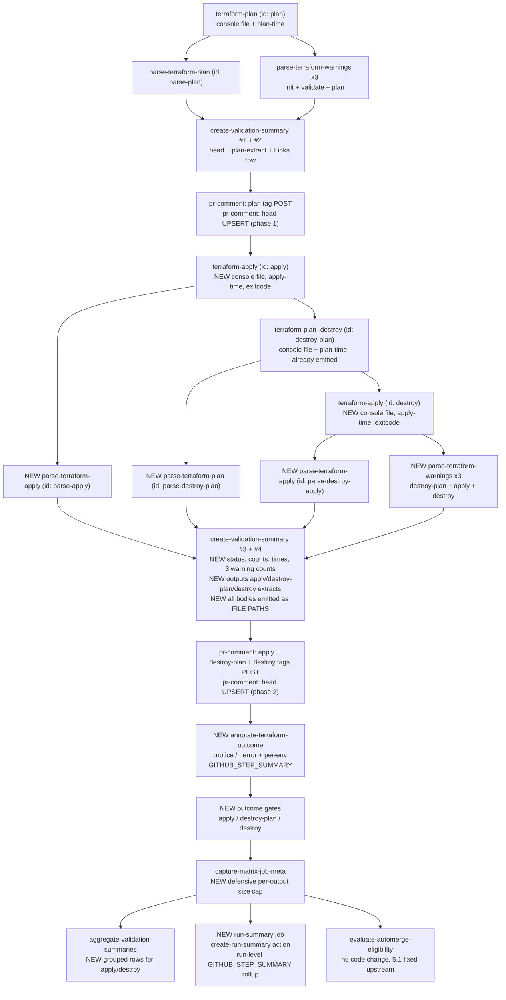

# Apply and destroy reporting

Authoritative spec for how `terraform apply`, `terraform plan -destroy` and destroy-apply results reach the PR conversation and the GitHub run-page UI.

Companion to [Workflow-pr-comments.md](Workflow-pr-comments.md) (the heads + tags model this extends) and [Plan-warnings.md](Plan-warnings.md) (the annotation + 65k-budget conventions this reuses).

Out of scope: the `plan` stage itself (already covered), `tflint` output, the `terraform-test` workflows.

**Status:** implemented on the `feat/apply-destroy-reporting` branch in the commit order of §11. §8 is normative; §13 records what implementation taught that the spec did not anticipate.

---

## 1. Why

A calling repo enabled `apply-on-pr` for one of its environments. The pull request applies real configuration to real infrastructure. The PR conversation says nothing about it: that environment's `📊` head comment is byte-for-byte the same shape as the head comment of an environment that only planned.

The step order inside a matrix job is why:

```
28  success  📝 Create validation summary
29  success  📋 Post per-env plan-extract tag
30  success  📝 Re-render validation summary with Links row
31  success  🏷️ Upsert per-env head comment      ← last write to the PR
32-37 success 🧐 Validation outcome: init…plan
38  success  🐙 Terraform Apply                  ← apply happens after
39  skipped  ☠📖 Terraform Destroy Plan
40  skipped  ☠ Terraform Destroy
```

Consequences today:

- A reviewer cannot tell "planned, awaiting merge" from "already applied to the environment".
- A **failed** apply leaves a head comment that reads `success` on every row. The only signal is the red job. The comment is not merely incomplete, it is actively misleading.
- On `push` / `workflow_dispatch` / `schedule` events **no PR comment is posted at all**, so apply results have no surface anywhere except raw job logs — not even a run-page summary.
- `destroy-plan` and `destroy` have never had any reporting surface, on any event.

## 2. Goals

1. Apply, destroy-plan and destroy outcomes are visible in the PR conversation for PR-triggered runs.
2. The head comment is never a stale all-green snapshot taken before the mutating steps ran.
3. A reviewer can tell an environment is **going to apply** before it does, and that it **did apply** after.
4. Apply/destroy output — including the errors from a partial apply — is reachable from the PR without opening the job log.
5. Non-PR runs (`push`, `schedule`, `workflow_dispatch`), fork PRs and envs with `add-pr-comment: false` get a run-page surface via `$GITHUB_STEP_SUMMARY` and `::notice` / `::error` annotations.
6. Warnings from the destroy-plan and from the mutating stages are surfaced, **without** redefining the existing `warning-count`.
7. A run-level rollup exists on the run page, covering every environment in one table.
8. Comment bodies stop travelling through step outputs, removing the last ARG_MAX exposure and shrinking the metadata artifact.
9. Two latent defects found while mapping this are fixed (§5).

Explicit non-goal: do **not** delay the first PR feedback. The validation table must keep appearing as soon as `plan` finishes, before apply starts.

Explicit invariant: **an environment that runs no mutating stage renders exactly the comment it renders today, byte for byte.** Every row, comment and count added here is presence-gated. This is a merge blocker, tested as C1.

## 3. Current state — what data exists

| Operation | step id | console captured | counts parsed | timing | status row in head | own tag comment | `🧐` outcome gate | in `$GITHUB_STEP_SUMMARY` |
|---|---|---|---|---|---|---|---|---|
| init | `init` | ✅ | n/a | ❌ | ✅ | n/a | ✅ | ❌ |
| verify-lock | `verify-lock` | n/a | n/a | ❌ | ✅ | n/a | ✅ | ❌ |
| fmt | `fmt` | n/a | n/a | ❌ | ✅ | n/a | ✅ | ❌ |
| validate | `validate` | ✅ | n/a | ❌ | ✅ | n/a | ✅ | ❌ |
| lint | `lint` | n/a | n/a | ❌ | ✅ | n/a | ✅ | ❌ |
| plan | `plan` | ✅ | ✅ `parse-plan` | ✅ `plan-time` | ✅ | ✅ | ✅ | ❌ |
| **apply** | `apply` | ❌ none | ❌ | ❌ | ❌ | ❌ | ❌ | ❌ |
| **destroy-plan** | `destroy-plan` | ✅ emitted, never consumed | ❌ no `parse-destroy-plan` step exists | ✅ emitted, never consumed | ❌ | ❌ | ❌ | ❌ |
| **destroy** | `destroy` | ❌ none | ❌ | ❌ | ❌ | ❌ | ❌ | ❌ |

Two independent causes. Fixing either alone yields nothing:

**Cause A — ordering.** Every PR-comment write sits at [terraform-ci-cd-default.yml:948-1110](../.github/workflows/terraform-ci-cd-default.yml); `apply` / `destroy-plan` / `destroy` at lines 1176-1248. The comment is written before the operations exist.

**Cause B — no capture.** [terraform-apply/action.yml](../terraform-apply/action.yml) declares **zero outputs**. [step_apply.sh](../terraform-apply/step_apply.sh) runs terraform and returns the exit code; stdout is not tee'd anywhere, nothing is timed, nothing is parsed. Even perfect ordering would render blank cells.

One thing already works in our favour: [capture-matrix-job-meta](../capture-matrix-job-meta/step_capture.sh) serialises the **whole** steps context after apply/destroy, so `steps.apply.outcome`, `steps["destroy-plan"].outcome` and `steps.destroy.outcome` are *already* in the artifact the aggregator job downloads. Outcome data exists today; only console output, counts and timings are genuinely missing.

## 4. Approach

Eight layers, in dependency order:

| # | Layer | Solves |
|---|---|---|
| L1 | Capture in `terraform-apply` (console file, timing, exit code, `-no-color`) | Cause B |
| L2 | `parse-terraform-apply` action + the missing `parse-destroy-plan` step | counts for apply / destroy-plan / destroy |
| L3 | Second render+upsert pass in the matrix job, after apply/destroy | Cause A, without delaying first feedback |
| L4 | Apply-aware wording + one tag comment per terraform invocation | goals 3 and 4 |
| L5 | Per-env `$GITHUB_STEP_SUMMARY` block + `::notice` / `::error` annotations | goal 5 |
| L6 | Warning parsing for destroy-plan / apply / destroy, as separate counts | goal 6 |
| L7 | A `run-summary` job writing a run-level rollup | goal 7 |
| L8 | Comment bodies passed as file paths, and `terraform-module-ci.yaml` migrated off `comment-on-pr@v2` | goal 8 |

L3 is deliberately a *second* pass rather than a relocation of the existing one. The head comment is a marker-based upsert that PATCHes in place, and the workflow already calls `create-validation-summary` twice for the Links row — a third call PATCHing the same marker is idempotent and costs one API round-trip. Moving the single existing pass to the end instead would mean a reviewer of a slow environment sees nothing for the whole plan duration (tens of minutes is normal for a large state) **plus** the apply duration.

L8 includes the `terraform-module-ci.yaml` migration (§7.15) rather than deferring it. Deferring would mean shipping an `emit-inline-bodies` mode flag and maintaining two rendering paths indefinitely; doing the migration deletes the deprecated outputs outright and leaves no step output in the repo carrying a comment body.

## 5. Defects fixed on the way

These are not cosmetic and are in scope because the same wiring fixes them.

### 5.1 `destroy-plan` auto-merge limits are silently unenforced

[evaluate-automerge-eligibility/helpers_additional.sh:169-175](../evaluate-automerge-eligibility/helpers_additional.sh) reads:

```bash
input_destroy_plan_count_add=$(get_step_output "${file}" "parse-destroy-plan" "count-add")
```

There is no step with id `parse-destroy-plan` anywhere in the workflow, so those reads always came back empty.

**What that actually did** (corrected after reading `validate_counts` closely, not what this section first claimed): the evaluator treats missing counts as "plan parsing may have failed" and marks the environment **ineligible**. So a repo with a `destroy-plan` goal (and no `destroy-on-pr`) and auto-merge enabled has *never* auto-merged — fail-closed, safe, but silent and with a misleading reason in the log. There is no separate `destroy-plan-max-count-*` limit family either: destroy-plan counts are **added to** the plan counts and checked against the same `plan-max-count-*` limits.

Adding the step with **exactly** the id `parse-destroy-plan` is the whole fix — the consumer side already exists and needs no change. The visible consequence is that such repos can now auto-merge **when their limits allow** (a destroy plan with `0` destroys under the default `plan-max-count-destroy: 0`, or any destroy plan under `-1`). Auto-merge becomes more permissive for that one class of repo, never less; it belongs in the release note.

### 5.2 No outcome gate for apply / destroy-plan / destroy

Every validation step has a `🧐 Validation outcome:` step that re-raises a non-success outcome as an `::error` annotation ([lines 1114-1175](../.github/workflows/terraform-ci-cd-default.yml)). The three mutating steps have none: they carry `continue-on-error: ${{ fromJSON(matrix.vars.allow-failing-terraform-operations) }}` and nothing else.

With `allow-failing-terraform-operations: true` a failed apply yields a green job, a green `conclusion`, a green PR comment and no annotation. Nothing anywhere says the tenant was left half-applied.

Adding the gates changes no job outcomes (§10.4) — it adds the annotation and the log line that the other six steps already produce.

## 6. Target data flow



## 7. Component changes

### 7.1 `terraform-apply` — capture (L1)

The action is already on the modern layout. Changes to [step_apply.sh](../terraform-apply/step_apply.sh) and [action.yml](../terraform-apply/action.yml):

New input:

| Input | Required | Default | Purpose |
|---|---|---|---|
| `environment-name` | no | `""` | Names the console output file, mirroring `terraform-plan`. Empty yields `tf-apply-console-output.txt`. |

New outputs, mirroring `terraform-plan`'s names as closely as the different verb allows:

| Output | Value |
|---|---|
| `console-output-file` | `${GITHUB_WORKSPACE}/tf-apply-console-output-<environment-name>.txt` |
| `apply-time` | wall-clock `mm:ss`, emitted **before** any return path (same rule as `plan-time`) |
| `exitcode` | raw exit code from `terraform apply` |

Command changes:

```diff
   local apply_cmd=(
     "${tf_bin}"
     apply
     -input=false
     -auto-approve
+    -no-color
     "${input_terraform_plan_file}"
   )
```

and the invocation gains `2>&1 | tee "${apply_console_out_file}"` with `set -o pipefail` around it, copied verbatim from [terraform-plan/step_plan.sh](../terraform-plan/step_plan.sh).

> **P4 — `-no-color` is a behaviour change shipped to every `@v0` consumer.** The major tag is force-moved on release, so every calling repo gets it immediately. Without it the captured file carries ANSI escapes that render as literal `ESC[0m` garbage inside the comment's code fence. Stripping ANSI post-hoc with `sed` is the alternative; `-no-color` is chosen because it is what `terraform-plan` already does and because ANSI in the *job log* is a marginal loss. Call it out in the release note.

> **P10 — ARG_MAX.** [terraform-apply/action.yml](../terraform-apply/action.yml) sources the step script under `set -o allexport`. Console output must never be assigned to a shell variable in that scope; only the *path* goes through `set-output`. See the ARG_MAX section of [CLAUDE.md](../CLAUDE.md) and [Plan-warnings.md §8](Plan-warnings.md).

> **P6 — the destroy step reuses this same action** with `id: destroy`. Both `apply` and `destroy` write a console file. The `environment-name` passed to the destroy invocation must be `<env>-destroy` — matching what the `destroy-plan` step already passes to `terraform-plan` — or the two files collide and the apply tag shows destroy output.

### 7.2 `parse-terraform-apply` — a new action (L2)

A new action rather than a mode on [parse-terraform-plan](../parse-terraform-plan/). The grammars are disjoint (`Plan: N to add, …` vs `Apply complete! Resources: N added, …`), the failure modes differ (§7.2.1), and `has-output-only-changes` is plan-specific. A mode flag would put two state machines in one script for no reuse.

Recognised summary lines:

```
Apply complete! Resources: [<I> imported, ]<A> added, <C> changed, <D> destroyed.
Destroy complete! Resources: <D> destroyed.
```

The segment list is **open-ended**, and this is parsed segment by segment, not as one anchored pattern — see P32.

Outputs, deliberately named to match `parse-terraform-plan` so downstream wiring is symmetric:

| Output | Notes |
|---|---|
| `count-import` | `?` when no summary line was found, `0` when terraform emitted no `imported` segment |
| `count-add` / `count-change` / `count-destroy` | `?` when no summary line was found |
| `count-total` | sum **including imports**; `?` when no summary line was found |
| `completed` | `true` when a summary line was found and parsed, `false` otherwise. Says whether the **counts** are available — not whether the apply succeeded; that is the step outcome (§14) |
| `apply-kind` | `apply` or `destroy`, from which summary line matched. The default workflow's destroy step applies a saved `-destroy` plan, which prints `Apply complete!` — so `apply` there too (P33) |
| `filtered-console-file` | console file with progress-tick lines removed (§7.2.2) |

`Destroy complete!` sets `count-add=0`, `count-change=0`.

There is no `count-move` / `count-remove`: terraform's apply summary carries no such segment. It **does** carry `imported`, which this section originally denied — see P32. Rendering still must not assume the plan badge set wholesale — §8.3.

> **P34 — the tag's shape must not contradict the head's status row.** The failure shape was chosen from `completed` alone. `completed` is false whenever the summary line could not be *parsed*, which is not the same thing as the apply having *failed*: a successful apply whose output the parser could not read posted **"❌ Apply failed — infrastructure may be partially applied"** next to a head row reading `success`. Self-contradictory, and the partial-state claim was untrue. This is not hypothetical — it is exactly what P32 produced in a calling repo before it was fixed, and the next unreadable line would do it again.
>
> The shape now consults the step's own status: `success` with unreadable output gets a closed, amber "counts could not be read" block; anything else keeps the red, open, partial-state block. The head, the tag, the annotation and the run summary all key on the same status, so they cannot disagree. Reported in review by a maintainer, 2026-09-21.
>
> **P32 — the apply summary line is a list, not a fixed triple.** It was first read with one pattern anchored at both ends to `added, changed, destroyed`. Terraform puts `N imported,` *before* `added` whenever import blocks are in play, so the match failed, `completed` stayed unset, and a **fully successful apply rendered as `❌ Apply failed — infrastructure may be partially applied` with `💫 ?/0 added`** — the exact inversion of the defect this feature exists to fix. Found on a calling repo that adopts existing objects with `import` blocks, which is the normal way to bring hand-made infrastructure under terraform.
>
> The fix is not an optional `imported` group; that would survive only until the next verb. Each segment is matched on its own — the way [parse-terraform-plan](../parse-terraform-plan/) has always read the `Plan:` line — and a segment whose verb is unknown is logged and left uncounted rather than failing the parse. **A finished apply must never be reported as a failed one**; under-reporting a count is the lesser error and the warning says so in the log.
>
> `count-total` includes imports, or an apply that only adopted existing objects renders as `Apply: no changes ✅` while five resources came under management.

#### 7.2.1 The failure case is the important one

> **P2 — a failed apply prints no summary line.** `Apply complete!` is emitted only on full success. A partial apply — three of nine resources created, then a provider error — prints the errors and stops. Counts are unavailable *exactly* when a reviewer most wants them.
>
> Consequences for the design:
> - Never render `0 added, 0 changed, 0 destroyed` for a failed apply. `completed=false` must render as `?`, never as zeros. A zero reads as "nothing happened", which is the opposite of the truth for a partial apply.
> - This is the core argument for the tag comments (§7.6) over a counts row alone: for the case that matters, the console tail *is* the information.
> - It is also why §8.3 chose the applied/planned delta shape — `?/9` at least tells the reviewer the size of what was attempted.

#### 7.2.2 Progress-tick noise

Apply output interleaves a progress line per in-flight resource every 10 seconds:

```
module.app.azuread_application.this: Still creating... [10s elapsed]
module.app.azuread_application.this: Still creating... [20s elapsed]
```

A 20-minute apply over 50 resources produces thousands of these. Tail-trimming to 65k without filtering yields a comment that is almost entirely `Still creating...`.

`parse-terraform-apply` therefore also emits `filtered-console-file`: the console file with lines matching

```
^\S.*: Still (creating|destroying|modifying|reading)\.\.\. \[[0-9]+[ms][0-9]*s? elapsed\]$
```

removed. The renderer consumes the filtered file; the raw file stays on disk and is what the job log shows.

> **P5 — filtering is lossy and can drift silently.** If terraform changes the wording, filtering stops working and the comment degrades to noise rather than breaking. Pinned by fixture test B6; the fixture must be captured from real output, not hand-written.

### 7.3 Workflow: the missing parse and warning steps (L2 / L6)

Six new steps in the matrix job:

| Step id | Action | Placed after | Consumes |
|---|---|---|---|
| `parse-apply` | `parse-terraform-apply` | `apply` | `steps.apply.outputs.console-output-file` |
| `parse-apply-warnings` | `parse-terraform-warnings` | `parse-apply` | same |
| `parse-destroy-plan` | `parse-terraform-plan` | `destroy-plan` | `steps.destroy-plan.outputs.console-output-file` |
| `parse-destroy-plan-warnings` | `parse-terraform-warnings` | `parse-destroy-plan` | same |
| `parse-destroy-apply` | `parse-terraform-apply` | `destroy` | `steps.destroy.outputs.console-output-file` |
| `parse-destroy-warnings` | `parse-terraform-warnings` | `parse-destroy-apply` | same |

All guarded with `if: always() && steps.<source>.outcome != 'cancelled' && steps.<source>.outcome != 'skipped'` and `continue-on-error: true`. The `always()` is **not** in the existing `parse-plan`, and that is not an inconsistency: plan runs with `continue-on-error: true`, so a failed plan never fails the job. apply and destroy run with `continue-on-error: ${{ fromJSON(allow-failing-terraform-operations) }}` — default false — so a failed apply fails the job on the spot, and a following step whose `if:` lacks `always()` is skipped even when it evaluates true (P31).

> **P7 — the step id `parse-destroy-plan` is load-bearing.** [evaluate-automerge-eligibility/helpers_additional.sh](../evaluate-automerge-eligibility/helpers_additional.sh) looks it up by literal string in the captured steps context. Renaming the step silently re-breaks §5.1 with no test failure anywhere unless F2 is implemented.

### 7.4 `create-validation-summary` — new inputs, rows and outputs (L3 / L4 / L6 / L8)

New inputs. All optional; all default to the "absent" sentinel so existing callers render byte-identically (test C1).

**Statuses and timings**

| Input | Default | Purpose |
|---|---|---|
| `status-apply` / `status-destroy-plan` / `status-destroy` | `""` | Step outcomes. A value that is non-empty **and not `skipped`** gates the corresponding rows — GitHub sets the string `skipped` for a step whose `if:` was false (P30). |
| `apply-time` / `destroy-plan-time` / `destroy-time` | `N/A` | `mm:ss` |

**Counts**

| Input | Default | Purpose |
|---|---|---|
| `apply-count-add` / `-change` / `-destroy` / `-total` | `N/A` | From `parse-apply` |
| `apply-completed` | `""` | `true` / `false` / `""` — drives the `?` rendering of §7.2.1 |
| `destroy-plan-count-add` / `-change` / `-destroy` / `-import` / `-move` / `-remove` / `-total` | `N/A` | From `parse-destroy-plan` (a plan, so the full badge set) |
| `destroy-count-destroy` / `-total` | `N/A` | From `parse-destroy-apply` |
| `destroy-completed` | `""` | as `apply-completed` |

**Warnings (four independent counts, one per operation block — §7.7)**

| Input | Default | Purpose |
|---|---|---|
| `warning-count` / `warnings-markdown-file` | `0` / `""` | **Unchanged semantics**: init + validate + plan |
| `apply-warning-count` / `apply-warnings-markdown-file` | `0` / `""` | apply only |
| `destroy-plan-warning-count` / `destroy-plan-warnings-markdown-file` | `0` / `""` | destroy-plan only |
| `destroy-warning-count` / `destroy-warnings-markdown-file` | `0` / `""` | destroy only |

**Console files and links**

| Input | Default | Purpose |
|---|---|---|
| `apply-console-file` / `destroy-plan-console-file` / `destroy-console-file` | `""` | Filtered console files for the three new extracts |
| `apply-tag-comment-id` / `destroy-plan-tag-comment-id` / `destroy-tag-comment-id` | `""` | Mirror `plan-tag-comment-id`; each adds one line to the Links row |

**Mode and rendering control**

| Input | Default | Purpose |
|---|---|---|
| `goals-json` | `""` | JSON array of the env's goals. Drives the Mode row (§8.1) and the plan-tag banner (§8.5). |
| `apply-extract-include-outputs` | `false` | §7.6 |
| `output-file-suffix` | `""` | §7.10. Disambiguates the body files written by the four invocations in one job. |

New outputs:

| Output | Kind | Purpose |
|---|---|---|
| `head-summary-file` | path | §7.10. Replaces the `head-summary` string output. |
| `plan-extract-file` / `apply-extract-file` / `destroy-plan-extract-file` / `destroy-extract-file` | path | §7.10. `plan-extract-file` replaces the `plan-extract` string output; the other three are new. |

Deleted outputs: `summary`, `prefix`, `head-summary`, `plan-extract` (§7.10, §7.15).

**Row-presence rule.** Every new row renders **only** when its gating input names a step that ran — non-empty and not `skipped`. This follows the existing "absent when uninteresting" convention already used by the Warnings and Plan-details rows, and is what makes the §2 invariant hold. Under the §8.1 ordering every new row is **appended below** today's last data row, so a plan-only env's table is a strict prefix of the full one — which is what test C1 asserts.

> **P9 — table sync.** [Workflow-pr-comments.md §5.1](Workflow-pr-comments.md) declares the per-env head and the per-group head structurally in sync, with exactly two documented intentional divergences. Every row added here lands in **both** renderers, and the presence rules must correspond (per-env: "this env has data"; per-group: "any env in the group has data"). Enforced by test F1. The run-level rollup (§7.9) is explicitly **outside** this invariant and uses a different shape — stated there so nobody "fixes" it into sync.

### 7.5 Workflow: the second render+upsert pass (L3)

New step order at the tail of the matrix job:

```
…
1114-1175  🧐 Validation outcome: init / lock / fmt / validate / lint / plan   (unchanged)
1176       🐙 Terraform Apply                                                  (unchanged position)
     NEW   🔍 Parse terraform apply                    id: parse-apply
     NEW   ⚠️ Parse apply warnings                     id: parse-apply-warnings
1206       ☠📖 Terraform Destroy Plan                                          (unchanged position)
     NEW   🔍 Parse terraform destroy plan             id: parse-destroy-plan
     NEW   ⚠️ Parse destroy-plan warnings              id: parse-destroy-plan-warnings
1220       ☠ Terraform Destroy                                                 (unchanged position)
     NEW   🔍 Parse terraform destroy                  id: parse-destroy-apply
     NEW   ⚠️ Parse destroy warnings                   id: parse-destroy-warnings
     NEW   📝 Create validation summary (phase 2)      id: cvs-apply
     NEW   🐙 Post apply tag                           id: post-apply-tag
     NEW   ☠📖 Post destroy-plan tag                   id: post-destroy-plan-tag
     NEW   ☠ Post destroy tag                          id: post-destroy-tag
     NEW   📝 Re-render phase 2 with Links             id: cvs-apply-final
     NEW   🏷️ Upsert per-env head comment (phase 2)    id: upsert-head-apply
     NEW   📣 Annotate outcome                         id: annotate                    (§7.8)
     NEW   🧐 Validation outcome: 🐙 Apply
     NEW   🧐 Validation outcome: ☠📖 Destroy Plan
     NEW   🧐 Validation outcome: ☠ Destroy
1250       📊 Capture matrix job metadata                                      (unchanged position)
1265       🧹 Shred resolved environment files                                 (unchanged position)
```

> **P1 — the new outcome gates must come after the phase-2 comment steps, not before.** A gate step exits 1. With `allow-failing-terraform-operations: false` that fails the job, and every subsequent step **without `if: always()` is skipped**. Putting the apply gate ahead of the phase-2 render means a failed apply skips the render — i.e. the exact case this whole feature exists to surface would be the one case it does not surface. It is the same reason the existing six gates sit *after* the phase-1 comment steps.

> **P15 — `always()` is required on every phase-2 comment step anyway.** The six *existing* gates run before apply. If `init` fails, gate 32 fails the job and apply/destroy are skipped; the phase-2 render must still run so the head reflects the final state of the run. Copy the `always() && add-pr-comment == 'true' && event_name == 'pull_request' && action != 'closed' && action != 'converted_to_draft'` guard verbatim from the phase-1 steps.

> **P16 — a second PATCH per head per run.** [pr-comment](../pr-comment/action.yml) short-circuits a no-op update by body hash, so an env that ran no mutating step costs one extra API read and no write. An env that did apply gets one extra PATCH. PATCH preserves `created_at`, so the head keeps its position in the conversation; GitHub marks the comment `edited` but does not re-notify subscribers. Acceptable.

> **P13 — grouped envs.** Grouped envs have no per-env head, so phase 2 for them is: post the tag comments (yes), upsert the head (no — the existing `pr-comment-group == ''` guard). Their apply status reaches a reader only through the per-group table (§7.11). §7.5 and §7.11 are therefore not independently shippable.

### 7.6 Tag comments — one per terraform invocation (L4)

| Invocation | Marker | Status |
|---|---|---|
| plan | `<!-- tf:tag:plan:<env>:run-id-<id>:attempt-<n> -->` | exists today |
| apply | `<!-- tf:tag:apply:<env>:run-id-<id>:attempt-<n> -->` | new |
| destroy-plan | `<!-- tf:tag:destroy-plan:<env>:run-id-<id>:attempt-<n> -->` | new |
| destroy | `<!-- tf:tag:destroy:<env>:run-id-<id>:attempt-<n> -->` | new |

Each is presence-gated: an env that only plans keeps exactly the two comments it has today (head + plan tag). An env configured with every goal gets five.

Three new purge steps at the top of the matrix job, alongside the existing plan-tag purge, using the marker prefixes `<!-- tf:tag:apply:<env>:`, `<!-- tf:tag:destroy-plan:<env>:` and `<!-- tf:tag:destroy:<env>:`.

> **P8 — `pr-comment` mode=delete matches by substring `contains`, not prefix.** Two consequences:
> 1. `<!-- tf:tag:destroy:` **is** a substring of nothing else here, but `<!-- tf:tag:destroy-plan:` would be matched by a hypothetical purge for `<!-- tf:tag:destroy` without the trailing colon. Always include the trailing `:` after the operation segment.
> 2. The trailing `:` after the env segment is what keeps `prod` from also matching `prod-dr`. Both the purge markers and the aggregator's env-prefix lookup depend on it. Never introduce a marker whose operation segment is a prefix of another's without a separator.

> **P3 — the largest new source of secret exposure in the repo.** `terraform apply` prints an `Outputs:` section at the end with the **actual values** of every non-sensitive output. `terraform plan` never does — it prints `+ output_name = (known after apply)`. So an apply tag can publish to a PR conversation values that the plan tag has always kept hidden, in repos whose maintainers have only ever reviewed the plan comment's exposure.
>
> Mitigation, all three:
> 1. `create-validation-summary` strips everything from a line matching `^Outputs:$` to EOF before budgeting the apply and destroy extracts, and appends `_(outputs section omitted)_` when it stripped anything.
> 2. Defeatable per workflow via the new input `apply-extract-include-outputs` (default `false`).
> 3. The default is `false` and the release note says so explicitly.
>
> Residual risk the strip does **not** cover: terraform error messages can embed attribute values, and provider errors can echo request bodies. This is already true of the plan comment. Documented, not mitigated.

> **P17 — each extract gets its own 65k budget.** They are separate comments. Do not share `HARD_LIMIT` between the renderers; the budgeting code is per-body. Within one body the existing warnings-over-console priority rule applies unchanged.

### 7.7 Warnings — four independent counts (L6)

| Count | Sources | Head row | Bodies rendered into |
|---|---|---|---|
| `warning-count` | init + validate + plan | `⚠️ Warnings` | plan tag |
| `apply-warning-count` | apply | `⚠️ Apply warnings` | apply tag |
| `destroy-plan-warning-count` | destroy-plan | `⚠️ Destroy plan warnings` | destroy-plan tag |
| `destroy-warning-count` | destroy | `⚠️ Destroy warnings` | destroy tag |

**One count per operation block, and each count's bodies live in exactly one tag comment.** This is the property that makes §8.1's per-operation blocks uniform, and it is why an earlier three-count design (apply and destroy sharing one count) was dropped: under blocked ordering that count would have sat inside the apply block while also counting the destroy block's warnings, leaving the destroy block a row short and the number unattributable to the comment it came from.

**The existing `warning-count` keeps its exact current meaning.** No repo's number changes. [Plan-warnings.md](Plan-warnings.md) needs only an additive edit.

> **P18 — one count per operation block is load-bearing.** §8.1's blocks are uniform only because every operation has its own warnings row with its own count, and every count's bodies live in exactly one tag comment. Collapsing any two counts (as an earlier three-count design did for apply + destroy) puts one row inside the wrong block and makes the number unattributable to the comment it came from. Do not merge them.

`parse-terraform-warnings` itself is reused **unchanged**. Only new invocations and new plumbing.

### 7.8 `annotate-terraform-outcome` — a new action (L5)

Modern layout, per [Action-implementation-guide.md](Action-implementation-guide.md). Pure side effects: writes `::notice` / `::error` workflow commands to stdout and appends markdown to `$GITHUB_STEP_SUMMARY`.

A separate action rather than folding into `create-validation-summary`, which is a pure renderer whose every test asserts on captured `$GITHUB_OUTPUT` strings. Mixing in side effects would make it untestable in the same shape.

The block itself is nonetheless rendered by `create-validation-summary`, as a sixth body file (`step-summary-file`): the head's table in its ungrouped shape with the Links row replaced by a `[Job log]` footer. Two reasons. A grouped env has no table in its PR head but the job page has no per-group table to defer to, and a second copy of the table renderer would drift. The phase-2 render therefore runs on every event (it is pure and cheap); only the POST/PATCH steps carry the `pull_request` guard.

| Condition | Emission |
|---|---|
| apply / destroy ran and succeeded | `::notice title=Apply succeeded::<env> — N added, N changed, N destroyed in mm:ss` |
| apply / destroy ran and failed | `::error title=Apply failed::<env> — apply did not complete; infrastructure may be partially applied` |
| any run at all | one per-env `$GITHUB_STEP_SUMMARY` block (§8.7) |

> **P11 — this is the only surface that exists on `push` / `schedule` / `workflow_dispatch` runs, on fork PRs, and for envs with `add-pr-comment: false`.** It is not a nice-to-have bolted onto a PR-comment feature; for a large class of runs it is the *entire* feature. Its `if:` must **not** carry the `github.event_name == 'pull_request'` guard the comment steps carry.

> **P19 — the 1 MiB `$GITHUB_STEP_SUMMARY` cap.** The block is a table plus counts, never console output. Do not append an extract here.

### 7.9 `create-run-summary` and the `run-summary` job (L7)

`$GITHUB_STEP_SUMMARY` is per **job**, and each matrix env is its own job — so §7.8 can only ever describe one env. The run-level rollup needs a job that runs once, after the matrix, on **every** event.

New job:

```yaml
run-summary:
  if: always()
  name: "Run summary"
  needs: [create-matrix, terraform-ci-cd]
  runs-on: ${{ inputs.runs-on }}
  # no pull-requests permission — this job never touches the PR
  steps:
    - download matrix-job-meta-* artifacts (continue-on-error)
    - uses: dsb-norge/github-actions-terraform/create-run-summary@v0
      continue-on-error: true
```

Chosen over extending the existing `conclusion` job (which repos wire into branch protection and which must stay trivially correct) and over relaxing `pr-comment-aggregator` (which is named for, and permissioned for, PR comments and would then run on `push` and `schedule`). Cost: one extra runner job, roughly 15 seconds.

> **P20 — `run-summary` must never fail the workflow.** `continue-on-error: true` on every step, and it is deliberately **not** in `conclusion`'s `needs:`. A reporting job that can redden a deploy is worse than no reporting job.

> The rollup deliberately uses a different table shape from the two PR-comment tables (§8.7). It is **not** part of the §7.4 sync invariant.

> The `Job` column links to the **run** page, not the per-job page. Per-job URLs need the Jobs API — a network call plus `actions: read` — both at odds with a job that has no permissions and must never fail (P20). The run page is one click from every job.

### 7.10 Comment bodies as file paths (L8)

Today `create-validation-summary` emits `head-summary`, `plan-extract` and the legacy `summary` as step **outputs**. Three costs:

1. They enter the `steps` context, so `capture-matrix-job-meta`'s `toJSON(steps)` writes ~65k×2 per env into the metadata artifact — which the aggregator, the auto-merge evaluator and now the run-summary job all download and `jq` over, for data none of them reads.
2. `pr-comment` receives the body through `${{ inputs.body }}`, which interpolates 65k of markdown into the composite step's script text.
3. It is the last realistic ARG_MAX exposure on this path — the reason `create-validation-summary` cannot use `set -o allexport` and the reason `pr-comment` keeps `input_body` shell-local.

Changes:

- `create-validation-summary` writes each body to `${RUNNER_TEMP}/tf-comment-<env>-<kind><output-file-suffix>.md` and emits the **paths** as `head-summary-file`, `plan-extract-file`, `apply-extract-file`, `destroy-plan-extract-file`, `destroy-extract-file`.
- `pr-comment` gains `body-file`. Exactly one of `body` / `body-file` is required for `mode=upsert`. Internally the action already writes the body to a tempfile for `gh api -F body=@`; with `body-file` it skips the heredoc entirely, which removes the `${{ inputs.body }}` interpolation as well.
- The deprecated `summary` and `prefix` outputs, and the inline `head-summary` / `plan-extract` strings, are **deleted** — not gated behind a mode flag. See §7.15 for what makes that possible.

> **P12 — file lifetime and collision.** `$RUNNER_TEMP` persists for the job, which is all that is needed. But `create-validation-summary` is invoked **four** times in one job (phase 1, phase 1 final, phase 2, phase 2 final) and the head-upsert falls back from the final invocation's body to the earlier one's. Without a distinguishing suffix the later invocation overwrites the file the fallback points at, and the fallback silently resolves to the *wrong* body. Hence `output-file-suffix`, passed explicitly as `phase1` / `phase1-final` / `phase2` / `phase2-final`. Tested as C16.

> **P14 — bodies leave the step-output log.** `log-multiline` already prints every body into the job log, so debuggability is unaffected. Keep those log lines.

### 7.11 `aggregate-validation-summaries` — grouped rows (L3 / L6)

[GROUPED_TABLE_STEP_ROWS](../aggregate-validation-summaries/helpers_additional.sh) gains `apply`, `destroy-plan` and `destroy`, read from the already-captured step outcomes. The warning rows gain three more (§7.7), and the Plan-details row gains its apply / destroy-plan / destroy siblings.

Row presence is group-wide: show a row when **any** env in the group has data for it; envs without render `—`.

The Links cell gains `[apply log]`, `[destroy plan log]` and `[destroy log]` lines when the env has the corresponding tag for this run, resolved by the same marker-prefix lookup already used for `[log extract]`.

> **No race on the per-env head.** The aggregator PATCHes per-*group* heads only; the matrix job PATCHes per-*env* heads only. They never target the same marker. Keep it that way.

### 7.12 `capture-matrix-job-meta` — a defensive size cap

§7.10 removes the large bodies at the source. Independently, `normalize_steps_context` gains a per-output size cap (default 4096 bytes) replacing an oversize value with `"<truncated: N bytes>"`.

Rationale: the ARG_MAX incident this action already carries a comment about was caused by a *downstream* action's output growing unexpectedly. A cap here means the next such growth degrades the artifact instead of killing the job. Nothing downstream reads any step output larger than a few hundred bytes.

### 7.13 `evaluate-automerge-eligibility` — no code change

It already reads `parse-destroy-plan` and `steps.apply.outcome`. §5.1 is fixed entirely upstream of it. Its suite gains F2 only.

### 7.14 `create-tf-vars-matrix` — new workflow inputs

`apply-extract-include-outputs` is a new top-level workflow input. Per [CLAUDE.md](../CLAUDE.md), boolean/string inputs need **no** matrix-builder logic — the generic forwarding loop handles them, and per-env override comes free — but they **must** be added to the `REQ_FIELDS` / `NOT_EMPTY_FIELDS` validators and to the JSON test fixtures, or the matrix job fails validation at runtime.

### 7.15 Migrating `terraform-module-ci.yaml` off `comment-on-pr@v2` (L8)

In scope, because it is what lets §7.10 delete the deprecated outputs outright instead of shipping an `emit-inline-bodies` mode flag and maintaining both code paths forever.

**What is actually there.** `terraform-module-ci.yaml` has two comment call sites, both using `dsb-norge/github-actions/ci-cd/comment-on-pr@v2` with `pr-comment-text` + `delete-comments-starting-with`:

| Call site | Producer | Body size |
|---|---|---|
| validation summary | `create-validation-summary` with `status-plan: "N/A"`, **no plan files at all** | a bare table plus `Plan not available 🤷‍♀️` — a few hundred bytes |
| test report | `create-test-report` | `tail -c 65000` of the test report, embedded in the body |

> **The ARG_MAX win is real but it is not where it looks.** The validation-summary call site in `terraform-module-ci.yaml` passes no plan output whatsoever, so its `summary` output has never been large — migrating *that* call site buys nothing for ARG_MAX and everything for consistency. The genuine remaining 65k-through-a-step-output path in this repo is `create-test-report`, which caps the test report at 65000 chars, builds the whole comment as one shell variable, emits it as a multiline step output, and has it interpolated as `pr-comment-text: ${{ … }}` into an action in another repository. (`allexport` is switched off before that variable is assigned, so it is not an *envp* exposure inside the step — the exposure is the step output plus the cross-repo input interpolation.) After §7.10 and this section, no step output in this repo carries a comment body.

**Changes:**

- `create-test-report` is converted from the legacy embedded-bash layout to the modern layout per [Action-implementation-guide.md](Action-implementation-guide.md): `action.yml` shim, `helpers.sh` cherry-picked unmodified, `helpers_additional.sh`, `step_create_test_report.sh`, `run_local_step_create_test_report.sh`, `run_all_tests.sh`. It emits `body-file`, not `summary` + `prefix`.
- Both call sites switch to `pr-comment` with markers `<!-- tf:head:module -->` and `<!-- tf:head:test:<test-file> -->`, `mode: upsert`, `body-file:`.
- `create-validation-summary`'s `summary` / `prefix` outputs are deleted (§7.10).

**Four things this buys beyond the ARG_MAX path:**

1. **§7.10 gets simpler, not bigger.** No `emit-inline-bodies` input, no dual rendering path, no test asserting the two forms agree.
2. **`create-test-report` enters CI for the first time.** [action-tests.yml](../.github/workflows/action-tests.yml) discovers suites by the presence of `run_all_tests.sh`; `create-test-report` has none, so nothing in CI has ever exercised it.
3. **Comments stop jumping.** `comment-on-pr@v2` deletes by prefix and POSTs a new comment every run, so the module-ci comment loses its place in the conversation and re-notifies subscribers each time. Marker upsert PATCHes in place and preserves `created_at` — the behaviour the default workflow already has.
4. **One less cross-repo dependency.** `ci-cd/comment-on-pr@v2` is the only cross-repo *commenting* action left in these workflows; after this, PR commenting in this repo runs on one primitive it owns. (`get-github-app-installation-token@v2` is unrelated and stays.)

> **P22 — this changes a second workflow's user-visible behaviour.** `terraform-module-ci.yaml` consumers see their comment stop being recreated and start being edited, and the comment body gains a marker line. It is an improvement, but it is not this feature, and it ships on the same force-moved `@v0`. It gets its own commit so it can be reverted alone, and its own line in the release note.

> **P23 — `create-test-report` has no tests today, so the conversion has no safety net.** Convert it in two steps within the commit: first add `run_all_tests.sh` against the *existing* legacy action to pin current output, then convert and require the pinned output to be reproduced byte-for-byte. Without that ordering the conversion is unverifiable.

## 8. Comment shapes, wording and iconography

Normative. [Workflow-pr-comments.md](Workflow-pr-comments.md) §5 is updated to match as part of this change.

The governing rule for everything below: **presence-gating**. An environment that runs no mutating stage renders today's comment byte-for-byte (§2, test C1).

### 8.1 Per-env head — row set and order

Rows in this fixed order. `cond` rows render only when their gating input is non-empty.

| # | Icon | Label | Gate |
|---|:---:|---|---|
| 1 | 🐙 / ☠ / 🐙☠ | Mode | cond — `goals-json` contains `apply-on-pr` and/or `destroy-on-pr` |
| 2 | ⚙️ | Initialization | always |
| 3 | 🔒 | Lock file | always |
| 4 | 🖌 | Format and Style | always |
| 5 | ✔ | Validate | always |
| 6 | 🧹 | TFLint | always |
| 7 | 📖 | Plan | always |
| 8 | ⚠️ | Warnings | cond — `warning-count` > 0 |
| 9 | 📊 | Plan details | cond — `include-plan-details` |
| 10 | ⏱ | Plan time | always |
| 11 | 🐙 | Apply | cond — `status-apply` ran (non-empty, not `skipped`) |
| 12 | ⚠️ | Apply warnings | cond — `apply-warning-count` > 0 |
| 13 | 📊 | Apply details | cond — `status-apply` |
| 14 | ⏱ | Apply time | cond — `status-apply` |
| 15 | ☠📖 | Destroy plan | cond — `status-destroy-plan` ran |
| 16 | ⚠️ | Destroy plan warnings | cond — `destroy-plan-warning-count` > 0 |
| 17 | 📊 | Destroy plan details | cond — `status-destroy-plan` |
| 18 | ⏱ | Destroy plan time | cond — `status-destroy-plan` |
| 19 | ☠ | Destroy | cond — `status-destroy` ran |
| 20 | ⚠️ | Destroy warnings | cond — `destroy-warning-count` > 0 |
| 21 | 📊 | Destroy details | cond — `status-destroy` |
| 22 | ⏱ | Destroy time | cond — `status-destroy` |
| 23 | 🔗 | Links | **always last**; rendered when any tag comment id was supplied |

**Ordering rule: operations in the order they are performed, each as a block.** Rows 2-10 are today's table unchanged. Every operation that follows `plan` contributes the same four-row block the plan block already has — **status · warnings · details · time** — and the blocks appear in the order the workflow runs them: plan, apply, destroy-plan, destroy. A row is omitted from its block when it has no data; the block's own rows keep this relative order.

Two consequences worth stating, because both are load-bearing for review:

- **New rows are append-only below row 10.** A plan-only environment's table is not merely equivalent to today's, it is a strict prefix of the new one. That is a stronger and more easily verified form of the §2 invariant than "the same rows in the same places" would have been.
- **Reading the table top to bottom replays the job.** A reviewer scanning down sees init → … → plan → apply → destroy, which is the order the job log shows and the order the annotations fire in. Grouping by kind instead — all statuses, then all warnings — would have read as a data dictionary rather than a timeline.

**Every operation block is exactly four rows** — status · warnings · details · time — including the destroy block, which is why §7.7 keeps four independent warning counts rather than three. Col-1 icons therefore repeat across blocks (four `⚠️`, four `📊`, four `⏱`); the `title` tooltip on each carries the full label, as today, and the Label column disambiguates.

Status cells keep the existing text form: `` `success` `` / `<kbd>failure</kbd>` / `<kbd>skipped</kbd>` / `<kbd></kbd>`.

**Rendered — an env with `apply-on-pr`:**

```markdown
### Terraform validation summary for environment: `example`
|  | Step | Result |
|:---:|---|---|
| <span title="Mode">🐙</span> | Mode | <span title="This environment mutates infrastructure on pull request">applies on PR</span> |
| <span title="Initialization">⚙️</span> | Initialization | `success` |
| <span title="Lock file">🔒</span> | Lock file | `success` |
| <span title="Format and Style">🖌</span> | Format and Style | `success` |
| <span title="Validate">✔</span> | Validate | `success` |
| <span title="TFLint">🧹</span> | TFLint | `success` |
| <span title="Plan">📖</span> | Plan | `success` |
| <span title="Plan details">📊</span> | Plan details | <div align="left"><span title="Resources to be added">`💫 1` add</span><br><span title="Resources to be changed">`🛠️ 0` change</span><br><span title="Resources to be destroyed">`💥 0` destroy</span></div> |
| <span title="Plan time">⏱</span> | Plan time | <span title="mm:ss (minutes:seconds)">`0:04`</span> |
| <span title="Apply">🐙</span> | Apply | `success` |
| <span title="Apply details">📊</span> | Apply details | <div align="left"><span title="Applied / planned">`💫 1/1` added</span><br><span title="Applied / planned">`🛠️ 0/0` changed</span><br><span title="Applied / planned">`💥 0/0` destroyed</span></div> |
| <span title="Apply time">⏱</span> | Apply time | <span title="mm:ss (minutes:seconds)">`1:07`</span> |
| <span title="Links">🔗</span> | Links | [log extract](#issuecomment-1)<br>[apply log](#issuecomment-2)<br>[job log](…) |
```

**Rendered — a plan-only env:** unchanged from today. Rows 2-10 and 22 only — a strict prefix of the above.

### 8.2 The Mode row

Rendered from `goals-json`, **independently of any outcome**, so it appears the moment the workflow starts and stays visible whether the apply succeeded, failed or never ran.

| goals contain | Icon | Value |
|---|:---:|---|
| `apply-on-pr` | 🐙 | `applies on PR` |
| `destroy-on-pr` | ☠ | `destroys on PR` |
| both | 🐙☠ | `applies on PR`<br>`destroys on PR` |

The seed job's placeholder body (`⏳ Awaiting results…`) gains the same line when the env qualifies, so the warning is on the PR before `init` has finished.

> **Concern — semantic wrinkle.** "Mode" is not a step, but it sits in a column headed `Step`. Accepted: the alternative — a banner line above the table — does not survive the grouped table's shape (§8.8), and having the marker in exactly one place in both tables is worth more than the column-header purity. Do not rename the column; that is a breaking change to every existing consumer's rendering.

### 8.3 Details rows — applied/planned delta

Apply and destroy report **applied / planned**:

```markdown
| 📊 | Apply details | `💫 1/1` added<br>`🛠️ 0/0` changed<br>`💥 0/0` destroyed |
```

Numerator from `parse-apply` / `parse-destroy-apply`; denominator from `parse-plan` / `parse-destroy-plan`. A partial apply reads `💫 3/9 added` at a glance. A failed apply reads `💫 ?/9 added` — never `0/9` (P2).

Apply rows carry only the three badges terraform's apply summary has. `move` / `import` / `remove` appear on the Plan details and Destroy plan details rows only; do not fabricate an applied-count for them.

Destroy plan details is a **plan**, so it uses the plan badge set and the plan's present-tense verbs (`add` / `change` / `destroy`). Destroy details uses `💥 N/N destroyed` alone.

### 8.4 Timing rows

One `⏱` row per invocation that ran, labelled `Plan time` / `Apply time` / `Destroy plan time` / `Destroy time`. Cell shape is unchanged from today: backtick-wrapped `mm:ss` inside `<span title="mm:ss (minutes:seconds)">`, em-dash `—` when absent.

`Plan time` keeps rendering unconditionally, including as `—`, exactly as today. The three new time rows are presence-gated.

### 8.5 Plan tag banner when the env mutates on PR

The plan tag's heading and its five block shapes are **unchanged**. A blockquote banner is inserted between heading and block when `goals-json` qualifies:

```markdown
### Terraform plan for environment: `example`

> 🐙 This environment applies on pull request — the plan below was applied to real infrastructure. The result is in the 🐙 apply comment.

Plan: no changes ✅
```

Destroy-on-PR variant: `> ☠ This environment destroys on pull request — …`.

> **Concern — no cross-link.** The banner names the apply comment but does not anchor to it: the plan tag is POSTed in phase 1, before the apply tag exists, so its id is unknown. PATCHing the plan tag again in phase 2 purely to add an anchor was rejected as an extra API round-trip per env for a link the head's Links row already provides.

### 8.6 Tag comment shapes

Headings mirror the plan tag exactly — these are one series and should read as one:

```
### Terraform apply for environment: `<env>`
### Terraform destroy plan for environment: `<env>`
### Terraform destroy for environment: `<env>`
```

**Destroy plan** reuses the plan tag's five block shapes verbatim — it is a plan.

**Apply and destroy** use five shapes of their own:

| # | Condition | Block |
|---|---|---|
| 1 | `completed=true`, total 0 | `Apply: no changes ✅` |
| 2 | `completed=true`, total > 0 | `<details><summary>Apply: A/P added, C/P changed, D/P destroyed ✅</summary>` + fenced console — applied/planned per kind, `?` for an unknown side (same rule as the head's details row, §8.3); plain text, since `<summary>` is raw HTML |
| 3 | `completed=false`, **status `success`** | `<details><summary>⚠️ Apply finished, but its counts could not be read</summary>` + fenced console — closed, not red, and it claims nothing about partial state (P34) |
| 3b | status **not** `success`, console available | `<details open><summary>❌ Apply failed — infrastructure may be partially applied</summary>` + fenced console |
| 4 | no console at all | `Apply not available 🤷‍♀️` |
| 5 | destroy variants of 1-3 | `Destroy: no changes ✅` / `Destroy: D/P destroyed ✅` (planned = destroy-plan count) / `❌ Destroy failed — …` |

Shape 3b is decided **before** the counts, so shapes 1 and 2 are reachable only when the step did
not fail. A parsed summary line means the counts are trustworthy, not that the step succeeded; if
it were asked first, a step that failed after the apply itself finished would carry a green
collapser beside a head row, an annotation and a headline that all read failure — P34 pointing the
other way. An absent status is not a failure: shape 3b needs a status that is present and not
`success`.

> **Amended 2026-09-18.** The title follows what the run *did*, not only what the goals allow on a pull request. An environment with the plain `apply` goal applies on push and schedule, and its job summary read "Terraform validation summary" directly above an `Apply | success` row — the table contradicting its own heading. The rule is now: an operation that ran in this run (the same `_op_ran` gate the blocks use) **or** goals that mutate on PR (which is all the seeded placeholder can know). Consequence for §2: the plan-only **table** is still a strict prefix of every fuller one, but the **heading** is not part of that prefix — it is a signal in its own right. Test C1b compares from the table header down; that a plan-only environment keeps the original heading byte for byte is asserted by the head-title tests instead.
>
> **Amended 2026-09-17 (third pass).** The head's own title moved too. "Terraform validation summary" is the wrong description of a comment that reports an apply and a destroy, so an environment that mutates on PR is titled **`### Terraform summary for environment: …`**, and a group containing such an environment likewise. Plan-only environments and groups keep the original title byte for byte — the §2 invariant and test C1 hold. "Run summary" was rejected: it already titles the run-page rollup. The seed placeholder applies the same rule from the matrix, so the comment does not rename itself mid-run.
>
> **Amended 2026-09-17 (second pass).** Shape 2 also carries `, I/P imported` when the apply imported anything (P32) — omitted otherwise, since terraform emits no `imported` segment unless import blocks are in play. The plan and destroy-plan tags moved the same way in the same release: their `N changes` line became a per-kind list (`Plan: A to add, C to change, D to destroy ℹ️`, plus import / move / remove when non-zero), and every destroy-plan shape is now labelled `Destroy plan` instead of `Plan`. One collapsed line, one grammar, everywhere.
>
> **Amended 2026-09-17**, after the first real `apply-on-pr` run: shape 2 said `Apply: N changes ✅`, a bare total the head already shows. The collapsed line is all most readers see, and the question they have is "did everything planned get applied?", so it now carries applied/planned per kind. Three shapes were offered (replace the total; keep it and append; put the ratios inside the details); replacing won. Shapes 1, 3 and 4 are unchanged — a failed apply has `?` numerators, so ratios add nothing there.

**Shape 3 is `<details open>`.** Every other collapser stays closed. A failed apply is the one case nobody should have to click, and it is the case where the console tail carries the whole story (§7.2.1).

Warning collapsers are appended as siblings after the block, exactly as the plan tag does today, with the same warnings-over-console budget priority (§7.6 P17).

### 8.7 `$GITHUB_STEP_SUMMARY`

**Per-env block** (written by `annotate-terraform-outcome` in each matrix job) mirrors the per-env head: same heading, same rows, same order, same cell shapes. Two differences: the Links row is replaced by a `[Job log](<url>)` footer (there is no PR to anchor into), and it renders on every event.

**Run-level rollup** (written by `create-run-summary` in the `run-summary` job) uses **envs as rows** — a deliberately different shape, suited to a wide run page and explicitly outside the §7.4 table-sync invariant:

```markdown
## Terraform run summary

**2 environments · 1 applied · 1 destroyed · 0 failed**

> The `· N destroyed` segment appears only when something was destroyed — most runs never destroy, and a permanent `· 0 destroyed` would be noise on all of them. An environment that both applies and destroys in one run (the throwaway-environment pattern) counts in both.

| Environment | Worst outcome | Plan | Apply | Destroy | Time | Job |
|---|:---:|---|---|---|---|---|
| `example` | ✅ | `💫 1` `🛠️ 0` `💥 0` | `💫 1/1` `🛠️ 0/0` `💥 0/0` | — | `1:11` | [log](…) |
| `other` | ❌ | `💫 0` `🛠️ 0` `💥 0` | — | — | `9:49` | [log](…) |
```

The headline line is the part that survives being read on a phone. `Time` is the sum of the env's invocation times. Rows are alphabetical when the job has no relevance file.

With path relevance the job also downloads the `relevance` artifact, and the rollup lists every environment of `environments-yml` in that order, the unaffected ones as rows of dashes, under the headline `N environments · A affected · U not affected · X applied · Y failed` and a line stating the relevance mode. An affected environment whose job left no metadata gets a `❔` row and counts as not reported. The exact shapes: [Path-relevance.md §6.5](Path-relevance.md).

### 8.8 Per-group head

Same row set and same order as §8.1, with the existing grouped conventions: emoji status cells (✅ / ❌ / 🚫 / ⏭️ / —), envs as columns, group-wide presence gating, `[Workflow log]` footer.

The Mode row renders the per-env value in each column (`🐙` / `☠` / `🐙☠` / `—`), so a group mixing an applying env with plan-only envs shows exactly which column is the dangerous one.

## 9. Pitfalls and concerns — index

Collected from §7-§8 for review convenience. Each is expanded at its source.

| # | Where | Concern |
|---|---|---|
| P1 | §7.5 | Outcome gates must sit **after** the phase-2 render, or a failed apply skips its own reporting |
| P2 | §7.2.1 | A failed apply prints no summary line — render `?`, never zeros |
| P3 | §7.6 | Apply output's `Outputs:` section leaks real output values the plan comment never showed |
| P4 | §7.1 | `-no-color` is a behaviour change shipped to every `@v0` consumer on release |
| P5 | §7.2.2 | Progress-tick lines drown the console tail; the filter is lossy and can drift silently |
| P6 | §7.1 | Apply and destroy share one action — console filenames must not collide |
| P7 | §7.3 | Step id `parse-destroy-plan` is matched by literal string in the auto-merge helper |
| P8 | §7.6 | Marker substring matching: terminate **both** the operation and the env segment with `:` |
| P9 | §7.4 | Per-env and per-group tables are declared in-sync; every row must land in both |
| P10 | §7.1 | ARG_MAX: console content never enters a shell var under `allexport` |
| P11 | §7.8 | Annotations and step summary must **not** carry the `pull_request` guard |
| P12 | §7.10 | Four `create-validation-summary` invocations per job share a temp dir — body files need a per-invocation suffix or the head fallback resolves to the wrong body |
| P13 | §7.5 | Grouped envs depend on §7.11 — the two are not independently shippable |
| P14 | §7.10 | Bodies leave the step-output log; `log-multiline` must be kept |
| P15 | §7.5 | Every phase-2 step needs `always()`, because the phase-1 gates may have failed the job |
| P16 | §7.5 | A second head PATCH per run; hash short-circuit keeps it free for plan-only envs |
| P17 | §7.6 | Each extract has its own 65k budget — do not share `HARD_LIMIT` |
| P18 | §7.7 | One warning count per operation block is load-bearing for §8.1's uniform blocks — collapsing any two counts re-opens the unattributable-number problem |
| P19 | §7.8 | The 1 MiB `$GITHUB_STEP_SUMMARY` cap — never append an extract |
| P20 | §7.9 | `run-summary` must never fail the workflow and is not in `conclusion`'s `needs:` |
| P21 | §7.14 | New workflow input must reach the matrix validators and fixtures |
| P22 | §7.15 | The module-ci migration changes a second workflow's user-visible comment behaviour on the same force-moved `@v0` |
| P23 | §7.15 | `create-test-report` has no tests today — pin its current output before converting it, or the conversion is unverifiable |
| P24–P31 | §13 | Found during implementation — see the table there |
| P32 | §7.2, §14 | The apply summary line is a list, not a fixed triple; and no renderer may derive the outcome from whether it parsed |
| P33 | §13 | A saved `-destroy` plan applied prints `Apply complete!` — see the table there |
| P34 | §7.2, §14 | A tag's shape must not contradict the head's status row — the outcome is the step's, never the parse's |
| P35–P39 | §13 | Found while capturing real output for the contract tests, and in their review — see the table there |

Four pitfalls of [Path-relevance.md](Path-relevance.md) §12 touch these jobs:

| # | Where | Concern |
|---|---|---|
| PR-P3 | Path-relevance.md §5.3 | The matrix job must not test the seed job's result: a broken seed skipped every environment while the conclusion stayed green |
| PR-P4 | Path-relevance.md §6.4 | The aggregator's desired set of groups is relevance ∪ metadata, or an all-unaffected group is deleted or left at its placeholder |
| PR-P14 | Path-relevance.md §8 | The `automerge` job needs `!cancelled()`, or the implicit `success()` skips it whenever the matrix is skipped |
| PR-P15 | Path-relevance.md §8 | Auto-merge eligibility with no metadata must still run the enabled and actor checks, from the relevance file |

## 10. Test coverage

Target: every new script path covered by the action's own `run_all_tests.sh`, which [action-tests.yml](../.github/workflows/action-tests.yml) runs on the PR. Suites must emit the canonical `Tests run: N` / `Tests passed: N` / `Tests failed: N` lines verbatim — see [Testing-in-ci.md](Testing-in-ci.md).

**must** = merge blocker. **should** = expected in this PR, may be deferred with an explicit note in the PR. **could** = worth having, not a blocker.

### 10.1 `terraform-apply`

The suite already injects a stub via `TF_BIN`; extend the stub to emit canned output and a controllable exit code.

| # | Level | Case | Assertion |
|---|---|---|---|
| A1 | must | successful apply | `console-output-file` exists, non-empty, contains the stub's output |
| A2 | must | successful apply | `apply-time` matches `^[0-9]+:[0-9]{2}$` |
| A3 | must | failed apply (stub exits 1) | `apply-time` and `console-output-file` still emitted; step exits non-zero |
| A4 | must | command construction | `-no-color` present; plan-file path passed as a single argv element (quoting regression) |
| A5 | must | `environment-name` empty vs set | `tf-apply-console-output.txt` vs `…-<env>.txt` |
| A6 | must | apply and destroy in one job | two distinct filenames, neither truncates the other (P6) |
| A7 | should | `exitcode` | equals the stub's exit code verbatim, including 1 and 2 |
| A8 | should | plan file missing | `check-prereqs` still fails first, unchanged |
| A9 | should | `extra-envs-file` | still applied; not regressed by the tee |
| A10 | could | stub emits 200k of output | no variable holds it; step completes (P10) |

### 10.2 `parse-terraform-apply` — fixture-driven

Fixtures under `parse-terraform-apply/test-data/`, mirroring `parse-terraform-plan/test-data/` naming. Fixtures must be captured from real terraform output, not hand-written (P5).

| # | Level | Fixture | Expectation |
|---|---|---|---|
| B1 | must | `apply_complete_1_add_0_change_0_destroy.log` | 1/0/0, total 1, `completed=true`, `apply-kind=apply` |
| B2 | must | `apply_complete_0_changes.log` | 0/0/0, total 0, `completed=true` |
| B3 | must | `destroy_complete_3_destroyed.log` | add 0, change 0, destroy 3, `apply-kind=destroy` |
| B4 | must | `apply_failed_partial.log` — real partial-failure shape, no summary line | all counts `?`, `completed=false` (P2) |
| B5 | must | `apply_failed_immediately.log` — provider auth error | `completed=false`, counts `?` — **not** zeros |
| B6 | must | `apply_with_progress_ticks.log` | `filtered-console-file` has zero `Still …` lines; every non-tick line preserved in order (P5) |
| B7 | must | `empty.log` | `completed=false`, no crash, exit 0 |
| B8 | should | `apply_complete_with_outputs.log` | parses through a trailing `Outputs:` section |
| B9 | should | `apply_large_counts.log` — 3-digit counts | no off-by-one in the number regex |
| B10 | should | `apply_non_ascii.log` | UTF-8 resource names survive the filter |
| B11 | should | fixture with the literal text `Apply complete!` inside a resource **value** | the real summary line is the one matched (anchoring regression) |
| B12 | could | ANSI-coloured fixture | documents the `-no-color` dependency: parse fails loudly rather than mis-counting |

### 10.3 `create-validation-summary`

| # | Level | Case | Assertion |
|---|---|---|---|
| C1 | must | all new inputs at their defaults | rendered head and plan-extract are **byte-identical** to today's output for the same inputs. The §2 invariant; the regression guard for every existing consumer |
| C1b | must | any combination of new inputs | the plan-only rendering is a **strict prefix** of the result — no new row is ever inserted above `Plan time` (§8.1) |
| C2 | must | `status-apply=success` | Apply row present, at position 8 of §8.1 |
| C3 | must | `status-apply=failure` | Apply row present with `<kbd>failure</kbd>` |
| C4 | must | `apply-completed=false` | Apply details renders `?/N`, never `0/N` (P2) |
| C5 | must | `status-destroy-plan` / `status-destroy` set independently | each row group appears independently |
| C6 | must | full row set | rows render in exactly the §8.1 order: operation blocks in execution order, each block ordered status · warnings · details · time, Links last |
| C7 | must | `goals-json` contains `apply-on-pr` | Mode row present; plan-tag banner present (§8.2, §8.5) |
| C8 | must | `goals-json` contains both on-PR goals | Mode row icon `🐙☠`, both value lines |
| C9 | must | `goals-json` malformed / empty | no Mode row, no banner, no crash |
| C10 | must | apply extract with an `Outputs:` section, `apply-extract-include-outputs=false` | section absent; omission note present (P3) |
| C11 | must | same, `=true` | section present |
| C12 | must | each extract > 65000 bytes | result ≤ 65000, cut line-aligned, valid UTF-8 |
| C13 | must | budgets are independent | a 64k plan extract does not shrink the apply extract (P17) |
| C14 | must | four warning counts | each row gated by its own count, each in its own operation block; `warning-count` semantics unchanged (P18) |
| C15 | must | destroy block | renders all four rows (status, warnings, details, time) when destroy ran with warnings |
| C16 | must | `output-file-suffix` | four invocations in one job write four distinct files; none overwrites another (P12) |
| C17 | must | every invocation | `$GITHUB_OUTPUT` contains no body strings at all; only paths, counts and flags |
| C18 | must | deleted outputs | `summary`, `prefix`, `head-summary`, `plan-extract` are absent from `$GITHUB_OUTPUT` |
| C19 | must | all tag comment ids supplied | Links row carries plan, apply, destroy-plan, destroy and job log lines |
| C20 | should | `apply-console-file` empty or missing | extract renders the "not available" shape, no crash |
| C21 | should | failed apply | block shape 3 rendered, and it is `<details open>` (§8.6) |
| C23 | should | grouped mode | head still omits the table; all extracts still produced |
| C24 | could | destroy-plan extract | uses the plan's five shapes, not apply's |

### 10.4 `annotate-terraform-outcome`

Assert on captured stdout and on a temp file bound to `GITHUB_STEP_SUMMARY`.

| # | Level | Case | Assertion |
|---|---|---|---|
| D1 | must | apply succeeded | exactly one `::notice`, containing env, counts and time |
| D2 | must | apply failed | exactly one `::error`; message names partial-application risk |
| D3 | must | apply skipped / not run | no apply annotation at all |
| D4 | must | any case | `$GITHUB_STEP_SUMMARY` gains a block; existing content appended to, never truncated |
| D5 | must | `GITHUB_STEP_SUMMARY` unset | no crash; annotations still emitted (P11) |
| D6 | must | env name containing `::` or `%` | GHA workflow-command escaping correct |
| D7 | should | block content | valid markdown, mirrors §8.1 rows, `[Job log]` footer not a Links row |
| D8 | should | block size | < 8 KiB (P19) |
| D9 | could | destroy succeeded, apply skipped | only the destroy annotation |

### 10.5 `create-run-summary`

| # | Level | Case | Assertion |
|---|---|---|---|
| G1 | must | three metadata files, mixed outcomes | one row per env, envs in a deterministic (alphabetical) order |
| G2 | must | headline line | env count, applied count and failed count all correct |
| G3 | must | zero metadata files (matrix skipped or artifacts missing) | renders a "no environments" block, exits 0 (P20) |
| G4 | must | malformed metadata file | that env is skipped with a warning; other envs still render; exits 0 |
| G5 | must | `GITHUB_STEP_SUMMARY` unset | no crash, exits 0 |
| G6 | should | env with no apply | Apply cell renders `—`, not `0/0` |
| G7 | should | metadata from an older action version, no apply keys | renders as "no apply", no crash (forward/backward compat) |
| G8 | could | 20 envs | block stays under the 1 MiB cap |

### 10.6 `pr-comment`

| # | Level | Case | Assertion |
|---|---|---|---|
| H1 | must | `body-file` upsert | posts the file's content verbatim, marker prepended |
| H2 | must | both `body` and `body-file` supplied | fails with a clear error |
| H3 | must | neither supplied, `mode=upsert` | fails with a clear error |
| H4 | must | `body-file` path does not exist | fails with a clear error, no partial POST |
| H5 | must | `body-file` with a 64k body | no ARG_MAX failure; content intact |
| H6 | should | `body` (existing path) | unchanged behaviour, including the hash short-circuit |
| H7 | should | `mode=delete` | `body-file` ignored, as `body` is today |

### 10.7 `aggregate-validation-summaries`

| # | Level | Case | Assertion |
|---|---|---|---|
| E1 | must | meta files with mixed apply outcomes | Apply row present; envs without render `—` |
| E2 | must | no env in the group has an apply outcome | whole Apply row omitted |
| E3 | must | env has an apply tag comment | Links cell gains `[apply log]` |
| E4 | must | env names where one is a prefix of another (`prod`, `prod-dr`) | tag lookup does not cross-match (P8) |
| E5 | must | marker namespace | `tf:tag:destroy:` does not match a `tf:tag:destroy-plan:` comment (P8) |
| E6 | must | four warning counts | each renders its own row, group-wide gated |
| E7 | should | destroy-plan and destroy rows | same presence rules as Apply |
| E8 | should | Mode row | per-env value in each column; row omitted when no env in the group mutates on PR |
| E9 | could | meta file from an older action version | renders as "no apply", no crash |

### 10.8 `capture-matrix-job-meta`

| # | Level | Case | Assertion |
|---|---|---|---|
| I1 | must | step output larger than the cap | replaced by `<truncated: N bytes>`; JSON stays valid |
| I2 | must | step output under the cap | passed through byte-identically |
| I3 | should | every output oversize | result file still parses; no `E2BIG` |

### 10.8b `create-test-report` (converted in §7.15)

Pinned against the legacy action's output **before** conversion (P23).

| # | Level | Case | Assertion |
|---|---|---|---|
| J1 | must | golden output | converted action reproduces the legacy action's body byte-for-byte for the same inputs |
| J2 | must | test report present | `<details>Show Test Report</details>` block rendered, capped at 65000 chars, cut line-aligned and valid UTF-8 |
| J3 | must | test report file missing | `Test report not available 🤷‍♀️` shape, no crash |
| J4 | must | `body-file` output | path exists, readable, contains the full body; no body string in `$GITHUB_OUTPUT` |
| J5 | must | summary contains `Success!` vs not | ✅ vs ❌ icon selection unchanged |
| J6 | should | 200k test report | capped, no ARG_MAX failure |
| J7 | should | non-ASCII test output | UTF-8 round-trips |
| J8 | could | marker | body carries `<!-- tf:head:test:<file> -->` exactly once |

### 10.9 Cross-cutting

| # | Level | Case | Assertion |
|---|---|---|---|
| F1 | must | row-set sync | the per-env renderer's row set equals the per-group renderer's row set (P9). New test; enforces the documented-but-unenforced §5.1 invariant of [Workflow-pr-comments.md](Workflow-pr-comments.md) |
| F2 | must | `parse-destroy-plan` step id | assert in `evaluate-automerge-eligibility/run_all_tests.sh` that the reusable workflow contains a step with that exact id (P7). It is the only thing standing between §5.1 and a silent re-break |
| F3 | must | workflow YAML parses | `python3 -c "import yaml; yaml.safe_load(...)"` on the reusable workflow |
| F4 | must | matrix fixtures | `create-tf-vars-matrix` fixtures updated for the new input; existing fixtures still pass (P21) |
| F5 | must | gate ordering | assert the three new `🧐` steps appear **after** `upsert-head-apply` in the workflow's step list (P1). A structural grep, not a behavioural test — but P1 is the defect most likely to be reintroduced by a later refactor |
| F6 | must | no inline bodies anywhere | assert no workflow in `.github/workflows/` passes a comment body through `${{ steps.*.outputs.* }}`; every `pr-comment` upsert uses `body-file:` |
| F7 | could | golden file | full head + four tag bodies for one representative env |
| F7 | must | every `with:` key a workflow passes is declared by the action or reusable workflow it calls, and every required input without a default is passed | GitHub enforces neither: an unknown key is a run-time warning nobody reads, and a missing required input arrives as an empty string. Both had already happened — an undeclared `apply-count-import`, and a `status-verify-lock` omission that rendered `<kbd></kbd>` in every module repo's comment |

### 10.10 What cannot be covered by tests

Stated so review does not assume more coverage than exists.

- **Ordering inside the real workflow.** F5/F5c grep the YAML; they do not prove the runtime behaviour. `action-tests.yml` runs action suites, not the reusable workflow. Verification is manual, via the PR's preview ref ([Preview-refs.md](Preview-refs.md)) against a calling repo with `apply-on-pr`, checking that a **deliberately failed** apply still updates the head comment.

  **Done, 2026-09-16**, against a calling repo's throwaway environment: `null` provider only, local backend, two resources where the second fails in a `local-exec` provisioner — a genuine partial apply with no cloud access needed, repeatable on every run because the state dies with the job. Three runs: the first never reached apply (lint) but proved phase 2 runs after a failed job; the second reached apply and found P31; the third showed the full expected result — job fails on the apply step, head reads `Apply | failure` with `💫 ?/2 added`, the apply tag is `<details open>❌ Apply failed …` with the console tail, both `Apply failed` annotations are on the check run, and the run summary reads `0 applied · 1 failed`. The successful-apply shapes, grouped environments and `push`-event surfaces are not covered by that environment and are validated from a real calling repo next.
- **Real terraform output drift** — *covered since §16.* Every fixture is a snapshot; a future terraform version changing the `Apply complete!` wording used to break parsing in production with green unit tests, mitigated only by B4/B5 failing loudly (`?`) rather than silently (`0`). The contract tests (§16) now run the real binary weekly across the newest `newest-minors` minors (six today) and diff the wording against the fixtures, and the outcome invariant (§14) means such a change can no longer render a successful apply as failed — only its counts as `?`, with a run-page warning asking for the console.
- **The secret-exposure surface of error messages** (P3 residual risk).
- **The run-level rollup's rendering on the real run page.** Tested as a string; the GitHub markdown renderer is not in the loop.

## 11. Delivery

- One feature branch, `feat/apply-destroy-reporting`. One draft PR. Promotion to ready-for-review is a separate, explicit step.
- This spec lands first, as its own commit, before any implementation commit.
- Commits are atomic and ordered to match §4's layers, each reviewable alone:
  spec → **L8a** (`pr-comment` gains `body-file`) → **L8b** (`create-test-report` pinned, then converted) → **L8c** (`terraform-module-ci.yaml` migrated off `comment-on-pr@v2`) → **L8d** (`create-validation-summary` emits paths, deprecated outputs deleted, default workflow rewired) → L1 → L2 → L6 → L3 → L4 → L5 → L7 → docs.
  L8 goes first deliberately: every later layer adds a comment body, and adding them before the file-path plumbing means writing the string path twice. Within L8 the order is forced — the deprecated outputs cannot be deleted (L8d) until their last consumer is gone (L8c), which needs the converted producer (L8b), which needs the new primitive (L8a). L8b and L8c are separately revertable, which P22 asks for.

  As implemented, L8b landed as two commits (pin the legacy output as goldens; convert) and L8c migrated only the test-report call site — the validation-summary call site needs `create-validation-summary` to publish a body file first, so it moved with L8d. Every commit stays green and no output is deleted before its last consumer is gone, which is what this ordering protects. L3 and L4 likewise split by action (renderer commits, then the workflow wiring) so each is reviewable alone.
- AI-config files, if touched, get their own commit.
- [Workflow-pr-comments.md](Workflow-pr-comments.md) §5-§6 and [Plan-warnings.md](Plan-warnings.md) are updated in the same PR — updating the docs is part of the change, not a follow-up.
- Verification against a real calling repo uses the PR's preview ref ([Preview-refs.md](Preview-refs.md), added in this PR). The manual dev-tag swap used before that mechanism existed is dropped from the branch, and its tag deleted, before the PR is marked ready.
- Release note must call out `-no-color` (P4), the new `Outputs:` stripping default (P3), the module-ci comment behaviour change (P22), that repos with a `destroy-plan` goal and auto-merge enabled can now auto-merge when their limits allow where they silently never did (§5.1), and that `@v0` consumers pick all of it up immediately.

## 12. Out of scope / follow-ups

- **A dedicated "applied" check run** separate from the job status, so branch protection can require it.
- **Drift detection.** A scheduled `plan`-only run reporting non-empty plans is a different feature. Note that a scheduled run with `apply` among its goals is auto-remediation, not detection.
- **Auto-merge limits for apply/destroy counts.** `evaluate-automerge-eligibility` gains real destroy-plan counts here (§5.1) but no new limit types.

## 13. Found during implementation

Recorded here because each would have been invisible in a green test run had the fixtures been less realistic.

| # | Where | Finding |
|---|---|---|
| P24 | `parse-terraform-warnings` | The warning-body collector had no terminator other than the next `Warning:`/`Error:` or EOF. Plan output puts warnings last, so it never showed; apply output prints diagnostics *before* `Apply complete!` and `Outputs:`, so a warning body swallowed every output value into markdown posted to the PR — a P3 leak path around the `Outputs:` strip. It also quietly appended the init success line to init warnings. Fixed with four literal end-of-operation terminators (a blank-line rule would truncate multi-paragraph warnings). Fixtures `t10`/`t11`. |
| P25 | `parse-terraform-apply` | Line-start anchoring of the summary line was not enough: an output rendered as a heredoc (`note = <<EOT`) prints its content at column 0, so a value containing the summary text was taken for the real line. Only the console above `^Outputs:$` is scanned now. And the modify/destroy progress ticks carry the resource id inside the bracket (`[id=…, 10s elapsed]`), a shape the spec's filter regex did not allow. |
| P26 | §7.2 / B12 | The spec assumed ANSI colour would break the summary-line parse. It does not: terraform emits `[reset][bold][green]\nApply complete!…` — the newline sits *between* the colour codes and the text. `-no-color` (P4) is needed for the rendered comment and for the warnings parser's box-drawing-free shape, not for the count parse. B12 now pins both facts. |
| P27 | `annotate-terraform-outcome` | A step outcome of `skipped` is not empty. Treating "non-empty and not success" as failure would have annotated every skipped apply as a failed one. Skipped is "did not run". |
| P28 | every renderer | `$(…)` runs in a subshell: a function that sets a global (`OUTPUTS_STRIPPED`, the run-summary counts) or ends its output with a newline loses both when called that way. Hit three times in one afternoon; now a section in [Action-implementation-guide.md](Action-implementation-guide.md). |
| P29 | test harnesses | Two suites exported large inputs that the production shim deliberately does not — `capture-matrix-job-meta` (JSON contexts) and, historically, `create-validation-summary` (allexport). A harness that exports what the shim keeps local E2BIGs the step's own `jq` on a large fixture and tests the harness, not the step. Both now mirror their shim. |
| P30 | §7.4, §8.1 | **Found in the first real run.** A step whose `if:` was false has the outcome string `skipped`, not `""`. Gating the operation blocks on "non-empty" rendered `Apply | skipped`, `Destroy plan | skipped`, `Destroy | skipped` on every plan-only environment — the §2 invariant broken in production while every unit test was green, because C1 only exercised the empty case. Both renderers now gate on "ran" (non-empty and not `skipped`), as `annotate-terraform-outcome` already did; tests cover all-skipped and mixed. The spec's own §7.4 wording was wrong about GitHub's semantics. |
| P31 | §7.3, §7.5 | **Found in the second real run.** The three `parse-*` steps after apply / destroy-plan / destroy had the same `if:` as `parse-plan` — without `always()`. apply fails the job on the spot (its `continue-on-error` is `allow-failing-terraform-operations`, default false), and an `if:` without `always()` is skipped after a failure even when it evaluates true. So the first real failed apply lost its parse step, hence its counts and console, and the apply tag read `Apply not available`. `parse-plan` never needed `always()` because plan runs with `continue-on-error: true`. Fixed; the phase-2 renders now also fall back to the raw console when the filtered one is absent; and F5c mechanically requires `always()` on every step between `parse-apply` and the gates — F5 checks order, which cannot see this. |
| P32 | §7.2, §14 | **Found on a calling repository.** The summary line is a list, not a fixed triple — and, the deeper defect, the renderers took "the line did not parse" for "the apply failed". Expanded at §7.2; the invariant that closes it is §14. |
| P33 | §7.2, §15 | **Applying a saved `-destroy` plan prints `Apply complete! Resources: 0 added, 0 changed, N destroyed.`**, not `Destroy complete!`. Only `terraform destroy` (and `apply -destroy` without a plan file) prints the latter. The default workflow's destroy step is a saved destroy plan applied, so in production `apply-kind` is `apply` for destroys and the destroy count sits in the `destroyed` segment of an apply line. The renderers never keyed on `apply-kind`, so nothing was wrong — but the spec and the hand-written destroy fixture both assumed `Destroy complete!` was what a destroy prints. Both shapes are now captured for real. |
| P34 | §7.2, §14 | **Found in review.** The tag's failure shape was chosen from `completed` alone, so a successful apply whose summary line could not be read posted "❌ Apply failed — infrastructure may be partially applied" beside a head row reading `success`. Expanded at §7.2; the invariant it belongs to is §14. |
| P35 | §7.2.2 | **The progress-tick elapsed format changed in 1.12.** Terraform 1.12.0+ prints `Still creating... [00m10s elapsed]` (zero-padded minutes, #36368); 1.11 prints `[10s elapsed]`. Hours differ too: `[1h0m10s elapsed]` up to 1.11, `[60m10s elapsed]` from 1.12. The hand-written fixture (`apply_with_progress_ticks.log`) is therefore the real 1.11 shape, not an older guess, and the captured one (`apply_progress_ticks.log`) is 1.12+. The filter regex accepts both because its hour and minute groups are optional and its digit runs unbounded — by construction, not by luck, but nothing had checked. The contract tests now assert the filter removes the real tick on every version in the window — the drift P5 warned about, caught by the mechanism P5 asked for. |
| P36 | §7.2 | **Neither `moved` nor `removed` blocks leave any trace on the summary lines.** A move prints `has moved to` in the plan and nothing on the `Plan:` line or the apply line; a `removed` block with `destroy = false` prints `will no longer be managed by Terraform` plus a warning in the plan, and again nothing on either summary line — Terraform has no `forgotten` segment (1.16 included). OpenTofu does: since 1.10 its line reads `… N destroyed, M forgotten.` `apply_complete_unknown_segment.log` (`2 forgotten`) is therefore hypothetical for Terraform and real wording elsewhere, kept because the *mechanism* — an unknown verb must warn, not fail — is what it pins. |
| P37 | §16 | **A signal sent to a backgrounded subshell never reaches terraform.** The interrupt scenario first ran `( cd … && terraform apply … ) &` and sent `kill -INT "$!"` — the pid of the subshell, not of terraform. A bash subshell does not forward a signal to its child (and, as an asynchronous command with job control off, had SIGINT set to ignored itself), so terraform never saw it and applied to completion, exit 0, summary line and all. It is *not* that a background terraform ignores SIGINT: Go re-installs its own handler when the program calls `signal.Notify`, even for a signal inherited as ignored, so terraform would have stopped had the signal reached its pid. `coreutils timeout --signal=INT` signals the command it ran — terraform itself — and stays the right tool. Worth knowing before writing the next "cancel it after N seconds" test. |
| P38 | §7.2 | **Terraform 1.14 appends `Actions: N invoked[, M failed].` to the apply summary line** — `Apply complete! Resources: 1 added, 0 changed, 0 destroyed. Actions: 2 invoked.` (#37689) — and `Actions: N to invoke.` to the `Plan:` line. The apply parser split the whole line on commas, took `0 destroyed. Actions: 2 invoked` for one unknown segment, and raised the *not recognised* warning on every such apply — §14 working as designed on a wording that is now known. Only the resources group, up to its full stop, is split now; what follows is logged and ignored, since it counts action invocations, not resources. The plan parser's per-segment regexes were never affected. No built-in action type exists to capture from, so the three fixtures are hand-written. |
| P39 | §7.2.2 | **Ephemeral resources tick with their own verbs.** `ephemeral.<addr>: Still opening... [00m10s elapsed]`, `Still renewing...`, `Still closing...` (Terraform 1.10+). The tick filter knew `creating|destroying|modifying|reading` only, so an ephemeral resource's ticks would have reached the rendered comment — P5's "degrade to noise" case, on a resource kind nobody had run through it. The three verbs are in the filter (and in the contract tests' signature) now; the fixture is hand-written since no built-in ephemeral type exists. |

## 14. The outcome invariant

**A finished apply must never be rendered as failed.** Stated as P32, met again as P34; enforced here.

The rendered outcome of apply, destroy-plan and destroy — the status cell in the per-env head and the per-group table, the tag comment's shape, the `::notice` / `::error` annotation, the per-env job-summary block, the run-level headline's *applied* / *destroyed* / *failed* counts, and the `🧐` gates — is derived from the **step outcome**, which is terraform's exit code, and from nothing else. Whether the parser recognised terraform's summary line decides only whether the **counts** are known. Counts are decoration: `?` when unavailable, never zeros (P2), never a verdict.

| Surface | Outcome from | Counts from | Where enforced |
|---|---|---|---|
| Head / grouped status cell | `status-apply` etc. — `steps.<id>.outcome` | — | always was |
| Head details row, run-summary cells | — | `count-*`, numerators `?` unless `completed=true` | `_render_ratio_badge`, `apply_cell` |
| Apply / destroy tag shape | `status-apply` / `status-destroy`: a step that ran and did not succeed gets `❌ … failed`, `<details open>`; a step that succeeded whose summary line could not be read gets the closed, amber `⚠️ … finished, but its counts could not be read` block instead, which claims nothing about partial state (P34) | `completed` + `count-total` pick *no changes* vs the success collapser; `?` ratios for an unknown side | `render_op_extract` |
| Annotation level | `status-apply` / `status-destroy` | `?` for non-numeric counts | `annotate_operation` |
| Run-summary headline | `steps.apply.outcome == success` alone | — | `render_summary` |
| `🧐` gates | `steps.<id>.outcome` | — | always were |

`parse-terraform-apply` never decides the outcome. Given the exit code (`apply-exitcode`, wired from `terraform-apply`'s `exitcode`), it names the one mismatch worth a human look, as **one `::warning title=Terraform output not recognised`** on the run page:

- exit 0 and no recognised summary line — a successful apply always prints one, so this is a wording change or a shape the parser has not met; the warning says the apply is still reported as succeeded, that the counts render `?`, and asks for the console to be reported;
- a summary line carrying a verb the parser does not know — the line proves the apply finished whatever the exit code, the unknown resources go uncounted, and the warning names the verb.

Exit non-zero with no summary line is the ordinary failed apply and warns about nothing. Exit non-zero *with* a complete summary line — something after the apply itself failed — keeps terraform's counts, and every surface reads failure: the exit code's call. `render_op_extract` asks the status before the counts for exactly this reason (§8.6, shape 3b). It did not always: while a parsed line decided first, that one surface would have shown a green collapser beside a head row, an annotation and a headline all reading failure. Terraform prints the line only once the apply itself has finished, so nothing had produced the combination, which is why it survived review twice.

The output is still called `completed`. Renaming it would touch every wire on the branch for no behaviour; its description now says what it means — *the counts are available* — and this section is what stops the next reader from taking it for an outcome.

Tested where the outcome is derived, so a regression in any one renderer fails on its own:

| Case | `parse-terraform-apply` | `create-validation-summary` | `annotate-terraform-outcome` | `create-run-summary` |
|---|---|---|---|---|
| exit 0 + no summary line | counts `?`, `completed=false`, one warning naming the file (§14 tests) | P34: head row `success`, the amber `⚠️ … counts could not be read` block, never `❌` and never "partially applied" | `::notice` with `?` counts, no `::error` | P34: counted as applied, `?/N` cell |
| exit 1 + no summary line | counts `?`, `completed=false`, no warning | P34: the red, open, partial-state block | D2: `::error`, no `::notice` | not counted as applied |
| exit 1 + a complete summary line | terraform's counts, `completed=true`, no warning | P34: the red, open, partial-state block, never the green collapser | D2 | §14: counted as failed, terraform's counts still render, ❌ |
| exit 0 + unknown verb | known verbs counted, `completed=true`, one warning naming the verb | (renders as a recognised success) | — | — |
| destroy variants | — | P34: the same rule for destroy | D9 | §14: counted as destroyed, `?/N` cell |

The renderer rows are pinned by the tests that landed with P34; the `parse-terraform-apply` cases are what the contract tests (§16) exercise against the real binary.

## 15. Fixture inventory

Every summary shape the parsers must accept is pinned as **real** console output — captured by `contract-tests/run.sh --capture` from a local-only configuration, not hand-written — under `parse-terraform-apply/test-data/` and `parse-terraform-plan/test-data/`. The `README.md` next to each set records provenance and the terraform version per fixture; the scenarios that produce them live under `contract-tests/scenarios/`.

| Scenario | Plan line | Apply line |
|---|---|---|
| `adds_only` | `Plan: 2 to add, 0 to change, 0 to destroy.` | `Apply complete! Resources: 2 added, 0 changed, 0 destroyed.` |
| `change_in_place` | `0 to add, 1 to change, 0 to destroy` + `Changes to Outputs:` | `0 added, 1 changed, 0 destroyed` + `Outputs:` |
| `replace` | `must be replaced` → `1 to add, 0 to change, 1 to destroy` | `1 added, 0 changed, 1 destroyed` |
| `destroys_only` | `0 to add, 0 to change, 1 to destroy` | `0 added, 0 changed, 1 destroyed` |
| `import_block` | `Plan: 1 to import, 1 to add, 0 to change, 0 to destroy.` | `Apply complete! Resources: 1 imported, 1 added, 0 changed, 0 destroyed.` (P32) |
| `moved_block` | `has moved to`, zero `Plan:` line | zero summary line (P36) |
| `moved_block_with_change` | `(moved from` on a resource that is also updated in place: `0 to add, 1 to change, 0 to destroy` — move 1 + change 1 = total 2 | `0 added, 1 changed, 0 destroyed` — the move is absent here too, so the apply total is 1 (P36) |
| `removed_block_forget` | `will no longer be managed by Terraform`, zero `Plan:` line, a warning | zero summary line (P36) |
| `no_changes` | `No changes. Your infrastructure matches the configuration.`, exit 0 | zero summary line |
| `outputs_only` | no `Plan:` line; `Changes to Outputs:`; exit 2 | zero summary line + `Outputs:` |
| `refresh_only` | `No changes. Your infrastructure still matches the configuration.`, exit 0 | zero summary line |
| `destroy_plan_applied` | `-destroy`: `0 to add, 0 to change, 2 to destroy` | `Apply complete! Resources: 0 added, 0 changed, 2 destroyed.` (P33) |
| `destroy_plan_empty` | `-destroy` with nothing to destroy: `No changes. No objects need to be destroyed.`, exit **0** | `Apply complete! Resources: 0 added, 0 changed, 0 destroyed.` — an empty destroy is a completed apply, not an unparsable console |
| `destroy_command` | — (`terraform destroy` carries its own plan) | `Destroy complete! Resources: 1 destroyed.` |
| `failed_provisioner` | `2 to add` | no summary line; `Error: local-exec provisioner error`; exit 1 (P2) |
| `cancelled_at_prompt` | — | `Apply cancelled.`; exit 1 |
| `interrupted` | `1 to add` | `Interrupt received.` … `Error: execution halted`; exit 1 |
| `check_warnings` | `Warning: Check block assertion failed` after the `Plan:` line | the same warning between the progress lines and the summary line |
| `progress_ticks` | `1 to add` | `Still creating... [00m10s elapsed]` (1.12+; `[10s elapsed]` on 1.11) then the summary line (P35) |

Wording facts these established, none of which the spec had right: imports are a segment of *both* lines and come first; moves and removals are on *neither*; a saved destroy plan applied says `Apply complete!`; an output-only plan has no `Plan:` line; a refresh-only plan uses a different "no changes" sentence, and an empty destroy plan a third one; a move that also changes its resource is rendered as `(moved from`, not `has moved to`; the tick's elapsed time is `00m10s` from 1.12 (`10s` up to 1.11).

All scenarios use the built-in `terraform_data` resource — it supports `import`, `moved` and `removed` blocks and `local-exec` provisioners, so no provider is downloaded and `init` is offline. The hand-written fixtures that pre-date this (provider errors, ANSI colour, three-digit counts, the `forgotten` verb — OpenTofu's wording, not Terraform's) stay, labelled as such in the README.

## 16. Contract tests

`.github/workflows/terraform-contract-tests.yml` runs `contract-tests/run.sh` under a matrix of terraform versions. For each version and each scenario of §15 it runs the configuration, captures the console the way `terraform-plan` and `terraform-apply` do (`-detailed-exitcode`, `-input=false`, `-no-color`, saved plan applied, `TF_IN_AUTOMATION=true`), feeds it through the two parsers' step scripts unmodified, and asserts:

1. the plan's and apply's exit codes;
2. every `count-*`, `has-output-only-changes`, `completed` and `apply-kind` against `expected.json`;
3. that a console the scenario expects to be recognised produced no *Terraform output not recognised* warning;
4. for the tick scenario, that a real tick line was printed and the filtered console has none;
5. that the **summary-bearing lines** of the captured console — `Plan:`, `Apply complete!`, `No changes.`, the "without changing any real infrastructure" sentence, `Changes to Outputs:`, `Warning:`, `Error:`, the resource-action lines (including both move forms), the tick shape with its elapsed time normalised — match the pinned fixture. A mismatch fails the job with one `::error` per console that lists the lines `Terraform <v> emits` which the fixture lacks and the lines `the fixture <path> has` which that version does not emit, then `update the fixture (contract-tests/run.sh --capture <scenario>) if intended`; the last forty lines of each console follow in the job log, and the whole scratch directory is uploaded as the `contract-tests-<version>` artifact.

Only those lines are compared, not the whole console: resource ids, durations and the order two parallel creates finish in are noise. Because every `Warning:` line is in the signature, a release that prints a new warning in every console fails every scenario at once — on purpose, since that warning would reach every calling repository's PR comment too.

A scenario whose language feature is newer than the oldest version in the window carries `min-terraform` in its `expected.json` (`import_block`: 1.5, `removed_block_forget`: 1.7). Below the floor it is skipped with a one-line note, counted as neither passed nor failed, and listed as skipped in the job summary.

**Triggers.** `pull_request` filtered to the parsers, the fixtures, the scenarios, the workflow itself and the two actions whose command lines the runner mirrors (`terraform-plan`, `terraform-apply`) — this is not a required check (action-tests.yml is), so path filtering is fine; `workflow_dispatch`; and a **weekly schedule**, which is the point: a new terraform release lands when nobody has pushed anything.

**Version window.** `contract-tests/versions.json` is the one place it lives:

```json
{ "newest-minors": 6, "extra": [] }
```

The newest `newest-minors` minor series (six today), each at its latest patch — today 1.11 through 1.16, every version the calling repositories pin, and the newest minor is always included so `latest` is always covered. `extra` pins exact versions below the window for a caller that needs one. Nothing names a release: `contract-tests/resolve-versions.sh` resolves the window against `https://api.releases.hashicorp.com/v1/releases/terraform` at run time (pre-releases skipped, 20 per page, paged with `after=<timestamp>` until two minors beyond the window have been seen), and fails the run loudly when the API is unreachable or returns fewer minors than asked — a silently empty matrix would be a green run that tested nothing. A `contract-conclusion` job gives the matrix one status.

**When it fails.** Read the message. If terraform changed its wording and the parser still counts correctly, re-pin with `contract-tests/run.sh --capture <scenario>` under that version and record the version in the fixture README. If the parser no longer counts correctly, that is a parser bug caught before a calling repository saw it. Either way the outcome invariant (§14) means a calling repository running the new version in the meantime saw `?` counts and a warning, not a failed apply.

**Not covered.** Provider-shaped output (the sanitised plan fixtures cover some of it, unrefreshed), remote backends, the reusable workflow's own wiring (§10.10), and `terraform-test` output.
