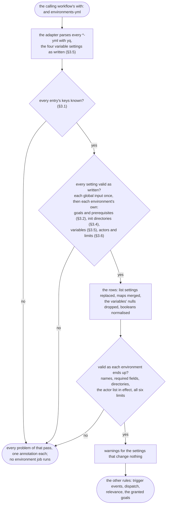
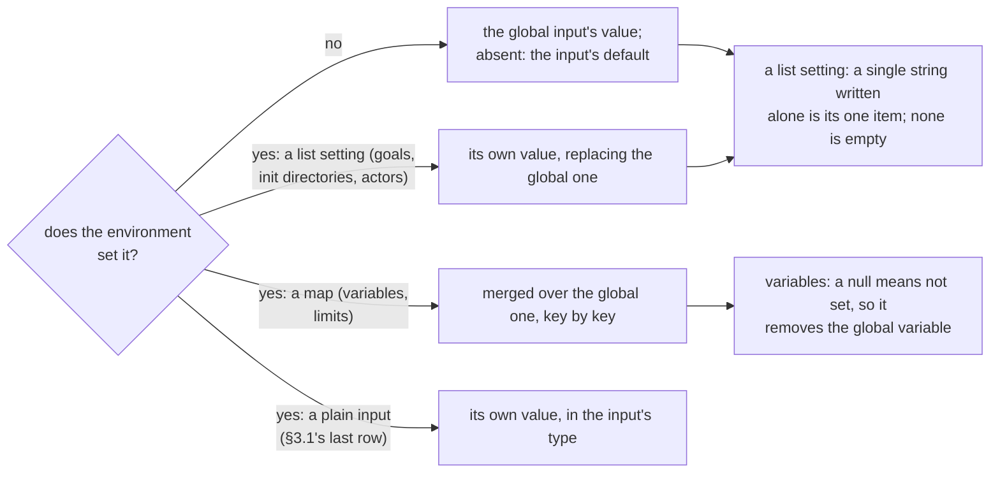

# Configuration validation

Authoritative spec for what the [decision engine](Decision-engine.md) accepts from a calling
workflow's configuration of [`terraform-ci-cd-default.yml`](../.github/workflows/terraform-ci-cd-default.yml),
and what it refuses, with the message it refuses with. It is rule 1 of the engine's decision
procedure: a configuration is valid or it is not, whatever the event, and nothing is decided until
it is.

§12 says where each rule lives; §13 is what implementation taught the spec.

## 1. Why

The workflow grew from a bash builder that forwarded whatever it was given. That made a mistake in
the configuration look like a different, valid configuration rather than an error, and the
difference showed up as an action nobody asked for:

- An environment written with `goals: [init, plan]` instead of `goals-yml:` kept the global goals,
  `[all]` by default, and applied on the next push to the default branch.
- A goals list written without its dashes, `init`, `plan` and `destroy-plan` on separate lines, is
  one string to YAML; the old gates read it as a substring and destroyed the environment. (Fixed
  with the dispatch rules; this spec states the goals rule whole.)
- A misspelt `github-environment` fell back to the environment's name, a GitHub Environment that
  does not exist and that the run then creates with no protection rules, so a required reviewer
  on apply was never asked.
- `pr-auto-merge-from-actors` left empty, or written as `~`, `{}`, `0` or `true`, let every actor's
  pull request auto-merge, past the required reviews.
- `ARM_SUBSCRIPTION_ID: 012345678901` lost its leading zero on the way to the job, and
  `TF_VAR_x: ~` reached it as the text `null`.

The rule of this spec: **every setting a caller writes means exactly one thing, and anything
else is an error that says plainly what is wrong and how to write it.** Where a setting has a
shorthand (a single goal written alone), the shorthand is spelled out here.

## 2. Decisions

| # | Decision | Rationale |
|---|---|---|
| D1 | Every key of an `environments-yml` entry must be one of an explicit list (§3.1). An unknown key is an error, never forwarded and never ignored. A workflow input added later is per-environment only when it is added to the list. | Forwarding every key let a misspelt key pass silently; a denylist would let a new workflow-only input be overridden per environment unnoticed. |
| D2 | An unsuffixed name of a per-environment YAML setting (`goals`, `extra-envs`, …) and a suffixed name of a plain one (`paths-yml`, `trigger-events-yml`) get their own messages naming the right spelling. | They are the likeliest mistakes, and the first applied (§1). |
| D3 | Goals are a list of known goal names; a single name written alone is that one goal. A goal whose prerequisite is missing is an error. | Decided by the maintainer: a goal that can never run must not be granted, recorded and believed. |
| D4 | Environment-variable values are text exactly as written. A null value means "not set". A mapping or a list as a value is an error. | YAML read `1.10` as `1.1` and dropped leading zeros before the value reached the job, and a null reached it as `null`. |
| D5 | With auto-merge switched on, every environment whose effective `pr-auto-merge-enabled` is true has an effective actor list naming at least one account. Empty is an error, not "everyone". | Decided by the maintainer: the old empty list let any author's pull request merge past review. |
| D6 | A per-environment `pr-auto-merge-from-actors-yml` replaces the global list for that environment. | Decided by the maintainer: the old merge added it to the global list, so a non-empty global list could only be widened per environment. |
| D7 | After the merge, `pr-auto-merge-limits` holds exactly the six known keys, each a YAML integer of at least `-1`. | A misspelt per-environment key was ignored over a permissive global value. |
| D8 | "On the default branch" means a branch of that name, never a tag. | A tag named like the default branch counted as it, so a dispatch from that tag could apply. |
| D9 | New messages are sentences for the person who wrote the configuration: what was written, why it cannot be used, and how to write what they probably meant. Existing messages keep their wording. | Asked for by the maintainer. Rewording every existing message would churn every spec's message table for no gain. |
| D10 | A `codeowners` value for the actor list, resolved from the repository's CODEOWNERS, is not offered. | Decided by the maintainer after the facts: teams resolve only with an organisation Members permission no workflow token has, email owners cannot be mapped to logins, and an owner merging their own change past review defeats the review. |

## 3. The rules

How a configuration is checked, before anything else is decided:



Where an environment's value for a setting comes from:



### 3.1 The keys of an `environments-yml` entry

An entry may hold exactly these keys:

| Key | Meaning |
|---|---|
| `environment` | required; the engine's name rule (`A-Z a-z 0-9 . _ -`, 1 to 255, starting with a letter or a digit) |
| `project-dir`, `github-environment`, `url` | as documented in the workflow |
| `paths`, `paths-ignore` | [Path-relevance.md](Path-relevance.md) §3 |
| `trigger-events` | [Dispatch-and-triggers.md](Dispatch-and-triggers.md) §3.2 |
| `depends-on` | [Environment-ordering.md](Environment-ordering.md) §3; one name written alone is that one name |
| `allow-failing-terraform-operations` | a per-environment setting only; there is no workflow input of that name |
| `goals-yml`, `terraform-init-additional-dirs-yml`, `pr-auto-merge-from-actors-yml` | replace the global input for this environment |
| `extra-envs-yml`, `extra-envs-from-secrets-yml`, `extra-envs-per-goal-yml`, `extra-envs-from-secrets-per-goal-yml`, `pr-auto-merge-limits-yml` | merged over the global input, key by key |
| `add-pr-comment`, `apply-extract-include-outputs`, `cache-terraform-modules`, `format-check-in-root-dir`, `pr-auto-merge-enabled`, `pr-comment-group`, `runs-on`, `terraform-version`, `tflint-version`, `verify-lock-file` | override the workflow input of the same name for this environment |

The last row is an explicit list in the engine (`PER_ENVIRONMENT_INPUTS`), and a test holds every
input the workflow declares to one of two classes: per environment (that list) or workflow only
(`environments-yml`, `trigger-events-yml`, `path-relevance-enabled`, the test stage's inputs,
`pr-auto-merge-app-id`, `pr-auto-merge-app-private-key-secret`). A new input fails that test until
someone decides its class. A spec that adds a key adds it to the first rows, as
Environment-ordering.md's `depends-on` did.

Refused, each with its own message:

| Written | Message |
|---|---|
| an unsuffixed YAML setting: `goals`, `extra-envs`, `extra-envs-from-secrets`, `extra-envs-per-goal`, `extra-envs-from-secrets-per-goal`, `pr-auto-merge-from-actors`, `pr-auto-merge-limits`, `terraform-init-additional-dirs` | `The environment 'prod' sets 'goals', which is not a setting: per environment it is 'goals-yml'. Written like this it would have been ignored, and the environment would have run with the global value.` |
| a suffixed plain setting: `paths-yml`, `paths-ignore-yml`, `trigger-events-yml`, `depends-on-yml` | `The environment 'prod' sets 'trigger-events-yml', which is not a setting: per environment it is 'trigger-events', a list written directly in the entry.` |
| a workflow-only input | `The environment 'prod' sets 'pr-auto-merge-app-id', which is a workflow input only: it applies to every environment at once. Set it in the calling workflow's 'with:'.` (the existing message for `path-relevance-enabled`, with its `paths: ['**']` advice, is kept) |
| a value the engine sets itself: `goals-granted`, `caller-repo-default-branch`, `caller-repo-calling-branch`, `caller-repo-is-on-default-branch` | `The environment 'prod' sets 'goals-granted', which the workflow works out itself; remove it.` |
| any other key | `The environment 'prod' sets 'github_environment', which is not a setting; did you mean 'github-environment'? The settings an environment may hold are listed in docs/Configuration-validation.md §3.1.` |

The suggestion is the one known key whose Levenshtein distance to the written key, both lower
cased, is smallest and at most 2; with no such key, or two at the same distance, there is no
suggestion. Every problem of every environment is reported in one run.

### 3.2 Goals

A caller names goals in `goals-yml`, globally or per environment:

- A YAML list of goal names: `[init, format, validate, lint, plan]`, or one `- name` per line.
- A single goal written alone is that one goal: `goals-yml: plan` is `[plan]` (and then needs
  `init`, below).
- Empty (`[]`, `""`, or the key with no value): no goals; the environment's job runs and does
  nothing. **Absent** is different: per environment it means the global `goals-yml`, and the
  global input absent means its default, `[all]`, which applies on a push to the default branch.

The names: `init`, `format`, `validate`, `lint`, `plan`, `apply`, `destroy-plan`, `destroy`, and
the three that are not stages, `all` (the five standard goals and `apply`), `apply-on-pr` and
`destroy-on-pr` (apply or destroy on a pull request against the default branch, each on its own).
Lower case, exactly.

A goal needs its prerequisite, or it could never run (D3):

| Goal | Needs |
|---|---|
| `plan`, `destroy-plan` | `init`, or `all` |
| `apply`, `apply-on-pr` | `plan`, or `all` |
| `destroy`, `destroy-on-pr` | `destroy-plan` |

`format`, `validate` and `lint` have no prerequisite here: their steps run whatever else is
granted, and `validate` or `lint` without `init` fail visibly in their own step rather than being
skipped. The global `goals-yml` is validated even when every environment sets its own: a
configuration is valid or not whatever the run, and a problem in a global input is reported once,
naming the input, not once per environment that inherits it.

Messages:

- `The environment 'prod' has the goal 'init plan destroy-plan', which is not a goal. It looks like a list written without its dashes: YAML reads the lines as one piece of text. Write one goal per line starting with '- ', or [init, plan, destroy-plan].` (the "looks like" sentences when the text holds goal names separated by spaces or commas)
- `The environment 'prod' has the goal 'aply', which is not a goal; did you mean 'apply'? A goal is one of init, format, validate, lint, plan, apply, destroy-plan, destroy, all, apply-on-pr, destroy-on-pr.`
- `The environment 'prod' has the goal 'ALL'; goals are written in lower case: 'all'.`
- `The environment 'prod' has the goal 'apply' without 'plan': an apply deploys the plan, so it could never run. Add 'plan', or use 'all'.`
- `The environment 'prod' has the goal 'destroy' without 'destroy-plan': a destroy deploys the destroy plan, so it could never run. Add 'destroy-plan'.`
- `The environment 'prod' has the goals {"plan": 1}; they must be a list of goal names.`
- For the global input: `goals-yml has the goal 'aply', …` in the same words.

### 3.3 Trigger events and path rules

As [Dispatch-and-triggers.md](Dispatch-and-triggers.md) §3.2 and [Path-relevance.md](Path-relevance.md)
§3 specify, with their existing messages.

### 3.4 Additional init directories

`terraform-init-additional-dirs-yml` is a list of directories, relative to the repository root. A
single directory written alone is that one directory; today a string inits nothing, silently.
Each entry is non-empty text. The init step quotes each directory, so one holding a space is one
directory.

- `The environment 'prod' has the additional init directory '', which is empty.`
- `The environment 'prod' has the additional init directory 5, which is not text; quote it.`
- `The environment 'prod' sets 'terraform-init-additional-dirs-yml' to {"main": true}; it must be a list of directories.`
- For the global input: `terraform-init-additional-dirs-yml has the additional init directory '', which is empty.` and `terraform-init-additional-dirs-yml is {"main": true}; it must be a list of directories.`
- A directory that does not exist is reported by the init step, as today.

### 3.5 Environment variables

`extra-envs-yml` and `extra-envs-per-goal-yml` hold variables by name; `extra-envs-from-secrets-yml`
and `extra-envs-from-secrets-per-goal-yml` hold secret names by variable name.

- A name follows the environment-variable rule, `[A-Za-z_][A-Za-z0-9_]*`.
- A value is text **as written** (D4). A plain scalar keeps its literal characters:
  `TF_VAR_version: 1.10` is `1.10`, `ACCOUNT: 012345678901` keeps its zero, `ARM_USE_OIDC: true` is
  `true`, `COUNT: 0x1F` is `0x1F`. A quoted or block scalar is its YAML value (chomping applies).
  The adapter reads these four settings, global and per environment, as a YAML string or as a
  mapping inside `environments-yml`, with every plain scalar's tag rewritten to a string before it
  becomes JSON; no other setting is read that way, so a per-environment `terraform-version: 1.10`
  is still refused with "quote it". A test lane's `extra-envs-yml` follows the same rule.
- A null value (`~`, `null`, `Null`, `NULL`, or the key with no value) means **not set**. In the
  job-wide maps the engine drops a null after the global and per-environment values are merged,
  so a per-environment null removes a global variable for that environment; it is never exported
  as the text `null`. In a per-goal plain map a null unsets the variable for that goal, as it does
  today. In a per-goal secret map and in a test lane, a null stays an error, as today.
- A mapping or a list as a value is an error: `The variable 'TAGS' of the environment 'prod' in 'extra-envs-yml' is a mapping; a variable's value is text. Quote it if the braces are part of the value.`
  (`… is a list; … if the brackets are part of the value.` for a list; `… is 3, which is not text; quote it.`
  for another value the adapter did not read as text; `… is not a variable name: a name is letters, digits and underscores, not starting with a digit.` for a bad name).
  For the global input, `The variable 'TAGS' in 'extra-envs-yml' is a mapping; …`, once, whatever
  the number of environments inheriting it.
- These rules are the engine's for the two job-wide maps, `extra-envs-yml` and
  `extra-envs-from-secrets-yml`. The per-goal maps are validated where they are resolved, by
  `resolve-goal-envs` in each environment's job, as before: an unknown goal key, a value that is
  not a mapping of variables, a null in a secret map. The engine reads their values as written and
  gives each map every goal key.

### 3.6 Auto-merge settings

With the workflow input `pr-auto-merge-enabled: true`, every environment whose effective
`pr-auto-merge-enabled` is true has an effective actor list (D5, D6):

- The effective list is the environment's own `pr-auto-merge-from-actors-yml` if it sets one, else
  the global input.
- It names at least one account: a list of logins, or a single login written alone. A login is
  GitHub's form, letters, digits and hyphens, 1 to 39 characters, not starting with a hyphen,
  optionally ending in `[bot]`; logins compare without case, as GitHub's do. A number in the list is
  an error (quote it).
- **In YAML, `[` and `]` delimit a flow list, so a bot login inside one must be quoted:**
  `'["dependabot[bot]", "renovate[bot]"]'`, or one `- "dependabot[bot]"` per line.
- Messages:
  - When no environment sets its own list, so the global one is in effect everywhere, one message naming the input: `Auto-merge is switched on (pr-auto-merge-enabled), but pr-auto-merge-from-actors-yml names nobody, so there is no one whose pull requests may merge without review. Name the accounts, for example ["dependabot[bot]"].`
  - Otherwise one per environment whose list in effect is empty: `Auto-merge is switched on (pr-auto-merge-enabled), but the actor list that applies to the environment 'prod' names nobody, so there is no one whose pull requests may merge without review. Name the accounts in pr-auto-merge-from-actors-yml, for example ["dependabot[bot]"].`
  - `pr-auto-merge-from-actors-yml holds 'dependabot[bot] renovate[bot]', which is not a login. It looks like a list written without its dashes: write one account per line starting with '- ', or ["dependabot[bot]", "renovate[bot]"].` (when the text holds logins separated by spaces or commas)
  - `pr-auto-merge-from-actors-yml holds 7, which is not a login; quote it if it is one.`
  - `pr-auto-merge-from-actors-yml holds 'a.b', which is not a login: a login is letters, digits and hyphens, up to 39, not starting with a hyphen, and a bot's ends in [bot].`
  - `pr-auto-merge-from-actors-yml is {"a": 1}; it must be a list of logins.`
  - Per environment the same, beginning `The pr-auto-merge-from-actors-yml of the environment 'prod' holds …`, and `The environment 'prod' sets 'pr-auto-merge-from-actors-yml' to 3; it must be a list of logins.`
- An environment whose effective `pr-auto-merge-enabled` is false needs no actors. Such an
  environment makes every pull request of the repository ineligible (Auto-merge.md §5), so it is
  the way to keep one environment's changes, and with them the repository, from auto-merging.
- With the input `false`, the shapes are still checked; empty lists are allowed.
- `pr-auto-merge-limits` (D7): after the global and per-environment values are merged, it holds
  exactly the six keys `plan-max-count-add`, `-change`, `-destroy`, `-import`, `-move`, `-remove`,
  each a YAML integer (not a boolean, not a quoted number) of at least `-1`, where `-1` means no
  limit. An absent or empty global value means the input's documented defaults.
  - `The environment 'prod' sets 'plan-max-count-destory' in 'pr-auto-merge-limits-yml', which is not a limit; did you mean 'plan-max-count-destroy'?` (with no near miss: `…, which is not a limit; the six limits are plan-max-count-add, -change, -destroy, -import, -move and -remove.`)
  - `pr-auto-merge-limits-yml sets 'plan-max-count-add' to '5', which is text; a limit is a whole number, written without quotes, and -1 means no limit.`
  - `pr-auto-merge-limits-yml sets 'plan-max-count-add' to -2; a limit is a whole number of -1 or more, and -1 means no limit.` (also for a boolean, a fraction and a null)
  - `pr-auto-merge-limits-yml lacks 'plan-max-count-move'; the six limits are plan-max-count-add, -change, -destroy, -import, -move and -remove.` (once, however many environments inherit it; for an environment that sets its own limits, `The limits of the environment 'prod' lack 'plan-max-count-move'; …`)
  - `pr-auto-merge-limits-yml is [1]; it must be a mapping of the six limits.`, and per environment `The environment 'prod' sets 'pr-auto-merge-limits-yml' to 'x'; it must be a mapping of the six limits.`
- A per-environment `pr-auto-merge-enabled: true` while the input is `false` changes nothing,
  because the auto-merge job does not run; it is a warning, not an error, so a repository that
  switched auto-merge off keeps running: `The environment 'prod' sets pr-auto-merge-enabled: true, but auto-merge is switched off for the whole run (the input pr-auto-merge-enabled is false), so it has no effect.`

Eligibility and the merge are [Auto-merge.md](Auto-merge.md).

### 3.7 Dispatch inputs

A dispatch whose delivered inputs hold neither `environment` nor `goal` runs every environment
with its goals, as a dispatch always has; its dispatch line says so, naming the inputs it did
deliver, sorted: `dispatched by octocat: this dispatch delivered the inputs mode, target but neither 'environment' nor 'goal', so every environment runs with its goals; the standard block is in docs/Dispatch-and-triggers.md §3.1`,
or, with none, `dispatched by octocat: this dispatch delivered no inputs, so every environment runs with its goals; the standard block is in docs/Dispatch-and-triggers.md §3.1`.
A string input dispatched empty is absent from the payload, so only delivered inputs can be named.
The standard block's `goal` is a choice with a default, which is always delivered, so a dispatch
that delivers neither comes from another block.
The adapter passes the names in the dispatch facts (`event.dispatch.inputs`, a list of strings),
never their values.

### 3.8 The default branch

"On the default branch" (the apply and destroy gates, a dispatch's `goal: apply`, the
`caller-repo-is-on-default-branch` row variable) means the run's ref is a **branch** named like the
default branch (D8). The adapter passes the runner's `GITHUB_REF_TYPE` as `event.ref_type`, a
required key of the input document. A run on a tag of that name is not on the default branch:
`dispatch: apply is only allowed from the default branch 'main'; this run is on the tag 'main'` (a
branch keeps the existing wording, `this run is on 'feature/x'`).

## 4. Message style

A new message (D9):

1. names the environment, or the input for a global problem, and the setting as written, quoted;
2. says in one clause why it cannot be used, in terms of what would have happened;
3. says how to write what was probably meant, with the exact text where there is one.

## 5. Examples

Each example is the part of the calling workflow's `with:` that matters, and what the engine does
with it.

**A standard project**, accepted:

```yaml
goals-yml: "[all]"
environments-yml: |
  - environment: dev
  - environment: prod
    github-environment: prod-approval
    goals-yml: [all, destroy-plan]
    extra-envs-yml:
      TF_VAR_sku_version: 1.10
```

`prod` plans and applies on a push to the default branch, destroy-plans on every run, and never
destroys; `TF_VAR_sku_version` is `1.10`, not `1.1`.

**A plan-only environment**, accepted: `goals-yml: [init, plan]` plans on every event and never
applies. Written as `goals-yml: plan` alone it is refused: `The environment 'dev' has the goal 'plan' without 'init' …`.

**A misspelt key**, refused:

```yaml
environments-yml: |
  - environment: prod
    goals: [init, plan]
```

`The environment 'prod' sets 'goals', which is not a setting: per environment it is 'goals-yml'. Written like this it would have been ignored, and the environment would have run with the global value.`

**A list without its dashes**, refused:

```yaml
goals-yml: |
  init
  plan
  destroy-plan
```

`goals-yml has the goal 'init plan destroy-plan', which is not a goal. It looks like a list written without its dashes …`

**Unsetting a global variable for one environment**, accepted:

```yaml
extra-envs-yml: |
  TF_LOG: DEBUG
environments-yml: |
  - environment: dev
  - environment: prod
    extra-envs-yml:
      TF_LOG: ~
```

`dev` runs with `TF_LOG=DEBUG`; `prod` has no `TF_LOG` at all.

**Auto-merge for two bots, production for one**, accepted:

```yaml
pr-auto-merge-enabled: true
pr-auto-merge-from-actors-yml: |
  - "dependabot[bot]"
  - "renovate[bot]"
pr-auto-merge-limits-yml: |
  plan-max-count-add: 5
  plan-max-count-change: 5
  plan-max-count-destroy: 0
  plan-max-count-import: -1
  plan-max-count-move: -1
  plan-max-count-remove: 0
environments-yml: |
  - environment: dev
  - environment: prod
    pr-auto-merge-from-actors-yml: ["dependabot[bot]"]
    pr-auto-merge-limits-yml:
      plan-max-count-add: 0
      plan-max-count-change: 0
```

A renovate pull request is not eligible, whatever it touches, because every environment of the run
must allow its actor and prod allows only dependabot. A dependabot pull request is eligible when
dev's plan stays within five adds and changes and prod's plan changes nothing.

**Auto-merge switched on with no actors**, refused: `Auto-merge is switched on (pr-auto-merge-enabled), but pr-auto-merge-from-actors-yml names nobody, …`.
With one environment naming its own actors, the others are named one by one: `… but the actor list that applies to the environment 'dev' names nobody, …`.

## 6. Interplay with other specs

| Spec | Relationship |
|---|---|
| [Decision-engine.md](Decision-engine.md) | This is its rule 1. The input document gains `event.ref_type` (required) and `event.dispatch.inputs`; the adapter's reading of the variable settings changes (§3.5); the core gains the key, goal, variable and auto-merge checks and drops null variables after the merge. |
| [Dispatch-and-triggers.md](Dispatch-and-triggers.md) | Goals (§3.2) are its rule 5's input; the dispatch line gains the delivered-inputs case (§3.7); the default branch is a branch (§3.8). |
| [Auto-merge.md](Auto-merge.md) | Its settings are validated here (§3.6); eligibility and the merge are there. |
| [Per-goal-environment-variables.md](Per-goal-environment-variables.md) | Its maps' keys are validated by `resolve-goal-envs`, unchanged; their values follow §3.5. |
| [Terraform-tests.md](Terraform-tests.md) | A lane's `extra-envs-yml` values follow §3.5's text rule; lanes keep their own key validation. |
| [Environment-ordering.md](Environment-ordering.md) | Its `depends-on` is on §3.1's list; the declared graph is validated there (its §5), after this spec's checks. |

## 7. Breaking changes

What these rules break for a configuration that worked on v0:

- unknown, unsuffixed and wrongly suffixed keys in an environment entry;
- goals whose prerequisite is missing;
- a mapping or a list as a variable value; a null value no longer exported as `null`;
- a variable value that is a plain scalar reaches the job as written (`1.10`, not `1.1`);
- a single additional init directory written as a string now inits it;
- auto-merge with no actors in effect for an environment; a per-environment actor list now
  replacing the global one; logins compared without case;
- limits: a quoted number, a missing key after the merge, an unknown key, a boolean;
- a tag named like the default branch is no longer the default branch.

No surveyed caller is affected: every key the callers use is on §3.1's list, every goals list is a
list of known names with its prerequisites, no variable value is a number, a null or a mapping,
the one caller with auto-merge names its actor in a block list, and every caller's limits are the
integer defaults.

## 8. Pitfalls

| # | Pitfall | Consequence | Rule |
|---|---|---|---|
| P1 | Generic forwarding made every key a row variable. | A misspelt key was a variable nobody reads. | The keys are checked before forwarding (D1). |
| P2 | YAML types plain scalars before anyone sees them. | `1.10` became `1.1`. | The adapter rewrites the variable settings' plain scalars to strings (§3.5). |
| P3 | GitHub logins are case-insensitive; the old actor match was not. | `Dependabot[bot]` never matched. | Logins compare without case (§3.6). |
| P4 | `GITHUB_REF_NAME` is the short name of a branch or a tag. | A tag named `main` was the default branch. | The ref type is checked (§3.8). |
| P5 | `[dependabot[bot]]` is not YAML. | A whole `environments-yml` fails to parse. | The messages and examples quote bot logins in flow lists (§3.6). |
| P6 | `$GITHUB_ENV` has no way to unset a variable. | A null exported as `null`. | Nulls are dropped before export (§3.5). |

## 9. Tests

In the engine's suite, table cases for every message of §3 and every example of §5; generated cases
over key names (each known key, its unsuffixed or suffixed form, a near miss at distance 1, 2 and 3,
a tie, an engine-set name), goal lists (each name, each prerequisite pair, case, shapes), variable
values (every YAML scalar form, native and as text, globally and per environment), actor lists and
limits; the invariants hold on every one. A structural test classifies every declared workflow
input (§3.1). In the adapter's suite, the source text of the variable settings for every scalar
form.

The expected churn, by category, so a reviewer can tell intended changes from accidents:

- every `input.json` of the port cases gains `event.ref_type` and a dispatch's `inputs`, and no
  golden changes with it;
- rows whose variable values were YAML booleans or numbers now hold them as text (15 cases,
  among them the callers 04 to 14, 16 and 17); the exported values are unchanged;
- a per-environment actor list replaces instead of merging (`fixture-happy-day-v1`,
  `merge-arrays-keep-duplicates`);
- an empty global limits value is the documented default, not null (`merge-global-empty-per-env-absent`);
- the cases that held a refused shape become errors, each recorded as a deviation
  (`per-env-goals-scalar`, `per-env-arbitrary-keys`, `per-env-stripped-names`, `merge-array-vs-object`, …).

## 10. Open questions

None; the decisions are the maintainer's (D3, D5, D6, D10).

## 11. Implementation order

1. `docs:` this spec and [Auto-merge.md](Auto-merge.md), with the breaking changes of §7.
2. `feat(engine):` the keys of an entry and the input classification (§3.1).
3. `feat(engine):` the goals' prerequisites and the goal messages (§3.2).
4. `feat(engine):` variables as source text, nulls dropped, their rules (§3.5); the adapter's reading.
5. `feat(engine):` the auto-merge settings (§3.6) and the additional init directories (§3.4).
6. `feat(engine):` the dispatch inputs' names (§3.7) and the ref type (§3.8).
7. `fix(terraform-init):` quote each additional directory.
8. Then Auto-merge.md's order.
9. `docs:` the thorough refresh: flow charts of the engine, the user guide's examples, the
   workflow's input descriptions (the per-environment settings, `environments-yml`'s key list).
10. Test-bed run: every example of §5 and a refused one of each kind.

## 12. Implementation notes

Every rule is core code in `engine/dsb_tf_engine/environments.py`, run by `build_rows` in two passes:

| Pass | What | Functions |
|---|---|---|
| as written, before any row | the keys of every entry (§3.1); goals (§3.2), init directories (§3.4), actors and limits (§3.6), the job-wide variables (§3.5), each global value once and then each environment's own | `check_keys`, `_setting_problems` (`goal_problems`, `init_dir_problems`, `actor_problems`, `limit_problems`, `variable_problems`) |
| per row | the variables' nulls dropped after the merge (§3.5) | `_without_nulls` |
| what each environment ends up with | the actor list in effect, all six limits (§3.6) | `_auto_merge_problems` |
| a warning, not an error | `pr-auto-merge-enabled: true` for an environment while the input is false | `setting_warnings`, read by `decide` |

The default branch is `on_default_branch`, the one place the gates' expansion, a dispatched apply
and `caller-repo-is-on-default-branch` read it. The dispatch line is `triggers.lines`. The adapter
reads the four variable settings through the `READ_AS` yq expressions (§3.5), `GITHUB_REF_TYPE`
into `event.ref_type` (a required runner variable), and a dispatch's delivered input names into
`event.dispatch.inputs`. `terraform-init/step_init.sh` reads the directories as NUL-terminated
items.

The tests are `engine/tests/test_config.py` (keys, variables, init directories, actors, limits,
warnings, one run reporting every kind), `test_triggers.py` (goals, the ref type, the dispatch
lines), `test_adapter.py` (the source text of every scalar form, the runner's ref type, the
delivered names) and `terraform-init/run_tests_step_init.sh` (a directory holding a space).

## 13. What implementation taught the spec

- **The yq rewrite has to be scoped three ways.** Rewriting "every plain scalar under these keys"
  created the keys where they were absent, turned a null document into `[]`, and turned a bare
  `false` given for a whole setting into text. The expressions select existing keys by name, only
  inside a list of mappings for `environments-yml`, and only inside a mapping for the global
  inputs.
- **The empty-actor message names the input or the environments, never both.** One message naming
  the input when no environment sets its own list; otherwise one per environment in need, since the
  fix can then be in either place.
- **Two passes, not one.** Every problem of the settings as written is reported in one run, globals
  first. What an environment ends up with (the actors in effect, the six limits) can only be judged
  once its row is built, so those come in a following run when the first had other problems.
- **The variables moved into the first pass.** Checked after the merge, a bad global variable was
  blamed on the first environment inheriting it, and only that environment's problems were
  reported; the worked examples of the user guide showed it. Checked as written, a global
  variable's problem names the input once and every environment's are reported together, and the
  merge of two valid maps needs no check of its own.
- **The init-directory rule retired a branch elsewhere.** Path relevance handled a directories value
  that was not a list; with every row's directories now a list of non-empty text, that branch was
  unreachable and was removed.
- **A null inside a per-environment limits mapping is refused as a value.** The merge keeps a null
  leaf, and a limit of null is neither a limit nor "not set".
- **Numbers in actor lists are ints only.** A fraction can never be a login, so only a whole number
  gets the "quote it" advice; anything else gets the login rule.
- **On the test bed every refusal and every accepted shape behaved as written.** One dispatch
  holding one mistake of each kind (an unsuffixed key, a near miss, a suffixed plain setting, a
  workflow-only input, goals without dashes, a goal without its prerequisite, an empty init
  directory, actors without dashes, a quoted and a misspelt limit) reported all ten in one run, in
  the words of §3. An accepted configuration showed a per-environment null removing a global
  variable, `1.10` and `012345678901` reaching the row as written, a single init directory written
  alone being initialised, and the inert per-environment `pr-auto-merge-enabled: true` as a
  warning. From a tag, a dispatched apply was refused naming the tag, and a default dispatch was
  granted no apply.
