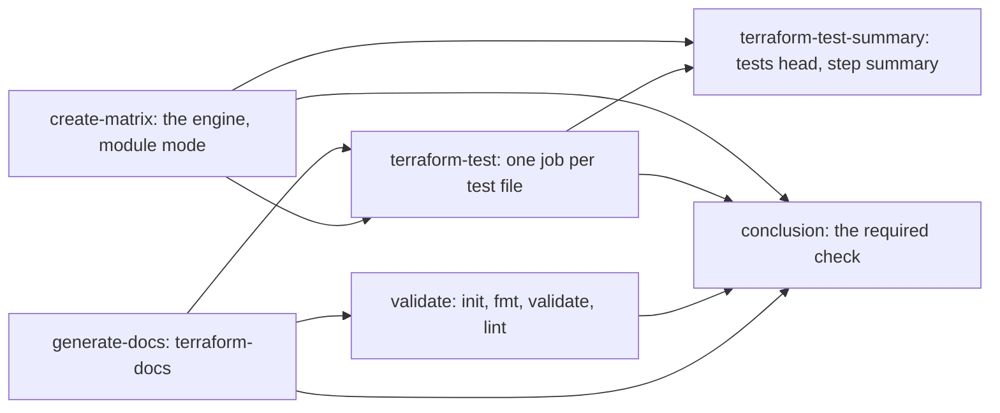

# Module CI

Status: **designed, being built.** §2 is settled; §13 lists what is open.

The reusable workflow [`terraform-module-ci.yaml`](../.github/workflows/terraform-module-ci.yaml)
validates, documents and tests a Terraform **module** repository: one module at the repository
root, its examples, and its `terraform test` files. The project workflow,
[`terraform-ci-cd-default.yml`](../.github/workflows/terraform-ci-cd-default.yml), does the same
for a repository of environments that are planned and applied. The two are separate workflows,
one per kind of repository, and share every piece that makes sense to share: the decision engine
decides the test stage for both, the test jobs are one job written twice, and the reports come
from the same actions. The user guide is
[Workflow-terraform-module-ci.md](Workflow-terraform-module-ci.md).

## 1. Why

On v0 module CI grew beside the project workflow and kept its own ways: a `find` over the working
tree for the test files, one comment per test file, a login with the repository's Azure principal
for every file, unit tests included, and a conclusion that failed a repository with no test files
the moment the shared `terraform-test` action moved on. The project workflow's test stage
([Terraform-tests.md](Terraform-tests.md)) solved each of these: committed files only, lanes with
their own credentials and GitHub Environments, one summary comment, a conclusion that judges named
results. Module CI takes that stage over instead of keeping a second one.

## 2. Decisions

| # | Decision | Why |
|---|---|---|
| D1 | **The decision engine decides a module's test stage**, in a module mode of the `create-matrix` command: the same discovery, root rule, lanes and validation as the project workflow's test stage, with no environments. `create-tftest-matrix` and `create-test-report` leave the v1 line. | One set of rules under the engine's coverage and mutation gates (Decision-engine.md D12, D13). The two actions were used by module CI alone; v0 keeps its own copies. |
| D2 | **The module workflow carries the project workflow's `terraform-test` and `terraform-test-summary` jobs**, written out again and held to the same steps by a structural test (F20). One workflow per kind of repository, never one for both. | A shared reusable workflow would change the project workflow's job graph and its check names, and nest `secrets: inherit`; a copy under a parity test cannot drift. |
| D3 | **Tests run on `pull_request`, `push`, `workflow_dispatch` and `schedule`** in module mode. | Module callers use a dispatch as their manual build, and a nightly schedule catches provider and API drift; a module has no environment to recover, which is why the project mode keeps tests off dispatches. |
| D4 | **Credentials come only from lanes**: none by default; one credential, the normal case, is one fallback lane that maps the repository's secrets; several are several lanes, and a lane may run in its own GitHub Environment with OIDC (§6). | The v0 workflow gave every file the repository's principal through workflow-level `env:`. Every module caller already carries the same three secret names in a calling-workflow `env:` block that never reached the called workflow; the lane replaces that block line for line. An implicit default lane would fail every repository without those secrets and keep unit tests on the principal. |
| D5 | **Terraform 1.13 or later** for the test jobs, as in the project workflow. | One floor, one authoring rule (Terraform-tests.md D11). |
| D6 | **terraform-docs pushes only on a pull request from the repository**, not from a fork or Dependabot; everywhere else a README that needs regenerating fails the docs check. The action is converted to the modern layout and keeps the upstream Docker action. | A dispatch or a push must never commit to the branch it runs on, `main` included. The Docker action's pinned terraform-docs keeps every README's table spacing. |
| D7 | **App tokens come from `actions/create-github-app-token@v3`**, in module CI and module release. | The organisation's own token action needs Deno from v3, which the hosted runners do not carry; the project workflow already uses the upstream action. |
| D8 | **Reporting follows the project workflow**: a validation head and a tests head on a pull request, a step summary from every job, and a conclusion line in the log, the step summary and an annotation. The per-file test comments of v0 are deleted once. | One reporting model for both kinds of repository ([Workflow-pr-comments.md](Workflow-pr-comments.md)); the actions exist. |
| D9 | **A module needs at least one test file**: with none, the conclusion is red, `terraform-test-required: false` opts out. Everything from a unit suite up is supported: lanes, GitHub Environments, OIDC, several credentials. | A module's tests are its contract with its callers; the template ships a unit suite. |
| D10 | **The test bed is a module-shaped branch of the project test bed**, with the kept test identity; close to release a real module repository is moved by the migration guide. | No new repository to administer; the identity and its environment exist. |
| D11 | **Scope: everything that makes sense to share**, and the module workflow's own gaps with it: the plugin cache, per-job permissions, parsed warnings, the docs. | The two workflows are held together by the structural tests from here on. |

## 3. Caller-facing API

### 3.1 Inputs

| Input | Type | Default | Meaning |
|---|---|---|---|
| `terraform-version` | string | required | Terraform for validation and, unless a lane says otherwise, the tests; 1.13 or later for tests. |
| `tflint-version` | string | required | TFLint for the lint step. |
| `readme-file-path` | string | `.` | Directory of the README terraform-docs maintains. |
| `runs-on` | string | `ubuntu-latest` | Runner of every job but the test jobs. |
| `add-pr-comment` | boolean | `true` | Post the validation and tests heads on pull requests. |
| `cache-terraform-modules` | boolean | `true` | The module cache in the test jobs ([Terraform-module-cache.md](Terraform-module-cache.md)). |
| `terraform-test-enabled` | boolean | `true` | `false` removes the test stage. |
| `terraform-test-required` | boolean | `true` | `false` lets a repository with no test file conclude green (D9). |
| `allow-failing-terraform-tests` | boolean | `false` | A failing test does not fail the check; per lane too. |
| `terraform-test-runs-on` | string | `ubuntu-latest` | Runner of the test jobs; per lane `runs-on`. |
| `terraform-test-timeout-minutes` | number | `30` | Each test job's timeout; per lane `timeout-minutes`. |
| `terraform-test-lanes-yml` | string | `""` | Lanes, exactly as in the project workflow ([Terraform-tests.md §3.2](Terraform-tests.md)). |
| `terraform-test-exclude-paths-yml` | string | `""` | Globs of test files discovery ignores. |

Every input with a project-workflow namesake means the same there; the engine validates them with
the same rules and messages ([Configuration-validation.md](Configuration-validation.md)).

### 3.2 Permissions, secrets and variables

```yaml
    permissions:
      id-token: write      # OIDC, for the test jobs
      contents: read       # checkout; the docs job pushes with the App token, not this one
      pull-requests: write # the heads
      actions: read        # job links in the tests head
    secrets: inherit
```

No job asks for more than `contents: read`: the docs commit is pushed with the App token, which
carries its own permissions. The App is the organisation's CI App: `vars.ORG_TF_CICD_APP_ID` and
`secrets.ORG_TF_CICD_APP_PRIVATE_KEY`. `vars.ORG_TF_CICD_APP_INSTALLATION_ID` is no longer read.

## 4. Jobs



| Job | Check name | What it does |
|---|---|---|
| `create-matrix` | `Create test matrix` | Runs `create-tf-vars-matrix` with `mode: module`; uploads `relevance` (the decision, for the summary). |
| `generate-docs` | `Update documentation` | terraform-docs on the README and the examples; on a pull request it commits a regenerated README with the App token, which starts a new run; elsewhere a README that needs regenerating fails it. |
| `validate` | `Validate module` | Init (no backend), fmt, validate, TFLint, the init and validate warnings, the validation head and its step summary, then the gates. Skipped when the docs job pushed a commit: the run the push starts validates. |
| `terraform-test` | `Terraform test (<file>)` | The project workflow's test job, step for step (F20); it waits for the docs job and skips when that pushed a commit. |
| `terraform-test-summary` | `Terraform tests summary` | The project workflow's summary job, step for step, while the stage is on: on every event with test files, and on a pull request. |
| `conclusion` | `Terraform conclusion` | §8. The only check a caller requires. |

The test jobs do not wait for validation: they install their own providers, and a failing test is
worth seeing next to a failing lint. They do wait for the docs job, as validation does: a docs
commit starts a run of its own, and this run's tree is superseded.

## 5. The engine's module mode

`create-matrix --mode module` (the action input `mode: module`) builds the input document without
`environments-yml`: no environments, no changed files, the test facts only (committed test files,
directories with `.tf` files; no locks, since a module commits none). The document carries
`"mode": "module"`, and `decide` then:

1. validates the test stage's inputs and lanes with the project mode's rules;
2. refuses an event other than the four of D3, as the project mode does;
3. decides the test stage on `pull_request`, `push`, `workflow_dispatch` and `schedule`, with no
   provider sets: every test root floats its providers;
4. with `terraform-test-required` true and the stage run, sets the tests block's `missing` when no
   test file runs or is held back from a fork (a misplaced or excluded file counts as none), with
   a warning naming the fix; the adapter publishes it as `tests-required-missing` (§8).

The output carries `tests`, `notices`, `warnings`, `trigger` and a record of one line per test
file (`tests/unit-tests.tftest.hcl: run, lane unit` or `…: not run, misplaced`). The adapter
publishes `tests-matrix-json`, `tests-count`, `tests-active`, `tests-required-missing` and
`relevance-file`; the file holds the output without matrices, as in the project mode, so
`create-test-summary` reads its not-run rows from the same place.

## 6. Credentials

| Case | Configuration |
|---|---|
| None | No lanes. Every file runs without credentials: unit tests with `mock_provider`. |
| One, from repository secrets (the v0 shape) | One fallback lane mapping the secrets the repository already has: |

```yaml
      terraform-test-lanes-yml: |
        - name: azure
          extra-envs-yml:
            ARM_USE_OIDC: true
            ARM_USE_AZUREAD: true
          extra-envs-from-secrets-yml:
            ARM_TENANT_ID: REPO_AZURE_DSB_TENANT_ID
            ARM_SUBSCRIPTION_ID: REPO_AZURE_SUBSCRIPTION_ID
            ARM_CLIENT_ID: REPO_AZURE_TERRAFORM_USER_SERVICE_PRINCIPAL
```

| Case | Configuration |
|---|---|
| One, isolated (recommended) | The same lane with `github-environment: auto` instead of the mappings; the environment holds the `ARM_*` secrets and the identity trusts `repo:<owner>/<repo>:environment:tftest-<lane>` only. |
| Unit without, integration with | Two lanes: `unit` matching `**/unit-*.tftest.hcl` with nothing, `integration` with a credential. |
| Several | One lane per identity, each matching its files. |

Lanes are the project workflow's, key for key ([Terraform-tests.md §3.2, §3.6](Terraform-tests.md)).

## 7. Reporting

| Surface | Pull request | Push, dispatch, schedule |
|---|---|---|
| Validation head `<!-- tf:head:module -->` | `create-validation-summary` with `subject: module`: the title "Terraform validation summary for module: `<repository>`", init, fmt, validate, lint and the warnings count; no lock and no plan rows (`absent`) | — |
| Tests head `<!-- tf:head:tests:<caller> -->` | `create-test-summary`, one comment for every file | — |
| Legacy `<!-- tf:head:test:<file> -->` comments | deleted by the validate job | — |
| Step summaries | validation block, each test job's block, the tests block, the conclusion line | the same |
| Annotations | one per failed gate, the tests headline, the conclusion | the same |

The docs job writes one line to its step summary: regenerated and pushed, up to date, or needs
regenerating.

## 8. The conclusion

Judges named results and the engine's outputs, like the project workflow's
([Path-relevance.md §7](Path-relevance.md)):

| Condition | Verdict |
|---|---|
| `create-matrix` not successful | red: the matrix could not be built |
| docs job not successful | red |
| docs job pushed a commit (validation skipped on purpose) | green: the run the push started decides |
| validation not successful, docs not pushed | red |
| tests required, stage on, no test file | red: a module needs at least one test file |
| tests active and the test jobs not successful | red |
| tests inactive and the test jobs skipped | fine |

One line, for example `conclusion: green — validation succeeded; tests: 4`, to the log, the step
summary and a `::notice` or `::error`.

## 9. Moving a module repository from v0

The user guide, [Workflow-terraform-module-ci.md](Workflow-terraform-module-ci.md), has the calling workflow and the lanes. In short: `@v1`; Terraform 1.13 or later;
`actions: read`; the calling workflow's `env:` block becomes a lane (§6); a repository without
tests adds a unit suite or sets `terraform-test-required: false` for the move.

## 10. Pitfalls

| # | Pitfall | Consequence | Rule |
|---|---|---|---|
| P1 | The calling workflow's `env:` block kept | Nothing: a caller's workflow-level `env` never reaches a called workflow. Tests without a lane have no credentials. | Replace it with a lane (§6). |
| P2 | A unit test without `mock_provider` in a lane without credentials | The provider fails to configure. | Mock the provider, or give the lane the credential. |
| P3 | Two module test jobs of two pull requests on one integration file | They create the same fixed-name objects. | The per-file concurrency group of the test job, `queue: max`. |
| P4 | A docs commit pushed with `GITHUB_TOKEN` | No new run starts, and the required check stays on the old commit. | The App token (D7). |
| P5 | The plugin cache restored where no CLI config points at it | Never read, and a miss fails init. | The test jobs set their cache up themselves, as in the project workflow; validation keeps its own. |
| P6 | A README out of date on a fork's pull request, a push, a dispatch or a schedule | The docs check fails: only a pull request from the repository gets a docs commit. | Regenerate with terraform-docs 0.20 (the pinned action's), or let a pull request regenerate it. |
| P7 | `.tflint.hcl` matched by the template's `.gitignore` (`**/.tflint.hcl`) | A copy that is not force-added is never committed, and lint fails: "could not find a TFLint config file". | The template keeps it force-added; a repository keeps it that way. |
| P8 | The default terraform-docs config injected in check mode | Upstream stages the whole directory and counts every staged file, so the injected file would read as drift. | The injected config is listed in `.git/info/exclude`; with push it is committed as before. |

## 11. Tests

- Engine: module mode for every event, the required finding, lanes and exclusions without
  environments, the record, the published outputs; under both gates.
- F20: `terraform-test` and `terraform-test-summary` of the two workflows have the same steps, the
  same permissions, environment, strategy and concurrency; they differ only in `needs` and in `if`
  where the module mode's events differ.
- F21: the module conclusion's needs, named results and lines; F9, F16 and F19 already cover the
  module workflows.
- `terraform-docs`: a suite for the converted step (push on a pull request only, fail on a diff
  elsewhere, the counts).
- The test bed: no test file, a unit suite only, the one-credential lane, an environment lane with
  OIDC, a docs change on a pull request, a dispatch.

## 12. Where each piece lives

| Piece | Where |
|---|---|
| Module mode | `engine/dsb_tf_engine/decide.py`, `tests.py`, `adapter.py`, `__main__.py` |
| The action input | `create-tf-vars-matrix/action.yml` (`mode`) |
| The module head | `create-validation-summary/` (`subject`, the `absent` status) |
| Docs | `terraform-docs/` |
| The workflows | `.github/workflows/terraform-module-ci.yaml`, `terraform-module-release.yaml` |
| Parity and conclusion tests | `evaluate-automerge-eligibility/run_all_tests.sh` (F20, F21) |

## 13. Open questions

1. The pull-request round on the test bed: a docs commit through the App, the validation and tests
   heads, the removal of v0's per-file comments.
2. An integration test that creates and destroys a resource in a sandbox resource group.

## 14. What implementation taught the spec

- **The test bed ran the rest through the workflow at the preview ref**, on a module-shaped branch
  of the project test bed made from the module template:
  - a push: the unit suite ran without credentials and the integration test as the lane
    identity, through its GitHub Environment and OIDC;
  - a README that needed regenerating failed the docs check with its step-summary line, and the
    conclusion named it;
  - with the README current, every job and the conclusion were green (`conclusion: green —
    validation succeeded; tests: 2`);
  - a dispatch ran the tests;
  - a branch without test files was red with the warning and `a module needs at least one test
    file`, and green with `terraform-test-required: false`.
- **The first mutation run of the module mode** found the adapter's string defaults and one
  conditional redundant; the adapter takes a boolean, and `--mode` is required.
