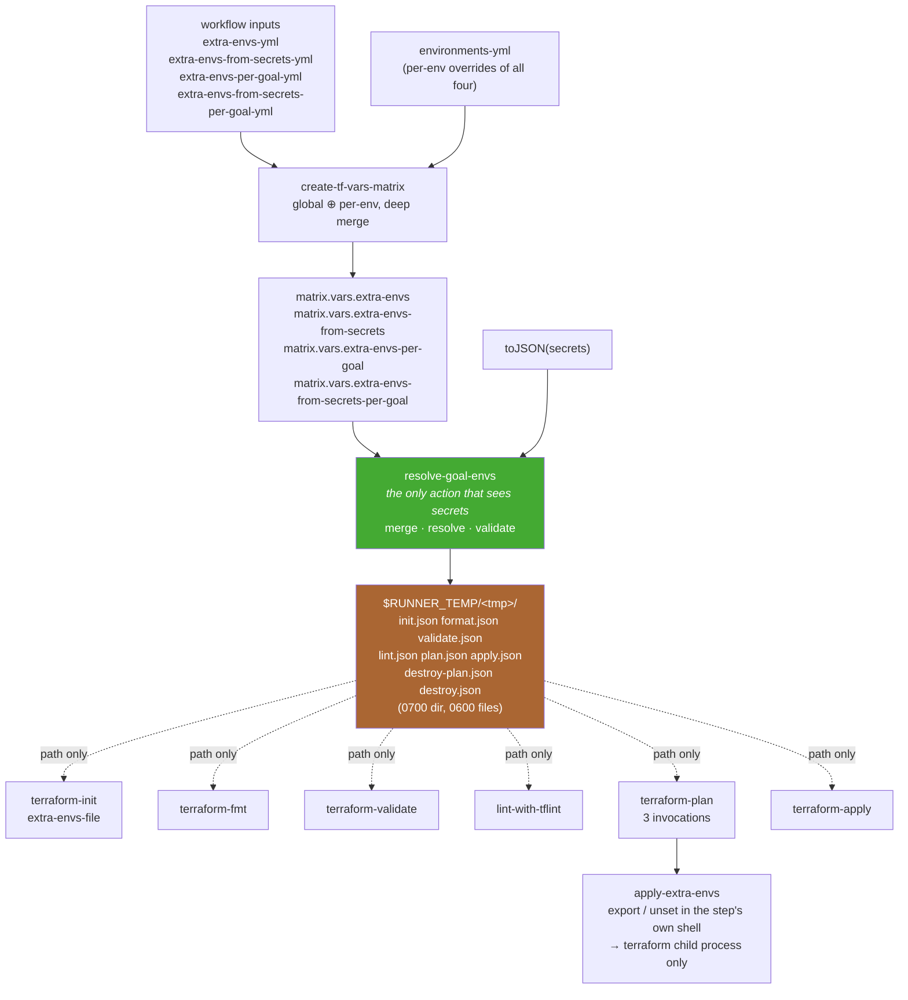

# Per-goal environment variables

Status: **spec — design decisions settled, not yet implemented**. Living document — update as implementation lands.

Lets callers set environment variables (plain and secret-sourced) for a single
terraform goal rather than for the whole job. Motivating case: `GOMEMLIMIT` and
`GOGC` tuned differently for `plan` than for the rest of the job.

## 1. Why

Today `extra-envs-yml` / `extra-envs-from-secrets-yml` resolve to a single set of
values that `export-env-vars` writes to `$GITHUB_ENV`
([export-env-vars/helpers_additional.sh:25-27](../export-env-vars/helpers_additional.sh#L25-L27)).
`$GITHUB_ENV` is append-only and job-wide, so every value reaches every
subsequent step — init, fmt, validate, lint, plan, apply, destroy, plus all the
parse and PR-comment steps. Scope granularity is the environment (= the matrix
row = the job), and nothing finer exists.

That is wrong for values whose correct setting differs per stage. `plan` may need
a much higher `GOMEMLIMIT` than `validate`; `terraform show -json` on a large plan
is a serious allocator while `fmt` is not; a `GOGC` low enough to keep `plan`
inside a runner's memory would needlessly slow down `lint`.

Goals of this design:

- Per-goal values for both plain and secret-sourced environment variables.
- Values scoped to the goal's own process — not leaked into sibling steps.
- Genuine *unset*, not just "set to empty string".
- Exactly one place in the repo handles the secrets bag.
- No large payload on `argv` or in `envp` (see [§8](#8-arg_max-and-payload-handling)).

## 2. Caller-facing API

### 2.1 New workflow inputs

Two new inputs on `.github/workflows/terraform-ci-cd-default.yml`, mirroring the
existing pair exactly (see [§4](#4-matrix-builder-changes) for the alignment
points):

| input | type | default |
|---|---|---|
| `extra-envs-per-goal-yml` | string (YAML) | `"{}"` |
| `extra-envs-from-secrets-per-goal-yml` | string (YAML) | `"{}"` |

Both are also valid **per-environment fields** inside `environments-yml`, like
their global counterparts.

```yaml
      extra-envs-yml: |
        ARM_USE_OIDC: true
        GOGC: 50
        GOMEMLIMIT: 6GiB

      extra-envs-per-goal-yml: |
        plan:
          GOMEMLIMIT: 12GiB
          GOGC: 25
        apply:
          GOMEMLIMIT: ~          # cleared for apply
        lint:
          GOGC: 400

      extra-envs-from-secrets-yml: |
        ARM_TENANT_ID: AZURE_TENANT_ID
        ARM_CLIENT_ID: AZURE_PLAN_READER_CLIENT_ID

      extra-envs-from-secrets-per-goal-yml: |
        apply:
          ARM_CLIENT_ID: AZURE_APPLY_CONTRIBUTOR_CLIENT_ID

      environments-yml: |
        - environment: dev
        - environment: prod
          extra-envs-per-goal-yml:
            plan:
              GOMEMLIMIT: 24GiB
```

> **Read [§9.3](#93-limitation-per-goal-secrets-cannot-swap-cloud-identity) before
> writing `extra-envs-from-secrets-per-goal-yml` for `ARM_*` credentials.** It
> does not do what it looks like it does.

### 2.2 Goal keys

Valid keys, matching the **goal** vocabulary a caller writes in `goals-yml`
(not the workflow's step ids):

`init` · `format` · `validate` · `lint` · `plan` · `apply` · `destroy-plan` · `destroy`

Notes:

- The key is `format`, though the workflow step id is `fmt`. The caller-facing
  name follows `goals-yml`.
- `destroy-plan` / `destroy` are separate keys from `plan` / `apply` even though
  they reuse the same two actions. This is deliberate — it is what lets a destroy
  plan be tuned independently.
- **There is no key for `all`.** `all` is not a stage; it is shorthand expanded
  inside each step's `if:` condition. The "applies to every goal" layer is the
  existing `extra-envs-yml`. An unknown key is a hard error
  ([§5.4](#54-validation)) precisely so `all:` fails loudly instead of silently
  doing nothing.

### 2.3 Merge and precedence

Resolution happens in two stages. The matrix builder resolves *global vs
per-environment*; the resolver action resolves *global vs per-goal* and expands
secret names.

Effective value for a given (environment, goal, key), last wins:

1. global `extra-envs-yml`
2. global `extra-envs-from-secrets-yml` (resolved)
3. per-goal `extra-envs-per-goal-yml[goal]`
4. per-goal `extra-envs-from-secrets-per-goal-yml[goal]` (resolved)

Two rules encoded there:

- **Specificity beats source.** A per-goal plain value overrides a global
  secret-sourced value for the same key (3 beats 2).
- **Within one specificity level, secrets win** (2 beats 1, 4 beats 3). This is
  not arbitrary — it preserves today's behavior, where
  [export-env-vars/action.yml:60-85](../export-env-vars/action.yml#L60-L85) runs
  the plain loop first and the secrets loop second, so a key present in both
  global maps already resolves to the secret value. Changing it would be a silent
  behavior change for existing callers.

Per-environment overrides are applied *before* any of this, by the matrix
builder, and are a **deep** merge — see
[§9.5](#95-deep-merge-one-existing-field-is-an-array).

Worked example from [§2.1](#21-new-workflow-inputs):

| | `GOGC` | `GOMEMLIMIT` | `ARM_CLIENT_ID` |
|---|---|---|---|
| dev · init/validate/format/destroy-* | 50 | 6GiB | `AZURE_PLAN_READER_CLIENT_ID` |
| dev · plan | 25 | 12GiB | `AZURE_PLAN_READER_CLIENT_ID` |
| dev · lint | 400 | 6GiB | `AZURE_PLAN_READER_CLIENT_ID` |
| dev · apply | 50 | *unset* | `AZURE_APPLY_CONTRIBUTOR_CLIENT_ID` |
| **prod · plan** | **25** | **24GiB** | `AZURE_PLAN_READER_CLIENT_ID` |

The prod·plan row is the deep-merge test: `GOGC` survives from the global
per-goal `plan:` block while `GOMEMLIMIT` is overridden by the environment's
`plan:` block. A shallow merge would replace the whole `plan:` object and drop
`GOGC` back to 50.

### 2.4 Clear semantics: null vs empty string

| YAML | JSON | effect |
|---|---|---|
| `GOMEMLIMIT: ~` (or `null`) | `null` | variable is **unset** in the goal's process |
| `GOMEMLIMIT: ""` | `""` | variable is **set to the empty string** |

The distinction is real and observable. For `GOGC`/`GOMEMLIMIT` specifically the
two are indistinguishable in effect — Go's `readGOGC` falls back to 100 when
`atoi32("")` fails, and `readGOMEMLIMIT` returns `maxInt64` on `p == ""` — but
for anything that treats empty string as a meaningful value, only `~` actually
removes it.

Being able to express `unset` at all is the main functional gain of this design
over routing per-goal values through `$GITHUB_ENV`, which has no unset mechanism.

## 3. Data flow



The load-bearing property: **what crosses from the resolver into a goal action is
a filesystem path, never a payload.** Secret values are therefore absent from
`argv`, from `envp`, and from the goal step's interpolated run-block script text.

## 4. Matrix-builder changes

`extra-envs-yml` and `extra-envs-from-secrets-yml` are currently aligned in five
places. The new pair follows them into all five:

| location | change |
|---|---|
| [create-tf-vars-matrix/action.yml:33-42](../create-tf-vars-matrix/action.yml#L33-L42) `YML_INPUTS` | add both |
| [:162-183](../create-tf-vars-matrix/action.yml#L162-L183) `MERGE_INPUT_YML_FIELDS` | add both — **but see [§9.5](#95-deep-merge-one-existing-field-is-an-array)** |
| [:227-228](../create-tf-vars-matrix/action.yml#L227-L228) `REQ_FIELDS` | add `extra-envs-per-goal`, `extra-envs-from-secrets-per-goal` |
| [:250-251](../create-tf-vars-matrix/action.yml#L250-L251) `NOT_EMPTY_FIELDS` | **do not add** — `{}` is a legitimate value |
| workflow inputs + `environments-yml` docs | add both |

Additionally, the builder **normalizes both maps to contain all eight goal keys**,
defaulting each to `{}`. Without this, `toJSON(matrix.vars.extra-envs-per-goal.plan)`
renders the four-character string `null` for an absent key, which then reaches the
resolver's `jq` as invalid input.

Test fixtures to update — all three pairs in
[create-tf-vars-matrix/test_data/](../create-tf-vars-matrix/test_data/):
`test_input_happy_day_*`, `test_input_minimal_*`, `test_input_fail_yml_spec_*`.

## 5. New action: `resolve-goal-envs`

Modern layout per [Action-implementation-guide.md](Action-implementation-guide.md).
This is the **only** action in the repo that receives `toJSON(secrets)` besides
the existing `export-env-vars`.

### 5.1 Interface

```yaml
inputs:
  extra-envs:                        # JSON object, global (per-env already applied)
  extra-envs-from-secrets:           # JSON object, global
  extra-envs-per-goal:               # JSON object of objects, keyed by goal
  extra-envs-from-secrets-per-goal:  # JSON object of objects, keyed by goal
  secrets-json:                      # toJSON(secrets)
outputs:
  envs-dir:                          # path to the directory of per-goal JSON files
```

All five inputs arrive via the heredoc pattern
([Action-implementation-guide.md §"Step shim pattern — JSON inputs"](Action-implementation-guide.md)).
`secrets-json` is heredoc'd straight to a `mktemp` file **before**
`set -o allexport`, and only the path is exported — see
[§8](#8-arg_max-and-payload-handling).

### 5.2 Output contract

```
$RUNNER_TEMP/<mktemp -d>/          0700
├── init.json                      0600
├── format.json                    0600
├── validate.json                  0600
├── lint.json                      0600
├── plan.json                      0600
├── apply.json                     0600
├── destroy-plan.json              0600
└── destroy.json                   0600
```

Every file always exists, containing at minimum `{}`. Each is the **fully
resolved effective set** for that goal — goal actions apply it verbatim and
perform no merging.

`$RUNNER_TEMP`, not `$GITHUB_WORKSPACE`: keeps the files out of
`actions/upload-artifact` globs, out of `terraform fmt -recursive` traversal, and
out of anything that could commit them.

### 5.3 Resolution algorithm

For each of the eight goals:

1. Start from `extra-envs`.
2. Overlay `extra-envs-from-secrets` with each value replaced by the
   corresponding secret's value.
3. Overlay `extra-envs-per-goal[goal]`.
4. Overlay `extra-envs-from-secrets-per-goal[goal]`, resolved as in 2.
5. Write to `<goal>.json`.

`null` values are preserved as JSON `null` through all overlays — they are
instructions to the consumer ([§6.2](#62-the-apply-extra-envs-helper)), not
absences. A `null` at a later stage overrides a value from an earlier one.

### 5.4 Validation

All failures are hard errors with `log-error` and a non-zero exit. Resolving at
one site means these are caught once, early, before any terraform runs.

| check | rationale |
|---|---|
| goal key is one of the eight | catches `all:`, `fmt:`, typos |
| secret name exists in `secrets-json` | **fixes an existing wart** — [export-env-vars/action.yml:83](../export-env-vars/action.yml#L83) resolves a missing secret to the literal string `null` with no warning. Multiplied across eight goal keys this becomes easy to hit and hard to see. |
| env name matches `[A-Za-z_][A-Za-z0-9_]*` | a name with `=` or a space silently corrupts the consumer |
| value is string, number, boolean, or null | an object/array is a config error, not a value |

There is deliberately **no reserved-name list**. A caller who sets
`TF_PLUGIN_CACHE_DIR` or `TF_IN_AUTOMATION` is assumed to mean it; guarding
against it would buy little and cost a list that has to be kept in sync with six
actions. The resulting override behavior is documented instead — see
[§6.3](#63-ordering-and-overriding-action-managed-variables).

### 5.5 Log hygiene

Log **keys only**, never values — mirroring the existing split between
`export-environment-variable` (logs the value) and
`export-secret-environment-variable` (does not) in
[export-env-vars/helpers_additional.sh](../export-env-vars/helpers_additional.sh).
Since a single map may now mix plain and secret-sourced keys, the safe default is
to log no values at all.

The runner masks secret values it has registered, so an accidental echo is
usually redacted — but that is a backstop, not the design.

## 6. Goal-action changes

### 6.1 New input

Each of the six goal actions gains exactly one input. None of them gains
`secrets-json`.

```yaml
  extra-envs-file:
    description: |
      Path to a JSON file with environment variables to apply to this action's
      invocations only. A JSON null value unsets the variable rather than setting
      it empty.

      A path rather than a payload so that values — which may be secrets — never
      enter argv, envp, or this step's script text.
    required: false
    default: ""
```

Shim side it is just a path, so it is safe in the `env:` block under allexport:

```yaml
    - id: plan
      shell: bash
      env:
        TF_IN_AUTOMATION: "true"
        input_working_directory: ${{ inputs.working-directory }}
        input_extra_envs_file: ${{ inputs.extra-envs-file }}
      run: |
        set -o allexport
        source "${{ github.action_path }}/step_plan.sh"
```

### 6.2 The `apply-extra-envs` helper

Lives in each action's `helpers_additional.sh`
([§9.6](#96-helperssh-is-off-limits-so-the-helper-is-duplicated)). `jq
--raw-output0` emits NUL-terminated strings, so keys and values are read as exact
byte sequences — multiline values (PEM keys) and shell metacharacters pass through
untouched, with no encoding hop and no per-variable subshell. Requires jq 1.7
([§9.2](#92-assumption-jq-17-baseline)).

```bash
# Applies a JSON env map to the current shell. A JSON null unsets rather than
# empties — $GITHUB_ENV cannot express that, and the distinction matters for
# anything treating "" as a real value.
#
# Takes a path, not the JSON: values may be secrets, and nothing here may hold
# the payload in a shell variable while allexport is in scope (ref. the ARG_MAX
# rule in CLAUDE.md). NUL-delimited so multiline values and shell
# metacharacters survive verbatim; the sentinel marks a null, while an empty
# field is a genuine empty-string value.
readonly _EXTRA_ENVS_UNSET='__DSB_UNSET__'
readonly _EXTRA_ENVS_FILTER='to_entries[] | (.key, (if .value == null then "__DSB_UNSET__" else (.value | tostring) end))'

function apply-extra-envs {
  local file="${1}" key value
  [ -z "${file}" ] && return 0
  if [ ! -f "${file}" ]; then
    log-error "extra-envs file '${file}' does not exist!"
    return 1
  fi
  while IFS= read -r -d '' key && IFS= read -r -d '' value; do
    if [ "${value}" = "${_EXTRA_ENVS_UNSET}" ]; then
      log-info "unsetting '${key}'"
      unset "${key}"
    else
      log-info "setting '${key}'"
      export "${key}=${value}"
    fi
  done < <(jq --raw-output0 "${_EXTRA_ENVS_FILTER}" "${file}")
}
```

Verified against `GOGC=50`, `GOMEMLIMIT=6GiB`, a two-line value, `""`, a JSON
number, a value containing `$ \` " * \`, and `null`, all under `set -o allexport`:
values arrive intact in the child process's environment, empty stays distinct
from unset, and a `null` genuinely removes a variable that was already exported.

The sentinel is a defined constant rather than a bare `-` so that a caller whose
real value happens to be the sentinel string is the only pathological case, and
it is an obviously deliberate one.

### 6.3 Ordering and overriding action-managed variables

Call `apply-extra-envs` **early in `main`, before the action's own exports**. With
no reserved-name list ([§5.4](#54-validation)), that ordering is what decides who
wins, and the result is asymmetric:

| variable | set by | who wins |
|---|---|---|
| `TF_PLUGIN_CACHE_DIR`, `TF_PLUGIN_CACHE_MAY_BREAK_DEPENDENCY_LOCK_FILE` | [terraform-init/step_init.sh:80-82](../terraform-init/step_init.sh#L80-L82) — the script, at runtime | **the action** |
| `TF_IN_AUTOMATION` | the shim's `env:` block, before the script runs | **the caller** |
| `GITHUB_TOKEN` (lint) | the shim's `env:` block | **the caller** |

The asymmetry is a consequence of when each assignment happens, not a policy. It
is the safe direction on the one that matters — a caller cannot accidentally
disable provider plugin caching — and callers who deliberately want to override
`TF_IN_AUTOMATION` can. Document it on the input; do not add code to enforce it.

### 6.4 Call sites

| action | step scripts to touch | notes |
|---|---|---|
| `terraform-init` | `step_init.sh` | modern already |
| `terraform-validate` | `step_validate.sh` | modern already |
| `terraform-plan` | `step_plan.sh`, `step_plan_show.sh`, `step_plan_json.sh` | **three** — see below |
| `terraform-fmt` | *(new)* `step_fmt.sh` | requires conversion, [§9.1](#91-blocker-three-legacy-actions-must-be-converted-first) |
| `lint-with-tflint` | *(new)* `step_lint.sh` | requires conversion |
| `terraform-apply` | *(new)* `step_apply.sh` | requires conversion |

`terraform-plan` runs terraform three times in three separate composite steps —
`plan`, `plan-show`, `plan-json`
([terraform-plan/action.yml:69-100](../terraform-plan/action.yml#L69-L100)) —
each in its own shell. **Apply the envs in all three.** `terraform show -json` on
a large plan is itself a significant allocator, so for the motivating
`GOMEMLIMIT` case, covering only `step_plan.sh` would miss a likely OOM site.

### 6.5 Array-built invocations

In scope for this work: every terraform/tflint invocation these actions make is
built as a bash **array** and invoked as `"${cmd[@]}"`, so arguments are never
word-split or glob-expanded.

Most invocations are already direct and correctly quoted —
`step_init.sh:59,94`, `step_validate.sh:39`, `step_plan_show.sh:33`,
`step_plan_json.sh:33` need no change. The work is confined to four places:

| site | current | why it matters |
|---|---|---|
| [terraform-plan/step_plan.sh:54,70](../terraform-plan/step_plan.sh#L54) | `plan_cmd="… ${input_extra_global_args} plan … ${input_extra_plan_args}"` then bare `${plan_cmd}` | the **only** invocation interpolating caller-controlled argument strings, then relying on word-splitting to re-split them |
| [terraform-apply/action.yml:51-54](../terraform-apply/action.yml#L51-L54) | `APPLY_CMD="terraform apply … ${{ inputs.terraform-plan-file }}"` then bare `${APPLY_CMD}` | plan-file path is unquoted; converted anyway under [§9.1](#91-blocker-three-legacy-actions-must-be-converted-first) |
| [terraform-fmt/action.yml:56](../terraform-fmt/action.yml#L56) | `TF_FMT_DIRS` is a newline-joined **string** iterated as `${TF_FMT_DIRS[*]}` | `[*]` on a scalar is not array iteration — it word-splits. A project path containing a space silently lints the wrong directories |
| [lint-with-tflint/action.yml:100,111](../lint-with-tflint/action.yml#L100) | same pattern for `TFLINT_DIRS` | same |

The last two are pre-existing latent bugs, not regressions introduced here. They
are in the files being rewritten anyway, and `jq -r` output over
`.terraform/modules/modules.json` paths is exactly where a space eventually shows
up — fix them as part of the conversion using `mapfile -t` (or `read -r -d ''`
over `jq --raw-output0`) into a real array.

Keep the existing `log-info "command string is …"` diagnostics; render the array
with `${cmd[*]@Q}` so the log stays copy-pasteable and shows the real quoting.

Note this makes an `env`-prefix approach to env scoping possible later
(`env -u VAR terraform …` as array elements), but that is **not** what this
feature uses — scoping is via `apply-extra-envs` in the step's own shell
([§6.2](#62-the-apply-extra-envs-helper)). The arrays are for quoting robustness
on their own merits.

## 7. Workflow changes

One resolver step, placed immediately after the existing
`🎰 Export environment variables and secrets` step at
[terraform-ci-cd-default.yml:524](../.github/workflows/terraform-ci-cd-default.yml#L524)
and before `🔑 Login to Azure`:

```yaml
      - name: "🎰 Resolve per-goal environment variables"
        id: goal-envs
        uses: dsb-norge/github-actions-terraform/resolve-goal-envs@v0
        with:
          extra-envs: ${{ toJSON(matrix.vars.extra-envs) }}
          extra-envs-from-secrets: ${{ toJSON(matrix.vars.extra-envs-from-secrets) }}
          extra-envs-per-goal: ${{ toJSON(matrix.vars.extra-envs-per-goal) }}
          extra-envs-from-secrets-per-goal: ${{ toJSON(matrix.vars.extra-envs-from-secrets-per-goal) }}
          secrets-json: ${{ toJSON(secrets) }}
```

Then one line added to each goal step's `with:`:

| step | line | added |
|---|---|---|
| `init` | [568](../.github/workflows/terraform-ci-cd-default.yml#L568) | `extra-envs-file: ${{ steps.goal-envs.outputs.envs-dir }}/init.json` |
| `fmt` | [597](../.github/workflows/terraform-ci-cd-default.yml#L597) | `.../format.json` |
| `validate` | [606](../.github/workflows/terraform-ci-cd-default.yml#L606) | `.../validate.json` |
| `lint` | [615](../.github/workflows/terraform-ci-cd-default.yml#L615) | `.../lint.json` |
| `plan` | [623](../.github/workflows/terraform-ci-cd-default.yml#L623) | `.../plan.json` |
| `apply` | [964](../.github/workflows/terraform-ci-cd-default.yml#L964) | `.../apply.json` |
| `destroy-plan` | [976](../.github/workflows/terraform-ci-cd-default.yml#L976) | `.../destroy-plan.json` |
| `destroy` | [1006](../.github/workflows/terraform-ci-cd-default.yml#L1006) | `.../destroy.json` |

Plus a cleanup step at the end of the `terraform` job:

```yaml
      - name: "🧹 Shred resolved environment files"
        if: always()
        run: |
          dir='${{ steps.goal-envs.outputs.envs-dir }}'
          [ -n "${dir}" ] && [ -d "${dir}" ] && rm -rf "${dir}" || :
```

`$RUNNER_TEMP` is documented as emptied per job, but `runs-on` is caller-overridable
to self-hosted groups ([:317-326](../.github/workflows/terraform-ci-cd-default.yml#L317-L326))
and composite actions cannot declare `post:` steps, so cleanup is explicit rather
than delegated to runner behavior.

## 8. ARG_MAX and payload handling

Per the ARG_MAX rule in [CLAUDE.md](../CLAUDE.md): under `set -o allexport`, every
assignment — **including `local` inside a function** — gets the export attribute
and lands in `envp` for any subsequent `fork+execve`. Confirmed empirically; a
`local` holding a payload is exported to children for as long as the function is
on the stack. Once `envp` crosses `ARG_MAX` (~2 MB) or `MAX_ARG_STRLEN` (128 KB
per string), the next `jq` or `bash -c` fails with exit 126 "Argument list too
long" — a failure that correlates with data size and so stays invisible in tests.

Rules for this feature:

1. **`secrets-json` is heredoc'd to a `mktemp` file before `set -o allexport`,
   and only the path is exported.** `toJSON(secrets)` is the one genuinely large
   payload here — a bag containing a PEM private key (this repo references
   `TF_CICD_APP_PRIVATE_KEY`) is single-handedly enough to matter. Note that
   [export-env-vars/action.yml:40-59](../export-env-vars/action.yml#L40-L59) is
   already safe by construction: it does `set +o allexport` *before* assigning
   `SECRETS_JSON`. A modern-layout shim defaults to the opposite, so this must be
   deliberate.
2. **Goal actions receive a path, never a payload.** This is the whole point of
   [§5.2](#52-output-contract) — it is what keeps six actions from each needing
   the discipline in rule 1.
3. **`apply-extra-envs` never assigns the JSON to a variable.** `jq` reads the
   file; the loop consumes a stream. Only individual keys and base64-encoded
   values transit shell variables, and those are bounded by the size of a single
   env var.
4. The resolved per-goal env values do of course end up in `envp` — that is what
   an environment variable is. They are bounded by whatever the caller configures,
   and unlike the `$GITHUB_ENV` route they are gone when the step ends.

## 9. Constraints, decisions and blockers

### 9.1 Blocker: three legacy actions must be converted first

`terraform-fmt`, `lint-with-tflint`, and `terraform-apply` still embed their bash
in `action.yml` and have no `step_*.sh` to host `apply-extra-envs`. Per
[CLAUDE.md](../CLAUDE.md), touching a legacy action for non-trivial work means
converting it to the modern layout per
[Action-implementation-guide.md §"Converting an Existing Inline-Bash Action"](Action-implementation-guide.md).

**This is the bulk of the effort in this feature.** Assessment per action:

| action | lines | scope | difficulty |
|---|---|---|---|
| [terraform-apply](../terraform-apply/action.yml) | 56 | `check-prereqs` stays inline; `apply` step → `step_apply.sh` (~8 lines of logic) | low |
| [terraform-fmt](../terraform-fmt/action.yml) | 70 | `check-prereqs` stays inline; `fmt` step → `step_fmt.sh`: `modules.json` discovery, loop over dirs, associative array of exit codes, summed exit | medium — tests need a fake `.terraform/modules/modules.json` fixture and a `terraform` stub |
| [lint-with-tflint](../lint-with-tflint/action.yml) | 121 | `check-prereqs` stays inline; **two** step scripts — `step_get_config.sh` (config discovery, emits an output) and `step_lint.sh` (`add-matcher`, `modules.json`, `tflint --init` + lint per dir, summed exit) | **highest** — an output contract between two steps, `${{ steps.get-config.outputs.file }}` becomes `input_config_file`, a problem matcher to preserve, and tests need a `tflint` stub on `PATH` |

Per the guide, prerequisite binary checks are explicitly fine to leave inline, so
each conversion is smaller than the raw line count suggests.

Consequences:

- Each converted action **auto-enrolls in CI** via
  [.github/scripts/discover-actions.sh](../.github/scripts/discover-actions.sh) —
  no matrix edit in `action-tests.yml`. But each new `run_all_tests.sh` must emit
  the canonical `Tests run:` / `Tests passed:` / `Tests failed:` lines verbatim or
  CI fails the suite on format drift ([Testing-in-ci.md](Testing-in-ci.md)).
- These three actions currently have **zero test coverage**. Conversion is where
  it gets written — which is a benefit, but it is also why the estimate is not
  small.
- Rewriting the internals of `terraform-apply` is the highest-risk change in this
  feature. It is the only step that mutates infrastructure, and it ships to every
  `@v0` caller the moment the tag moves ([§9.9](#99-v0-force-move-blast-radius)).

### 9.2 Assumption: jq 1.7 baseline

`jq --raw-output0` in [§6.2](#62-the-apply-extra-envs-helper) requires **jq 1.7+**.
Accepted as a baseline: this repo targets the current GitHub-hosted runner images,
where jq is 1.7.x, and the standing convention is to assume preinstalled runner
tooling rather than probe or install it.

`runs-on` is nominally caller-overridable to a self-hosted group
([:317-326](../.github/workflows/terraform-ci-cd-default.yml#L317-L326)), so a
sufficiently old self-hosted image would fail here. Not designed around. If it
ever matters, the fallback is to base64-encode values in the jq filter
(`.value | tostring | @base64`) and decode per variable, which is line-oriented
and works on jq 1.5+ at the cost of a subshell per variable.

### 9.3 Limitation: per-goal secrets cannot swap cloud identity

The most attractive use case for `extra-envs-from-secrets-per-goal-yml` — a
reader service principal for `plan`, a contributor for `apply` — **does not work
under this design**, and the failure is silent.

```yaml
      - name: "🔑 Login to Azure"
        uses: azure/login@v3
        if: env.ARM_TENANT_ID != '' && env.ARM_SUBSCRIPTION_ID != '' && env.ARM_CLIENT_ID != ''
```

[:533](../.github/workflows/terraform-ci-cd-default.yml#L533) — the consumer of
`ARM_*` is `azure/login`, not terraform, it runs **once, early**, and it reads
`env.`, i.e. job-wide `$GITHUB_ENV`. Variables that exist only inside
`terraform-apply`'s step process are invisible to it. Handing terraform a
different `ARM_CLIENT_ID` after the OIDC token was already minted for another
identity changes nothing useful.

Mitigations, in order of preference:

1. **Document it prominently** on the input itself: per-goal secret envs reach the
   terraform/tflint process, not `azure/login`. Suitable for things terraform or a
   provider reads directly; not for the workflow's cloud login.
2. A follow-up that adds a re-login step before `apply`. This needs the values in
   job-wide `$GITHUB_ENV`, which is the *other* design (a per-goal
   `export-env-vars` injector step) — so it is a genuinely separate mechanism,
   not an extension of this one. The two can coexist.
3. Reject `ARM_*` in `extra-envs-from-secrets-per-goal-yml` outright. Blunt, and
   wrong for callers who legitimately want terraform's azurerm provider to
   authenticate via env vars independently of the CLI login.

**Decision: 1.** Documented, not guarded — consistent with dropping the
reserved-name list ([§5.4](#54-validation)). The caveat goes on the input
description and in the caller-facing docs, worded so the limitation is obvious
before someone builds a plan/apply identity split on top of it. 2 remains a
possible follow-up on the other mechanism; 3 is rejected.

### 9.4 Missing secrets currently resolve to the string `null`

[export-env-vars/action.yml:83](../export-env-vars/action.yml#L83) does
`jq -r '.[$key]'` against the secrets bag with no existence check, so a secret
name absent from `secrets-json` exports the literal four characters `null`. Today
that is one mapping per environment and it fails soon after at Azure login.
Spread across eight goal keys, it becomes easy to typo a name in the `apply` block
only — `plan` works, `apply` authenticates as nothing, and the error surfaces far
from its cause.

`resolve-goal-envs` hard-fails on unresolvable names ([§5.4](#54-validation)).
Fixing the same wart in `export-env-vars` is a small, separable improvement worth
doing in the same PR.

### 9.5 Deep merge: one existing field is an array

`MERGE_INPUT_YML_FIELDS`
([create-tf-vars-matrix/action.yml:169-183](../create-tf-vars-matrix/action.yml#L169-L183))
merges with `jq -s 'add'` — a **shallow** merge. Correct for the existing flat
maps, wrong for a nested goal→envs map, where a per-environment `plan:` block
would replace the global `plan:` block wholesale instead of merging per key.

**A blanket switch to `.[0] * .[1]` is a regression.** `pr-auto-merge-from-actors-yml`
is a YAML **array** (default `"[]"`,
[:243-248](../.github/workflows/terraform-ci-cd-default.yml#L243-L248)) and it is
in the merge list. jq's `*` is undefined for arrays:

```console
$ echo '["a"] ["b"]' | jq -s 'add'            # current behavior: concatenate
["a","b"]
$ echo '["a"] ["b"]' | jq -s '.[0] * .[1]'
jq: error (at <stdin>:1): array (["a"]) and array (["b"]) cannot be multiplied
```

Verified per-field behavior across the merge list:

| field | shape | `add` | `*` | affected |
|---|---|---|---|---|
| `extra-envs-yml` | flat object of scalars | `{"A":1,"B":3}` | `{"A":1,"B":3}` | no — identical |
| `extra-envs-from-secrets-yml` | flat object of scalars | identical | identical | no |
| `pr-auto-merge-limits-yml` | flat object of integers | identical | identical | no |
| `pr-auto-merge-from-actors-yml` | **array** | concatenates | **errors** | **yes** |
| `extra-envs-per-goal-yml` *(new)* | nested object | drops sibling keys | merges per key | needs `*` |
| `extra-envs-from-secrets-per-goal-yml` *(new)* | nested object | drops sibling keys | merges per key | needs `*` |

`*` and `add` are provably identical for every flat scalar object, so only the
array field forces the dispatch. One expression handles both without branching in
bash:

```bash
# 'add' is shallow: correct for flat maps, and the only thing defined for arrays
# (pr-auto-merge-from-actors-yml). '*' recurses into objects but replaces scalars
# — required for the nested per-goal maps, where a per-env override of one goal
# must not discard that goal's other keys.
MERGED_JSON=$(echo "${GLOBAL_ENVS_JSON} ${ENV_JSON}" \
  | jq -s 'if (.[0] | type) == "array" then add else .[0] * .[1] end')
```

Also verified: `*` preserves `null` leaves
(`{"plan":{"M":"6GiB"}} * {"plan":{"M":null}}` → `{"plan":{"M":null}}`), which the
unset semantics in [§2.4](#24-clear-semantics-null-vs-empty-string) depend on.

Regression tests required — see [§10](#10-test-scenarios) T31-T35. Note that
`pr-auto-merge-from-actors-yml` is documented as having *no* per-environment
setting even though it sits in the merge list, so its array path may be
unexercised in practice. Do not rely on that: `has-field` will still find it if a
caller sets it, and an untested path that now hard-errors is worse than one that
silently concatenates.

### 9.6 `helpers.sh` is off-limits, so the helper is duplicated

`helpers.sh` must stay byte-identical across actions and be cherry-picked
unmodified ([CLAUDE.md](../CLAUDE.md)), so `apply-extra-envs` goes into each
action's `helpers_additional.sh` — **six copies**. Three of those actions have no
`helpers_additional.sh` today and get one during conversion.

**This is by design, not a compromise.** A shared file at the repo root would
technically resolve via `${{ github.action_path }}/../`, since GitHub checks out
the whole repo under `_actions/dsb-norge/github-actions-terraform/<ref>/`, but the
repo has deliberately settled this the other way for `helpers.sh`: each action
directory is self-contained. Duplicate, and keep the six copies byte-identical so
a future `diff` across them stays meaningful.

### 9.7 Resolved secret values are written to disk

`resolve-goal-envs` writes plaintext secrets to files. Not a new exposure class —
`$GITHUB_ENV` is itself a plaintext file on the runner containing exactly these
resolved values today — but it is a new *location*, so:

- `mktemp -d` under `$RUNNER_TEMP` (0700), files 0600.
- Outside `$GITHUB_WORKSPACE`, so no artifact glob, `fmt -recursive` walk, or
  stray `git add` can reach them.
- Explicit cleanup step ([§7](#7-workflow-changes)), because composite actions
  cannot declare `post:` steps and self-hosted runners may not clear
  `$RUNNER_TEMP` as reliably as hosted ones.
- Keys logged, values never ([§5.5](#55-log-hygiene)).

### 9.8 `all` is not a goal

Callers will try `all:` in `extra-envs-per-goal-yml`. It is not a stage — it is
shorthand expanded inside each step's `if:` — so there is nothing to attach to.
The global `extra-envs-yml` is the every-goal layer. Handled by rejecting unknown
keys ([§5.4](#54-validation)) so the mistake fails loudly rather than being
silently dropped.

### 9.9 `@v0` force-move blast radius

The major tag is force-moved on every minor release, so everything here reaches
every `@v0` caller immediately. The two new workflow inputs and six new action
inputs are additive and defaulted, so they are safe. The **rewritten internals of
`terraform-fmt`, `lint-with-tflint`, and `terraform-apply` are not** — those are
behavior-preserving-by-intention rewrites of untested code.

**Decision: one release for all of it.** The dev-tag swap flow in
[Development-and-release.md](Development-and-release.md) is mandatory, and
verification happens from a calling repo's PR that exercises `fmt`, `lint`, and
`apply` against real infrastructure — not just this repo's own test suites. That
end-to-end verification is what makes a single release acceptable despite the
conversions riding along; do not merge on green `action-tests` alone.

Re-tag and force-push the dev tag on every pushed commit, and delete it from
local and origin before merge ([§11](#11-implementation-order)).

## 10. Test scenarios

`resolve-goal-envs/run_all_tests.sh`:

- **T1** — All inputs `{}` → eight files, each `{}`.
- **T2** — Global plain only → identical content in all eight files.
- **T3** — Per-goal override of one key → that goal differs, the other seven do not.
- **T4** — Per-goal `null` → JSON `null` present in that goal's file, value present in others.
- **T5** — Secret resolution → env name mapped to the secret's *value*, not its name.
- **T6** — Precedence: key in all four inputs → resolves per [§2.3](#23-merge-and-precedence) ordering.
- **T7** — Per-goal plain beats global secret for the same key.
- **T8** — Global secret beats global plain for the same key (backwards-compat guard).
- **T9** — Unknown goal key (`all`, `fmt`) → non-zero exit, error logged.
- **T10** — Secret name absent from `secrets-json` → non-zero exit.
- **T11** — `TF_PLUGIN_CACHE_DIR` / `TF_IN_AUTOMATION` → **accepted**, written to the file (no reserved-name list, [§5.4](#54-validation)).
- **T12** — Invalid env name (`FOO BAR`, `FOO=BAR`) → non-zero exit.
- **T13** — Object/array value → non-zero exit.
- **T14** — Multiline secret value (fake PEM) → survives byte-identical into the file.
- **T15** — Directory is 0700, files 0600.
- **T16** — No secret value appears anywhere in captured stdout/stderr.

Per goal action, in its existing suite:

- **T17** — `extra-envs-file` empty/unset → no-op, action behaves exactly as before *(regression guard for all existing callers)*.
- **T18** — Path to a non-existent file → non-zero exit with a clear error.
- **T19** — `{}` → no-op.
- **T20** — Plain values → present in the environment the invocation sees.
- **T21** — `null` → variable genuinely unset even when previously exported job-wide.
- **T22** — `""` → set and empty, distinct from 21.
- **T23** — Multiline value → intact.
- **T24** — Value containing `$`, backticks, quotes, `*` → no shell interpretation.
- **T25** — Values do **not** leak to the next step *(the core scoping claim; assert via a following step in `run_local_*`)*.
- **T26** — `terraform-plan` specifically: envs applied in all three of `plan`, `plan-show`, `plan-json`.

Array-built invocations ([§6.5](#65-array-built-invocations)), per action:

- **T27** — Argument containing a space (`-var=foo=a b`) reaches terraform as **one** argv element.
- **T28** — Argument containing a glob (`*`) is not expanded against the working directory.
- **T29** — Empty `extra-global-args` / `extra-plan-args` produce no empty argv element.
- **T30** — `terraform-fmt` / `lint-with-tflint`: a discovered directory path containing a space is linted as one directory, not two *(the latent bug this fixes)*.

`create-tf-vars-matrix` — deep-merge regression suite ([§9.5](#95-deep-merge-one-existing-field-is-an-array)):

- **T31** — Deep merge — per-env `plan:` block overriding one key preserves the global `plan:` block's other keys (the [§2.3](#23-merge-and-precedence) prod·plan row).
- **T32** — **`pr-auto-merge-from-actors-yml` set both globally and per-env → arrays concatenate, no jq error** *(the regression the type dispatch exists for)*.
- **T33** — `pr-auto-merge-limits-yml` set both globally and per-env → per-key override, unchanged from before.
- **T34** — `extra-envs-yml` / `extra-envs-from-secrets-yml` set both globally and per-env → per-key override, unchanged from before *(guards the three flat fields against the merge change)*.
- **T35** — Per-goal map with a `null` leaf survives the per-env merge as `null`, not as a dropped key.
- **T36** — All eight goal keys normalized to exist when inputs omit them.
- **T37** — Both new fields absent from the workflow input entirely → `{}`, and `*-yml` fields stripped from matrix output.

T32-T34 are the ones that would otherwise catch a merge-semantics regression
only in production, on a calling repo that happens to use per-environment
auto-merge configuration.

## 11. Implementation order

One PR, one minor release — the dev tag is verified end-to-end from a calling
repo's PR, which covers the conversions and the feature together
([§9.9](#99-v0-force-move-blast-radius)). Ordering within the PR, so that each
step is independently reviewable:

**1 — legacy conversions**
`terraform-apply` → `terraform-fmt` → `lint-with-tflint`, easiest first. No
behavior change intended, no new inputs yet. Fold in the array-built invocations
and the `TF_FMT_DIRS` / `TFLINT_DIRS` array fix
([§6.5](#65-array-built-invocations)) here — these files are being rewritten
anyway, and doing it now means the new suites cover the fixed behavior from the
start rather than being written twice.

**2 — array-built invocation in `terraform-plan`**
[step_plan.sh:54,70](../terraform-plan/step_plan.sh#L54) to an array. Separate
from step 1 because this action is already modern and already tested — the
existing suite should pass unchanged, with T27-T29 added.

**3 — matrix builder + inputs**
Both new workflow inputs, `environments-yml` docs, the five alignment points,
type-dispatched merge ([§9.5](#95-deep-merge-one-existing-field-is-an-array)),
goal-key normalization, fixtures. Land the deep-merge regression suite (T31-T35) *with* this change, not after.

**4 — `resolve-goal-envs`**
The new action plus its full suite. Fold the `export-env-vars` missing-secret fix
([§9.4](#94-missing-secrets-currently-resolve-to-the-string-null)) in here.

**5 — goal-action inputs + wiring**
`extra-envs-file` on all six, `apply-extra-envs` in six `helpers_additional.sh`,
the resolver step and eight `extra-envs-file:` lines in the workflow, the cleanup
step. This is where the feature becomes live.

**6 — docs**
Caller-facing section in
[Workflow-terraform-ci-default.md](Workflow-terraform-ci-default.md) alongside
the existing `extra-envs-yml` material, with the
[§9.3](#93-limitation-per-goal-secrets-cannot-swap-cloud-identity) caveat and the
[§6.3](#63-ordering-and-overriding-action-managed-variables) override behavior
stated plainly. Update this document's status line.

## 12. Out of scope / follow-ups

- **Re-login before `apply`** for genuine per-goal cloud identity. Needs job-wide
  `$GITHUB_ENV`, so it is the per-goal `export-env-vars` injector design rather
  than an extension of this one ([§9.3](#93-limitation-per-goal-secrets-cannot-swap-cloud-identity)).
- **Non-goal steps.** `setup-tflint`, `verify-terraform-lock`, `parse-terraform-*`
  and the PR-comment actions get no per-goal envs. Add keys if a need appears; the
  eight-key list is not load-bearing beyond validation.
- **Per-goal `extra-plan-args` / `extra-global-args`.** `terraform-plan` already
  has both inputs and the workflow only uses `extra-plan-args` for `-destroy`
  ([:980](../.github/workflows/terraform-ci-cd-default.yml#L980)). Exposing them
  per-goal is a smaller change than this feature and covers some of the same
  ground — worth doing separately.
- **`TF_CLI_ARGS_<subcommand>`.** Terraform's own per-subcommand mechanism already
  works through the existing `extra-envs-yml` with no repo changes, and covers any
  need expressible as CLI flags. Document it as the cheaper alternative so callers
  do not reach for per-goal envs unnecessarily. Caveat: it applies to *both* plan
  invocations, `plan` and `destroy-plan`.
- **`terraform-test`.** [terraform-test/action.yml:63-71](../terraform-test/action.yml#L63-L71)
  has the same string-built-command pattern that [§6.5](#65-array-built-invocations)
  fixes elsewhere, but it is not a goal action and not part of the default
  workflow. Worth the same treatment eventually; not here.

Settled, recorded so they are not re-litigated:

- **Reserved-name list** — rejected. Callers may override anything; the resulting
  precedence is documented in [§6.3](#63-ordering-and-overriding-action-managed-variables).
- **Duplicating `apply-extra-envs` across six actions** — by design, consistent
  with `helpers.sh` ([§9.6](#96-helperssh-is-off-limits-so-the-helper-is-duplicated)).
- **jq 1.7 as a baseline** — accepted ([§9.2](#92-assumption-jq-17-baseline)).
- **Secrets winning over plain values at the same specificity level** — preserved
  from current behavior ([§2.3](#23-merge-and-precedence)).
- **Array-built invocations** — in scope, [§6.5](#65-array-built-invocations).
- **Single release for conversions plus feature** — [§9.9](#99-v0-force-move-blast-radius),
  [§11](#11-implementation-order).
