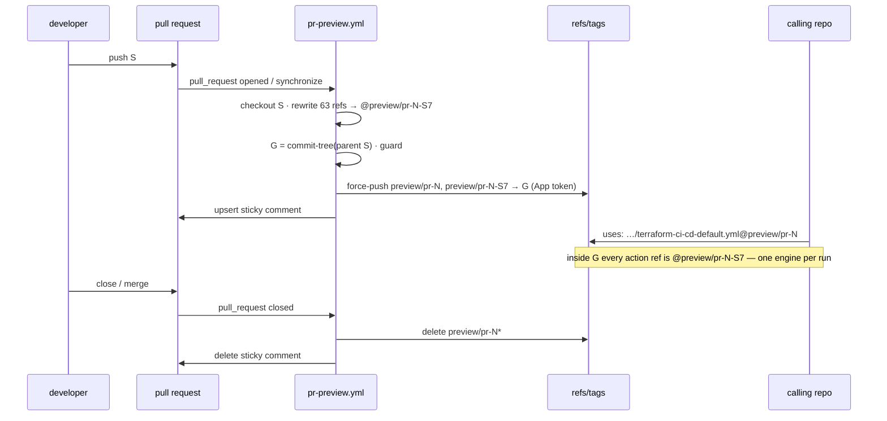

# Preview refs — testing a pull request from a calling repo without the dev-tag swap

Status: **normative** — decisions taken in §12. Keep this file in sync with `.github/workflows/pr-preview.yml`, `.github/scripts/rewrite-internal-refs.sh` and `.github/scripts/test-rewrite-internal-refs.sh`.

Prior art: the same mechanism runs in [dsb-norge/cert-warden](https://github.com/dsb-norge/cert-warden) (`.github/workflows/pr-preview.yml`), whose design spec names *this* repo's dev-tag swap as the friction it set out to remove. This document ports it back, adapted to a repo whose product is the reusable workflow itself.

## 1. Why

Every consumer of this repo pins `dsb-norge/github-actions-terraform/<path>@v0`. The reusable workflows do the same internally: `terraform-ci-cd-default.yml` carries 49 `uses: dsb-norge/github-actions-terraform/<action>@v0` lines and `terraform-module-ci.yaml` another 14. That is what makes "try my branch from a calling repo" a ritual ([Development-and-release.md](Development-and-release.md), "Development and testing"):

1. regex-rewrite all 63 refs to `@my-feature`, inserting a `# TODO revert to @v0` marker above each;
2. commit the swap on the feature branch;
3. `git tag -f -a my-feature && git push -f origin refs/tags/my-feature` — **again after every push**;
4. point the calling repo at the *branch* for the workflow (the branch carries the swapped file) — the *tag* only serves the actions;
5. before merge: delete the tag, regex-revert the 63 refs, commit again.

Costs, all of them paid per PR:

- **A swap commit and a revert commit** that say nothing about the change, and which have to be kept out of `main` by discipline alone. A forgotten revert ships `@my-feature` to every calling repo on the next `v0` move — the tag was deleted in step 5, so every calling run fails at `Set up job`.
- **A forgotten re-tag** after a push tests the previous commit while the branch looks up to date; the symptom is "my fix did not work" and the cause is invisible from the calling repo.
- **Two refs with one name** (branch for the workflow, tag for the actions) — `Development-and-release.md` and `CLAUDE.md` both spend words on `refs/heads/` vs `refs/tags/` disambiguation because of this.
- **Not reviewable**: a PR whose diff is 63 ref rewrites plus the actual change is harder to review than the change alone; reviewers have learnt to skim past the markers, which is exactly how a stray one gets merged.

## 2. Goals, non-goals, invariant

Goals:

- A same-repo PR gets, **automatically and on every push**, a ref a calling repo can consume with a single `uses:` line — for the reusable workflows *and* the composite actions, through one name.
- The PR branch is never modified. Nothing generated is ever merged. `main` never contains a preview ref.
- The consumed tree is **hermetic**: every internal `uses:` in it resolves to the very commit being consumed, so a calling run cannot mix this PR's workflow with `v0`'s actions (or vice versa), and a rebuild landing mid-run cannot swap the engine underneath a running job.
- Cleanup is automatic: closing the PR deletes every ref it created.
- The old manual procedure keeps working, scripted, as the fallback for fork PRs and for a repo where the App (§5) is not yet configured.

Non-goals (§13): an in-repo end-to-end run that *consumes* the preview (this repo has no terraform fixture; a calling repo is still where the workflow is exercised); fork PRs; any change to how releases (`v0.X`, `v0`) are cut.

Invariant, stated as a check the workflow enforces (§3.3): **every `uses: dsb-norge/github-actions-terraform/…@<ref>` in the published tree names the immutable preview tag, and that tag resolves to the published commit.**

## 3. Mechanism

One new workflow, `.github/workflows/pr-preview.yml`, `on: pull_request: types: [opened, synchronize, reopened, closed]`, two jobs.

### 3.1 `publish-preview` (opened / synchronize / reopened, same-repo PRs only)

1. Check out the PR **head** (`github.event.pull_request.head.sha`) — not the merge commit — with `persist-credentials: false`.
2. Run `bash .github/scripts/rewrite-internal-refs.sh preview/pr-<N>-<sha7>` where `<sha7>` is the first seven characters of the head SHA. The script rewrites every `uses: dsb-norge/github-actions-terraform/<path>@<anything>` in the consumable workflow files (§4.1) to the given ref, and nothing else.
3. Build a **detached generated commit**: `git add -A; git write-tree; git commit-tree <tree> -p <head-sha>`. Parent = the PR head (provenance is one `git log` away), tree = the rewritten working tree. No branch points at it.
4. Tag it twice, locally: the **immutable** `preview/pr-<N>-<sha7>` and the **moving** `preview/pr-<N>`.
5. **Guard** (§3.3). Fail the job before pushing anything if the invariant does not hold.
6. Force-push both tags with a GitHub App installation token (§5). `--force` is correct here: the moving tag is *meant* to move, and the immutable one is idempotent for a given head SHA (re-runs on the same head produce the same tree; the commit differs only by timestamp, and the newer one wins).
7. Upsert a sticky PR comment (marker `<!-- gat:preview-ref -->`, via this repo's own `pr-comment` action) carrying the copy-paste `uses:` lines — shape in §7. Write the same to `$GITHUB_STEP_SUMMARY`.

### 3.2 `cleanup-preview` (closed, same-repo PRs only)

1. `GET repos/{repo}/git/matching-refs/tags/preview/pr-<N>` — **prefix** match, so filter with the anchored regex `^refs/tags/preview/pr-<N>(-[0-9a-f]+)?$` before deleting; without it PR 5 would delete PR 53's refs (P9).
2. `DELETE repos/{repo}/git/refs/tags/…` for each. This is `contents: write` on `GITHUB_TOKEN` — allowed, because deleting a ref does not push workflow content.
3. Delete the sticky comment (`pr-comment` `mode: delete`). The merge ref can be gone on `closed`, so this job checks out the **default branch** to get `pr-comment`.

### 3.3 The guard

```bash
bad="$(git grep -hoE 'uses:[[:space:]]+dsb-norge/github-actions-terraform(/[^@[:space:]]*)?@[^[:space:]]+' \
         "${commit}" -- $(bash .github/scripts/rewrite-internal-refs.sh --list-files) \
       | grep -vE "@${pinnedRef}\$" || true)"
[[ -z "${bad}" ]]                                                   # every ref names the pinned tag
[[ "$(git rev-parse "${pinnedRef}^{commit}")" == "${commit}" ]]     # and the pinned tag is this commit
[[ "$(git rev-parse "${commit}^")" == "${HEAD_SHA}" ]]              # and the parent is the PR head
```

The file set comes from the script's `--list-files` mode so the guard and the rewrite can never disagree about scope (P2), and the regex is the script's `REF_PATTERN` byte-for-byte — the F-guard test (§9) holds both in place. It is deliberately stricter than "no mutable ref": a ref pointing at some *other* immutable commit passes the weaker test while serving the wrong code — cert-warden's head-SHA attempt slipped through exactly that way, with a green end-to-end run that was exercising the released engine.

### 3.4 Sequence



## 4. Design choices

### 4.1 What gets rewritten

Every `.github/workflows/*.yml` / `*.yaml` **except** an explicit exclusion list held in the script: `pr-preview.yml` (its own comment template contains `uses: dsb-norge/github-actions-terraform/…@<placeholder>` lines that are templates, not references — rewriting them corrupts the comment and fails the guard) and `action-tests.yml` (not consumable, no refs). A new consumable workflow is covered the day it is added; a new non-consumable one that happens to contain a self-ref shows up as a guard failure, which is the right default.

`README.md`, `docs/**` and `action.yml` files are never touched: the examples there *should* say `@v0`.

The match is `uses:[[:space:]]+dsb-norge/github-actions-terraform(/[^@[:space:]]*)?@[^[:space:]]+` (the optional `/…` group keeps a hypothetical `github-actions-terraform-other` repo out) — any current ref, not just `@v0`. A branch that still carries an old-style manual swap (`@my-feature`, `@apply-destroy-reporting`) therefore still publishes a hermetic preview; the markers above those lines are left alone.

### 4.2 Why a tag, and why two

- **Why not the PR head SHA as the internal ref?** It is immutable and the action directories are identical, so `uses: …/<action>@<head-sha>` *would* resolve correctly. But a calling repo consumes the *workflow file*, and that file must be the **rewritten** one, which exists only in the generated commit. A commit cannot contain its own SHA; a tag on it can be named in advance. (In cert-warden the same argument arrives via workflow-to-workflow `uses:`; here it arrives via the caller.)
- **Why not only the moving `preview/pr-<N>`?** A calling run resolves `uses:` refs at `Set up job` of each job. With internal refs on the moving tag, a rebuild landing between two jobs of one run serves two different engines to that run. Internal refs name the immutable tag; the moving tag exists for the *caller's* convenience (edit the calling workflow once per PR, not once per push).
- **Why not a branch?** The user's question, and the old procedure's habit. A branch would need the same App token (P1 applies to any ref carrying modified workflow files), would appear in branch lists and PR base pickers, and would be the third moving name for one PR. `uses:` resolves tags and branches identically, and this repo's whole consumption story is tags (`@v0`, `@v0.21`). The old procedure only needed a branch because the swap lived *in* the branch; the generated commit removes that reason. Tags only.

### 4.3 Naming

`preview/pr-<N>` and `preview/pr-<N>-<sha7>`. Same namespace as cert-warden, so anyone moving between dsb-norge repos meets one convention. The `preview/` prefix keeps them out of `git tag --list 'v*'` and makes the release-picking snippet in Development-and-release.md unambiguous (P22).

### 4.4 Lightweight tags

`git tag -f <name> <commit>`, not annotated. They are machine-managed and disposable; an annotation would only duplicate the generated commit's message. Release tags stay annotated as today.

## 5. The token — why a GitHub App is required

Pushing **any** ref whose new commits add or modify `.github/workflows/*` requires the `workflows` permission. `GITHUB_TOKEN` cannot be granted it (it is not in the `permissions:` vocabulary), and the check applies to tags exactly as to branches. The push therefore uses an installation token from a GitHub App with **Contents: read & write** and **Workflows: read & write**, minted in-job with `actions/create-github-app-token` and down-scoped at mint time to exactly those two.

Configuration (repo-level, as cert-warden does — org-level variables and secrets are not visible to a public repo by default):

- variable `PREVIEW_APP_ID`
- secret `PREVIEW_APP_PRIVATE_KEY`

Until both exist the `publish-preview` job **skips the mint and the push** and the sticky comment says "preview unavailable (bootstrap)" with the two names — the PR that introduces this workflow shows exactly that on itself, which is the acceptance signal that everything except the credential is wired.

Bootstrap, once, by an org owner:

1. Organisation settings → Developer settings → GitHub Apps → **New GitHub App**. Suggested name `dsb-norge-github-actions-terraform-preview`. Homepage: this repo. **Uncheck** "Active" under Webhook. Repository permissions: **Contents → Read and write**, **Workflows → Read and write**. "Where can this GitHub App be installed?" → **Only on this account**.
2. Generate a private key (`.pem`).
3. Install the App on **this repository only**.
4. From a clone of this repo: `gh variable set PREVIEW_APP_ID --body '<app id>'` and `gh secret set PREVIEW_APP_PRIVATE_KEY < <the .pem>`.
5. Re-run the failed/skipped `PR preview ref` run on any open PR; the sticky comment turns into the refs.

Alternative considered: reusing the org App the module-repo workflows in this repository already reference (`dsb-norge-terraform-cicd-access`). Rejected as the default — it exists for a different job with a broader footprint; adding `workflows: write` to it and installing it on a public repo widens its blast radius for no gain. A dedicated App has one job and one installation. Decision recorded in §12.

Fork PRs are skipped entirely (both jobs gate on `github.event.pull_request.head.repo.full_name == github.repository`): fork-PR runs get no secrets, and a maintainer can publish for a fork manually (§10).

## 6. Components

| File | Role |
|---|---|
| `.github/workflows/pr-preview.yml` | The two jobs of §3. Job names `🏷️ Publish preview ref` and `🧹 Delete preview refs`. `permissions: {}` at top; publish = `contents: read` + `pull-requests: write` (the push uses the App token, not `GITHUB_TOKEN`); cleanup = `contents: write` + `pull-requests: write`. `concurrency: pr-preview-<N>`, `cancel-in-progress: true`. |
| `.github/scripts/rewrite-internal-refs.sh` | `rewrite-internal-refs.sh <ref>` rewrites the file set in the working tree and prints per-file counts; `rewrite-internal-refs.sh --list-files` prints the file set (one per line) and rewrites nothing. Follows the `.github/scripts` conventions in [Testing-in-ci.md](Testing-in-ci.md) (`#!/bin/env bash`, `set -o nounset`, `main`, explicit exit). |
| `.github/scripts/test-rewrite-internal-refs.sh` | Offline test suite for the script (§9); emits the canonical `Tests run/passed/failed` lines. Runs as the first step of `publish-preview` and locally. |
| `pr-comment/` | Unchanged; the sticky comment is `mode: upsert` / `mode: delete` with marker `<!-- gat:preview-ref -->`. Local `uses: ./pr-comment`, so the publish job uses the PR's copy and the cleanup job the default branch's. |
| `docs/Development-and-release.md` | "Development and testing" rewritten around the preview ref; the manual procedure becomes "Fallback: publishing by hand", scripted. |
| `docs/Testing-in-ci.md` | One cross-reference: the rewrite script is tested by `pr-preview.yml`, not `action-tests.yml`. |
| `README.md` | "Development and maintenance" (currently an empty heading) points at both docs. |
| `CLAUDE.md` | "Development workflow" replaced (own commit — AI config). |

## 7. Sticky comment shape — decided: B

Constraints: one comment per PR, edited in place; the copy-paste line must be the reusable-workflow `uses:` a calling repo actually edits; both refs visible; says when it was built from what; says it dies with the PR. Below, `<N>`=53, head `a1b2c3d`, generated `9f8e7d6`.

### Option A — prose, two blocks (cert-warden's shape) — considered

````markdown
### 🧪 Preview ref for this PR: `preview/pr-53`

**Quick try** — moves with every push to this PR:

~~~yaml
jobs:
  ci-cd:
    # TODO revert to '@v0'
    uses: dsb-norge/github-actions-terraform/.github/workflows/terraform-ci-cd-default.yml@preview/pr-53
~~~

**Running it for longer than one job?** Pin the per-push ref. It never moves, and every
internal ref inside it names itself, so a rebuild mid-run cannot swap the engine under you:

~~~yaml
    uses: dsb-norge/github-actions-terraform/.github/workflows/terraform-ci-cd-default.yml@preview/pr-53-a1b2c3d
~~~

The same ref works for `terraform-module-ci.yaml`, `terraform-module-release.yaml` and every composite action.

- Refreshed on every push (currently `a1b2c3d` → generated commit `9f8e7d6`).
- Every push adds a `preview/pr-53-<sha>`; all of them are deleted when this PR closes. Pin one for validation, never for production.
````

### Option B — table first, one snippet — **normative**

````markdown
### 🧪 Preview refs for this PR

| Ref | Moves | Use it for |
|---|:---:|---|
| `preview/pr-53` | on every push | quick try from a calling repo — edit the calling workflow once |
| `preview/pr-53-a1b2c3d` | never | anything longer than one job — a rebuild mid-run cannot change it under you |

~~~yaml
jobs:
  ci-cd:
    # TODO revert to '@v0'
    uses: dsb-norge/github-actions-terraform/.github/workflows/terraform-ci-cd-default.yml@preview/pr-53
~~~

Built from `a1b2c3d` → `9f8e7d6`. The same ref serves `terraform-module-ci.yaml`, `terraform-module-release.yaml` and every composite action. Every push adds a `preview/pr-53-<sha>`; all are deleted when this PR closes — pin for validation, never for production.
````

Decision: **B**. It is scannable at the size this repo's other comments are (tables everywhere), the one snippet is the line 95 % of readers came for, and the pinned ref is a copy from the table for the 5 %.

### Bootstrap comment (single shape, not open)

````markdown
### 🧪 Preview ref: unavailable (bootstrap)

Publishing a preview tag pushes rewritten workflow files, which needs a GitHub App with `workflows: write` — `GITHUB_TOKEN` cannot do it. Configure the repository variable `PREVIEW_APP_ID` and secret `PREVIEW_APP_PRIVATE_KEY` (see `docs/Preview-refs.md` §5) and re-run this workflow; every PR then gets a `preview/pr-<N>` ref here automatically.
````

## 8. Pitfalls and concerns

| # | Pitfall | Handling |
|---|---|---|
| P1 | Pushing a ref with modified workflow files needs `workflows: write`; `GITHUB_TOKEN` cannot have it. | App token (§5). Mint step gated on `vars.PREVIEW_APP_ID != ''`; unset → bootstrap comment, job green; set but mint fails → job red, visibly. |
| P2 | Rewrite scope and guard scope drift apart (a new workflow is rewritten but not checked, or vice versa). | Single source: `--list-files` on the script feeds the guard. Tested (T-M6). |
| P3 | The workflow's own comment template contains `uses: …@<placeholder>` lines; rewriting them corrupts the comment. | `pr-preview.yml` is in the exclusion list; the guard uses the same list. |
| P4 | Moving tag rebuilt mid-run → two engines in one calling run. | Internal refs name the *immutable* tag; the moving tag is caller-side convenience only. Documented in the comment. |
| P5 | `closed` arrives while a publish for a late `synchronize` is running. | Same concurrency group, `cancel-in-progress: true`: the close cancels the publish. A publish that has already pushed before the close is swept by cleanup regardless (cleanup lists live refs, does not trust outputs). |
| P6 | Fork PRs have no secrets; the App token step would fail. | Both jobs gate on same-repo. Fallback for forks in §10. |
| P7 | `actions/checkout` on `pull_request` checks out the **merge** commit by default; the generated commit's parent would then be a synthetic merge that changes on every `main` push. | `ref: ${{ github.event.pull_request.head.sha }}`; guard asserts `parent == head`. |
| P8 | The App token must not leak into the checkout's persisted credentials or a third-party step. | `persist-credentials: false`; the token is passed as a step `env:` to the push step only; the only non-`actions/*` step in that job is this repo's own `pr-comment`, which runs with `GITHUB_TOKEN`. |
| P9 | `git/matching-refs/tags/preview/pr-5` matches `preview/pr-53*` too. | Anchored regex filter before delete (§3.2). Tested by inspection (F-guard, §9). |
| P10 | Immutable tags accumulate until close; if the workflow is disabled or the close event never fires (repo transferred, PR deleted by admin), orphans remain. | Documented one-liner sweep in Development-and-release.md: `gh api repos/<repo>/git/matching-refs/tags/preview/ --jq '.[].ref'` then delete. |
| P11 | `pull_request` runs the **PR's** copy of `pr-preview.yml` with repo secrets available (same-repo PRs). | Same-repo authors already have write access; nothing new is exposed. It is also what lets a PR that changes the workflow test itself. |
| P12 | The generated commit is reachable only via the tags; after cleanup it is unreachable and eventually garbage-collected, so `…/commit/9f8e7d6` links in old comments may 404. | Accepted; the comment is deleted with the tags anyway. |
| P13 | A calling run started before the tags exist fails at `Set up job` with "unable to resolve ref". | The comment appears only after the push succeeds; the doc says "wait for the 🏷️ check". |
| P14 | A preview tag consumed from **production** outlives its PR only as a hard failure at the caller's next run. | Every surface says "never for production"; the `preview/` prefix is unmistakable in a calling workflow's diff. |
| P15 | `git tag --sort=-creatordate \| head -n 5` in the release procedure lists preview tags fetched locally. | Release snippet gets `--list 'v*'`; note on clearing local preview tags. |
| P16 | `git grep` on a commit object prefixes matches with `<commit>:<path>:`. | `-h` suppresses filenames (`-o` prints the match only). |
| P17 | `$(…)` in the build step swallows a non-zero exit under `set -e` only if the substitution is the whole command. | The build step runs under the runner's `bash -eo pipefail`; substitutions are assigned to variables (`x="$(…)"`), which *does* propagate the exit status. Kept minimal deliberately. |
| P18 | Supply chain: the job mints a write-capable token next to third-party actions. | Only `actions/checkout` and `actions/create-github-app-token` run in that job (repo convention pins by major tag; both are GitHub-owned). If this repo ever moves to SHA pinning, this workflow first. |
| P19 | `workflows: write` granted at mint but not at install → mint fails with a 422. | The failure is the job's; §5 step 1 lists both permissions; the bootstrap comment names the doc. |
| P20 | `# TODO revert to @v0` markers on a branch that still uses the old manual swap. | Harmless; the script rewrites any ref. The doc tells authors to drop the swap commit and use the preview ref instead. |
| P21 | Draft PRs. | No draft gate: drafts are precisely when you want to test. |
| P22 | Preview tags are public (public repo). | So is the PR branch; nothing in a generated commit is not already in the PR. |
| P23 | The publish job runs the offline self-test before publishing; a failing self-test blocks *every* preview until fixed. | Intended: a broken rewriter must not publish. The test is offline and sub-second. |

## 9. Tests

Suite: `.github/scripts/test-rewrite-internal-refs.sh`, offline, fixture-based (a temp repo layout with synthetic workflow files). Canonical summary lines; run in `publish-preview` before the rewrite and locally.

### Must

| # | Case |
|---|---|
| T-M1 | Every `uses: dsb-norge/github-actions-terraform/<path>@<ref>` in the file set is rewritten to the given ref — `@v0`, `@v0.21`, `@main`, `@some-feature`, `@<sha>` alike. |
| T-M2 | Both forms survive: `uses:` and list-item `- uses:`; indentation and everything after the ref (trailing comment) preserved byte-for-byte. |
| T-M3 | Lines that are **not** `uses:` are untouched: `# TODO revert to @v0` markers, prose mentioning `github-actions-terraform@v0`, `runs-on:` etc. |
| T-M4 | Files in the exclusion list are untouched even when they contain matching lines. Files outside `.github/workflows/` (`README.md`, `docs/*.md`, `*/action.yml`) are untouched. |
| T-M5 | Idempotent: running twice with the same ref changes nothing the second time; running with `v0` after `preview/pr-1-abc1234` restores the original bytes (manual fallback = revert path). |
| T-M6 | `--list-files` prints exactly the set the rewrite touched, one per line, sorted, and modifies nothing. |
| T-M7 | Missing argument → non-zero exit, usage on stderr, no file modified. |
| T-M8 | Refs to *other* repos (`dsb-norge/github-actions/...@v2`, `actions/checkout@v6`, `hashicorp/setup-terraform@v4`) are untouched. |
| T-M9 | Against the **real** repo tree (not a fixture): after rewriting to `X`, `grep -c '@X$'` over the file set equals the number of self-refs before, and no `@v0` self-ref remains in that set. |

### Should

| # | Case |
|---|---|
| T-S1 | A file in the set with zero refs is reported as `0` and left byte-identical (no trailing-newline or mode change from `sed -i`). |
| T-S2 | Summary line `Rewrote N reference(s) in M file(s)` matches the per-file counts. |
| F-guard | Structural: the guard in `pr-preview.yml` derives its path list from `--list-files` (grep the workflow for the call) and its regex is the one in §3.3 — asserted by a test that greps the YAML, like `evaluate-automerge-eligibility`'s F-series does for the default workflow. |

### Could

| # | Case |
|---|---|
| T-C1 | CRLF-tolerant matching (a workflow file committed with CRLF). |
| T-C2 | A `uses:` value quoted (`uses: "dsb-norge/…@v0"`) — not used in this repo; document as unsupported instead if it complicates the regex. |

### What tests cannot cover

- That the App has `workflows: write` and is installed here — only the live mint shows it (P19).
- GitHub's ref-resolution semantics for `uses:` (tags vs branches, `Set up job` timing) — asserted by the guard's construction, verified once by consuming a preview from a calling repo and reading its `Set up job` log ("Download action repository 'dsb-norge/github-actions-terraform@preview/pr-N-<sha7>'").
- Cleanup on `closed` — verified once by closing the introducing PR and listing `git/matching-refs/tags/preview/`.

## 10. Day-to-day procedure (goes into Development-and-release.md)

1. Open a PR (draft is fine). Wait for the `🏷️ Publish preview ref` check.
2. Copy the `uses:` line from the sticky comment into the calling repo's workflow, above it `# TODO revert to '@v0'`.
3. Push to the PR as often as you like; the moving ref follows. For a long calling run, pin `preview/pr-<N>-<sha7>`.
4. Merge (or close). The refs and the comment disappear. Revert the calling repo's line to `@v0`.

Fallback — fork PRs, or before the App exists — by hand from a clone with `workflow`-scoped credentials (developer tokens normally have it; the restriction of §5 is on installation tokens):

```bash
bash .github/scripts/rewrite-internal-refs.sh my-feature        # rewrite the working tree
git commit -am 'chore: swap internal refs to dev tag my-feature' # on the feature branch
git tag -f my-feature && git push -f origin refs/tags/my-feature # re-run both after every push
# … test from the calling repo with @my-feature (workflow and actions, one ref) …
bash .github/scripts/rewrite-internal-refs.sh v0                 # revert before merge
git commit -am 'chore: revert internal refs to @v0'
git push --delete origin my-feature
```

This is the old procedure minus the regex, the markers and the branch/tag split — the tag now serves the workflow too because the swap is committed on the branch the tag points at.

## 11. Delivery

Lands **inside the apply-and-destroy-reporting PR** (branch `feat/apply-destroy-reporting`, D4) — the PR that most needs it: it currently carries the manual swap. Commits in this order, each self-contained, after the reporting commits:

1. `docs: spec for preview refs` — this file, decisions taken.
2. `feat(ci): publish preview/pr-<N> tags for every same-repo PR` — script, its test suite and the workflow together: the F-guard test needs the workflow, and a rewriter without its publisher is not a state worth reverting to.
3. `docs: replace the dev-tag swap procedure with preview refs` — Development-and-release.md, README.md, Testing-in-ci.md cross-reference, two stale lines in Apply-and-destroy-reporting.md.
4. `chore: update CLAUDE.md development workflow for preview refs` — AI config, own commit.

Acceptance on the introducing PR: the bootstrap comment appears (no App yet) → App configured → re-run → refs appear → a calling repo consumes `preview/pr-<N>` and its `Set up job` log shows the pinned tag for every action → close → refs gone.

Once the refs appear, the reporting PR drops its manual swap commit (`chore: swap @v0 action refs to dev tag …`), deletes the dev tag, and the calling repo used for validation moves from the branch name to `preview/pr-<N>` — with a backup branch before the history rewrite, per the working agreement.

## 12. Decisions — taken

| # | Question | Options | Decision |
|---|---|---|---|
| D1 | Which App pushes the tags? | (a) new dedicated App, repo-level `PREVIEW_APP_ID` / `PREVIEW_APP_PRIVATE_KEY`; (b) reuse `dsb-norge-terraform-cicd-access` with `workflows: write` added and installed here. | **(a)** — §5. |
| D2 | Sticky comment shape | A prose / B table | **B** — §7 (A kept as considered). |
| D3 | Tag namespace | `preview/pr-<N>` / `dev/pr-<N>` / `pr-<N>` | **`preview/`** — §4.3. |
| D4 | Where it lands | own PR / inside the apply-and-destroy-reporting PR | **inside the reporting PR** — it is the PR carrying the manual swap today, so it becomes the first consumer; the recommendation was a separate PR, the user chose to couple them. |

## 13. Out of scope / follow-ups

- **In-repo consume run.** A `workflow_dispatch` workflow in this repo that runs `terraform-ci-cd-default.yml@preview/pr-<N>` against a tiny local-backend `null_resource` environment would make every PR self-verify through GitHub's real remote-fetch path (the way cert-warden's `preview-consume.yml` does). It needs a fixture environment and the right `permissions:`; worth its own spec.
- **Fork PRs.** A maintainer-triggered `workflow_dispatch` variant that publishes a preview for a given fork PR number.
- **Local publish helper.** A `--publish <ref>` mode on the script that builds the detached commit and pushes the tags from a developer clone, making the fallback identical to CI's output.

## 14. What implementation taught the spec

- **Bootstrap path verified on the introducing PR (2026-09-16).** First run of `pr-preview.yml` on the PR that added it: `🧪 Self-test` green (31 cases), `🎫 Mint App token` and `🏗️ Build` skipped, bootstrap comment posted, job green, cleanup job skipped. Exactly the §5 "unavailable" state. The refs themselves, consumption from a calling repo and cleanup on close remain to be observed once the App exists (§9, "what tests cannot cover").
- **Zero-ref files in the T-M9 uniformity check.** Concatenating per-file ref lists with a newline separator makes a file with no refs contribute an empty line, which `sort -u` counts as a second distinct target and which then leaks into the ref argument as a leading newline. Filter empties (`grep .`) before both the count and the pick. Same class of bug as the trailing-newline traps in [Action-implementation-guide.md](Action-implementation-guide.md).
- **`gh run list --workflow <file>` 404s until the workflow exists on the default branch.** The file form resolves through `actions/workflows/<file>`, which knows only the default branch; for a workflow introduced in a PR, filter runs by branch and name (or wait — the lookup succeeds as soon as the first run exists). Cost one confusing line in a monitor, nothing else.
