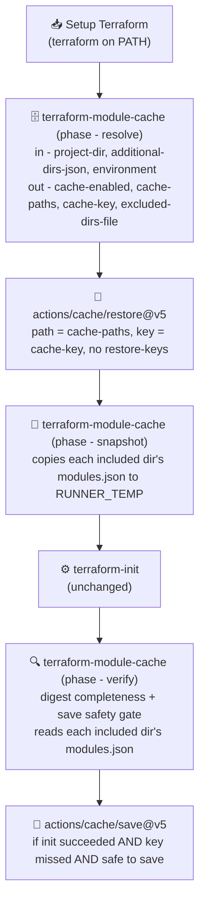

# Terraform module cache

Authoritative spec for caching `terraform` **modules** across runs of
[`terraform-ci-cd-default`](../.github/workflows/terraform-ci-cd-default.yml).

Out of scope: the provider plugin cache (already implemented — see
[`setup-terraform-plugin-cache`](../setup-terraform-plugin-cache/action.yml)),
the `.terraform.lock.hcl` verification, and caching anything else under
`.terraform/`.

## 1. Why

Every job in the default workflow runs `terraform init` in the environment's
`project-dir` plus every directory in `terraform-init-additional-dirs`. Each of
those inits downloads every remote module from scratch, on every run, in every
matrix job. A calling repo with six environments and three additional dirs pays
that download 24 times per workflow run, for module trees that changed in none
of them.

Providers already avoid this. Modules do not, and the reason is structural:

| | Providers | Modules |
|---|---|---|
| Global cache | `TF_PLUGIN_CACHE_DIR` — one directory, consulted by every init | none; there is no `TF_MODULE_CACHE_DIR` |
| Where content lands | the shared cache dir, symlinked/copied into `.terraform/providers` | unpacked into each working directory's own `.terraform/modules/` |
| Integrity record | `.terraform.lock.hcl`, committed, with `h1:` hashes | `.terraform/modules/modules.json`, generated, no hashes |

So a module cache means caching the per-directory `.terraform/modules` trees
themselves — one entry covering N directories — not a single shared path.

## 2. Verified behaviour

Everything in this section was checked against `terraform v1.16.0`, not assumed.
Re-run the checks in §10 if you need to re-establish them on a newer CLI.

### 2.1 `modules.json` is path-portable

A registry module and a local module produce:

```json
{"Modules": [
  {"Key": "",      "Source": "",                                       "Dir": "."},
  {"Key": "local", "Source": "../../shared",                           "Dir": "../../shared"},
  {"Key": "reg",   "Source": "registry.terraform.io/Azure/naming/azurerm",
                   "Version": "0.4.2",                                 "Dir": ".terraform/modules/reg"}
]}
```

Every `Dir` is relative to the working directory. No absolute paths, no runner
identity, no workspace root. A tree restored under a different absolute path on
a different runner is valid as-is.

### 2.2 A warm tree genuinely skips the download

Restoring only `.terraform/modules` (no `.terraform/providers`, no
`.terraform/terraform.tfstate`) into a fresh directory at a *different* absolute
path and running `terraform init`:

```
Initializing modules...            ← no "Downloading …" line

Initializing provider plugins...
```

Init reads the manifest, sees the recorded version satisfies the config, and
installs nothing.

### 2.3 Local modules are not copied — but they are not invisible either

`source = "../../shared"` records `Dir` equal to the source path and unpacks
nothing under `.terraform/modules`. So a local module costs no download and
takes no space in the cache.

It does **not** follow that a local module is irrelevant to the cache. What a
local module declares lands in the *consuming* directory's tree. With
`envs/dev` sourcing `../../main` locally, and `main/` pulling one remote module:

```
envs/dev's own declarations:                ../../main      (local — nothing to download)
what landed in envs/dev/.terraform/modules: shared.net      (remote — the whole tree)
  shared     -> ../../main
  shared.net -> .terraform/modules/shared.net
```

This is the single most consequential fact in this document for a repo whose
environments are thin wrappers over a shared local module tree. An audit that
reads only `envs/dev/*.tf` sees one local source, concludes there is nothing to
cache, and is wrong about both the digest and the safety classification. Hence
the local-source walk in §4.4.1 and §4.5.

### 2.4 A stale tree reconciles safely — **for immutably pinned sources only**

With a cache recorded at `0.4.2` and config bumped to `0.4.1`:

```
Initializing modules...
Downloading registry.terraform.io/Azure/naming/azurerm 0.4.1 for reg...
```

Init compares the manifest against the config and re-downloads only what no
longer matches. This is the property the whole design leans on: an imperfect
cache costs a few clones, not correctness.

**That property does not hold for moving refs.** See §3.

### 2.5 How init reacts to a manifest it does not understand

Three cases, all checked:

| Manifest state | Result |
|---|---|
| Extra/unknown fields added (`SchemaVersion`, unknown per-module keys) | ignored; warm skip still works |
| Valid JSON, wholly different shape — the "terraform changed the schema" case | silently re-downloads every module and rewrites the manifest; self-heals |
| Not parseable as JSON | **hard error**: `failed to read module manifest: error unmarshalling snapshot: …` |

The first two are why the cache key carries no terraform version (§4.4.3). The
third is an operational note: a truncated or corrupt restored archive does not
degrade to a re-download, it fails the init step. The remedy is to bust the key,
not to debug the config.

### 2.6 A module directory is replaced wholesale, but never removed

There is no version in the on-disk layout — a module lands in
`.terraform/modules/<module-label>` whatever version it is — so the obvious
question is what happens to the previous contents on a pin bump.

Verified with a module whose `v1.0.0` has `main.tf` + `extra.tf` and whose
`v2.0.0` deletes `extra.tf`:

| Change | Result |
|---|---|
| `m` bumped `v1.0.0` → `v2.0.0` | `.terraform/modules/m` goes from `{extra.tf, main.tf}` to `{main.tf}` — wiped and re-extracted, **not** merged over |
| `keep` deleted from the config entirely | `.terraform/modules/keep` **stays on disk**, and its `modules.json` entry stays too, still pointing at `v1.0.0` |

The first is the reassuring half: a bumped module cannot leave a deleted `.tf`
file behind to be loaded as part of the new version.

The second would matter a great deal if cache entries were ever built on top of
one another — a removed module's directory would ride along into every future
entry, and `modules.json` is no help in spotting it because the orphan's entry
survives there too. §7.1 explains why this design makes that impossible rather
than managing it.

### 2.7 The manifest records resolved versions, not constraints

A registry module declared with a range and one declared with an exact pin are
byte-identical once init has run:

| config | `modules.json` |
|---|---|
| `version = "~> 0.4"` | `Source: registry.terraform.io/Azure/naming/azurerm`, `Version: 0.4.3` |
| `version = "0.4.3"` | `Source: registry.terraform.io/Azure/naming/azurerm`, `Version: 0.4.3` |

Git sources behave differently: the ref survives verbatim inside `Source`
(`git::…?ref=main`), at every depth — including a module pulled in by another
module.

So the manifest is authoritative about *what was resolved* and silent about
*what was asked for*. That asymmetry is exactly why the post-init save gate
(§4.5.2) closes the git half of the transitive hole and not the registry half.

## 3. The correctness hazard this design exists to contain

A module sourced from a git **branch** is the case where a warm cache is not
merely stale but wrong, silently.

Verified: a module at `git::…//?ref=main`, cached at commit *v1*; the upstream
branch then advances to *v2*; re-init with the warm tree:

```
Initializing modules...            ← no download, no warning
```

and the module content is still *v1*. Today — with no cache — every run fetches
the branch tip, so CI plans against *v2*. With a naive module cache, CI would
plan and apply against *v1* indefinitely, with nothing in the log saying so.

`terraform init -upgrade` re-resolves and fixes it, but `-upgrade` also
re-resolves providers and may rewrite `.terraform.lock.hcl`, so it is not an
option here — and it would defeat the cache entirely.

The same class of problem, in a milder form, applies to any source whose
resolution can move: a registry module with a range constraint (`~> 0.4`) or no
`version` at all. Confirmed: an unpinned registry source resolves to the latest
release. Freezing that is arguably within the config's own contract (the pin
still holds) but it is still a behaviour change from today.

**Consequence for the design:** a directory is cached only when every module
source **reachable from it** — including everything reached through local module
sources (§2.3) — resolves to immutable content. Directories that can reach a
moving ref are excluded from the cache and keep today's behaviour. This is what
makes the feature safe to default to on.

That condition is checked twice, against two different sources of truth: from
the configuration before init (§4.5), and from the resolved module graph before
an entry is written (§4.5.2).

## 4. Design

### 4.1 Shape

One new composite action, `terraform-module-cache`, does the work. Because
that work straddles `terraform init`, the action has three phases selected by a
`phase` input — `resolve` before the restore, `snapshot` after it, `verify`
after init and before the save. They are one action rather than three so the
source classifier is genuinely one function (§4.5.2); a phase is a step guarded
by `if: inputs.phase == '<phase>'`.

The workflow does an explicit **restore → init → save**, with no `restore-keys`
(§7.1), rather than a single `actions/cache` step.



### 4.2 Why restore/save split, and not one `actions/cache` step

Four reasons, all load-bearing:

1. **Gate the save on init succeeding.** Cache entries are immutable — the first
   save under a key wins and every later save under that key is a no-op. A
   half-built tree from a failed init would otherwise occupy the key and block
   the good tree from ever being saved under it.
2. **Avoid the `hashFiles`-after-init trap.** A combined step evaluates its `key`
   expression once, before init, so it is safe today. Any key expression
   evaluated at save time is not: after init, `.terraform/modules/**` is full of
   downloaded `.tf` files, so `hashFiles('**/*.tf')` returns a *different* value
   than it did at restore time — permanent miss, save on every run. Computing the
   key once in a step and passing it to both cache steps as an output removes the
   trap by construction.
3. **Skip the save when the key hit.** This one is not housekeeping — combined
   with the absence of `restore-keys` it is what makes orphan accumulation
   structurally impossible. See §7.1.
4. **Control *when* the save happens.** A combined `actions/cache` step writes
   at post-job — after `plan` and `apply` have run. The split makes the save an
   ordinary step that can be placed immediately after init, which is what keeps
   anything those later stages write inside a module directory out of the
   archive. See invariant 8.4.

### 4.3 Cache paths

Derived, never hardcoded. This workflow is consumed by many repos; the init
directory list lives in `matrix.vars` and is different for each of them.

For each directory in `[project-dir] + terraform-init-additional-dirs` that
passes the §4.5 audit, emit one line:

```
<normalized-dir>/.terraform/modules
```

`normalized-dir` strips a leading `./` and any trailing `/`, so `./main` and
`main` produce one path and one digest entry, not two. The list is a multiline
step output (`set-multiline-output`) consumed as
`path: ${{ steps.module-cache.outputs.cache-paths }}`.

**Never widen this to `<dir>/.terraform`.** That directory also holds
`terraform.tfstate` — the *backend configuration*, which is per-environment.
Caching it and restoring it into another environment's job points that job at
the wrong state.

### 4.4 Cache key

```
tf-modules-<runner.os>-<environment>-<digest>
```

No `restore-keys`. An entry is either hit exactly or not at all — see §7.1 for
why that is the design and not a limitation.

| Component | Source | Why |
|---|---|---|
| `runner.os` | `RUNNER_OS`, lowercased | constant for a given caller, so it never costs a miss; guards the one real cross-OS concern (path handling on a Windows runner). Arch is deliberately **not** in the key — module trees are plain source files |
| `environment` | `matrix.vars.environment`, non-alphanumerics collapsed to `-` | one entry per matrix row, since `project-dir` differs per environment. Sanitised because a cache key has a restricted character set and a comma is meaningful to the cache API |
| `digest` | first 16 hex of a sha256, see §4.4.1 | the whole point |

**A key component that moves must earn its keep; one that is constant for a
given caller is nearly free.** `runner.os` never changes for a caller, so it
costs nothing. The terraform version is the opposite, and is deliberately
**not** in the key — see §4.4.3.

#### 4.4.1 The digest is over reachable module declarations, not over `.tf` files

`hashFiles('**/*.tf')` busts on every terraform edit — that is most PRs. Hash the
thing that actually determines module content instead.

For each included directory, the audit collects the module declarations
**reachable** from it:

1. Parse every `module` block in that directory's `*.tf`.
2. For each declaration whose source is **local** (`./`, `../`), resolve it
   relative to the declaring directory and recurse into it, collecting its
   declarations under the dot-path prefix of the label — matching how terraform
   itself keys them (`shared` → `shared.net`, §2.3).
3. Remote declarations from step 1 and every level of step 2 form the reachable
   set for both the digest and the §4.5 classification.

The walk is confined to `$GITHUB_WORKSPACE` — a local source resolving outside
it is skipped with a notice, since terraform would fail on it anyway — memoised
per resolved directory so a diamond is not re-walked, and cycle-guarded on the
current chain.

Feed the normalised result to `sha256sum`:

```
<normalized-dir>\t<module-dot-path>\t<source>\t<version-constraint-or-empty>
```

one line per reachable remote module, sorted, over the included directories only.
Editing a `resource` block, a variable, or an output does not move the digest.
Bumping a module pin does — including one bumped inside a local module the
directory consumes.

Result: exact hits on the overwhelming majority of runs, and a genuine miss
exactly when the reachable module set changed.

#### 4.4.2 Digest completeness is load-bearing, so verify it at runtime

Because a hit skips the save (§4.2), a digest that misses an input does not
merely produce a suboptimal key — it produces a **permanently stale entry**. The
key keeps hitting, the stale tree keeps being restored, init keeps reconciling it
correctly, and the corrected tree is never written back. The run pays the full
download *plus* a pointless restore, forever, until the digest moves for some
unrelated reason.

This is silent, so make it loud. On an exact hit, each included directory's
`.terraform/modules/modules.json` is copied to `$RUNNER_TEMP` immediately after
restore; after init, the two are compared with the `Modules` array normalised
(sorted by `Key`, limited to `Key`/`Source`/`Version`/`Dir`). Any difference means
the resolved module set changed while the key did not:

```
::warning::module cache digest is incomplete for '<dir>' — the module set
changed on an exact cache hit. The cache is not helping for this directory.
```

The comparison runs only for directories that were included in the cache, so an
excluded directory legitimately downloading on every run does not trip it.

#### 4.4.3 Why the terraform version is *not* in the key

Modules are not published per terraform version — a module at `0.4.2` is the
same bytes whichever CLI downloads it — so the only thing a terraform bump could
invalidate is the `modules.json` manifest format.

It cannot, for two reasons:

1. **Terraform already guarantees this.** People upgrade the CLI in place every
   day without wiping `.terraform/modules`. If a bump broke a pre-existing
   module tree it would be a notorious upgrade hazard. It is not.
2. **The failure mode self-heals anyway.** A manifest terraform does not
   recognise makes it re-download and rewrite (§2.5) — which costs exactly the
   one cold init that putting the version in the key would have cost.

Meanwhile the cost of including it is real and unconditional. The workflow's
`terraform-version` default is `latest`, so the resolved version moves on every
terraform release, cold-starting every environment in the matrix several times a
year to insure against a failure that resolves itself for free.

### 4.5 Source classification

Applied to the `source` (and `version`) of every module in the **reachable set**
defined in §4.4.1 — not merely the blocks written in the init directory itself.

| `source` shape | Class | Rationale |
|---|---|---|
| begins `./` or `../` | **local** | never downloaded (§2.3); not cached and not disqualifying, but **walked into** — what it declares counts |
| registry (`[<host>/]<ns>/<name>/<provider>`) with an exact `version` (`"1.2.3"` or `"= 1.2.3"`) | immutable | resolves to exactly one release |
| registry with a range (`~>`, `>=`, `<`, `,`) or no `version` | **mutable** | an upstream release changes the resolution |
| `?ref=` a 40-character hex sha | immutable | content-addressed |
| `?ref=` matching `^v?[0-9]+(\.[0-9]+){0,2}([-+].+)?$` | immutable *by convention* | version tags are conventionally not moved; the one assumption in the audit a determined force-push can violate |
| `?ref=` anything else, or no `?ref=` at all | **mutable** | branch or default branch — the §3 hazard |
| `s3::`, `gcs::`, `hg::`, bare `http(s)://…` archive | **mutable** | nothing in the URL fixes the content |

Decision, per directory:

- any **mutable** source anywhere in its reachable set → the directory is
  **excluded** from `cache-paths` and from the digest. It inits exactly as it
  does today.
- an empty reachable *remote* set → excluded; there is nothing to cache and an
  empty entry is pure overhead. Note this is now judged after the local walk, so
  a directory that declares only `../../main` is *not* excluded when `main`
  itself pulls remote modules.
- otherwise → included.

`cache-enabled` is `false` only when no directory qualifies; the workflow's `if:`
on the cache steps then skips them entirely.

Excluded directories and the reason for each are written to a file
(`excluded-dirs-file`, a path — **not** an output payload, per the ARG_MAX rule
in `CLAUDE.md`) and surfaced as one `::notice` per directory, so a repo that
silently gets no caching can find out why from the run page.

#### 4.5.1 The parser's errors are not symmetric

The audit reads HCL with pattern matching, not a real parser, and the two
directions of error have very different costs:

| | Effect |
|---|---|
| **Over-reads** — an `_override.tf` variant, a commented-out `source` line inside a live block, a `module "x"` inside a string | Safe. The reachable set becomes a superset, and "any mutable source excludes" is monotone over supersets: more sources can only make the audit *more* conservative. Verified: an `_override.tf` repointing a module from `?ref=v1.0.0` to `?ref=main` is caught, because both files are `*.tf` and both blocks are read |
| **Under-reads** — a `module` block in `.tf.json`, or HCL the patterns miss | **Unsafe.** A mutable source goes unseen, the directory is cached, and the §3 freeze returns silently |

A module block commented out in its entirety is in neither column: the audit
skips it and so does terraform, so the two agree. It is worth knowing that this
is agreement rather than a gap, because the same pattern *would* have been a gap
for any design that pruned directories by declared label.

So the audit must err toward reading too much, never too little, and any future
change to the matching must be evaluated in that direction. An under-read of a
*git* source is backstopped by the post-init save gate (§4.5.2), which sees the
resolved graph rather than the config text. An under-read of a *registry*
constraint is not backstopped by anything — the manifest cannot express it
(§2.7) — so that half rests on the pattern matching alone.

#### 4.5.2 The post-init save gate

Pre-init classification decides what to *attempt*. What actually gets written is
decided again after init, from `modules.json` — the resolved module graph, which
lists every module including those declared inside remote modules.

For every included directory, each recorded `Source` is classified by the table
above. If any is mutable the entry is **not saved**, and a `::warning` names the
directory and the offending source.

This makes the write the safety boundary. Because entries never inherit (§7.1),
a tree is only ever restored under a key matching it exactly, and the only
entries that exist are ones this design wrote — so **a tree that is never
written is never restored**, by any path. Pre-init classification stays as an
optimisation: it avoids a pointless restore and a pointless init-then-discard
for a directory already known to be unsafe.

**All-or-nothing per entry.** One archive covers every included directory under
one key, so a single offending directory suppresses the whole save rather than
being dropped from the archive. A partial archive written under a key whose
digest promises the full set would leave every later run restoring less than the
key implies, with the §4.4.2 completeness check firing forever. The coarseness is
accepted; the per-directory-entry follow-up in §11 would make it per-directory
for free.

**What it catches, precisely.** `Source` preserves a git ref, so a moving `?ref=`
is visible at any depth. It does not preserve registry version constraints
(§2.7), so no registry mutability is visible here at any depth. Top-level
registry ranges are still caught by the pre-init grep; transitive ones are caught
by neither — §4.5.3.

Because one classification table is applied to two different inputs — config
text before init, resolved `Source` strings after — it is a single function
taking an explicit input-kind (`classify-source config|manifest …`), with a
documented contract for what each input can and cannot reveal. Passing the kind
rather than inferring it means the divergence is visible at every call site: the
two do not and cannot produce identical verdicts, and a maintainer who assumes
they do will misread one of them.

**The gate fails closed.** A manifest that is missing, or present but not
parseable — the state §2.5 shows terraform itself rejects — refuses the save
rather than reading as a clean graph. Invariant 8.3 is about never writing an
unsafe tree, and a tree whose contents cannot be established is not established
to be safe.

#### 4.5.3 What stays open: transitive registry ranges

A pinned remote module that internally declares `~> 2.0` for a child is invisible
to both halves: the pre-init walk cannot see inside a remote module, and the
post-init manifest records only the resolved version (§2.7). Caching such a
directory freezes that child at whatever version was current when the entry was
written.

Not closed, deliberately. It is the mildest form of the §3 hazard — the child
still satisfies the constraint the config asked for — and a pinned module whose
contents float is already non-reproducible today, with or without this cache.
§11 records the shape of a fix.

## 5. Workflow wiring

Only the `resolve` step carries the goal gate. Everything downstream keys off
its verdict alone:

```yaml
if: steps.module-cache.outputs.cache-enabled == 'true'
```

That is not shorthand — it is exact. A skipped step's outputs evaluate to the
empty string, so when `resolve` is skipped for want of the `init` goal the
comparison is false and every later cache step skips with it. GitHub also
applies an implicit `success()` to any `if:` containing no status function, so a
`resolve` that *failed* stops the chain too. Repeating the goal gate downstream
would restate a condition already implied, and invite the two copies to drift.

The save step adds the rest of its preconditions:

```yaml
if: >-
  steps.module-cache.outputs.cache-enabled == 'true'
  && steps.init.outcome == 'success'
  && steps.restore-module-cache.outputs.cache-hit != 'true'
  && steps.post-init-check.outputs.safe-to-save == 'true'
```

Both `actions/cache` steps are `continue-on-error: true`. The cache is an
optimisation, so a cache-service failure — or a concurrent run winning the race
to write the same key — must degrade to a cold init, never fail a terraform run.

With no `restore-keys`, `cache-hit` is simply whether the entry existed — so the
save runs when there is something new to write *and* the resolved graph says it
is safe to write it.

Two further invocations of the action support this:

- `phase: snapshot` after the restore — copies each included directory's
  `modules.json` to `$RUNNER_TEMP`, so §4.4.2 has a before-image;
- `phase: verify` after init — walks the same directories once, reading each
  `modules.json` to do both post-init jobs in one pass: compare against the
  before-image (completeness, §4.4.2) and classify every recorded `Source`
  (safety, §4.5.2), emitting `safe-to-save`.

Both belong to the action rather than to inline `run:` blocks in the workflow.
The classifier has to be shared (§4.5.2) and workflow YAML cannot share code
with an action; the before-image filename likewise has to be agreed between the
step that writes it and the step that reads it, and one place should own it.

**Step order is part of the design, not incidental.** The save sits immediately
after init and its check, and before `fmt`, `validate`, `lint`, `plan` and
`apply`. Terraform runs can write inside module directories — a `local_file` or
`archive_file` writing next to the module that declared it, a provider dropping
a scratch file — and none of that belongs in a cache entry that later runs
restore as if init had produced it. Init is the only thing whose output the
archive is meant to contain, so the save happens while that is all there is.
Invariant 8.4.

`terraform-init` itself is **unchanged**. It needs no new input: the tree is on
disk before it runs, and init discovers it.

## 6. New workflow input

`cache-terraform-modules`, `type: boolean`, default `true`, with the usual
per-environment override in `environments-yml`.

Per `CLAUDE.md`, a plain boolean input needs no matrix-builder logic — the
generic input-forwarding loop propagates it. Required changes are only:

- the `inputs:` block in the workflow, plus the per-env bullet in the
  `environments-yml` description;
- `REQ_FIELDS` and `NOT_EMPTY_FIELDS` in
  [create-tf-vars-matrix/action.yml:246-289](../create-tf-vars-matrix/action.yml);
- the JSON test fixtures under `create-tf-vars-matrix/`.

It stays a string in the matrix (`matrix.vars.cache-terraform-modules == 'true'`)
— no `fromJSON()` normalization, since nothing needs it as a JSON boolean.

## 7. Cache scoping — what to actually expect

GitHub scopes cache entries by ref, and this determines the hit pattern more
than the key design does:

- an entry written by a run on `refs/pull/N/merge` is readable only by later
  runs on that same PR;
- a PR run **can** read entries written on the repository's default branch;
- a default-branch run cannot read a PR's entries.

So:

| Scenario | Expected |
|---|---|
| First run of a PR that changes no module pins | exact hit off the default-branch entry — warm |
| Second and later pushes to that PR | exact hit off the entry saved by the PR's own first run, or still the default-branch one — warm |
| PR that changes any reachable module pin | miss; the job cold-inits its directories and saves a fresh entry. Later pushes to that PR hit it |
| Merge to default branch | the default-branch entry for the new digest is written, warming every subsequent PR |
| Brand-new environment added | cold once, then warm |
| Any reachable module resolves through a moving git ref, at any depth | the entry is never written (§4.5.2) — that environment inits cold on every run, with a warning naming the directory and the source |

**A miss costs exactly what today costs on every run.** That is the ceiling on
this design's downside, and it is worth keeping in mind whenever a change is
proposed to make misses rarer: nothing here can be slower than the status quo.

Repository cache quota is 10 GB with LRU eviction, and entries unused for 7 days
are evicted. Budget: one entry per environment per reachable-module generation,
covering `project-dir` plus every included additional dir.

Every environment's entry contains its own copy of the *shared* additional dirs,
so that content is stored once per environment rather than once. Accepted: for a
six-environment caller at the observed ~18 MB per directory this is a few hundred
MB against a 10 GB quota. §11 records the shape that would fix it and the trigger
for wanting to.

### 7.1 Why orphans cannot accumulate

Init never removes a module directory whose module left the config (§2.6), so a
cache that inherits — restore a previous tree, init on top, save the result —
carries every removed or renamed module forward into every future entry. Nothing
collects them: `modules.json` keeps the orphan's entry too, so the manifest is a
superset of the live set rather than a description of it, and distinguishing an
orphan from a live nested module needs the full config module graph, which does
not exist until after init.

**This design does not inherit.** No `restore-keys` means a tree is only ever
restored under a key that matches its reachable module set exactly; a hit skips
the save; therefore every entry that is ever *written* was built by init into an
empty `.terraform/modules` on a fresh runner. Orphans are not detected and
removed — they cannot be created.

The cost is the third row of the table above: when the module set changes, that
job cold-inits instead of downloading only the module that moved. Bounded, as
noted, by what happens today on every single run.

Alternatives considered and rejected — pruning orphans so that `restore-keys`
could be kept, and periodically resetting the key to bound the leak — are
recorded with their reasoning in §11, because "add `restore-keys` back, it will
be warmer" is exactly the change someone will propose.

### 7.2 Trust boundary

A restored module tree is terraform *configuration*, and in this workflow it
flows into `apply`. That makes the cache's trust boundary worth stating
explicitly, so the next reader knows it was considered rather than missed.

**What GitHub enforces.** The ref boundary from §7 is applied server-side: an
entry written on a pull-request ref cannot be read by a run on the default
branch. That blocks the obvious path — a contributor's PR cannot plant a tree
that a later `apply` restores — and it is the control this design leans on.

**What it does not cover.** Cache scope is per repository *per ref*, not per
workflow, so every workflow able to run on the default branch shares one scope.
Key and version are validated client-side only, so an actor holding a
default-branch Actions runtime token can write an entry under any key,
including one whose digest they computed from the repository's own contents.
Obtaining that token needs a separate compromise — a `pull_request_target` or
`workflow_run` job that executes pull-request code with the default branch's
token, or a compromised third-party action.

So this is a lateral-movement technique, not an entry point, and it is only
worth an attacker's effort where the compromised workflow has *fewer* privileges
than the one that restores the cache. An actor who already has default-branch
execution at this workflow's privilege level would edit the terraform directly
and skip the cache entirely.

**Why modules deserve the paragraph and providers do not.** The provider cache
has an integrity record: `.terraform.lock.hcl` carries `h1:` hashes, so a
tampered provider fails verification at init. Modules have no equivalent — as
§1 notes, `modules.json` is generated and hashless. Terraform cannot detect a
tampered module tree, and neither can this design, because there is nothing to
verify against. The exposure is not larger than the provider cache's; the
*detectability* is.

**What the design does about it, deliberately:**

| Decision | Effect here |
|---|---|
| No `restore-keys` (invariant 8.2) | A poisoned entry has to match the exact key. Prefix matching — where any miss under a broad prefix picks up a planted entry — is not available. Adopted for §7.1's reasons; this is a second dividend |
| Save immediately after init (invariant 8.4) | The archive contains init's output and nothing a later stage wrote |
| `cache-terraform-modules` is per-environment (§6) | A caller whose repository runs more than this workflow on its default branch can set it `false` for the environments that apply to production, without giving up caching everywhere |

**What the design deliberately does not do.** Making default-branch runs
restore-free — save-only, so `apply` never consumes a cached tree — was
considered and rejected. It would leave every deployment cold forever, and it
buys protection only against a scenario that already requires a prior
compromise of a *different* workflow in the calling repository. The ref boundary
covers the untrusted-contributor case, and the per-environment input covers the
caller who judges their own surface differently.

## 8. Invariants

Break any of these and the cache becomes unsafe, or silently useless, rather
than merely imperfect:

1. **No `terraform init -upgrade`, ever, anywhere in this repo.** Currently true
   (`terraform-init/step_init.sh` uses `-input=false -reconfigure`; `-reconfigure`
   is backend-only and does not touch modules). If an `-upgrade` path is ever
   added, module caching must be disabled on that path.
2. **No `restore-keys` on the module cache.** Adding one reintroduces
   inheritance, and with it orphan accumulation that nothing in this design
   collects (§7.1). If warmer misses are wanted, take one of the §11 options —
   do not reach for the one-line change.
3. **An unsafe tree must never be written.** The post-init save gate (§4.5.2) —
   not the pre-init classification — is the safety boundary, because writing is
   the only way content enters the cache and nothing inherits. Pre-init
   classification is an optimisation and may be relaxed; the gate may not.
4. **The save runs immediately after init, before any other terraform stage.**
   `actions/cache/save` is an ordinary step, so its position in the list is the
   entire control — there is no post-job hook enforcing this. Terraform runs
   write inside module directories (the blocker on OpenTofu's own shared
   module-cache proposal is precisely that "modules can write on any file"), so
   a save placed after `plan` or `apply`, or a reversion to a combined
   `actions/cache` step whose save fires at post-job, silently starts capturing
   run-time droppings and replaying them into later runs as though init had
   produced them. §5.
5. **Everything in `cache-paths` must be represented in the digest.** A directory
   whose module set can change without moving the key becomes a permanently
   stale entry (§4.4.2). This is why the digest walks local sources, and why the
   completeness check exists.
6. **Cache `<dir>/.terraform/modules`, never `<dir>/.terraform`.** §4.3.
7. **The cache key is computed exactly once**, in the resolve step, and consumed
   by both the restore and the save step. §4.2.
8. **The audit must err toward reading too much HCL, never too little.** §4.5.1.
9. **No large payload through step outputs.** Paths and short strings only; the
   excluded-dirs detail goes through a file. `capture-matrix-job-meta` captures
   every step's outputs via `toJSON(steps)`, and this is the documented ARG_MAX
   trip-wire.

## 9. Test scenarios

`terraform-module-cache/run_all_tests.sh`, picked up automatically by
`.github/workflows/action-tests.yml` (discovery is by presence of the suite —
see [docs/Testing-in-ci.md](Testing-in-ci.md)). Fixtures are directory trees of
`.tf` files; no terraform binary is needed for the audit tests.

Classification and inclusion:

| Fixture | Expectation |
|---|---|
| `t01_registry_pinned` | exact `version = "0.4.2"` → included; digest stable |
| `t02_registry_range` | `version = "~> 0.4"` → excluded, notice emitted |
| `t03_registry_unpinned` | no `version` → excluded |
| `t04_git_sha_ref` | `?ref=<40-hex>` → included |
| `t05_git_tag_ref` | `?ref=v1.2.3` → included |
| `t06_git_branch_ref` | `?ref=main` → excluded — the §3 hazard |
| `t07_git_no_ref` | no `?ref=` → excluded |
| `t08_no_modules` | no `module` blocks → excluded |
| `t09_mixed_dirs` | one cacheable dir + one branch-ref dir → `cache-paths` has one line; digest covers only the included dir |
| `t10_override_file` | `_override.tf` repoints a pinned module at `?ref=main` → excluded (§4.5.1 over-read is safe) |

The local-source walk (§4.4.1) — the part most likely to be got wrong:

| Fixture | Expectation |
|---|---|
| `t11_local_to_remote` | dir declares only `../../main`; `main` pulls a pinned remote module → **included**, digest non-empty, path emitted |
| `t12_local_to_mutable` | as above but `main` pulls `?ref=main` → **excluded**, notice names the transitive source |
| `t13_local_nested_depth` | two levels of local indirection before the remote module → reached, dot-path key `a.b.c` |
| `t14_local_diamond` | two labels reaching the same local dir → memoised, both dot-paths present, no duplicate work |
| `t15_local_cycle` | local modules referencing each other → terminates, no infinite recursion |
| `t16_local_escapes_workspace` | `../../../outside` → skipped with a notice, no crash, no read outside `$GITHUB_WORKSPACE` |
| `t17_digest_follows_local` | bumping a pin **inside** `main` changes the consuming dir's digest |

Key and paths:

| Fixture | Expectation |
|---|---|
| `t18_path_normalization` | `./main` and `main` yield one identical path and digest |
| `t19_digest_stability` | editing a `resource` block leaves the digest unchanged; bumping a module `version` changes it |
| `t20_env_key_sanitization` | environment name with `/`, `.` and `,` produces a key in the permitted character set |
| `t21_no_restore_keys` | the action emits no restore-keys output at all — guards invariant 8.2 against a well-meaning re-addition |
| `t22_empty_additional_dirs` | `[]` and `""` both handled; project-dir alone |
| `t23_missing_dir` | a declared additional dir that does not exist → excluded with a notice, no crash |

Runtime checks:

| Fixture | Expectation |
|---|---|
| `t24_completeness_match` | identical pre/post manifests on an exact hit → no warning |
| `t25_completeness_drift` | post-init manifest gains a module → `::warning` naming the directory (§4.4.2) |
| `t26_completeness_reorder` | same modules, different `Modules` array order → normalised, no warning |
| `t27_completeness_excluded_dir` | an excluded directory downloads on every run → never trips the check |
| `t28_completeness_missing_before` | no before-image (cache missed) → check skipped, no warning |

Post-init save gate (§4.5.2):

| Fixture | Expectation |
|---|---|
| `t29_gate_all_pinned` | every resolved `Source` immutable → `safe-to-save=true` |
| `t30_gate_transitive_branch_ref` | manifest has `git::…?ref=main` at a nested key such as `parent.child` → `safe-to-save=false`, warning names the directory and the source |
| `t31_gate_all_or_nothing` | two included dirs, one offending → the whole save is suppressed; no partial path list is emitted |
| `t32_gate_registry_range_invisible` | manifests produced from `~> 0.4` and from `0.4.3` are identical → both pass the gate. Asserts the documented blindness (§2.7, §4.5.3), so a future reader sees it is intended rather than a bug |
| `t33_gate_classifier_input_kind` | the same source string classified as config text vs as a manifest `Source` → a registry entry from a manifest is never called mutable for lack of a constraint; the divergence is explicit, not accidental |
| `t34_gate_init_failed` | init non-zero → save already gated on outcome; the gate does not crash on a missing or partial manifest |

## 10. Re-verifying the terraform behaviour

The §2 and §3 claims are CLI-version-dependent. To re-establish them:

```bash
# 2.1/2.2 portability + warm skip
mkdir -p /tmp/mc/a && cd /tmp/mc/a
printf 'module "n" {\n  source  = "Azure/naming/azurerm"\n  version = "0.4.2"\n}\n' > main.tf
terraform init -input=false -backend=false          # expect: Downloading …
cat .terraform/modules/modules.json                 # expect: only relative Dir values
mkdir -p /tmp/mc/other/deep/b && cp main.tf /tmp/mc/other/deep/b/
mkdir -p /tmp/mc/other/deep/b/.terraform
cp -r .terraform/modules /tmp/mc/other/deep/b/.terraform/modules
cd /tmp/mc/other/deep/b && terraform init -input=false -backend=false   # expect: NO Downloading line

# 2.3 a remote module reached THROUGH a local module lands in the consumer's tree
mkdir -p /tmp/mc/r/main /tmp/mc/r/envs/dev
printf 'module "net" {\n  source  = "Azure/naming/azurerm"\n  version = "0.4.2"\n}\n' > /tmp/mc/r/main/main.tf
printf 'module "shared" {\n  source = "../../main"\n}\n' > /tmp/mc/r/envs/dev/main.tf
cd /tmp/mc/r/envs/dev && terraform init -input=false -backend=false >/dev/null
ls .terraform/modules/    # expect: shared.net — despite dev declaring only a local source

# 2.7 constraint vs resolved version — the manifest keeps only the latter
mkdir -p /tmp/mc/rng /tmp/mc/exa
printf 'module "r" {\n  source  = "Azure/naming/azurerm"\n  version = "~> 0.4"\n}\n' > /tmp/mc/rng/main.tf
printf 'module "r" {\n  source  = "Azure/naming/azurerm"\n  version = "0.4.3"\n}\n' > /tmp/mc/exa/main.tf
for d in rng exa; do (cd "/tmp/mc/$d" && terraform init -input=false -backend=false >/dev/null &&
  jq -c '.Modules[]|select(.Key!="")|{Source,Version}' .terraform/modules/modules.json); done
# expect: two identical lines — the constraint is gone, only the resolution survives

# 3. the moving-ref hazard, with a local git repo as the module source
mkdir -p /tmp/mc/src && cd /tmp/mc/src && git init -q -b main .
echo 'output "v" { value = "one" }' > main.tf
git add -A && git -c user.email=t@t -c user.name=t commit -qm v1
mkdir -p /tmp/mc/g && cd /tmp/mc/g
printf 'module "m" {\n  source = "git::file:///tmp/mc/src//?ref=main"\n}\n' > main.tf
terraform init -input=false -backend=false && cat .terraform/modules/m/main.tf   # "one"
cd /tmp/mc/src && echo 'output "v" { value = "two" }' > main.tf
git add -A && git -c user.email=t@t -c user.name=t commit -qm v2
cd /tmp/mc/g && terraform init -input=false -backend=false
cat .terraform/modules/m/main.tf     # still "one" — the hazard, reproduced

# 2.5 manifest tolerance, back in the warm dir produced above
cd /tmp/mc/other/deep/b
python3 -c "import json;p='.terraform/modules/modules.json';m=json.load(open(p));m['SchemaVersion']=2;json.dump(m,open(p,'w'))"
terraform init -input=false -backend=false        # expect: no Downloading line

echo '{"modules":[{"key":"n"}],"schema":9}' > .terraform/modules/modules.json
terraform init -input=false -backend=false        # expect: Downloading … (self-heals)

echo 'not json {{{' > .terraform/modules/modules.json
terraform init -input=false -backend=false        # expect: Error: failed to read module manifest

# 2.6 wholesale replace, and orphans
mkdir -p /tmp/mc/p/src && cd /tmp/mc/p/src && git init -q -b main .
echo 'output "a" { value = "v1" }' > main.tf && echo 'output "e" { value = "x" }' > extra.tf
git add -A && git -c user.email=t@t -c user.name=t commit -qm v1 && git tag v1.0.0
git rm -q extra.tf && echo 'output "a" { value = "v2" }' > main.tf
git add -A && git -c user.email=t@t -c user.name=t commit -qm v2 && git tag v2.0.0
mkdir -p /tmp/mc/p/ws && cd /tmp/mc/p/ws
printf 'module "m" {\n  source = "git::file:///tmp/mc/p/src//?ref=v1.0.0"\n}\n\nmodule "keep" {\n  source = "git::file:///tmp/mc/p/src//?ref=v1.0.0"\n}\n' > main.tf
terraform init -input=false -backend=false >/dev/null && ls .terraform/modules/m   # extra.tf main.tf
printf 'module "m" {\n  source = "git::file:///tmp/mc/p/src//?ref=v2.0.0"\n}\n' > main.tf
terraform init -input=false -backend=false >/dev/null
ls .terraform/modules/m        # expect: main.tf only — replaced wholesale
ls .terraform/modules/         # expect: keep/ still there — orphan, never collected
terraform validate             # expect: Success — orphans are inert
```

Write the `.tf` fixtures as well-formed HCL and run `terraform fmt -check` on
them. `terraform init` accepts some malformed single-line block forms that
`fmt` rejects, and silently drops the `version` argument when it does — which
looks exactly like a pinning bug in the audit. (`module "a.b"` is worth knowing
about too: it crashes terraform outright, so dotted labels cannot occur in a
config that works, and the dot-path key namespace is unambiguous.)

## 11. Out of scope / follow-ups

Rejected, with reasons, because each is a plausible-sounding change to propose:

- **`restore-keys` plus orphan pruning.** Keeps misses warm by inheriting the
  previous tree and deleting directories the config no longer references. The
  pruning rule is workable — terraform re-downloads a module whose directory is
  missing even when the manifest still lists it, so a wrong prune costs one
  download and nothing else — but it means `rm -rf` inside a caller's checkout,
  driven by the same pattern-matching parser whose under-reads are unsafe
  (§4.5.1), and it still never collects a module that was commented out rather
  than deleted. Traded away for invariant 8.2.
- **Making default-branch runs restore-free** to keep a poisoned entry out of
  `apply`. Reasoning in §7.2.
- **A rolling month stamp in the key** to bound inheritance. A workaround for a
  problem that A removes outright; costs a guaranteed cold start per environment
  per month.

Genuine follow-ups:

- **One cache entry per init directory**, keyed on the directory path and its own
  digest. A pin bump would then cold-init only the directory that changed, and
  the shared additional dirs would deduplicate to one entry across the whole
  matrix instead of one per environment — retiring the redundancy noted in §7.
  Blocked on ergonomics: Actions cannot iterate `uses:` steps, so it needs either
  a capped set of repeated `if:`-guarded cache steps (with a caller-visible cliff
  when the cap is exceeded) or hand-rolled calls to the undocumented cache API,
  which is not a dependency this shared workflow should take. Revisit with a
  measured rate of module-pin changes in the calling repos.
- **Closing transitive registry ranges (§4.5.3).** After init the parent modules'
  own `.tf` files are on disk, so a recursive grep over `.terraform/modules` would
  recover the constraints the manifest drops (§2.7) and close the half the save
  gate cannot. It means pattern-matching content downloaded from remote sources,
  which is why it is deliberately separate from the gate rather than bundled into
  it.
- **Resolving moving git refs to a sha before init** (`git ls-remote`) and putting
  the sha in the digest. Would make branch-ref modules cacheable *and* correct, at
  the cost of network calls and credential handling in the audit.
- **Per-directory attribution of init output.** `terraform-init` tees every
  invocation into one console file with no dir markers, so nothing downstream can
  say which directory a given `Downloading` line came from. Emitting a marker
  would sharpen §4.4.2 and help `parse-terraform-warnings` too.
- **The provider cache is untouched.** Its combined `actions/cache@v5` step
  evaluates its key before init, so it does not have the §4.2 trap. Migrating it
  to restore/save for save-on-success is a separate, independent change.
