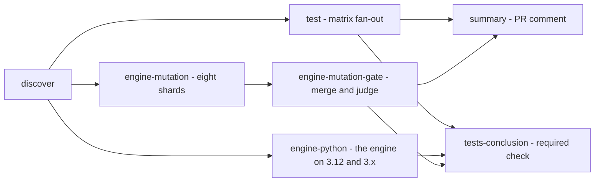

# Testing in CI

Living spec for the workflow that runs this repo's composite-action test suites on every pull request and reports the result as a single aggregated PR comment.

This doc is the source of truth for *what* gets tested, *why*, and *how*. Code in [`.github/workflows/action-tests.yml`](../.github/workflows/action-tests.yml) and [`.github/scripts/`](../.github/scripts/) is expected to conform to this spec. If the design changes, update this file first.

Out of scope: the test suites themselves (their layout is described in [Action-implementation-guide.md](Action-implementation-guide.md)), branch-protection configuration on the GitHub side, and any tests for the reusable workflows under `.github/workflows/terraform-*.yml`.

## 1. Goals and non-goals

### Goals

- Run every modern `run_all_tests.sh` suite automatically on each PR, in parallel.
- Surface the result as a single PR comment so reviewers see at a glance which actions were exercised and which aren't.
- Expose a single, stable status check (`tests-conclusion`) that branch protection requires — independent of how the matrix grows.
- Make the not-tested set visible too, so the comment doubles as a nudge toward modernization.

### Non-goals

- Running tests for actions that don't yet have a `run_all_tests.sh` (those rows just appear under "Not tested yet").
- Per-step granularity in the PR comment (suite-level pass/fail + counts is enough; job logs cover detail).
- Running on PRs from forks — see §7.

## 2. Workflow shape

Seven jobs:



`engine-python` runs the decision engine's suite with its coverage gate on the oldest Python it
supports (3.12, [Decision-engine.md](Decision-engine.md) D1) and on the newest release, installed
by `actions/setup-python` with the suite's pinned `coverage`. The discovered `engine` suite in the
`test` matrix runs on the image's `python3`, which moves with `ubuntu-latest`; this job keeps the
floor tested when it does. It is not part of the PR comment; its result gates `tests-conclusion`.
The engine's mutation gate runs once, in `engine-mutation` and `engine-mutation-gate` (§14),
never in the suite jobs.

### 2.1 `discover`

Scans top-level `*/action.yml` and `*/action.yaml` files in the checkout (both extensions exist in this repo). For each action directory, classifies as:

- **has-tests** if `run_all_tests.sh` exists, *and* the directory is not on the explicit exclusion list (§3).
- **no-tests** otherwise.

Emits two job outputs:

- `tests-matrix` — JSON array of action names with tests, fed straight into the `test` matrix.
- `no-tests-list` — JSON array of action names without tests, consumed by `summary`.

A second pass adds every top-level directory that holds `run_all_tests.sh` but no `action.yml` or `action.yaml`, under the directory's name, by the same exclusion rule. There are two such suites, neither of them an action, and both gate the pull request like every action's: the decision engine in [`engine/`](../engine) ([Decision-engine.md](Decision-engine.md) §8), and the structural tests in [`structural-tests/`](../structural-tests), the invariants that hold across the workflows, the actions and the documentation (F2-F29).

Dynamic discovery means newly-added test suites are picked up automatically; no workflow edit is needed when a legacy action gets modernized.

### 2.2 `test` (matrix)

One job per entry in `tests-matrix`. `fail-fast: false` so all suites run regardless of any single failure. Each job checks out the repository, then runs two steps:

1. **🧪 Run `<action>` tests** — runs `bash <action>/run_all_tests.sh`, tee's stdout to a log file, enforces the canonical summary-line contract (§4), parses counts (§4), resolves the matrix job URL, writes the result JSON (§5), emits any failure/drift annotation (§11), and finally exits with the suite's real exit code.
2. **📤 Upload result artifact** (`if: always()`) — uploads the result JSON as `test-result-<action>` so the summary job can aggregate it.

All the per-action logic lives inside step 1 because GitHub Actions does **not** propagate `steps.<id>.outputs.*` from a step that exits non-zero. If parsing/annotating happened in a follow-up step reading those outputs, the log path would be empty on failure and counts would always render as `?`. Doing everything in one shell means the same process that has the log path also writes the artifact.

When a suite fails (real test failure, format drift, or non-zero exit for any other reason), the run-tests step exits non-zero → the matrix job fails → `tests-conclusion` (§2.4) catches it via `needs.test.result`. The upload step uses `if: always()`, so the result JSON is still produced and uploaded even when the run-tests step failed. The summary job uses `if: !cancelled()`, so it still runs and posts/upserts the comment even when some matrix entries failed.

### 2.3 `summary`

Runs after `discover`, `test` and `engine-mutation-gate`. Conditions:

- `if: !cancelled() && github.event_name == 'pull_request' && github.event.pull_request.head.repo.fork == false`
- `permissions: pull-requests: write, contents: read, actions: read` (the run's start, for the headline's `⏱`)

Steps:

1. Downloads all `test-result-*` artifacts (merge-multiple).
2. Calls [`.github/scripts/aggregate-action-tests.sh`](../.github/scripts/aggregate-action-tests.sh), which builds the markdown (§6) and:
   - upserts the PR comment via `gh api`;
   - appends the same body to `$GITHUB_STEP_SUMMARY` so the run page shows it inline (§11);
   - emits a single headline annotation summarizing the totals (§11).

### 2.4 `tests-conclusion`

Single, no-matrix terminal job. `needs: [discover, test, engine-python, engine-mutation-gate]`, with the same fork guard as §7:

```yaml
if: always() && (github.event_name != 'pull_request' || github.event.pull_request.head.repo.fork == false)
```

Fails if `needs.discover.result != success`, if `needs.engine-python.result != success`, if `needs.engine-mutation-gate.result != success`, or if `needs.test.result` is `failure` or `cancelled`. Treats `success` and `skipped` as passing (`skipped` happens when `tests-matrix` is empty). This is the stable check name that branch protection requires — independent of which suites exist at any given time.

## 3. Discovery rules and exclusions

Discovery globs both `*/action.yml` and `*/action.yaml` from the repo root. Directories can additionally be **excluded by name**, regardless of whether `run_all_tests.sh` is present:

| Excluded | Reason |
|---|---|
| *(none)* | — |

Three suites run a step's `run:` block from `action.yml` itself: `create-tf-vars-matrix` extracts it with `yq` and substitutes its expressions ([Decision-engine.md](Decision-engine.md) §8), and `export-env-vars` and `terraform-apply` each carry an `extract_step_source.py` that extracts the block with its expressions substituted as literal text, as GitHub does, and runs it against fixtures. For `export-env-vars` that tests the shim and, through it, `step_export_envs.sh`; for `terraform-apply`, the prerequisite check that stays inline.

`.github/` is excluded because discovery looks one level deep only (`find -mindepth 2 -maxdepth 2`) and both passes skip `.github/` explicitly; the second pass also skips `.git/`. `contract-tests/` holds no `run_all_tests.sh` and is therefore not discovered; it has its own workflow (§13).

When an excluded directory gets a real `run_all_tests.sh` later, drop it from the exclusion list in the same PR.

## 4. Test-count parsing contract

The per-action test job parses these three lines from the suite's stdout:

```text
Tests run:    <N>
Tests passed: <N>
Tests failed: <N>
```

This format is set by the template in [Action-implementation-guide.md §`run_all_tests.sh`](Action-implementation-guide.md#run_all_testssh--automated-tests) and is emitted by every modern suite.

Multi-step orchestrator scripts (e.g. [`terraform-plan/run_all_tests.sh`](../terraform-plan/run_all_tests.sh)) emit these lines once **per delegated step script**. The parser sums them, so the action's totals are the sum across its sub-suites.

ANSI color codes around the numbers are tolerated — escapes are stripped before matching. Each line is anchored on both ends (`^Tests run:[[:space:]]+[0-9]+[[:space:]]*$`) so a suffix like `Tests run: 7 (extra info)` is rejected as drift; a trailing space or two is fine.

### 4.1 What if a new suite diverges from this format?

Two options, in order of preference:

1. Fix the suite to match the convention (it's three lines of `echo`).
2. Add a fallback parser to the workflow that handles the divergence.

(2) is a last resort. Drift makes the spec less useful.

### 4.2 Drift is enforced by CI

The workflow validates each suite's stdout against this format and **fails the test job** if any of the three lines is missing. The drifted suite shows up in the PR comment as ❌ Fail with `?` for counts, and the run page gets a `::error title=Suite format drift` annotation pointing here.

This means a new (or modified) suite that doesn't emit the canonical lines will block merge through the [`tests-conclusion`](#24-tests-conclusion) check. The check is intentionally strict — quiet drift would erode the comment's usefulness over time.

## 5. Result-JSON artifact shape

Each `test-result-<action>` artifact contains exactly one file `result-<action>.json` with this shape:

```json
{
  "action": "parse-terraform-plan",
  "outcome": "success",
  "tests-run": 20,
  "tests-passed": 20,
  "tests-failed": 0,
  "duration-seconds": 14,
  "job-url": "https://github.com/.../actions/runs/123/job/456"
}
```

- `outcome` is `success` (suite exited 0 and emitted the canonical summary lines) or `failure` (any other case — non-zero exit and/or format drift). Cancelled jobs never reach the artifact-write step, so `cancelled`/`skipped` outcomes never appear on disk.
- `job-url` points to the specific matrix job's page. Resolved at runtime via `gh api /repos/{owner}/{repo}/actions/runs/{run_id}/jobs`, filtering for the job whose name ends with `(<action>)`. Falls back to the run page URL if the lookup fails.
- On format drift (§4.2), `tests-run`/`tests-passed`/`tests-failed` are all `null` and the comment renders them as `?`. On a non-drift failure the counts are always parseable, so they're always integers.

## 6. PR comment shape

Single comment per PR. Identified by an HTML-comment marker on the first line. Upsert semantics: if a comment matching the marker exists, edit in place; otherwise post fresh.

Marker:

```html
<!-- action-tests-summary -->
```

This is *not* a backtick-delimited heading prefix like the `aggregate-validation-summaries` action uses, because we only have one comment per PR — substring collision isn't a concern, and an HTML comment is invisible to readers.

Body layout (red example shown; on a green run the row table is all ✅ and the headline drops the trailing "… suite(s) not passing" clause):

````markdown
<!-- action-tests-summary -->
### 🧪 Action test results

**Total: 212 tests across 8 suites — 210 passed, 2 failed, 1 suite(s) not passing** · ⏱ 4:31 since the run started

**Tested (8)**

| Action | Result | Tests | Time | Details |
|---|:---:|:---:|:---:|---|
| aggregate-validation-summaries | ✅ Pass | 28 / 28 | 0:31 | [job log](…) |
| auto-merge-pr | ✅ Pass | 24 / 24 | 0:02 | [job log](…) |
| parse-terraform-plan | ❌ Fail | 5 / 7 | 0:03 | [job log](…) |
| … | … | … | … | … |

**Not tested yet (0)** — modernization candidates

_Empty — every action has a test suite._

_Run: [workflow run](https://github.com/…/actions/runs/<id>) · Commit: `<sha>`_
````

Conventions:

- Status icons: ✅ success, ❌ failure, ⚠️ cancelled, ⏭️ skipped, ❓ anything else. In practice only ✅ and ❌ show up — see §5 (outcomes that reach the artifact).
- The headline has two variants: `… <passed> passed, <failed> failed` on a fully green run, and `… <passed> passed, <failed> failed, <N> suite(s) not passing` whenever any suite isn't a clean pass. Same logic powers the headline annotation (§11.2).
- The "Tests" column shows `passed / run`. Failed count = `run - passed`; not shown explicitly to keep the table tight. A drifted suite shows as `?` here.
- The "Time" column is each result's `duration-seconds` as `m:ss` (`h:mm:ss` from an hour, `—` when missing): the suite's own run, and for `engine-mutation-gate` the time from its first shard's start to the merge, which is the gate's real cost. The headline's `⏱` is the run's wall-clock from its start (the Actions API's `run_started_at`) to the summary, which waits for the gate, so it is how long the pull request waited for its result. It is left out when the start cannot be read.
- "Not tested yet" is collapsed by default (`<details>`) so it doesn't dominate once it shrinks. It is *always* present, even when empty — an empty list communicates "we test everything", which is a meaningful state.
- Both action lists are alphabetically sorted.
- Tested rows are sorted alphabetically. Failed rows are *not* hoisted to the top — relative ordering stays stable across PRs and the status icon already draws the eye.

### 6.1 Upsert mechanics

[`aggregate-action-tests.sh`](../.github/scripts/aggregate-action-tests.sh):

1. `gh api --paginate /repos/{owner}/{repo}/issues/{pr}/comments` to list comments.
2. Filter to those whose body starts with `<!-- action-tests-summary -->`.
3. If exactly one match: `gh api -X PATCH /repos/{owner}/{repo}/issues/comments/{id} -F body=@<file>` (edit in place).
4. If zero matches: `gh api -X POST /repos/{owner}/{repo}/issues/{pr}/comments -F body=@<file>` (fresh).
5. If two or more matches (shouldn't happen, but guard anyway): delete all but the oldest, then PATCH the oldest.

GitHub API failure during list/post/patch: `errexit` ends the script non-zero with `gh`'s error, failing the `summary` job (a failed delete of a duplicate is ignored). The `tests-conclusion` job does *not* depend on `summary`, so a posting failure doesn't gate the PR — but it does light up the workflow with a clear red signal.

## 7. Triggers and fork handling

```yaml
on:
  pull_request:
  workflow_dispatch:
```

Fork guard:

```yaml
if: github.event_name != 'pull_request' || github.event.pull_request.head.repo.fork == false
```

This guard lives on `discover`, `engine-mutation-gate`, `summary`, and `tests-conclusion`. The `test`, `engine-python` and `engine-mutation` jobs are implicitly gated because they have `needs: discover` — when discover is skipped, they are too. The summary job has the same fork condition AND-ed into its existing `if:`.

The workflow does **not** run on PRs from forks. `GITHUB_TOKEN` is read-only on fork PRs and the summary job couldn't post the comment; running the matrix without a working summary defeats the purpose. DSB's working model is internal contributors, so this is acceptable. If a fork-PR use case appears later, revisit — the safe path would be to skip-only-the-comment, not switch to `pull_request_target`.

`workflow_dispatch` is included for manual triggering during development of the workflow itself.

Path filters: intentionally omitted. "Did this workflow run at all" being load-bearing for branch protection is simpler with no filters.

## 8. Files involved

| Path | Purpose |
|---|---|
| `docs/Testing-in-ci.md` | This doc. |
| `.github/workflows/action-tests.yml` | The PR workflow (§2). |
| `.github/scripts/discover-actions.sh` | Discovery script (§2.1, §3). |
| `.github/scripts/aggregate-action-tests.sh` | Summary builder + PR-comment upsert (§6). |
| `.github/scripts/rewrite-internal-refs.sh` | Not part of this workflow — rewrites internal `uses:` refs for [`pr-preview.yml`](../.github/workflows/pr-preview.yml); spec [Preview-refs.md](Preview-refs.md). |
| `.github/scripts/test-rewrite-internal-refs.sh` | Its offline test suite; runs in `pr-preview.yml`'s `publish-preview` job before anything is built, not here — a broken rewriter must block the preview, not the action tests. Same canonical summary lines (§4). |
| `<action>/run_all_tests.sh` | The actual test suites — owned by each action, not by this workflow. |
| `engine/run_all_tests.sh` | The decision engine's suite, discovered by the second pass (§2.1) and run again on the supported Pythons by `engine-python` (§2); it needs `pipx`, or an importable `coverage`, for its coverage gate ([Decision-engine.md](Decision-engine.md) §8). In CI it runs with `ENGINE_MUTATION=shards`, which leaves its mutation gate to §14; locally it runs both gates. |
| `engine/tests/mutation.py` | The engine's mutation gate: `--shard K/N --out <file>` runs one shard, `--merge <files>` judges them (§14). |
| `structural-tests/run_all_tests.sh` | The structural tests F2-F29: the invariants across the workflows, the actions, the engine and the documentation that no action's suite owns. Discovered by the second pass (§2.1). A new one takes the next number. |

The `.github/scripts/` files follow the script conventions from [Action-implementation-guide.md](Action-implementation-guide.md): `#!/bin/env bash`, `set -o nounset`, a `main` function (the test suite has none), and an explicit `exit ${_main_exit_code}` at the end. They do *not* live inside composite actions — the first two serve this workflow, the rewrite pair `pr-preview.yml`.

`jq`, `yq`, `gh`, `python3`, and standard coreutils are assumed to be present on the `ubuntu-latest` runner. No install logic is bundled.

## 9. Adding a new test suite

When a legacy action gets modernized and gains a `run_all_tests.sh`:

1. Make sure the suite prints the three `Tests run:` / `Tests passed:` / `Tests failed:` lines (§4).
2. Make sure it writes the step's output to a `mktemp` file, never a fixed path under `/tmp`: in CI
   each suite has a job of its own, but locally every suite can run side by side, and two sharing a
   file fail at random. The structural test F18 (`structural-tests/run_all_tests.sh`)
   fails on a redirect into a fixed `/tmp` path.
3. Drop the action name from the §3 exclusion list if it was there.
4. That's it — discovery picks it up automatically on the next PR run.

## 10. Removing a test suite

If a suite needs to be skipped (e.g. genuinely flaky on CI, pending fix):

1. Add the action's directory name to the §3 exclusion table with a short reason and a tracking link.
2. Re-run CI and confirm the action moves from the "Tested" section to "Not tested yet".

Don't disable suites by deleting their `run_all_tests.sh` — the exclusion table is the audit trail.

## 11. Run-page reporting

The PR comment (§6) is the primary view, but it lives on the PR conversation timeline and is hidden on non-PR triggers like `workflow_dispatch`. To make the same information visible directly on the **workflow run page**, the workflow also emits annotations and writes a step summary.

### 11.1 Per-suite annotations

Each `test` matrix job emits at most one annotation via the workflow log commands (`::error`, `::warning`, `::notice`) depending on the suite's outcome:

| Outcome | Annotation level | Title | Message |
|---|---|---|---|
| `success` | _(silent)_ | — | — |
| `failure` (format drift, §4.2) | `::error` | `Suite format drift` | `<action>/run_all_tests.sh did not emit canonical summary lines (missing: …). See docs/Testing-in-ci.md §4 and docs/Action-implementation-guide.md.` |
| `failure` (suite exited non-zero, format OK) | `::error` | `Action tests failed` | `<action>: <passed>/<run> tests passed (<failed> failed)` |
| `cancelled` | _(silent)_ | — | — |

Two emissions never coexist: drift is detected before parsing, and a drifted suite is always classified as `failure` with the drift annotation. A non-drift failure always has parseable counts because the drift check passed first.

Success is deliberately silent — a green run with 8 passing matrix entries shouldn't produce 8 noise annotations. Cancelled jobs are also silent because the merged run-tests step never reaches the annotation code when SIGTERM'd; GitHub's own "Job was cancelled" marker covers the case.

### 11.2 Aggregate headline annotation

The `summary` job emits **one** annotation summarizing the whole run:

| Condition | Level | Title | Message |
|---|---|---|---|
| Any `tests-failed > 0` or any suite `outcome != "success"` | `::error` | `Action tests: failures` | `<run> tests across <suites> suites — <passed> passed, <failed> failed, <N> suite(s) not passing` |
| All suites passed | `::notice` | `Action tests: all green` | `<run> tests across <suites> suites — <passed> passed, 0 failed` |

The `outcome != "success"` condition matters because a suite hit by §4.2 format drift (or any crash before the count lines are emitted) has `tests-failed = null`, which would otherwise count as zero. The suite-level outcome catches it.

This guarantees every PR run has at least one annotation in the Annotations panel — green runs get one notice with the headline numbers; red runs get the headline error plus one per-suite error.

### 11.3 Step summary

The `summary` job also appends the full markdown body (the same one used for the PR comment, §6) to `$GITHUB_STEP_SUMMARY`. This renders on the workflow run page's "Summary" tab. The HTML marker on the first line is invisible there.

Step summaries are scoped to a single run — they don't accumulate or get reconciled across runs, so the upsert mechanics from §6.1 don't apply here.

### Why two mechanisms

The PR comment, annotations, and step summary serve different audiences:

- **PR comment** — for reviewers scanning the PR conversation. Persistent, edits in place across re-runs.
- **Annotations** — for anyone scanning a workflow run for what went wrong. Short, high-signal, surfaced in multiple places in the GitHub UI (the run page, the PR checks pane, status check tooltips).
- **Step summary** — for anyone on the run page who wants the full picture without opening a comment or clicking through to a PR. Also the only run-page view that survives for non-PR triggers.

The same totals appear in all three, so they stay consistent — there's a single source of truth (the result-JSON artifacts) feeding all three.

## 12. Verification

When changing anything in this workflow — the YAML, either of the scripts, or the spec — verify it both locally before pushing and live in CI after pushing. Skip these steps and you risk breaking the only signal that catches regressions across this whole repo.

### 12.1 Local smoke tests (before pushing)

**YAML and bash syntax** — fast sanity check:

```bash
python3 -c "import yaml; yaml.safe_load(open('.github/workflows/action-tests.yml'))"
bash -n .github/scripts/discover-actions.sh
bash -n .github/scripts/aggregate-action-tests.sh
bash -n .github/scripts/rewrite-internal-refs.sh
bash .github/scripts/test-rewrite-internal-refs.sh
```

**Discovery script** — confirm it partitions actions correctly:

```bash
bash .github/scripts/discover-actions.sh
# Expect: tests-matrix=[...] and no-tests-list=[...] on stdout, partitioned on the
# presence of run_all_tests.sh (plus any name on the exclusion list — see §3).
```

**Aggregator script** — exercise it with fixture results in DRY_RUN so it builds the markdown without trying to post:

```bash
results_dir=$(mktemp -d)
cat > "${results_dir}/result-foo.json" <<'JSON'
{"action":"foo","outcome":"success","tests-run":10,"tests-passed":10,"tests-failed":0,"duration-seconds":3,"job-url":"https://example.com/job/1"}
JSON
cat > "${results_dir}/result-bar.json" <<'JSON'
{"action":"bar","outcome":"failure","tests-run":8,"tests-passed":6,"tests-failed":2,"duration-seconds":5,"job-url":"https://example.com/job/2"}
JSON

DRY_RUN=true \
GITHUB_STEP_SUMMARY=/tmp/step-summary.md \
RESULTS_DIR="${results_dir}" \
NO_TESTS_LIST='["create-tf-vars-matrix","terraform-init"]' \
PR_NUMBER=1 \
GITHUB_REPOSITORY=dsb-norge/github-actions-terraform \
GITHUB_SERVER_URL=https://github.com \
GITHUB_RUN_ID=1 \
GITHUB_SHA=0000000 \
bash .github/scripts/aggregate-action-tests.sh
# Expect: markdown body printed on stderr, ::error annotation for 2 failures,
# step summary appended to /tmp/step-summary.md, "DRY_RUN=true — skipping comment upsert."
```

**Suite-format conformance sweep** — every suite must emit the canonical lines (§4). Run them all and grep with the same anchored regex CI uses:

```bash
for d in */run_all_tests.sh; do
  log=$(bash "${d}" 2>&1)
  stripped=$(echo "${log}" | sed -E 's/\x1B\[[0-9;]*[A-Za-z]//g')
  for needle in 'Tests run:' 'Tests passed:' 'Tests failed:'; do
    if ! echo "${stripped}" | grep -qE "^${needle}[[:space:]]+[0-9]+[[:space:]]*$"; then
      echo "DRIFT: ${d} missing or non-canonical '${needle}'"
    fi
  done
done
# Expect: no DRIFT output. CI enforces this too (§4.2), but catching it locally is faster.
```

**End-to-end dry run** — chain discover + every suite + aggregator and inspect the rendered comment body. Useful when changing the markdown layout:

```bash
tmp=$(mktemp); GITHUB_OUTPUT="${tmp}" bash .github/scripts/discover-actions.sh
tests_matrix=$(grep '^tests-matrix='   "${tmp}" | cut -d= -f2-)
no_tests_list=$(grep '^no-tests-list=' "${tmp}" | cut -d= -f2-)
rm -f "${tmp}"

results_dir=$(mktemp -d)
for a in $(echo "${tests_matrix}" | jq -r '.[]'); do
  out=$(bash "${a}/run_all_tests.sh" 2>&1) || true
  stripped=$(echo "${out}" | sed -E 's/\x1B\[[0-9;]*[A-Za-z]//g')
  r=$(awk '/^Tests run:[[:space:]]+[0-9]+/    {s+=$3} END {print s+0}' <<<"${stripped}")
  p=$(awk '/^Tests passed:[[:space:]]+[0-9]+/ {s+=$3} END {print s+0}' <<<"${stripped}")
  f=$(awk '/^Tests failed:[[:space:]]+[0-9]+/ {s+=$3} END {print s+0}' <<<"${stripped}")
  jq -n --arg a "$a" --arg o success --argjson r "$r" --argjson p "$p" --argjson f "$f" --argjson d 0 \
    --arg u "https://github.com/dsb-norge/github-actions-terraform/actions/runs/0" \
    '{action:$a,outcome:$o,"tests-run":$r,"tests-passed":$p,"tests-failed":$f,"duration-seconds":$d,"job-url":$u}' \
    > "${results_dir}/result-${a}.json"
done

DRY_RUN=true RESULTS_DIR="${results_dir}" NO_TESTS_LIST="${no_tests_list}" \
  PR_NUMBER=0 GITHUB_REPOSITORY=dsb-norge/github-actions-terraform \
  GITHUB_SERVER_URL=https://github.com GITHUB_RUN_ID=0 GITHUB_SHA=0000000 \
  bash .github/scripts/aggregate-action-tests.sh 2>&1
rm -rf "${results_dir}"
```

### 12.2 Live CI verification (after pushing)

Push the branch and open a draft PR. Then confirm each surface works.

**Job status** — every job in the workflow should turn green (or `tests-conclusion` should turn red if any suite legitimately failed):

```bash
gh pr checks <pr-number>
```

Expect rows for `🔎 Discover actions`, one `🧪 Test (<action>)` per modern suite, `🐍 Engine on Python 3.12` and `3.x`, `🧬 Engine mutation 1/8` to `8/8`, `🧬 Engine mutation gate`, `📝 Aggregate summary`, and `tests-conclusion` (the gate job is intentionally plain so the required-check label reads cleanly).

**PR comment** — should appear once on the first run, edit in place on subsequent runs (`updated_at` advances; the comment count stays at one):

```bash
gh api repos/<owner>/<repo>/issues/<pr-number>/comments \
  --jq '.[] | select(.body | startswith("<!-- action-tests-summary -->")) | {id, created_at, updated_at}'

# Body footer should reference the latest workflow run id:
gh api repos/<owner>/<repo>/issues/comments/<id> --jq '.body' | grep '_Run:'
```

**Annotations** — both per-suite and headline annotations should appear:

```bash
run_id=<from gh pr checks output>
for job_id in $(gh api "repos/<owner>/<repo>/actions/runs/${run_id}/jobs" --paginate --jq '.jobs[].id'); do
  job_name=$(gh api "repos/<owner>/<repo>/actions/jobs/${job_id}" --jq '.name')
  anns=$(gh api "repos/<owner>/<repo>/check-runs/${job_id}/annotations" \
    --jq '.[] | "[" + .annotation_level + "] " + (.title // "") + ": " + (.message // "")' 2>/dev/null)
  [[ -n "${anns}" ]] && { echo "--- ${job_name} ---"; echo "${anns}"; }
done
```

Expect: at minimum a `[notice]` headline from the `📝 Aggregate summary` job; on a red run, also one `[error]` per failed suite from the corresponding `🧪 Test (<action>)` jobs, and from `🧬 Engine mutation gate` when the gate fails.

**Step summary** — open the workflow run page in the browser; the "Summary" tab should render the same markdown as the PR comment (totals, tested table, not-tested-yet list, footer with run link). This is the only surface that's not API-accessible; visual check only.

**Deprecation warnings** — scan all job logs to ensure no action version is throwing deprecation notices:

```bash
for job_id in $(gh api "repos/<owner>/<repo>/actions/runs/${run_id}/jobs" --paginate --jq '.jobs[].id'); do
  gh api "repos/<owner>/<repo>/actions/jobs/${job_id}/logs" 2>/dev/null \
    | grep -iE 'node\.js [0-9]+ actions are deprecated|deprecation' \
    | head -2
done
```

(Internal Node `Buffer()` warnings from third-party actions can be ignored; they're not actionable from this workflow.)

### 12.3 Suite-conformance sweep on legacy modernization

When converting a legacy action to gain a `run_all_tests.sh`, run the conformance sweep from §12.1 against just the new file before opening the PR. CI will catch drift on push (§4.2), but failing fast locally saves a round-trip.

## 13. Contract tests are a separate workflow

[`.github/workflows/terraform-contract-tests.yml`](../.github/workflows/terraform-contract-tests.yml) is **not** part of this workflow and is not discovered by §2.1: `contract-tests/` has no `action.yml`. It runs real terraform binaries — the newest `newest-minors` minors (six, in `contract-tests/versions.json`), resolved from the HashiCorp releases API at run time — against local-only scenarios, feeds the captured console through `parse-terraform-plan` and `parse-terraform-apply`, and diffs the summary-bearing lines against the fixtures those parsers pin; each plan is counted a second time from its JSON plan (`terraform show -json`) and held to the same expected counts. It needs the network, takes about a minute per version, runs on a path-filtered `pull_request`, on `workflow_dispatch` and **weekly on a schedule**, and is not a required check. Spec: [Apply-and-destroy-reporting.md §16](Apply-and-destroy-reporting.md); runner and version window: [`contract-tests/`](../contract-tests/README.md).

The suites here stay hermetic: every fixture the parsers test against is a file in the repo, and `run_all_tests.sh` never invokes terraform.

## 14. The engine's mutation gate, sharded

The mutation gate ([Decision-engine.md](Decision-engine.md) D12, §8) is nearly all of this workflow's
cost: every mutant runs the engine's suite in its own copy of `engine/`. It runs **once** per run,
split across parallel jobs, instead of inside every job that runs the engine suite.

- **The suite jobs leave it out.** The `test` job's engine suite and both `engine-python` jobs run
  with `ENGINE_MUTATION=shards`. `run_tests.py` then runs the unit tests and the coverage gate,
  prints `Mutation gate not run here (ENGINE_MUTATION=shards) …`, and counts one gate test, not
  two. Nothing else reads the variable, and locally it is unset, so `bash engine/run_all_tests.sh`
  still runs both gates.
- **`engine-mutation`** is a matrix of N shards, twelve, on Python 3.12, the floor. The
  mutants' keys are printed by `ast.unparse`, so every shard runs one Python and the keys match
  `tests/mutation_equivalents.json`. Each runs `mutation.py --shard K/N --out
  mutation-shard-K.json`: the unmutated baseline first, then every N-th mutant from the K-th,
  interleaved so each shard holds a share of every module. A shard judges nothing. It exits non-zero
  only when its baseline fails, and uploads its keys and survivors as `engine-mutation-K`.
- **`engine-mutation-gate`** runs when the shards finish, whatever their result (`!cancelled()`).
  A shard that failed fails it. Otherwise it downloads the shards' results and runs
  `mutation.py --merge`, which applies the gate the unsharded run applies: an unexplained
  survivor, a stale equivalent and a listed equivalent that is killed each fail it. Before it
  judges anything it checks that the shards ran every mutant exactly once. A missing shard would
  otherwise hide its survivors, and it would also make every equivalent in it read as killed.
- **`tests-conclusion`** requires `engine-mutation-gate` to succeed.
- **The PR comment includes the gate.** `engine-mutation-gate` writes `result-engine-mutation-gate.json`
  in the §5 shape, one test as the engine suite counts it locally, and uploads it as
  `test-result-engine-mutation-gate` whatever its result. `summary` needs the gate, so a red gate
  is a red row and the totals cannot read green over it.

The structural test F17 (`structural-tests/run_all_tests.sh`) holds this together:
- every job that runs the engine suite sets `ENGINE_MUTATION=shards`;
- the shards are 1..N, with the same N in the matrix, the command and the job name;
- the merge needs the shards, checks their result and reports a `test-result-*` artifact, which
  `summary` waits for;
- `tests-conclusion` requires the merge.

To change the shard count, change all three places together. F17 fails until they agree.

**Why twelve.** With four shards the run took 6.4 minutes, and the slowest shard, 5.9 of them, was
the critical path; runners were not the limit. With eight it took 4.3 minutes, the shards between
91 and 243 seconds, the spread set by the few mutants that hang until their timeout. The merged
verdict was the local one both times. As the engine grew to about 7,300 mutants, eight shards took
159 to 421 seconds each. The spread followed the runner more than the share: the two shards whose
unmutated baseline took 15 seconds finished in under 200, the six whose baseline took 25 in 340 to
420, and a slow runner's longer baseline also lengthened its timeout for the mutants that hang.
With the auto-merge evaluator the engine has about 8,600 mutants. Twelve shards hold about 715
each, and the timeout came down from six baselines to three. A local sample of every eighth mutant
showed why: two of 1,069 hung, and took 23 percent of the sample's time at the old timeout. On the
full local run (12 workers, 8,547 mutants, 8.5 minutes) 15 hung; the slowest that finished is the
listed equivalent, which runs the whole suite, at 2.1 baselines under that load. Each run's log
names the mutants that hung and the slowest of the rest (`HUNG <key>`), so the next tuning starts
from data. The first run with twelve took 6.9 minutes in all, against 7.5 for eight shards and
fewer mutants the run before: the shards took 147 to 345 seconds (baselines 18 to 29), the 15 hung
mutants fell 0 to 5 to a shard, and the shard holding five was the slowest. The listed equivalent
took 1.6 baselines, under the timeout of three.

**What made it fast**, measured on the full gate (4,038 mutants at the time), before and after, on 12 local
cores: 22 minutes became 3.6, and CI's three full runs of about 66 to 78 minutes each became one
sharded run.
- **Own tests first.** Each mutant runs the test module of the module it mutates first (`test_x`
  for `x.py`, `OWN_TESTS` for the two whose name does not say it). Then come the other modules in
  name order, and last `SLOW_LAST`: `test_generated` and `test_determinism`, which take nearly all
  of the suite's time. The previous fixed order listed fast modules by hand and left new ones
  after the slow two. A mutant that only its own module's tests kill therefore ran about eight
  seconds of unrelated tests first.
- **A timeout from the baseline.** A mutant that hangs counts as killed after three times the
  baseline's duration (six at first), and never before 60 seconds, instead of after a fixed 300
  seconds. A mutant that makes the suite three times slower without failing it counts as killed
  too; that is the bound's meaning. A mutant that survives runs the suite once, which took 2.1
  baselines with every core busy; three leave it room, and the log's slowest finished mutant says
  when they no longer do.
- **Mutants built in the workers.** Listing the mutants re-parsed each module once per mutant, 46
  seconds of serial work before any mutant ran. The listing now walks each module once, and each
  worker builds its own mutant's source from its index. The keys, lines and mutated sources are
  byte-identical to before.

The verdict did not change. The same mutants are killed and the same one is listed as equivalent.
