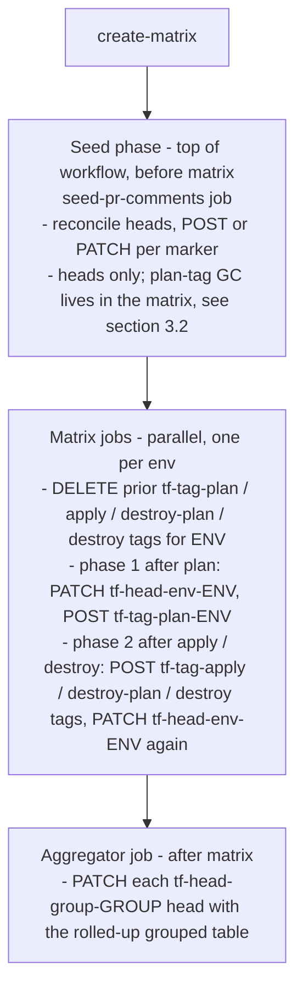
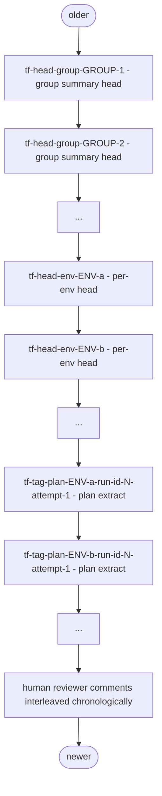

# PR comments

Authoritative spec for all pull-request comments produced by [`terraform-ci-cd-default.yml`](../.github/workflows/terraform-ci-cd-default.yml).

Out of scope: deployment-environment UI, status checks, workflow run summaries — this doc is only about the comments posted on the PR conversation timeline.

## 1. Mental model — heads and tags

Two classes of PR comment, identified by an HTML marker on the body:

- **Heads** — long-lived, mutable. PATCHed in place across runs. Never reordered: their `created_at` is fixed at first-ever post, so once seeded they stay at their position in the PR conversation forever.
- **Tags** — run-scoped, immutable per run. Markers embed the workflow run id. Deleted at the start of the next run, re-POSTed by the matrix job that owns them.

Heads are pre-allocated at the top of every workflow run, in a deterministic order. This is what guarantees the relative order of summary comments never flips between runs — the rendering changes, the positions don't. Tags appear below all heads because they're necessarily POSTed mid-run.

All commenting goes through two generic, terraform-agnostic primitives — [`pr-comment`](../pr-comment/) (single op) and [`pr-comments-reconcile`](../pr-comments-reconcile/) (bulk seed + GC). They take `repo`, `issue-number`, `github-token`, and operate purely on HTML markers; they know nothing about terraform, events, or fork PRs (those concerns live in the workflow's `if:` guards).

## 2. Marker namespace

| Marker | Class | Cardinality | Posted/refreshed by |
|---|---|---|---|
| `<!-- tf:head:group:<group> -->` | Head | One per distinct non-empty `pr-comment-group` | Seed job (initial), [`aggregate-validation-summaries`](../aggregate-validation-summaries/) (final) |
| `<!-- tf:head:env:<env> -->` | Head | One per ungrouped env with `add-pr-comment: true` | Seed job (initial), matrix job for that env (final) |
| `<!-- tf:tag:plan:<env>:run-id-<run-id>:attempt-<run-attempt> -->` | Tag | One per env per run-attempt | Matrix job for that env |
| `<!-- tf:tag:apply:<env>:run-id-<run-id>:attempt-<run-attempt> -->` | Tag | One per env per run-attempt **that ran apply** | Matrix job for that env (phase 2) |
| `<!-- tf:tag:destroy-plan:<env>:run-id-<run-id>:attempt-<run-attempt> -->` | Tag | One per env per run-attempt that ran destroy-plan | Matrix job for that env (phase 2) |
| `<!-- tf:tag:destroy:<env>:run-id-<run-id>:attempt-<run-attempt> -->` | Tag | One per env per run-attempt that ran destroy | Matrix job for that env (phase 2) |
| `<!-- tf:head:module -->` | Head | One | [`terraform-module-ci.yaml`](../.github/workflows/terraform-module-ci.yaml) validation summary |
| `<!-- tf:head:test:<test-file> -->` | Head | One per test file | [`terraform-module-ci.yaml`](../.github/workflows/terraform-module-ci.yaml) test report |

The three operation tags follow the plan tag's lifecycle exactly (purged at the top of the matrix job, POSTed fresh) and are presence-gated on the step having run — an env that only plans keeps exactly the two comments it always had. See [Apply-and-destroy-reporting.md §7.6](Apply-and-destroy-reporting.md).

Marker name conventions:

- Heads: `tf:head:<scope>:<name>` where `<scope>` is one of `group` / `env`.
- Tags: `tf:tag:<kind>:<scope-key>:run-id-<run-id>:attempt-<run-attempt>`. The run-id distinguishes workflow runs; the attempt token distinguishes re-runs of the same run (`run-id` is stable across attempts, only `run-attempt` increments). Both are needed so re-runs — including "Re-run failed jobs" — get fresh tags without colliding with the prior attempt's.

Markers are treated as opaque substrings by the underlying actions: matching is `body.contains(marker)`. The exact format is enforced by convention in this doc, not by the actions themselves — any unique-enough string works.

Because matching is by substring, **every segment is terminated by `:`**. The purge marker `<!-- tf:tag:destroy:<env>:` cannot match a `tf:tag:destroy-plan:` tag, and `<!-- tf:tag:plan:prod:` cannot match `prod-dr`'s tag, only because of those colons. Never introduce a marker whose segment is a prefix of another's without the separator ([Apply-and-destroy-reporting.md P8](Apply-and-destroy-reporting.md)).

## 3. Lifecycle of a single workflow run



### 3.1 Seed phase

The `seed-pr-comments` job in [`terraform-ci-cd-default.yml`](../.github/workflows/terraform-ci-cd-default.yml) composes a `heads-yml` manifest from `create-matrix` outputs:

1. One `tf:head:group:<group>` head per distinct non-empty `pr-comment-group` value.
2. One `tf:head:env:<env>` head per env with `add-pr-comment: true` **and no `pr-comment-group`**. Grouped envs do not get a standalone per-env head — they are represented in their per-group head's table.

Heads are processed in declared order — group heads first, env heads after. On a fresh PR, this means group heads get earlier `created_at` than env heads, so the conversation order is group summaries above per-env. On re-runs the existing heads are PATCHed in place to a `⏳ Awaiting results…` placeholder body.

The seed job does **not** GC plan tags — that work happens per-env in the matrix (§3.2). This is what makes "Re-run failed jobs" behave correctly: when a previous attempt's seed already succeeded, GitHub skips it on the re-run, so any cleanup hooked into the seed phase wouldn't fire. Each matrix job purges its own env's plan tags as its first commenting step, which works whether the seed re-ran or not. The seed is `terraform-ci-cd`'s `needs:` dependency so matrix jobs still can't race ahead of head seeding.

### 3.2 Matrix phase

Each env's matrix job runs the validation pipeline and emits comments in the following order:

1. **Purge prior plan tags** (runs as the **first** post-checkout step, before init/plan/etc.) — `pr-comment` delete with marker `<!-- tf:tag:plan:<env>:`. Substring match wipes every existing plan-tag for this env regardless of run-id or attempt token. Running at the top of the job means prior runs' outdated plan output disappears from the PR conversation within seconds of the new attempt starting — not after init+plan finishes 4-5 minutes in. Idempotent: a fresh first-attempt run finds nothing to delete (records `action=not-found`); a re-run wipes the attempt(s) it's about to supersede. Envs whose matrix job *doesn't* re-run (e.g. on "Re-run failed jobs") are untouched — their plan tags stay, which is correct because their plan output didn't change either.
2. **Plan tag** (after [`create-validation-summary`](../create-validation-summary/) has rendered the bodies) — `pr-comment` upsert with marker `<!-- tf:tag:plan:<env>:run-id-<run-id>:attempt-<run-attempt> -->`. The purge step at the top of the job already wiped everything, so the upsert resolves to a fresh POST.
3. **Head** — `pr-comment` upsert with marker `<!-- tf:head:env:<env> -->` (ungrouped envs only). Since the seed job already POSTed this marker, this resolves to a PATCH that replaces the `⏳ Awaiting results…` placeholder with the validation table + Links row.

Steps 2 and 3 are guarded by `always()` so the head and tag refresh even when an earlier step (init, tflint, etc.) failed. Together they are **phase 1** — the reviewer's first feedback, at plan time.

4. **Phase 2** — after `apply`, `destroy-plan` and `destroy` have run, [`create-validation-summary`](../create-validation-summary/) renders again with the operation outcomes, counts, times and warnings; one tag is POSTed per operation that ran (markers `tf:tag:apply:` / `tf:tag:destroy-plan:` / `tf:tag:destroy:`, purged at the top of the job like the plan tag); and the head is PATCHed a second time. `pr-comment` short-circuits on an unchanged body, so a plan-only env costs one API read and no write. Every phase-2 step carries `always()`, and the three new `🧐 Validation outcome` gates for the mutating steps come **after** it — a gate exits 1 and would otherwise skip the render for exactly the failed apply the phase exists to report. The full rationale, ordering and pitfalls: [Apply-and-destroy-reporting.md §7.5](Apply-and-destroy-reporting.md).

Phase 2's render also runs on non-PR events and for `add-pr-comment: false` envs — not to post anything, but to feed the per-env block that [`annotate-terraform-outcome`](../annotate-terraform-outcome/) writes to the job's `$GITHUB_STEP_SUMMARY`. That block, plus the run-level table the `run-summary` job writes, is the only reporting surface on `push` / `schedule` / `workflow_dispatch` runs and on fork PRs. See [Apply-and-destroy-reporting.md §8.7](Apply-and-destroy-reporting.md).

Trade-off of the early-purge placement: if the matrix job crashes between the purge and step 2, the env has no plan tag for this attempt at all. Acceptable — stale plan output from a prior attempt is a worse signal than no plan output. The per-env head still refreshes (step 3 has `always()`), and the per-group head's Links column drops the `log extract` line for unanchored envs rather than rendering a wrong link.

### 3.3 Aggregator phase

[`aggregate-validation-summaries`](../aggregate-validation-summaries/) downloads all `matrix-job-meta-*.json` artifacts, builds the per-group rolled-up table, and upserts each `tf:head:group:<group>` head with the final rendered body. Seed job has already pre-allocated these heads, so the upsert resolves to a PATCH (preserving `created_at`).

## 4. Re-run behavior

### Heads

1. Seed phase PATCHes each head body to `⏳ Awaiting results (run #N)…`.
2. Matrix / aggregator phase PATCHes each head body to its final state.

Heads keep their original `created_at` across runs (PATCH preserves it). Their position at the top of the conversation is fixed from the first POST onwards.

### Tags

1. Each matrix job's **first** post-checkout steps delete any existing tag for its own env — one purge per tag kind (`<!-- tf:tag:plan:<env>:`, `…apply…`, `…destroy-plan…`, `…destroy…`), substring match regardless of run-id or attempt. This handles cross-run AND cross-attempt cleanup uniformly: prior runs' tags, prior attempts of the current run's tags, all go.
2. The matrix job then runs the validation pipeline (init → fmt → validate → lint → plan), and after that POSTs a fresh plan tag carrying the current `run-id` + `attempt` tokens.
3. Envs whose matrix job *doesn't* re-run (e.g. "Re-run failed jobs" with that env having succeeded in the prior attempt) keep their existing plan tag untouched — their plan output didn't change.

The net visual effect on a re-run: heads briefly show "Awaiting results" while matrix is executing, and the prior attempt's plan tags disappear from the conversation within seconds of each matrix job starting. Envs that aren't being re-run keep their existing tags showing the right state.

This works because the purge happens before init — not after `create-validation-summary` — so stale plan output isn't visible for the ~4 minutes that init + plan take to run. The cost: if the matrix job crashes between purge and post, the env has no plan tag for this attempt. We accept that trade-off (stale > none).

## 5. Comment body shapes

### 5.1 Per-env head

```markdown
### Terraform validation summary for environment: `<env>`   ← plan-only
### Terraform summary for environment: `<env>`              ← applies and/or destroys on PR
|  | Step | Result |
|:---:|---|---|
| <span title="Initialization">⚙️</span> | Initialization | `success` |
| <span title="Lock file">🔒</span> | Lock file | `success` |
| <span title="Format and Style">🖌</span> | Format and Style | `success` |
| <span title="Validate">✔</span> | Validate | `success` |
| <span title="TFLint">🧹</span> | TFLint | `success` |
| <span title="Plan">📖</span> | Plan | `success` |
| <span title="Plan time">⏱</span> | Plan time | <span title="mm:ss (minutes:seconds)">`1:23`</span> |
| <span title="Links">🔗</span> | Links | [log extract](#issuecomment-<plan-tag-id>)<br>[job log](<job-url>) |
```

The rows above are the plan-only shape — what an environment that runs no mutating stage renders, byte for byte. An environment that applies or destroys gains a `🐙 / ☠ Mode` row first and one four-row block per operation (status · warnings · details · time) after `Plan time`; the full 23-row set, its order and its presence rules are normative in [Apply-and-destroy-reporting.md §8.1](Apply-and-destroy-reporting.md), and the two heads' row sets are asserted equal by a test in [`aggregate-validation-summaries`](../aggregate-validation-summaries/).

This table is kept structurally in sync with the per-group head (§5.3) — same row set, labels, col-1 icon tooltips (`<span title="…">`), and Plan-details / Plan-time / Warnings cell conventions and row-presence rules. Two differences are **intentional**, not drift: (1) step-status cells here use text (`` `success` `` / `<kbd>failure</kbd>`) vs emoji in the grouped head — a column-width adaptation (one wide Result column vs many narrow per-env columns); (2) the header shape and footer scope (`[Job log]` job-scoped here vs `[Workflow log]` run-scoped in §5.3). When changing one head's row set or cell shape, change the other to match unless it's one of these two.

The Links row sits at the bottom of the table — same shape as the per-group head's Links column (§5.3) so reviewers learn one navigation pattern. `[log extract]` anchors at this env's plan tag (§5.2) for the current run; `[job log]` anchors at this matrix job's `#logs`. The Links row replaces the standalone `[Job log]` footer that older versions emitted below the table.

The Links row is rendered by `create-validation-summary` when any `*-tag-comment-id` input is supplied, one line per tag in operation order — `[log extract]`, `[apply log]`, `[destroy plan log]`, `[destroy log]` — then `[job log]`. The matrix calls `create-validation-summary` twice per phase for ungrouped envs: once to get the tag body files (used to POST the tags), then again with the resulting comment ids supplied to re-render the head with the Links row. Grouped envs skip the second call (their head body is unused — see grouped mode below).

Bodies leave the action as **file paths** (`head-summary-file`, `plan-extract-file`, `apply-extract-file`, …), never as string outputs, and reach `pr-comment` through its `body-file` input. A string output would enter the steps context and from there the metadata artifact and envp — see [Apply-and-destroy-reporting.md §7.10](Apply-and-destroy-reporting.md). Each invocation in a job passes a distinct `output-file-suffix` so the head-upsert fallback never resolves to a file a later invocation overwrote.

Status cells: `` `success` `` for successful steps, `<kbd>failure</kbd>` / `<kbd>cancelled</kbd>` / `<kbd>skipped</kbd>` / `<kbd></kbd>` (empty outcome) for everything else.

Plan time row is always emitted in ungrouped mode. Renders the upstream `terraform-plan@v0` `plan-time` output as `` `mm:ss` `` inside `<span title="mm:ss (minutes:seconds)">`; the tooltip surfaces the unit on desktop hover. Defaults to the em-dash `—` (not backtick-wrapped) when the upstream action didn't supply a value — same empty-state convention as the per-group head (§5.3).

Warnings row is rendered between `📖 Plan` and `📊 Plan details` when `warning-count > 0`. Shape: `| <span title="Warnings">⚠️</span> | Warnings | <span title="Warnings from init+validate+plan">⚠️ N</span> |`. Absent when count is 0, missing, or `?`. The warning bodies live in the plan-tag comment (§5.2), not the head. See [Plan-warnings.md](Plan-warnings.md).

Plan details row is rendered only when `include-plan-details=true`. Shape (badge stack wrapped in `<div align="left">` to match the per-group head's cell):

```markdown
| <span title="Plan details">📊</span> | Plan details | <div align="left"><span title="Resources to be added">`💫 1` add</span><br><span title="Resources to be changed">`🛠️ 0` change</span><br><span title="Resources to be destroyed">`💥 0` destroy</span></div> |
```

Optional badges (move / import / remove) are appended `<br>`-separated when the count is non-zero.

#### Grouped mode

When `pr-comment-group` is non-empty, the env has **no per-env head at all** — its row in the per-group head's table is the env's summary surface, and its plan output still gets its own per-env plan tag (§5.2). The seed manifest excludes grouped envs from per-env head seeding, and the matrix-job step that PATCHes the per-env head is skipped via an `if:` guard on `matrix.vars.pr-comment-group`. Reviewers reach the grouped env's plan output via the per-group head's Links column.

### 5.2 Per-env plan tag

```markdown
### Terraform plan for environment: `<env>`

<plan-block>
```

When the env's goals contain `apply-on-pr` and/or `destroy-on-pr`, a blockquote banner sits between the heading and the block — `> 🐙 This environment applies on pull request — the plan below was applied to real infrastructure. …` — so a reviewer cannot mistake "planned" for "applied". It carries no anchor to the apply tag (that tag does not exist yet when the plan tag is POSTed); the head's Links row does. See [Apply-and-destroy-reporting.md §8.5](Apply-and-destroy-reporting.md).

`<plan-block>` is one of five shapes:

1. `Plan: no changes ✅` — when `count-total` is numeric 0 and `has-output-only-changes` is not true.
2. `<details><summary>Plan: output-only changes ℹ️</summary>…</details>` — when `count-total` is 0 but `has-output-only-changes=true` (the plan changes outputs but no resources).
3. `<details><summary>Plan: A to add, C to change, D to destroy ℹ️</summary>…</details>` — when `count-total` is numeric > 0. `, I to import` / `, M to move` / `, R to remove` are appended when those counts are non-zero, matching the head's Plan details row: the same badge vocabulary, the same order, the same only-when-non-zero rule. If any of the three core counts is not numeric the line falls back to `Plan: N changes ℹ️`.
4. `<details><summary>Show Plan (last 65k characters)</summary>…</details>` — fallback when `count-total` is missing or `?` (parse failed).
5. `Plan not available 🤷‍♀️` — when no plan output is available at all.

All `<details>` shapes wrap the plan text in a `` ```terraform `` code fence. The plan text is capped at 65000 characters (tail-trimmed) to stay under GitHub's 65536-char comment limit.

When `warning-count > 0`, a sibling `<details><summary>⚠️ N warnings</summary>…</details>` collapser is appended after the `<plan-block>` inside the same plan-tag comment. The two collapsers are siblings, not nested; the warnings collapser is **not** a sixth `<plan-block>` shape. See [Plan-warnings.md §5–§6](Plan-warnings.md) for the budgeting algorithm (warnings have priority over plan output when the combined body would exceed 65000 chars) and the rendered shape.

### 5.3 Per-group head

The rolled-up grouped table aggregates every env in the group (alphabetical column order):

```markdown
### Terraform validation summary for group: `<group>`   ← every env in the group only plans
### Terraform summary for group: `<group>`              ← any env in the group mutates on PR
|  | Step | <env-a> | <env-b> | <env-c> |
|:---:|---|:---:|:---:|:---:|
| <span title="Initialization">⚙️</span> | Initialization | <span title="success">✅</span> | <span title="failure">❌</span> | <span title="skipped">⏭️</span> |
| <span title="Lock file">🔒</span> | Lock file | … | … | … |
| <span title="Format and Style">🖌</span> | Format and Style | … | … | … |
| <span title="Validate">✔</span> | Validate | … | … | … |
| <span title="TFLint">🧹</span> | TFLint | … | … | … |
| <span title="Plan">📖</span> | Plan | … | … | … |
| <span title="Plan details">📊</span> | Plan details | <div align="left">…</div> | … | … |
| <span title="Plan time">⏱</span> | Plan time | <span title="mm:ss (minutes:seconds)">`1:23`</span> | <span title="mm:ss (minutes:seconds)">—</span> | … |
| <span title="Links">🔗</span> | Links | [log extract](#issuecomment-…)<br>[job log](…) | … | … |

[Workflow log](<run-url>)
```

This table is kept structurally in sync with the per-env head (§5.1) — same row set, labels, col-1 icon tooltips, and cell conventions / row-presence rules. The two intentional differences are noted in §5.1: status cells use emoji here (vs text) and the footer is run-scoped `[Workflow log]` (vs job-scoped `[Job log]`).

As in §5.1, the rows shown are the plan-only shape. A group in which any env mutates on PR gains a `Mode` row first (`🐙` / `☠` / `🐙☠` per env, `—` for plan-only columns), and any env having run apply / destroy-plan / destroy adds that operation's four-row block after `Plan time`, group-wide gated. The Links cell gains `[apply log]`, `[destroy plan log]` and `[destroy log]` lines resolved by the same run-id-scoped marker lookup. [Apply-and-destroy-reporting.md §8.8](Apply-and-destroy-reporting.md).

Status cells map outcomes to emoji + tooltip: ✅ / ❌ / 🚫 / ⏭️ / — (empty outcome).

Plan details cells stack the count badges in a `<div align="left">` so they anchor left in the otherwise center-aligned column. The badges (`💫 N add`, `🛠️ N change`, `💥 N destroy`) always render; `🔀 move`, `📥 import`, `⛓️‍💥 remove` are appended only when non-zero. The whole Plan details **row** is omitted when no env in the group has plan data (parse-plan didn't run anywhere) — matching the per-env head's `include-plan-details` gate. When shown, data-less envs render `N/A`.

Warnings row is rendered between the step rows and `📊 Plan details`, and only when at least one env in the group has warnings — the whole row is omitted otherwise, matching the per-env head (which suppresses at `warning-count == 0`). When shown, each cell is `⚠️ N` for envs with warnings and em-dash `—` for clean envs. Keeps ⚠️ a signal rather than a permanent fixture. See [Plan-warnings.md](Plan-warnings.md).

Plan time cells: backtick-wrapped `mm:ss` when present, em-dash `—` when missing. Both wrapped in `<span title="mm:ss (minutes:seconds)">` so desktop hover surfaces the unit.

Links cells contain up to two `<br>`-separated lines: `[log extract](#issuecomment-<id>)` (anchors to the env's plan tag, located by the `<!-- tf:tag:plan:<env>:run-id-<run-id>:` marker-prefix substring — matches any attempt of the current run; stale tags from prior runs are ignored) and `[job log](<url>#logs)` (resolved via the Jobs API). When neither resolves, the cell is empty rather than emitting stray pipes.

The footer of the per-group head is a single `[Workflow log](<run-url>)` line pointing at the workflow run page. Per-env heads (§5.1) instead use `[Job log]` because their URL targets the specific job's `#logs` anchor — different scope, different label.

### 5.4 Per-env operation tags

One tag per mutating invocation that ran, same lifecycle as the plan tag:

```markdown
### Terraform apply for environment: `<env>`
### Terraform destroy plan for environment: `<env>`
### Terraform destroy for environment: `<env>`
```

The destroy plan is a plan and reuses the five plan-block shapes, labelled `Destroy plan` rather than `Plan` in every one of them (it previously said `Plan:` under a `destroy plan` heading). Apply and destroy have their own: `Apply: no changes ✅` · `<details><summary>Apply: A/P added, C/P changed, D/P destroyed ✅</summary>…` (applied/planned per kind, `?` for an unknown side, `, I/P imported` appended when the apply imported anything) · `<details open><summary>❌ Apply failed — infrastructure may be partially applied</summary>…` · `Apply not available 🤷‍♀️`, with destroy wording for the destroy tag. The failure shape is the **only** `<details open>` in the system. Each body has its own 65k budget with the same warnings-over-console priority as the plan tag, and carries its own warnings collapser (apply warnings live in the apply tag, never the plan tag).

By default the apply and destroy bodies strip everything from terraform's `Outputs:` line onward and append `_(outputs section omitted)_`: `terraform apply` prints every non-sensitive output's actual value there, which `terraform plan` never does. The workflow input `apply-extract-include-outputs` (per-env overridable) opts back in. Normative shapes and rationale: [Apply-and-destroy-reporting.md §8.6 and P3](Apply-and-destroy-reporting.md).

## 6. Configuration

Workflow inputs:

| Input | Effect |
|---|---|
| `add-pr-comment` (global default `true`) | When `false`, suppresses both the env's head + plan tag for that environment. The env does not appear in the seed manifest either. |
| `apply-extract-include-outputs` (global default `false`, per env) | When `true`, the apply and destroy tags keep terraform's `Outputs:` section — the actual output values. See §5.4. |
| `pr-comment-group` (per env, optional) | When non-empty, the env is represented in that group's per-group head only — no standalone per-env head is created (the env's row in the per-group head's table is its summary surface). The env's own plan tag is still POSTed and is reachable from the per-group head's Links column. When empty (default), the env is "ungrouped" and gets its own per-env head with the full validation table. |

Triggering rules: comments are only posted when the workflow runs against a `pull_request` event whose action is not `closed` or `converted_to_draft`. Forks cannot post (the workflow guards against `github.event.pull_request.head.repo.fork == true` at the seed-job level).

Required token permission: `pull-requests: write` (and `issues: write` if the comment thread is a plain issue). Declared at the top of `terraform-ci-cd-default.yml`.

## 7. Ordering guarantees

On a fresh PR (run #1), the seed job POSTs in declared order, so the conversation timeline becomes:



On subsequent runs, heads stay at their original `created_at` positions (PATCH preserves it). Tags — plan and, for envs that ran them, apply / destroy-plan / destroy — are wiped per-env by the matrix delete-first steps and re-POSTed at the bottom of the conversation, the operation tags after the plan tag because they are POSTed in phase 2. Order between heads never changes.

## 8. Concurrency caveat

When two workflow runs against the same PR overlap (e.g. retrigger before the first finishes), each run's matrix delete-first step will wipe plan tags from the env it's about to post for — including any in-flight tag the other run just POSTed. The result is some plan tags briefly disappearing and reappearing while both runs are in flight. Each run's aggregator scopes its anchor lookup to its own `run-id`, so the per-group head's Links column resolves to that run's tags rather than the competing run's.

Mitigation: set `concurrency: { group: pr-${{ github.event.pull_request.number }}-tf, cancel-in-progress: true }` on the caller workflow so a new run cancels any in-flight previous run. Without this, the noise is tolerable but not zero.

## 9. Degraded mode

If listing PR comments fails (network blip, rate limit, etc.), both [`pr-comment`](../pr-comment/) and [`pr-comments-reconcile`](../pr-comments-reconcile/) enter degraded mode:

- `upsert` → POST a fresh comment best-effort, even though it may duplicate an existing one.
- `delete` → no-op (we can't safely identify victims).
- Reconcile's GC pass → skipped entirely.

Duplicates from degraded runs self-heal on the next clean run: the matrix's per-env delete-first step wipes all plan tags for that env (any leftover duplicates included) before posting the new one. For heads, the upsert path sorts marker matches by `created_at` ASC, keeps the oldest, and deletes the rest in the same call.

## 10. Action references

| Spec section | Implementing action / step |
|---|---|
| §3.1 Seed phase | `seed-pr-comments` job in [`terraform-ci-cd-default.yml`](../.github/workflows/terraform-ci-cd-default.yml) calling [`pr-comments-reconcile`](../pr-comments-reconcile/) |
| §3.2 Matrix phase per-env head | matrix step "Upsert per-env head comment" calling [`pr-comment`](../pr-comment/) (mode `upsert`) |
| §3.2 Matrix phase plan tag | matrix step "Post per-env plan-extract tag" calling [`pr-comment`](../pr-comment/) (mode `upsert`, run-id-scoped marker) |
| §3.3 Aggregator phase | `pr-comment-aggregator` job in the workflow, calling [`aggregate-validation-summaries`](../aggregate-validation-summaries/) |
| §3.2 phase 2 | matrix steps `cvs-apply`, `post-apply-tag` / `post-destroy-plan-tag` / `post-destroy-tag`, `cvs-apply-final`, `upsert-head-apply` |
| §5.1, §5.2, §5.4 body rendering | [`create-validation-summary`](../create-validation-summary/) outputs `head-summary-file`, `plan-extract-file`, `apply-extract-file`, `destroy-plan-extract-file`, `destroy-extract-file` (paths; posted via `pr-comment`'s `body-file`) |
| §5.3 grouped body rendering | [`aggregate-validation-summaries`](../aggregate-validation-summaries/) `render_group_body` |
| Run-page surfaces (not PR comments) | [`annotate-terraform-outcome`](../annotate-terraform-outcome/) per env, [`create-run-summary`](../create-run-summary/) per run — [Apply-and-destroy-reporting.md §8.7](Apply-and-destroy-reporting.md) |
