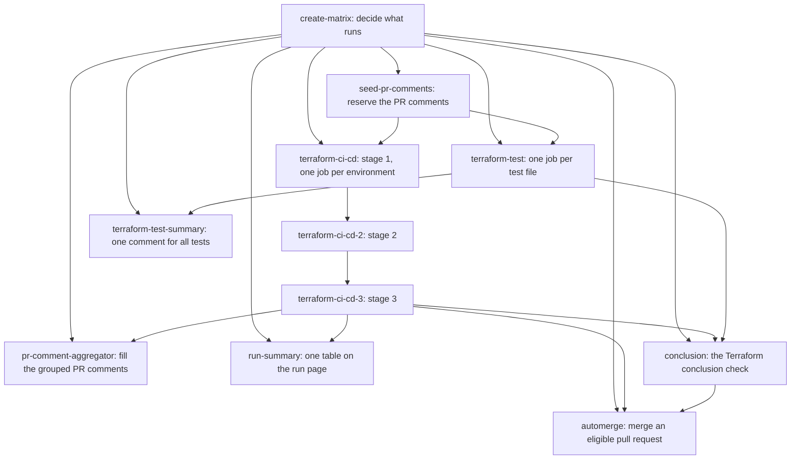

# Workflow [`terraform-ci-cd-default`](../.github/workflows/terraform-ci-cd-default.yml)  

Default DSB CI/CD workflow for terraform projects that performs various operations depending on from what github event it was called and given input. Default behavior (when not modified by inputs):

0. On `pull_request` and `push`, run only the environments the change is relevant to, see [which environments run](#which-environments-run-path-relevance)
1. Install `latest` version of terraform
2. Install `latest` version of TFLint
3. Run `terraform init`
4. Run `terraform fmt -check`
5. Run `terraform validate`
6. Perform linting with TFLint
7. If `terraform init` was successful, run `terraform plan`
8. If called from `pull_request` event, reconcile PR comments (per-env validation summaries and a per-env plan extract, plus optional per-group rolled-up tables). Heads are pre-allocated at the top of the run in deterministic order and PATCHed in place across runs; plan tags are GC'd between runs. See [Workflow-pr-comments.md](./Workflow-pr-comments.md) for the full spec, including the heads + tags model and the optional `pr-comment-group` field that collapses several envs into one combined-table head
9. If any of the steps `init`, `format`, `validate`, `lint` or `plan`, or the 🔒 lock file check on a pull request, failed, stop the workflow with a failure
10. If called from either of events `push` or `workflow_dispatch` on the default branch of the calling repo and `plan` step was successful, run `terraform apply`. I.e. the default is to perform terraform apply when merging PRs.
11. After `apply` (and `destroy-plan` / `destroy` when those goals are set), report the outcome: the PR comments from step 8 are updated with one block per operation and one tag comment per operation that ran, and — on every event, PR or not — each matrix job writes its environment's block to its `$GITHUB_STEP_SUMMARY` with a `::notice` / `::error` for the apply result, and a `run-summary` job writes one table covering every environment to the run page. An environment that neither applies nor destroys gets no operation blocks and no operation tags. If `apply`, `destroy-plan` or `destroy` failed, stop the workflow with a failure (same `allow-failing-terraform-operations` escape hatch as step 9). See [Apply-and-destroy-reporting.md](./Apply-and-destroy-reporting.md).

Moving a repository from `@v0` to `@v1`: [Migration-v0-to-v1.md](./Migration-v0-to-v1.md); every change between them: [V1-changes.md](./V1-changes.md).

What steps to execute and when can be modified using the input `goals-yml`, see the description of the input documented in the [workflow](../.github/workflows/terraform-ci-cd-default.yml). Goals are a YAML list of known names (`[init, format, validate]`, or one `- name` per line); a single goal may be written alone. Any other name, a list written without its dashes, or a goal without the goal it needs (`plan` without `init`, `apply` without `plan`, `destroy` without `destroy-plan`) is a validation error, see [mistakes the workflow refuses](#mistakes-the-workflow-refuses).

#### **Inputs**

All inputs are documented in the [workflow declaration](../.github/workflows/terraform-ci-cd-default.yml).

The input `environments-yml` is required all others are optional, see description of each in the [workflow declaration](../.github/workflows/terraform-ci-cd-default.yml).

##### **`environments-yml`**

Specification of environments to run this terraform workflow and it's stages for. Minimum 1 environment must be specified.

Type: YAML list (as string) with specifications of environments to execute stages for.

Given that this is a list of environments (potentially with differing configuration), each entry in this list gets a GitHub job of its own; the jobs run in parallel unless `depends-on` puts an environment in a later stage ([example 15](#15-ordering-environments-a-test-tenant-before-production)).

Across workflow runs, jobs for the same environment are serialised. Each job sits in a GitHub concurrency group named after the environment's `github-environment` field (defaults to `environment`), so a run that arrives while another is in progress for that environment waits its turn — an in-progress apply is never cancelled, and neither is a run that is already waiting. Pending runs start in the order they began waiting (best-effort, not guaranteed), up to 100 per environment; GitHub cancels anything beyond that. This deliberately opts out of GitHub's default queue depth of one, where a third run cancels the one already waiting and the cancelled run's `Terraform conclusion` check then fails. Three things to know about the group: it is the bare `github-environment` value, case-insensitive and shared by every workflow in the repository that uses it, so a scheduled reconcile and a merge apply for the same environment queue behind each other; ordering is best-effort, so after a burst of merges two runs queued close together may in rare cases start in the other order and leave the environment on the older commit until the next run; and a `cancel-in-progress: true` group on the calling workflow still cancels the whole run, including an in-progress or waiting environment job, so use one only on workflows that never apply.

Only one field is required for each entry in this yaml list: **`environment`** - string. Using default behavior this is the name of a directory found within the `/envs` directory in the root of the calling repo. This directory is where all workflow steps are executed.

**Example** have the workflow execute steps within `/envs/my-tf-environment` of the calling repo:

```yaml
environments-yml: |
  - environment: "my-tf-environment"
```

See more examples under [worked examples](#worked-examples) further down.

There are several optional fields for each entry in `environments-yml`, see description of each in the [workflow declaration](../.github/workflows/terraform-ci-cd-default.yml). Any other key is a validation error, which names the closest known key when one is within two edits, so a misspelt setting never falls back to the global value silently; the full list is [Configuration-validation.md §3.1](./Configuration-validation.md).

#### Events, dispatch and schedule

The workflow runs on `pull_request`, `push`, `workflow_dispatch` and `schedule`; any other event is a validation error. Trigger the calling workflow on the events you want and let each environment say which it takes part in. The full design is [Dispatch-and-triggers.md](./Dispatch-and-triggers.md).

| Input or field | Default | Meaning |
|---|---|---|
| `trigger-events-yml` (input) | `[pull_request, push, workflow_dispatch]` | The events an environment takes part in unless it sets its own. `schedule` is not allowed here. |
| `trigger-events` (per environment) | the input | Replaces the input for this environment. The only place `schedule` may appear. |
| `schedule-goal` (per environment) | `plan` | What a scheduled run may do: `plan`, `default` (what a push to the default branch would grant, a reconcile), `apply` or `destroy-plan`, the values of the dispatch `goal` input with the same meaning. Ignored on every other event. |

**Schedule is opt-in per environment, and a scheduled run plans.** Only the environment the schedule is for opts in; a schedule nothing opted into runs nothing, green, with a notice naming the key. A scheduled environment plans and does not apply unless its `schedule-goal` says otherwise, so a nightly drift check is one line on any environment, and a nightly reconcile is two:

```yaml
on:
  schedule: [{ cron: "0 2 * * *" }]
  # … pull_request, push, workflow_dispatch as usual

jobs:
  tf:
    # … uses, secrets and permissions as usual
    with:
      environments-yml: |
        - environment: prod
          trigger-events: [pull_request, push, workflow_dispatch, schedule]   # nightly plan: a drift check
        - environment: staging
          trigger-events: [pull_request, push, workflow_dispatch, schedule]
          schedule-goal: default                                               # nightly reconcile
```

A scheduled run never destroys; with `schedule-goal: default`, an environment holding `destroy` runs its destroy plan and stops there. A `schedule-goal` mistake is an error on every event, so it fails the next pull request rather than the night ([example 6](#6-scheduled-drift-detection)).

**Dispatching one environment.** Add the standard inputs block to the calling workflow, the same in every repository; the workflow reads the inputs from the caller's event, nothing goes through `with:`:

```yaml
on:
  workflow_dispatch:
    inputs:
      environment:
        description: "Environment to run, as named in environments-yml. Empty runs every environment."
        type: string
        default: ""
      goal:
        description: "Goal for this run. default follows goals-yml; plan, apply and destroy-plan override it for the selected environments."
        type: choice
        options: [default, plan, apply, destroy-plan]
        default: default
      reason:
        description: "Why this run is dispatched. Recorded in the run summary."
        type: string
        default: ""
```

```bash
gh workflow run <calling-workflow>.yml --ref main -f environment=staging -f goal=apply -f reason="rebuild after incident 42"
```

- `goal` only ever removes from what the environment's `goals-yml` would grant on a push to the same branch: `plan`, `apply` and `destroy-plan` cap it (an `apply` never brings the destroy goals with it; only `default` does, when `goals-yml` holds them), and `apply` needs the environment to hold `apply` or `all` and the default branch. Asking for more is an error, never a silent downgrade, and the dropdown can never add `destroy`.
- A name that matches no environment, or one whose `trigger-events` lack `workflow_dispatch`, is an error, never a green run that did nothing.
- Who dispatched what, with which goal and reason, is the first notice of the run and a line of the run summary. Without the inputs block a dispatch runs every environment with its `goals-yml`, and says where to copy the block from.
- Tests do not run on a dispatch or a schedule.

#### Which environments run: path relevance

On `pull_request` and `push`, an environment runs only when the change touches a file that is relevant to it. A pull request is judged on its whole diff, a push on everything it carried. On `schedule` and `workflow_dispatch` relevance is not consulted: every environment that takes part in the event runs, or on a dispatch the one environment it names (see [events, dispatch and schedule](#events-dispatch-and-schedule)). The full design is [Path-relevance.md](./Path-relevance.md).

Two optional fields per environment decide what is relevant:

| Field | Default | Meaning |
|---|---|---|
| `paths` | `[auto]` | Files that make this environment relevant. A list containing `auto` is the standard set plus the other entries; a list without it replaces the standard set. `["**"]` means always relevant. |
| `paths-ignore` | `["**/*.md"]` when `paths` uses `auto`, otherwise `[]` | Files that never make this environment relevant, applied after `paths`. `[]` means ignore nothing. |

`auto` is the environment's `project-dir` (`envs/<environment>/**` by default), `main/**`, `modules/**`, every directory of its `terraform-init-additional-dirs-yml`, and the repository root's `.tflint.hcl` (`/.tflint.hcl`). Patterns follow a small glob grammar: `*` within one directory level, `**` any number of levels, `?` one character, and a pattern without `/` matches the file name anywhere unless a leading `/` anchors it at the root (`/Makefile` is the root's only, `Makefile` any). There is no negation, no `[…]` and no `{…}`. An environment that reads files from outside the standard set, such as a `-var-file` passed through `TF_CLI_ARGS_*`, a local module outside `main/` and `modules/`, or Markdown through `file()`, must list them in `paths`.

```yaml
environments-yml: |
  - environment: prod                      # auto
  - environment: staging
    paths: [auto, "scripts/**"]            # the standard set plus one directory
    paths-ignore: ["**/*.md", "**/*.txt"]  # replaces the implied ignore
  - environment: sandbox
    paths: ["**"]                          # every change
```

Every uncertainty runs every environment: a change under `.github/workflows/`, a force push, a pull request whose head moved since the run started, more files than the API lists, or an API that cannot answer. The run page says which applied, in a notice such as `relevance diff (diff): 1 of 3 environments affected`, and in the run summary.

**Remove `paths` and `paths-ignore` from the `on:` block of your calling workflow.** A workflow skipped by `on.paths` reports no check at all, so a required `Terraform conclusion` check stays pending and blocks the pull request. Relevance lives inside the workflow instead, and a pull request that touches nothing relevant runs one short job and reports a green check. Before:

```yaml
on:
  pull_request:
    branches: [main]
    paths: ["envs/staging/**", "main/**", "modules/**"]
```

After:

```yaml
on:
  pull_request:
    branches: [main]
```

To keep every environment running on every change, for instance while you review your `paths`, set the input `path-relevance-enabled: false`. It applies to all environments; to run one environment on every change, give it `paths: ["**"]`.

What a pull request shows for an environment the change does not touch: an ungrouped environment's summary comment says "➖ Not affected by this pull request" with its path rules, and its old plan comments are removed; in a group's table the environment keeps its column, filled with `—`, and a line under the table names it as not affected. A pull request that touches no environment is eligible for auto-merge, under the same enabled and actor checks as any other.

Examples, for `prod` ungrouped and `staging` and `sandbox` in the group `platform`:

| Change | Runs | Conclusion |
|---|---|---|
| `README.md`, `docs/runbook.md` | nothing | green, nothing to verify |
| `envs/staging/main.tf` | `staging` | green if `staging` passes |
| `modules/net/main.tf` | all three | as always |
| `envs/prod/README.md` | nothing (the implied ignore) | green |
| `.github/workflows/terraform.yml` | all three (the workflow changed) | as always |
| A push to `main` merging the `staging` change | `staging` | green if the apply passes |

Three things to know:

- An apply that failed on one push is not retried by a later push that does not touch that environment. Run the workflow by `workflow_dispatch` to reconcile it: a dispatch is never filtered by relevance, and with the standard inputs block it can name that one environment.
- A pull request with a merge conflict gets no run at all, so its check stays "Expected" until the conflict is resolved. That is GitHub's behaviour, not relevance.
- The repository's Environments view shows the last deployment of each environment, which may be from an older change than the latest run when later changes did not touch it.

#### Terraform tests

Every committed `*.tftest.hcl` and `*.tftest.json` file runs as its own job, in parallel with the environments, on pull requests and pushes (not on `schedule` or `workflow_dispatch`). A repository without test files is unaffected; `terraform-test-enabled: false` switches the stage off. One pull-request comment summarises every file, failed ones first, and a failing test blocks the merge unless it is tolerated with `allow-failing-terraform-tests`. The full design is [Terraform-tests.md](./Terraform-tests.md).

**Where test files go.** Terraform finds a test file only beside a root module's `.tf` files or in the `tests/` directory directly under it. Supported layouts: a repository-root `tests/` with no `.tf` at the root (each `run` block names its module, `module { source = "./modules/net" }`, relative to the root), and `tests/` beside any module, `main/` or environment directory. A file anywhere else is reported as misplaced and does not run. Terraform 1.13 or later.

A `tests/` directory inside an environment works, but is rarely what you want: the environment's own init and validate load those files too, so a broken test file blocks its plan, and its real provider blocks apply. Prefer a repository-root `tests/` with mocks, or `tests/` beside a module.

**Provider versions** come from the environments: each file runs once per distinct set of provider versions in the environments' lock files, normally once. Every lock must record a checksum for the runner's platform (the 🔒 lock check already requires `linux_amd64`); a test job whose lock does not reports `lock-platform` with the command that fixes it.

**Lanes** say which files run with which credentials. Without lanes every file runs with no credentials, which is right for unit tests with `mock_provider`:

```yaml
terraform-test-lanes-yml: |
  - name: unit
    match: ["**/unit-*.tftest.hcl"]
  - name: integration
    match: ["**/integration-*.tftest.hcl"]
    github-environment: auto          # runs in the GitHub Environment tftest-integration
    timeout-minutes: 60
```

The first lane whose `match` covers a file owns it; a lane without `match` takes the rest. The workflow's own `extra-envs-*` inputs never reach a test job, so a test can never borrow the apply identity. A lane either maps secrets by name (`extra-envs-from-secrets-yml`) or, better, runs in a GitHub Environment: its `ARM_*` and `TF_VAR_*` secrets are exported under their own names, and its OIDC subject names the lane. GitHub upper-cases secret names, so a `TF_VAR_tenant_id` secret arrives as `TF_VAR_TENANT_ID`; the lane exports it under both that name and `TF_VAR_tenant_id`, so a snake_case or an upper-case declaration works. A mixed-case variable name needs an explicit mapping in `extra-envs-from-secrets-yml`. A test file that uses `var.x` itself declares `variable "x" {}`.

**Bringing up an environment lane:**

1. Add the lane with `github-environment: auto` and open a pull request. The first run creates `tftest-<lane>`, and its jobs fail with `no-credentials`, printing a `gh secret set` command for each of `ARM_TENANT_ID` and `ARM_CLIENT_ID`.
2. Someone with write access sets the secrets (the environment must exist first; the settings page needs admin, `gh` does not):
   ```bash
   gh secret set ARM_TENANT_ID       --repo <owner>/<repo> --env tftest-<lane> --body '<tenant-id>'
   gh secret set ARM_CLIENT_ID       --repo <owner>/<repo> --env tftest-<lane> --body '<client-id>'
   gh secret set ARM_SUBSCRIPTION_ID --repo <owner>/<repo> --env tftest-<lane> --body '<subscription-id>'   # subscription lanes only
   ```
3. The identity's owner adds a federated credential for the subject `repo:<owner>/<repo>:environment:tftest-<lane>`, or one flexible credential for every lane of the repository ([Terraform-tests.md §3.6](./Terraform-tests.md)). Environment names are lowercase: the credential compares case-sensitively.
4. Re-run the failed jobs.

Never add protection rules to a `tftest-*` environment.

**Keeping plan and apply identities out of reach** of a test job takes two things: plan and apply credentials are environment secrets of the Terraform environments, never repository or organisation secrets; and a plan or apply identity trusts only its environments' subjects, never `pull_request` or a branch. Client IDs are not secret; only the subject an identity trusts keeps a test job from minting its token.

**Choosing lanes and settings.** One lane per identity. Keep unit tests in a lane with no credentials and name their files `unit-*`, as in the example above. Leave `terraform-test-runs-on` at `ubuntu-latest`, and set `runs-on` on a lane only when its tests must reach a restricted network. Keep timeouts short: a test killed by its timeout leaves the objects it created, and nothing can destroy them, since the test's state lived in the job. Use `allow-failing-terraform-tests` only while a lane is being brought up. Leave a lane's `providers-from` unset, so each file runs against every distinct lock set the environments hold; narrow it only for a lane whose module only one environment uses. If test files have been placed in environment directories and should not run in the stage, exclude them with `terraform-test-exclude-paths-yml: ["envs/**"]`.

**Two callers.** When a repository calls this workflow from two workflows on the same pull request, both would run the same tests: set `terraform-test-enabled: false` in all but one. Environment secrets reach the test jobs only with `secrets: inherit` on the caller, as everything else does.

#### Variables and secrets

Normally you'll have the need to pass some variables or secrets to terraform in order to perform authentication or otherwise configure the terraform operations. This can be achieved by specifying them in `extra-envs-yml` and/or `extra-envs-from-secrets-yml`.

For _global_ values, those to be passed for all terraform environments specified in `environments-yml` use the workflow **inputs** `extra-envs-yml` and `extra-envs-from-secrets-yml`.

For environment specific values specify **the fields** `extra-envs-yml` and `extra-envs-from-secrets-yml` for one or more environment defined in the `environments-yml` workflow input. An environment's map is merged over the global one, variable by variable.

A value reaches the job as written: `TF_VAR_sku: 1.10` is `1.10` and `ACCOUNT: 012345678901` keeps its leading zero, with nothing to quote. A null (`~`, `null`, or the key with no value) means not set, so an environment's null removes a global variable for that environment; `""` sets the empty string. A mapping or a list as a value is a validation error; quote it if the braces or brackets are part of the value. A secret name the job cannot find fails the job before any Terraform runs. See [example 9](#9-variables).

#### Variables for a single goal

`extra-envs-yml` and `extra-envs-from-secrets-yml` reach every step of the job. When the correct value differs per stage — `plan` may need a much higher `GOMEMLIMIT` than `validate`, and a `GOGC` low enough to keep `plan` inside a runner's memory would needlessly slow down `lint` — use `extra-envs-per-goal-yml` and `extra-envs-from-secrets-per-goal-yml` instead. Both exist as workflow inputs and as per-environment fields, like their global counterparts.

```yaml
      extra-envs-yml: |
        ARM_USE_OIDC: true
        GOGC: 50
        GOMEMLIMIT: 6GiB

      extra-envs-per-goal-yml: |
        plan:
          GOMEMLIMIT: 12GiB
          GOGC: 25
        apply:
          GOMEMLIMIT: ~          # cleared for apply
        lint:
          GOGC: 400

      environments-yml: |
        - environment: dev
        - environment: prod
          extra-envs-per-goal-yml:
            plan:
              GOMEMLIMIT: 24GiB
```

Valid goal keys are the ones you write in `goals-yml`: `init`, `format`, `validate`, `lint`, `plan`, `apply`, `destroy-plan`, `destroy`. Three things to know about them:

- The key is **`format`**, even though the workflow step is called `fmt`.
- **`destroy-plan` and `destroy` are separate** from `plan` and `apply`, so a destroy plan can be tuned independently.
- **There is no `all` key.** `all` is not a stage, it is shorthand the decision engine expands into the goals it grants, so there is nothing to attach values to — the every-goal layer is `extra-envs-yml`. Writing `all:` is a hard error rather than a silent no-op.

An unknown goal key, a secret name that is not available to the workflow, an environment variable name that is not a valid one, or a value that is a list or a mapping all fail the job early, before any terraform runs.

Effective value for a given (environment, goal, variable), last wins:

1. global `extra-envs-yml`
2. global `extra-envs-from-secrets-yml`
3. per-goal `extra-envs-per-goal-yml[goal]`
4. per-goal `extra-envs-from-secrets-per-goal-yml[goal]`

So specificity beats source — a per-goal plain value overrides a global secret-sourced one for the same variable — while within one level, secret-sourced wins, as it does in the job-wide maps. Per-environment values are merged into the global ones first, per goal and per variable: the `prod` example above ends up with `GOMEMLIMIT: 24GiB` **and** `GOGC: 25` for `plan`.

For the resulting table across the example:

| | `GOGC` | `GOMEMLIMIT` |
|---|---|---|
| dev · init/validate/format/destroy-* | 50 | 6GiB |
| dev · plan | 25 | 12GiB |
| dev · lint | 400 | 6GiB |
| dev · apply | 50 | *unset* |
| **prod · plan** | **25** | **24GiB** |

##### Clearing a variable

`GOMEMLIMIT: ~` (YAML null) **unsets** the variable for that goal. `GOMEMLIMIT: ""` sets it to the empty string, which is a different thing for anything that treats an empty value as meaningful. Being able to express *unset* at all is the main functional gain over routing these through `$GITHUB_ENV`, which has no unset mechanism.

##### Two caveats

**Per-goal secrets do not swap cloud identity.** The values reach the terraform/tflint process for that goal — not the workflow's `Login to Azure` step, which runs once, early, and reads job-wide environment variables. A reader service principal for `plan` and a contributor for `apply` therefore does **not** work through `extra-envs-from-secrets-per-goal-yml`: handing terraform a different `ARM_CLIENT_ID` after the OIDC token was already minted for another identity changes nothing. Use it for values terraform or a provider reads directly.

**Overriding a variable the workflow manages itself is allowed, and who wins depends on how the workflow sets it.** There is no reserved-name list. A variable the action exports at runtime — `TF_PLUGIN_CACHE_DIR` in `init` — wins over your value, so provider plugin caching cannot be disabled by accident. A variable set in the step's environment — `TF_IN_AUTOMATION`, and `GITHUB_TOKEN` for `lint` — is overridden by your value. The asymmetry is a consequence of when each assignment happens, not a policy.

##### The cheaper alternative

Terraform's own `TF_CLI_ARGS_<subcommand>` mechanism already works through plain `extra-envs-yml` with no per-goal configuration at all, and covers anything expressible as a CLI flag. Reach for it first. One caveat: `TF_CLI_ARGS_plan` applies to **both** plan invocations, `plan` and `destroy-plan`. Another: `-compact-warnings` changes the diagnostic shape — one `Warnings:` list of summaries instead of a `Warning:` block per diagnostic — so `parse-terraform-warnings` counts zero and the warning annotations and the warnings section of the plan comment disappear; the count parsers are unaffected.

Full design, including why the values are passed as a file path rather than as a payload: [Per-goal-environment-variables.md](./Per-goal-environment-variables.md).

#### Module downloads are authenticated

`terraform init` installs a remote module by shelling out to `git clone`. The public registry resolves a module such as `Azure/avm-res-keyvault-vault/azurerm` to `git::https://github.com/Azure/terraform-azurerm-avm-res-keyvault-vault?ref=<sha>`, so a configuration with no `git::` sources of its own still ends up cloning from github.com — once per module.

Those clones are fresh repositories under `.terraform/modules`. They inherit nothing from the workspace repository, so the credentials `actions/checkout` wrote into *its* local config do not apply, and without help the clones are anonymous. GitHub budgets unauthenticated traffic at **60 requests/hour counted against the source IP**, which every runner behind the same NAT address shares. A module set of any size spends that quickly, and when it is gone the pack negotiation is refused with a `401`; git has no credentials and no tty, so it fails with

```text
fatal: could not read Username for 'https://github.com': No such device or address
```

which terraform reports as `Failed to download module` — for a subset of the modules that varies run to run, since it is a throttle and not a misconfiguration. The workflow therefore hands `${{ github.token }}` to `terraform-init`, which authenticates the clones so they are budgeted per repository (1 000 requests/hour) instead. Nothing is required of the calling repository; `contents: read` is enough.

Two things worth knowing:

- **A runner that already has github.com credentials keeps them.** When the runner's global or system git config carries an `extraheader`, a credential helper or an `insteadOf` rewrite for github.com, the token is not injected — a repository whose private modules are cloned with runner-level credentials must keep working. The init log says which of the two happened.
- **The error is annotated.** If a clone is refused for want of credentials anyway, the init step emits an annotation naming the host and the likely cause, rather than leaving `Failed to download module` to be diagnosed from first principles.

Note that the module cache normally hides this problem: on a cache hit nothing is cloned at all, so the failure surfaces only when the cache misses — after a module pin changes, for instance. See [Terraform-module-cache.md](./Terraform-module-cache.md).

#### Dependabot pull requests: the admission

A pull request Dependabot opens runs code nobody has looked at: a new provider release or module version. A run Dependabot starts therefore executes Terraform only once the **admission** admits its pull request, with no person in the loop for a dependency that passes ([Dependabot-admission.md](Dependabot-admission.md)). The pull request is admitted when:

- it changes only what Dependabot writes: `version` arguments and git `ref` values in `.tf` files, and lock entries;
- every provider and module it changes comes from an allowed namespace, built in `dsb-norge`, `hashicorp`, `microsoft` and `Azure`, compared without case;
- each new version was published at least three days before the run (`dsb-norge` is exempt), and a provider's new version is signed with the key of the version before it, or with one HashiCorp vouches for, and its lock hashes are the publisher's;
- every environment it concerns has a committed `.terraform.lock.hcl`, which `init` then reads only, so a provider the lock does not record never runs.

An admitted run is decided as a person's run would be: the environments plan with their identity, and the test lanes run, credentialed ones included. A Dependabot run cannot read Actions or environment secrets, so the identities' IDs must be plain values, which they may be, since an identity is protected by the OIDC subject it trusts, not by its client ID:

```yaml
      environments-yml: |
        - environment: prod
          extra-envs-yml:
            ARM_TENANT_ID: "00000000-0000-0000-0000-000000000000"
            ARM_SUBSCRIPTION_ID: "00000000-0000-0000-0000-000000000000"
            ARM_CLIENT_ID: "00000000-0000-0000-0000-000000000000"
```

A test lane that needs credentials gets its IDs in its own `extra-envs-yml` the same way; one whose IDs are still environment secrets fails on an admitted Dependabot run, with a message saying so.

**Other publishers, and the minimum age.** The policy is added to the built-in one:

```yaml
      dependabot-admission-yml: |
        allow:
          - elastic
          - cyrilgdn/postgresql
        min-age-days: 3        # the default, from 0 to 90
        min-age-exempt:        # besides dsb-norge
          - my-other-org
```

`dependabot-admission-enabled: false` runs Dependabot's pull requests as before the admission existed.

**A pull request that is not admitted** runs no Terraform job. `Terraform conclusion` fails with `conclusion: red — Dependabot pull request not admitted: 2 of 3 dependencies failed; see the admission comment`, each environment's comment says it was not admitted, and the admission comment lists every dependency with its result and what to do:

```markdown
### 🚫 Dependabot pull request not admitted

No Terraform ran. Every dependency a Dependabot pull request changes must pass the admission before any job runs it ([what the admission checks](https://github.com/dsb-norge/github-actions-terraform/blob/main/docs/Dependabot-admission.md)).

| Dependency | Change | Result |
|---|---|---|
| provider `hashicorp/azurerm` | 4.41.0 → 4.42.0 | ✅ admitted |
| provider `cyrilgdn/postgresql` | 1.25.0 → 1.26.0 | ❌ `cyrilgdn` is not on the allow list |
| module `Azure/naming/azurerm` | 0.4.3 → 0.4.4 | ❌ published 1 day ago; the minimum is 3 days, reached at 2026-09-23 14:13 UTC |

<details><summary>Files</summary>

- `envs/dev/.terraform.lock.hcl`, `envs/prod/.terraform.lock.hcl`: provider `hashicorp/azurerm`
- `envs/prod/.terraform.lock.hcl`: provider `cyrilgdn/postgresql`
- `main/naming.tf`: module `Azure/naming/azurerm`

</details>

**If you trust provider `cyrilgdn/postgresql` and the update is intended:** add `cyrilgdn/postgresql` (or `cyrilgdn`) to `allow` in `dependabot-admission-yml` in the calling workflow on the default branch, then comment `@dependabot rebase` on this pull request.

**module `Azure/naming/azurerm` 0.4.4 is too new:** published 1 day ago; the minimum is 3 days, reached at 2026-09-23 14:13 UTC. Then re-run all jobs of this run.

**To run this pull request once without changing the policy:** push a commit to its branch. That run is yours and is not judged; Dependabot stops rebasing the pull request.
```

A Dependabot push to its branch, on a caller that triggers on every branch, runs nothing and is green; the pull request's own run judges the change. Grant the calling job the permissions the workflow's header lists and nothing more: `permissions: write-all` raises a Dependabot run's token to write.

Dependabot updates a provider only where `required_providers` gives it the block form, `source` and `version` on lines of their own. Written on one line, `random = { source = "hashicorp/random", version = "3.5.1" }`, the update fails in Dependabot's job with "Content didn't change!" and no pull request is opened.

#### Worked examples

Each example is the part of the calling workflow's `with:` that matters, what runs on each event, and why. Find the one closest to your configuration. The tables and messages come from running the workflow's own code on the configuration shown: its decision engine, which is the `Create job matrix` job, and, where an example says what a later step decides (the auto-merge evaluator, the conclusion, the export of variables), that step. Every message is quoted as the workflow prints it.

How to read the tables:

| Column | The run |
|---|---|
| Pull request | A pull request to the default branch, `main`, that changes a file the environment is relevant to. [Example 8](#8-path-relevance) shows the other cases. |
| Push | A push to `main`, such as the merge of that pull request, with the same change. |
| Dispatch | A `workflow_dispatch` on `main` from a calling workflow with the [standard inputs block](#events-dispatch-and-schedule), left at its defaults: every environment, `goal: default`. |
| Schedule | A run of a `schedule:` trigger in the calling workflow. |

A cell lists the goals the environment is granted, which are the steps its job runs. `init … plan` stands for `init, format, validate, lint, plan`. "Does not take part" means the event is not in the environment's trigger events, so the environment has no job in that run. Where the event makes no difference, as for variables, the table shows what each environment's job receives instead. Unless an example says otherwise, each environment's directory is `envs/<environment>` and every other input is at its default.

##### The jobs of a run



An arrow is a `needs:` of the job it points to. The jobs after the environments need all three stage jobs; the chart draws the last one only. Without `depends-on`, stage 1 holds every environment and stages 2 and 3 are skipped.

| Job | Runs | Does |
|---|---|---|
| `create-matrix` (Create job matrix) | on every run | Validates the configuration and decides which environments run, with which goals, and which test files run. A refused configuration stops the run here. |
| `seed-pr-comments` (Seed PR comment heads) | on a pull request that is not from a fork | Creates the comment heads at the top of the pull request, in a fixed order. |
| `terraform-ci-cd`, `terraform-ci-cd-2`, `terraform-ci-cd-3` (Terraform) | when their stage has environments, after the stage before succeeded or was skipped | One job per environment that runs: init, fmt, validate, lint and plan, then apply, destroy plan or destroy as granted. The stages come from `depends-on` ([example 15](#15-ordering-environments-a-test-tenant-before-production)). |
| `terraform-test` | on a pull request or a push, when the repository has committed test files | One job per test file, in parallel with the environments. |
| `pr-comment-aggregator` (PR comment aggregator) | on a pull request | Renders the grouped comments ([example 12](#12-grouped-pr-comments)). |
| `run-summary` (Run summary) | on every run | Writes one table with every environment to the run page. |
| `terraform-test-summary` (Terraform tests summary) | on a pull request, and on a push with test files, while the test stage is on | Writes one comment and one summary for every test file. |
| `conclusion` (Terraform conclusion) | on every run | The check to require in branch protection: green when everything that should have run ran and passed, including when nothing needed to run. The reporting jobs are not among its `needs`, so they can never turn it red. |
| `automerge` (PR auto merger) | on a pull request to the default branch from the same repository, with `pr-auto-merge-enabled: true` and a green conclusion | Merges the pull request when every environment allows it ([example 13](#13-auto-merge-for-dependabot)). |

##### 1. One environment, all defaults

A repository with one Terraform root in `envs/my-env`. The complete calling workflow, saved as `.github/workflows/terraform.yml`:

```yaml
name: "Terraform CI/CD"

on:
  pull_request:
    branches: [main]
  push:
    branches: [main]
  workflow_dispatch:
    inputs:
      environment:
        description: "Environment to run, as named in environments-yml. Empty runs every environment."
        type: string
        default: ""
      goal:
        description: "Goal for this run. default follows goals-yml; plan, apply and destroy-plan override it for the selected environments."
        type: choice
        options: [default, plan, apply, destroy-plan]
        default: default
      reason:
        description: "Why this run is dispatched. Recorded in the run summary."
        type: string
        default: ""

jobs:
  tf:
    uses: dsb-norge/github-actions-terraform/.github/workflows/terraform-ci-cd-default.yml@v1
    secrets: inherit # the workflow reads the secrets named in extra-envs-from-secrets-yml
    permissions:
      id-token: write      # OIDC login, for the environments and the test jobs
      contents: read       # checkout, and the files a push changed
      pull-requests: write # PR comments, and the files a pull request changed
      actions: read        # job links in the grouped PR comments
    with:
      environments-yml: |
        - environment: my-env
```

| Environment | Pull request | Push | Dispatch | Schedule |
|---|---|---|---|---|
| `my-env` | `init … plan` | `init … plan, apply` | `init … plan, apply` | does not take part |

The default `goals-yml` is `[all]`: the standard goals on every event, and `apply` on a push, a dispatch or a schedule on the default branch. The default trigger events are `pull_request`, `push` and `workflow_dispatch`, so a schedule added to this workflow would run nothing until an environment opts in ([example 6](#6-scheduled-drift-detection)). Require the check `tf / Terraform conclusion` in the branch protection of `main`; `tf` is the calling job's id.

##### 2. dev, test and prod, with prod behind required reviewers

```yaml
      environments-yml: |
        - environment: dev
        - environment: test
        - environment: prod
          github-environment: prod-approval
```

For a change under `modules/`, which all three read:

| Environment | Pull request | Push | Dispatch | Schedule |
|---|---|---|---|---|
| `dev` | `init … plan` | `init … plan, apply` | `init … plan, apply` | does not take part |
| `test` | `init … plan` | `init … plan, apply` | `init … plan, apply` | does not take part |
| `prod` | `init … plan` | `init … plan, apply` | `init … plan, apply` | does not take part |

Each environment's job runs in the GitHub Environment its `github-environment` names, by default the environment's own name; GitHub creates one that does not exist yet, with no protection rules. Create `prod-approval` in the repository's settings with required reviewers: GitHub then holds every `prod` job until a reviewer approves it, the pull request's plan as well as the push's apply, while `dev` and `test` start at once. The same name is the environment's concurrency group, so two runs never work on `prod` at the same time. A misspelt key is refused ([`github_environment`](#github_environment-instead-of-github-environment)), so a typo cannot lose the reviewers silently.

##### 3. A plan-only environment

```yaml
      environments-yml: |
        - environment: audit
          goals-yml: [init, format, validate, lint, plan]
```

| Environment | Pull request | Push | Dispatch | Schedule |
|---|---|---|---|---|
| `audit` | `init … plan` | `init … plan` | `init … plan` | does not take part |

Without `apply` or `all` among its goals, `audit` is never granted an apply, on any event. A dispatch that asks for one is refused, not downgraded to a plan:

```text
dispatch: environment 'audit' does not hold the goal 'apply' (goals: init, format, validate, lint, plan)
```

##### 4. A sandbox that applies on the pull request

```yaml
      environments-yml: |
        - environment: sandbox
          goals-yml: [all, apply-on-pr]
```

| Environment | Pull request | Push | Dispatch | Schedule |
|---|---|---|---|---|
| `sandbox` | `init … plan, apply` | `init … plan, apply` | `init … plan, apply` | does not take part |

`apply-on-pr` applies on a pull request against the default branch; a pull request against any other branch only plans. It stands on its own: `[init, plan, apply-on-pr]` applies on the pull request (`init, plan, apply`) and only plans on the push (`init, plan`). The environment's pull-request comment is titled "Terraform summary" rather than "Terraform validation summary", and shows its mode, `applies on PR`.

##### 5. A tear-down environment

```yaml
      environments-yml: |
        - environment: teardown
          goals-yml: [init, destroy-plan, destroy]
          trigger-events: [pull_request, push, workflow_dispatch, schedule]
        - environment: preview
          goals-yml: [init, destroy-plan]
```

| Environment | Pull request | Push | Dispatch | Schedule |
|---|---|---|---|---|
| `teardown` | `init, destroy-plan` | `init, destroy-plan, destroy` | `init, destroy-plan, destroy` | `init, destroy-plan` |
| `preview` | `init, destroy-plan` | `init, destroy-plan` | `init, destroy-plan` | does not take part |

`destroy` is granted on a push or a dispatch on the default branch and nowhere else: never on a schedule, which runs `teardown`'s destroy plan and stops there, and never on a pull request unless the goals hold `destroy-on-pr`. A destroy plan alone is read-only: `preview` shows on every run what a destroy would remove, and removes nothing. A dispatch can narrow `teardown` but never widen it: `goal: destroy-plan` grants `init, destroy-plan`, `goal: plan` grants only `init` (the one standard goal it holds), and `goal: apply` is refused:

```text
dispatch: environment 'teardown' does not hold the goal 'apply' (goals: init, destroy-plan, destroy)
```

##### 6. Scheduled drift detection

The calling workflow adds `schedule: [{ cron: "23 3 * * *" }]` to its `on:` block, off the hour, where GitHub's scheduler delays or drops fewer runs, and the environments the schedule is for opt in. Goals are the default `[all]`:

```yaml
      environments-yml: |
        - environment: prod
          trigger-events: [pull_request, push, workflow_dispatch, schedule]
        - environment: sandbox
          trigger-events: [push, workflow_dispatch, schedule]
          schedule-goal: default
```

| Environment | Pull request | Push | Dispatch | Schedule |
|---|---|---|---|---|
| `prod` | `init … plan` | `init … plan, apply` | `init … plan, apply` | `init … plan` |
| `sandbox` | does not take part | `init … plan, apply` | `init … plan, apply` | `init … plan, apply` |

`prod` applies on every push that concerns it and plans every night without applying: a plan with changes is drift, or a default branch that a failed apply left unapplied, to look into. The nightly plan runs as `prod` itself, in its GitHub Environment, with its credentials and in its concurrency group, so it waits for a running apply instead of racing it for the state lock. `sandbox` reconciles every night: `schedule-goal: default` grants what a push to the default branch would. The run summary and a notice say what each environment was capped to:

```text
schedule: goal default for sandbox; goal plan for prod (schedule-goal, plan where an environment sets none)
```

and each environment's line of the decision record names its cap before its goals:

```text
prod: run — relevance: all:event; schedule-goal: plan; goals: init, format, validate, lint, plan
sandbox: run — relevance: all:event; schedule-goal: default; goals: init, format, validate, lint, plan, apply
```

`schedule-goal` takes the values of the dispatch `goal` input with the same meaning: `plan`, the default, `default`, `apply` (the standard goals and `apply`, no destroy plan) and `destroy-plan` (`init` and `destroy-plan`). A scheduled run never destroys. A cap only removes, so a mistake is an error, on every event:

```text
environments-yml: environment 'sandbox': 'schedule-goal: apply' needs the goal 'apply' or 'all' (goals: init, format, validate, lint)
environments-yml: environment 'prod': 'schedule-goal' is one of default, plan, apply, destroy-plan, not 'aply'
```

A `schedule-goal` on an environment whose `trigger-events` lack `schedule` changes nothing, and the run warns: `The environment 'prod' sets schedule-goal: default, but its trigger-events do not hold schedule, so it has no effect.`

`schedule` itself goes in the `trigger-events` of the environment the schedule is for; in the input `trigger-events-yml` it would reach every environment, including one added later, so there it is refused:

```text
trigger-events-yml: 'schedule' is per environment only; add it to the trigger-events of the environment the schedule is for
```

A schedule that no environment opted into runs nothing, and the run is green with the notice `schedule: no environment takes part in scheduled runs; add 'schedule' to the trigger-events of the environment the schedule is for`. `sandbox` takes no part in pull requests, so its pull-request comment says `➖ Does not take part in pull requests: this environment's trigger-events are push, workflow_dispatch, schedule`, and a pull request that changes its files is never auto-merged ([example 13](#13-auto-merge-for-dependabot)).

##### 7. Dispatching one environment

The environments of [example 2](#2-dev-test-and-prod-with-prod-behind-required-reviewers), dispatched through the standard inputs block of [example 1](#1-one-environment-all-defaults). From the command line:

```bash
gh workflow run terraform.yml --ref main -f environment=prod -f goal=apply -f reason="rebuild after incident 42"
```

| Dispatch | `dev` | `test` | `prod` |
|---|---|---|---|
| on `main`, `environment: prod`, `goal: plan` | not requested | not requested | `init … plan` |
| on `main`, `environment: prod`, `goal: apply` | not requested | not requested | `init … plan, apply` |
| on `main`, every environment, `goal: plan` | `init … plan` | `init … plan` | `init … plan` |
| on `feature/x`, `environment: prod`, `goal: default` | not requested | not requested | `init … plan` |
| on `feature/x`, `environment: prod`, `goal: apply` | refused | refused | refused |
| on the tag `main`, `environment: prod`, `goal: apply` | refused | refused | refused |

"Not requested" is an environment the dispatch did not name; it has no job. A dispatch runs the environment it names, or every environment that takes part in dispatches, and is never filtered by path relevance. The `goal` input only ever removes goals: `plan` keeps the standard goals, `apply` needs the goal `apply` or `all` and a run on the default branch, and asking for more is refused rather than downgraded. Tests do not run on a dispatch. The run's first notice, repeated in the run summary, says who asked for what:

```text
dispatched by octocat: environment prod, goal apply, reason "rebuild after incident 42"
```

When someone else re-runs it, the line reads `dispatched by octocat (re-run by hubot): environment prod, goal apply, reason "rebuild after incident 42"`.

The refused dispatches, and two more mistakes:

- `goal: apply` from a feature branch:

  ```text
  dispatch: apply is only allowed from the default branch 'main'; this run is on 'feature/x'
  ```

- `goal: apply` from a tag named like the default branch, which is a tag and not the default branch:

  ```text
  dispatch: apply is only allowed from the default branch 'main'; this run is on the tag 'main'
  ```

- a name that matches no environment:

  ```text
  dispatch: no environment named 'prdo'. Environments: dev, test, prod
  ```

- `goal: destroy-plan` for an environment without that goal:

  ```text
  dispatch: environment 'prod' does not hold the goal 'destroy-plan' (goals: all)
  ```

A calling workflow **without the inputs block** can still be dispatched: every environment runs with its `goals-yml`, here `init … plan, apply` on `main`, and the notice says where to find the block:

```text
dispatched by octocat: the calling workflow declares no dispatch inputs, so every environment runs with its goals; copy the standard block from docs/Dispatch-and-triggers.md §3.1 to choose one environment and a goal
```

A calling workflow with **an inputs block of its own**, one without `environment` and `goal` (here `target` and `mode`), runs the same way, and the notice names the inputs the dispatch delivered:

```text
dispatched by octocat: this dispatch delivered the inputs mode, target but neither 'environment' nor 'goal', so every environment runs with its goals; the standard block is in docs/Dispatch-and-triggers.md §3.1
```

##### 8. Path relevance

On a pull request or a push, an environment runs only when a changed file is relevant to it ([which environments run](#which-environments-run-path-relevance)). The tables below are for pull requests; a push with the same change runs the same environments, with `apply` where the goals grant it. "Runs" is `init … plan`, and "—" is not affected: no job.

**`auto`, with shared `main/` and `modules/`.** The environments of example 2, with no `paths`:

| Changed files | `dev` | `test` | `prod` | Matched |
|---|---|---|---|---|
| `envs/dev/main.tf` | runs | — | — | `envs/dev/**` |
| `main/variables.tf` | runs | runs | runs | `main/**` |
| `modules/net/main.tf` | runs | runs | runs | `modules/**` |
| `.tflint.hcl` | runs | runs | runs | `/.tflint.hcl`, the root's only |
| `envs/dev/.tflint.hcl` | runs | — | — | `envs/dev/**` |
| `scripts/deploy.sh` | — | — | — | nothing |
| `.github/workflows/terraform.yml` | runs | runs | runs | a workflow changed, so everything runs |

`auto` is the environment's directory, `main/**`, `modules/**`, its additional init directories and the root's `.tflint.hcl`, with `**/*.md` ignored. The run's notice gives the count, `relevance diff (diff): 1 of 3 environments affected` for the first row, and a change under `.github/workflows/` runs everything with `relevance all (workflow-changed): 3 of 3 environments affected`.

**A documentation-only pull request**, changing `README.md`, `docs/runbook.md` and `envs/prod/README.md`, runs no environment:

```text
relevance diff (diff): 0 of 3 environments affected; nothing to verify for this change
```

Each environment's comment says `➖ Not affected by this pull request: no changed file matches this environment's paths`, with its path rules, and the check is green:

```text
conclusion: green — nothing to verify for this change; environments: 0 affected, 3 not affected (diff: diff); tests: 0
```

Committed test files still run on such a pull request: tests are not filtered by relevance.

**Explicit `paths` and `paths-ignore`:**

```yaml
      environments-yml: |
        - environment: dev
          paths: [auto, "scripts/**"]            # the standard set plus scripts/
          paths-ignore: ["**/*.md", "**/*.txt"]  # replaces the implied **/*.md
        - environment: test
          paths: ["envs/test/**", "shared/**"]   # without auto: replaces the standard set
        - environment: prod
          github-environment: prod-approval
          paths-ignore: []                       # auto, ignoring nothing
```

| Changed files | `dev` | `test` | `prod` |
|---|---|---|---|
| `scripts/deploy.sh` | runs | — | — |
| `envs/dev/notes.txt` | — | — | — |
| `modules/net/main.tf` | runs | — | runs |
| `shared/README.md` | — | runs | — |
| `envs/prod/README.md` | — | — | runs |

A list with `auto` adds to the standard set; a list without it replaces the set, so `test` does not run for `modules/`. `paths-ignore` defaults to `["**/*.md"]` only with `auto`, which is why `test` runs for a Markdown file under `shared/`; `paths-ignore: []` ignores nothing, which is why `prod` runs for its README.

**Always relevant**, `paths: ["**"]`:

```yaml
      environments-yml: |
        - environment: dev
        - environment: sandbox
          paths: ["**"]
```

A pull request that changes only `README.md` runs `sandbox` and not `dev`.

**Relevance switched off**, `path-relevance-enabled: false`: every environment that takes part in the event runs, whatever changed. With the environments of example 2, a pull request that changes only `README.md` runs all three, with the notice `relevance all (disabled): 3 of 3 environments affected`. The input applies to every environment; to run one environment on every change, give it `paths: ["**"]`.

##### 9. Variables

**Values reach the job as written.**

```yaml
      extra-envs-yml: |
        ARM_USE_OIDC: true
        TF_VAR_sku: 1.10
        TF_VAR_account: 012345678901
        TF_VAR_retention_days: 07
        TF_VAR_hex: 0x1F
```

| Variable | The job gets |
|---|---|
| `ARM_USE_OIDC` | `true` |
| `TF_VAR_sku` | `1.10` |
| `TF_VAR_account` | `012345678901` |
| `TF_VAR_retention_days` | `07` |
| `TF_VAR_hex` | `0x1F` |

YAML itself would read `1.10` as the number 1.1 and drop the leading zeros; the workflow reads the values of its variable settings as the text you wrote, so there is nothing to quote. A mapping or a list as a value is refused ([a variable whose value is a mapping](#a-variable-whose-value-is-a-mapping)).

**A per-environment null removes a global variable.**

```yaml
      extra-envs-yml: |
        ARM_USE_OIDC: true
        TF_LOG: DEBUG
      environments-yml: |
        - environment: dev
        - environment: prod
          extra-envs-yml:
            TF_LOG: ~
```

| Environment | `ARM_USE_OIDC` | `TF_LOG` |
|---|---|---|
| `dev` | `true` | `DEBUG` |
| `prod` | `true` | not set |

`~`, `null` and a key with no value all mean not set. `TF_LOG: ""` is different: it sets the variable to the empty string.

**Secrets by name.**

```yaml
      extra-envs-yml: |
        ARM_USE_OIDC: true
      extra-envs-from-secrets-yml: |
        ARM_TENANT_ID: AZURE_TENANT_ID
        ARM_CLIENT_ID: AZURE_CLIENT_ID
      environments-yml: |
        - environment: dev
          extra-envs-from-secrets-yml:
            ARM_SUBSCRIPTION_ID: DEV_SUBSCRIPTION_ID
        - environment: prod
          github-environment: prod-approval
          extra-envs-from-secrets-yml:
            ARM_SUBSCRIPTION_ID: PROD_SUBSCRIPTION_ID
            ARM_CLIENT_ID: AZURE_PROD_CLIENT_ID
```

| Environment | `ARM_TENANT_ID` from | `ARM_CLIENT_ID` from | `ARM_SUBSCRIPTION_ID` from |
|---|---|---|---|
| `dev` | `AZURE_TENANT_ID` | `AZURE_CLIENT_ID` | `DEV_SUBSCRIPTION_ID` |
| `prod` | `AZURE_TENANT_ID` | `AZURE_PROD_CLIENT_ID` | `PROD_SUBSCRIPTION_ID` |

Each value is the name of a secret, read in the environment's own job, so only names ever appear in the matrix and the logs. An environment's map is merged over the global one, variable by variable. The secrets reach the workflow only through `secrets: inherit`, and a GitHub Environment's secrets reach the job that runs in it. With `ARM_TENANT_ID`, `ARM_CLIENT_ID` and `ARM_SUBSCRIPTION_ID` set, the job logs in to Azure before Terraform runs. A name the job cannot find fails it before any Terraform runs:

```text
ERROR: export-env-vars: the secret 'PROD_SUBSCRIPTION_ID', configured for environment variable 'ARM_SUBSCRIPTION_ID', is not available to this workflow!
ERROR: export-env-vars: check the spelling, and that the calling workflow passes secrets down with 'secrets: inherit'.
```

##### 10. Per-goal variables: more memory for plan

```yaml
      extra-envs-yml: |
        GOGC: 50
        GOMEMLIMIT: 6GiB
      extra-envs-per-goal-yml: |
        plan:
          GOMEMLIMIT: 12GiB
          GOGC: 25
        apply:
          GOMEMLIMIT: ~
        lint:
          GOGC: 400
      environments-yml: |
        - environment: dev
        - environment: prod
          extra-envs-per-goal-yml:
            plan:
              GOMEMLIMIT: 24GiB
```

| Goal | `dev`: `GOGC`, `GOMEMLIMIT` | `prod`: `GOGC`, `GOMEMLIMIT` |
|---|---|---|
| `init`, `format`, `validate`, `destroy-plan`, `destroy` | 50, 6GiB | 50, 6GiB |
| `lint` | 400, 6GiB | 400, 6GiB |
| `plan` | 25, 12GiB | 25, 24GiB |
| `apply` | 50, not set | 50, not set |

A per-goal value reaches only that goal's Terraform or TFLint process. `prod`'s own `plan` entry is merged into the global one variable by variable, so it keeps `GOGC: 25`. A key that is not a goal fails the job before any Terraform runs; `all` is not one, since the every-goal layer is `extra-envs-yml`:

```text
ERROR: resolve-goal-envs: extra-envs-per-goal: "all" is not a valid goal, valid goals are: init, format, validate, lint, plan, apply, destroy-plan, destroy
```

The rules in full are under [variables for a single goal](#variables-for-a-single-goal).

##### 11. Additional init directories

```yaml
      terraform-init-additional-dirs-yml: ./shared
      environments-yml: |
        - environment: dev
        - environment: prod
          terraform-init-additional-dirs-yml:
            - ./shared
            - "./modules/my module"
```

| Environment | `terraform init` also runs in | `auto` also includes |
|---|---|---|
| `dev` | `./shared` | `shared/**` |
| `prod` | `./shared`, `./modules/my module` | `shared/**`, `modules/my module/**` |

A single directory may be written alone, as the global input is here. An environment's own list replaces the global one, so `prod` repeats `./shared`; without it, `prod` would neither init `./shared` nor run for a change there. A directory holding a space is one directory. The additional directories join `auto`, so a pull request that changes `shared/providers.tf` runs both environments. The events are as in example 1.

##### 12. Grouped PR comments

```yaml
      environments-yml: |
        - environment: prod
        - environment: staging
          pr-comment-group: platform
        - environment: sandbox
          pr-comment-group: platform
```

A pull request that changes `envs/staging/main.tf`:

| Environment | Pull request | Its summary on the pull request |
|---|---|---|
| `prod` | — | its own comment: `➖ Not affected by this pull request` |
| `staging` | `init … plan` | a column of the comment `Terraform validation summary for group: platform` |
| `sandbox` | — | a column of the same comment, filled with dashes and named under the table as not affected |

Environments with the same `pr-comment-group` share one summary comment with a column each, placed above the ungrouped environments' comments; each environment's plan still gets a plan comment of its own. The other events are as in example 2. The comment model is [Workflow-pr-comments.md](./Workflow-pr-comments.md).

##### 13. Auto-merge for Dependabot

Auto-merge merges a pull request past the required reviews, with a GitHub App's token, when every environment of the run allows the pull request's actor and every plan stays within its limits. It is considered only on a pull request; on a push, a dispatch or a schedule the auto-merge job never runs.

**The full settings.**

```yaml
      pr-auto-merge-enabled: true
      pr-auto-merge-app-id: "123456"
      pr-auto-merge-app-private-key-secret: AUTO_MERGE_APP_PRIVATE_KEY # the secret's name, not its value
      pr-auto-merge-from-actors-yml: |
        - "dependabot[bot]"
        - "renovate[bot]"
      pr-auto-merge-limits-yml: |
        plan-max-count-add: 5
        plan-max-count-change: 5
        plan-max-count-destroy: 0
        plan-max-count-import: -1
        plan-max-count-move: -1
        plan-max-count-remove: 0
      environments-yml: |
        - environment: dev
        - environment: test
        - environment: prod
          github-environment: prod-approval
          pr-auto-merge-limits-yml: # merged over the global limits
            plan-max-count-add: 0
            plan-max-count-change: 0
```

The App needs write access to the repository's contents and pull requests. It merges with `gh pr merge --admin`, so where a ruleset on the default branch requires an approval, put the App on that ruleset's bypass list; that is what lets it merge past the approval. A run that Dependabot triggered sees Dependabot secrets, not Actions secrets, so the key must be a Dependabot secret as well; the environments' IDs are plain values ([Dependabot pull requests](#dependabot-pull-requests-the-admission)). A Dependabot pull request is planned, and so considered for auto-merge, only once the admission admits it: one that is not admitted fails `Terraform conclusion` and never merges. Each limit applies to an environment's plan and destroy plan counted together, from Terraform's JSON plan, and `-1` means no limit.

A pull request that changes `modules/net/versions.tf` plans all three environments. What the evaluator decides:

| Pull request | Eligible | The evaluator's reason |
|---|---|---|
| by `dependabot[bot]`, no plan changes anything | yes | — |
| by `Dependabot[bot]`, the same | yes | logins compare without case |
| by `octocat`, the same | no | `Actor 'octocat' is not authorized for PR automerge` |
| by `dependabot[bot]`, `prod`'s plan changes one resource | no | `Change count (1) exceeds limit (0) in environment` |
| by `dependabot[bot]`, `dev`'s plan changes six | no | `Change count (6) exceeds limit (5) in environment` |
| by `dependabot[bot]`, `dev`'s plan is not complete | no | `The plan of 'dev' is not complete (a -target plan, or changes deferred to a later plan), so its counts do not cover every change` |
| by `dependabot[bot]`, `test`'s lint failed, tolerated by `allow-failing-terraform-operations` | no | `Terraform operation(s) did not succeed: lint (failure). A failure allow-failing-terraform-operations tolerates still blocks auto-merge, environment is ineligible for PR auto merge` |
| by `dependabot[bot]`, documentation only | yes | no environment is affected, and each allows the actor |
| by `octocat`, documentation only | no | `Actor 'octocat' is not authorized for PR automerge` |

**A per-environment actor list replaces the global one.**

```yaml
        - environment: prod
          github-environment: prod-approval
          pr-auto-merge-from-actors-yml: ["dependabot[bot]"]
```

A `renovate[bot]` pull request that changes only `envs/dev/` is not eligible. `prod` is not affected, but every environment of the run must allow the actor, and `prod`'s list names only Dependabot: `Actor 'renovate[bot]' is not authorized for PR automerge`. The same pull request by `dependabot[bot]` is eligible.

**Production opts out.** `pr-auto-merge-enabled: false` on `prod` keeps every pull request of the repository from auto-merging, whatever it changes:

```yaml
        - environment: prod
          github-environment: prod-approval
          pr-auto-merge-enabled: false
```

A Dependabot pull request that changes only `envs/dev/` is not eligible, with `PR automerge is disabled for this environment` for `prod`. An environment with auto-merge off needs no actor list.

**An environment out of pull requests.** With `nightly` of [example 6](#6-scheduled-drift-detection) (`trigger-events: [push, schedule]`) beside `dev`, a Dependabot pull request that changes only `envs/dev/` is eligible. One that changes `envs/nightly/` is not, because `nightly` was never planned on the pull request:

```text
The change touches 'nightly', which takes no part in pull requests, so it was never planned, environment is ineligible for PR auto merge
```

**Only the default branch, from the same repository.** The auto-merge job runs only for a pull request against the default branch whose head is in the calling repository, so never for a fork, a draft or another base branch. The merge is pinned to the head and base the run planned: when either moved in the meantime, nothing is merged and the next run decides ([Auto-merge.md §6](./Auto-merge.md)).

##### 14. Terraform tests

```yaml
      terraform-test-lanes-yml: |
        - name: unit
          match: ["**/unit-*.tftest.hcl"]
        - name: integration
          match: ["**/integration-*.tftest.hcl"]
          github-environment: auto
```

With `modules/net/tests/unit-net.tftest.hcl` and `tests/integration-net.tftest.hcl` committed:

| Test file | Pull request | Push | Dispatch | Schedule |
|---|---|---|---|---|
| `modules/net/tests/unit-net.tftest.hcl` | runs in lane `unit`, with no GitHub Environment | runs | does not run | does not run |
| `tests/integration-net.tftest.hcl` | runs in lane `integration`, in the GitHub Environment `tftest-integration` | runs | does not run | does not run |

Each file is a job of its own beside the environments, whatever the change touched, a documentation-only pull request included. Tests never run on a dispatch or a schedule, so a recovery never starts them. See [Terraform tests](#terraform-tests) above and [Terraform-tests.md](./Terraform-tests.md).

##### 15. Ordering environments: a test tenant before production

```yaml
      environments-yml: |
        - environment: shared
        - environment: prod
          github-environment: prod-approval
          depends-on: [shared]
        - environment: sandbox
          goals-yml: [all, apply-on-pr]
```

`prod` applies only after `shared` has succeeded in the same run. The workflow runs the environments in up to three stages, one job after the other (`Terraform` each, so the check names do not change), and the engine assigns the stages:

| Run | Stage 1 | Stage 2 |
|---|---|---|
| push to `main`, a change under `modules/` | `shared`: `init … plan, apply` | `prod` and `sandbox`: `init … plan, apply` |
| push to `main`, a change only under `envs/prod/` | `prod`: `init … plan, apply` | — |
| pull request, a change under `modules/` | `shared`: `init … plan` | `prod`: `init … plan`; `sandbox`: `init … plan, apply` |
| dispatch, `environment: prod`, `goal: apply` | `prod`: `init … plan, apply` | — |
| dispatch, every environment, `goal: plan` | all three: `init … plan` | — |

- **Stages are used only when something applies or destroys.** A run that only plans puts every environment in stage 1, in parallel, as without `depends-on`. The pull request above is staged because `sandbox` applies on it.
- **A stage waits for the whole stage before it**, not only for what an environment names: GitHub has no per-job dependencies inside a matrix. If `shared` fails, stage 2 does not run, so `sandbox` is held back too, although it depends on nothing.
- **An environment with no dependencies and no dependents goes in the last stage**, here `sandbox` in stage 2, so its failure can never hold anything back.
- **A dependency that is not in the run does not hold anything back.** With a change only under `envs/prod/`, relevance leaves `shared` out and `prod` applies at once. The run says so, because it is the only warning that production applied without its dependency:

  ```text
  ordering: 'prod' depends on 'shared', which is not in this run (relevance: no changed file matches), so it runs without waiting for it
  ```

  `depends-on` orders environments within one run. It never checks whether `shared`'s last apply, in some earlier run, succeeded.
- **A dispatch naming one environment runs it alone.** That is the way to recover an environment a failed stage held back:

  ```text
  ordering bypassed: 'prod' depends on 'shared', which a single-environment dispatch does not run
  ```

- **A tolerated failure releases the next stage.** An environment with `allow-failing-terraform-operations: true` ends green even when its apply fails, so the stage after it runs. Do not set it on an environment others depend on.
- A required reviewer on `prod-approval` holds `prod`'s job, and with it every later stage, until someone approves.

When `shared`'s apply fails, the run is red and says what was held back. The conclusion:

```text
conclusion: red — stage 1 failed; stage 2 held back (2 environment(s)); environments: 3 affected, 0 not affected (diff: diff); tests: 0
```

The run summary gives `prod` and `sandbox` a ⏭️ row each and lists the stages under the table:

```text
_Ordering: 2 stages. Stage 1: `shared`. Stage 2: `prod`, `sandbox`. Stage 1 failed, so stage 2 did not run. Held back: `prod`, `sandbox`._
```

On a pull request, each held-back environment's comment says `⏭️ Held back: this environment is in stage 2 and stage 1 failed`, with what it depends on; a group comment shows a held-back member's column as ⏭️. After fixing `shared`, re-run the workflow, or dispatch `prod` alone.

The full design is [Environment-ordering.md](./Environment-ordering.md).

#### Mistakes the workflow refuses

A configuration the workflow cannot run as written is refused before any environment job starts. The `Create job matrix` job fails with one error annotation per problem, titled `create-tf-vars-matrix`, and the `Terraform conclusion` check is red:

```text
conclusion: red — the matrix could not be built (failure)
```

The keys and goals of every environment are checked together, so one run lists all such problems. This configuration is refused three times:

```yaml
      environments-yml: |
        - environment: dev
          goals: [init, plan]
        - environment: prod
          github_environment: prod-approval
          goals-yml: [init, apply]
```

```text
The environment 'dev' sets 'goals', which is not a setting: per environment it is 'goals-yml'. Written like this it would have been ignored, and the environment would have run with the global value.
The environment 'prod' sets 'github_environment', which is not a setting; did you mean 'github-environment'? The settings an environment may hold are listed in docs/Configuration-validation.md §3.1.
The environment 'prod' has the goal 'apply' without 'plan': an apply deploys the plan, so it could never run. Add 'plan', or use 'all'.
```

Each mistake below is refused with the message under it.

##### `goals:` instead of `goals-yml:`

```yaml
        - environment: prod
          goals: [init, plan]
```

```text
The environment 'prod' sets 'goals', which is not a setting: per environment it is 'goals-yml'. Written like this it would have been ignored, and the environment would have run with the global value.
```

##### `github_environment` instead of `github-environment`

```yaml
        - environment: prod
          github_environment: prod-approval
```

```text
The environment 'prod' sets 'github_environment', which is not a setting; did you mean 'github-environment'? The settings an environment may hold are listed in docs/Configuration-validation.md §3.1.
```

The suggestion is the one known key within two edits of what was written, if there is one.

##### A goals list without its dashes

```yaml
      goals-yml: |
        init
        plan
        destroy-plan
```

```text
goals-yml has the goal 'init plan destroy-plan', which is not a goal. It looks like a list written without its dashes: YAML reads the lines as one piece of text. Write one goal per line starting with '- ', or [init, plan, destroy-plan].
```

Written inside an environment, the message starts `The environment 'prod' has the goal …`.

##### A misspelt goal

```yaml
        - environment: prod
          goals-yml: [init, plan, aply]
```

```text
The environment 'prod' has the goal 'aply', which is not a goal; did you mean 'apply'? A goal is one of init, format, validate, lint, plan, apply, destroy-plan, destroy, all, apply-on-pr, destroy-on-pr.
```

##### `plan` without `init`

```yaml
        - environment: dev
          goals-yml: plan
```

```text
The environment 'dev' has the goal 'plan' without 'init': a plan needs an initialised directory, so it could never run. Add 'init', or use 'all'.
```

A single goal written alone is that one goal; here it lacks the goal it needs.

##### `apply` without `plan`

```yaml
        - environment: prod
          goals-yml: [init, apply]
```

```text
The environment 'prod' has the goal 'apply' without 'plan': an apply deploys the plan, so it could never run. Add 'plan', or use 'all'.
```

##### A workflow-only input set per environment

```yaml
        - environment: prod
          pr-auto-merge-app-id: "123456"
```

```text
The environment 'prod' sets 'pr-auto-merge-app-id', which is a workflow input only: it applies to every environment at once. Set it in the calling workflow's 'with:'.
```

`path-relevance-enabled` has advice of its own:

```text
The environment 'prod' sets 'path-relevance-enabled', which is a workflow input only; to run it on every change, set its 'paths' to ['**']!
```

##### `trigger-events-yml` set per environment

```yaml
        - environment: prod
          trigger-events-yml: [push, schedule]
```

```text
The environment 'prod' sets 'trigger-events-yml', which is not a setting: per environment it is 'trigger-events', a list written directly in the entry.
```

##### Auto-merge switched on with nobody named

```yaml
      pr-auto-merge-enabled: true
      environments-yml: |
        - environment: dev
        - environment: prod
```

```text
Auto-merge is switched on (pr-auto-merge-enabled), but pr-auto-merge-from-actors-yml names nobody, so there is no one whose pull requests may merge without review. Name the accounts, for example ["dependabot[bot]"].
```

An empty list never means everyone. When some environments name their own accounts, the message names each environment left with nobody, here with `dev` naming `["dependabot[bot]"]` and `prod` inheriting the empty global list:

```text
Auto-merge is switched on (pr-auto-merge-enabled), but the actor list that applies to the environment 'prod' names nobody, so there is no one whose pull requests may merge without review. Name the accounts in pr-auto-merge-from-actors-yml, for example ["dependabot[bot]"].
```

##### An unquoted bot login in a flow list

```yaml
      pr-auto-merge-from-actors-yml: "[dependabot[bot]]"
```

```text
The specification for input 'pr-auto-merge-from-actors-yml' is not valid yaml!
```

In a flow list `[` and `]` delimit the list, so `[dependabot[bot]]` is not YAML. Written inside `environments-yml`, the whole input fails to parse:

```text
The specification for input 'environments-yml' is not valid yaml!
```

Quote a bot's login in a flow list, `'["dependabot[bot]", "renovate[bot]"]'`, or write one `- "dependabot[bot]"` per line.

##### A quoted limit

```yaml
      pr-auto-merge-limits-yml: |
        plan-max-count-add: '5'
        plan-max-count-change: 0
        plan-max-count-destroy: 0
        plan-max-count-import: -1
        plan-max-count-move: -1
        plan-max-count-remove: 0
```

```text
pr-auto-merge-limits-yml sets 'plan-max-count-add' to '5', which is text; a limit is a whole number, written without quotes, and -1 means no limit.
```

##### A misspelt limit

```yaml
        - environment: prod
          pr-auto-merge-limits-yml:
            plan-max-count-destory: 0
```

```text
The environment 'prod' sets 'plan-max-count-destory' in 'pr-auto-merge-limits-yml', which is not a limit; did you mean 'plan-max-count-destroy'?
```

##### A variable whose value is a mapping

```yaml
        - environment: prod
          extra-envs-yml:
            TF_VAR_tags: {team: platform}
```

```text
The variable 'TF_VAR_tags' of the environment 'prod' in 'extra-envs-yml' is a mapping; a variable's value is text. Quote it if the braces are part of the value.
```

Quoted, `TF_VAR_tags: '{"team": "platform"}'` is accepted, and the job gets the text between the quotes.

##### An empty additional init directory

```yaml
        - environment: prod
          terraform-init-additional-dirs-yml: ["./main", ""]
```

```text
The environment 'prod' has the additional init directory '', which is empty.
```

##### An unquoted version number

```yaml
        - environment: prod
          terraform-version: 1.10
```

```text
The environment 'prod' sets 'terraform-version' to 1.1, which is not a string; quote it!
```

Unlike the variable settings, a setting that overrides a workflow input is read as YAML, so a version needs its quotes: `terraform-version: "1.10"`.

##### A dependency that does not exist, or a cycle

```yaml
      environments-yml: |
        - environment: staging
        - environment: prod
          depends-on: [stagng]
```

```text
The environment 'prod' depends on 'stagng', which is not an environment of environments-yml; did you mean 'staging'?
```

Two environments that depend on each other could never run first:

```text
depends-on forms a cycle, shared → prod → shared, so none of them could ever run first; remove one of the dependencies.
```

The workflow runs at most three stages, whichever environments a change touches:

```text
depends-on needs 4 stages, but the workflow runs at most 3: shared → platform → regional → app. Flatten the chain, or split the repository.
```

##### Accepted with a warning

One setting that changes nothing is a warning rather than an error, so a repository that switched auto-merge off keeps running: an environment's `pr-auto-merge-enabled: true` while the input is `false`.

```text
The environment 'prod' sets pr-auto-merge-enabled: true, but auto-merge is switched off for the whole run (the input pr-auto-merge-enabled is false), so it has no effect.
```
