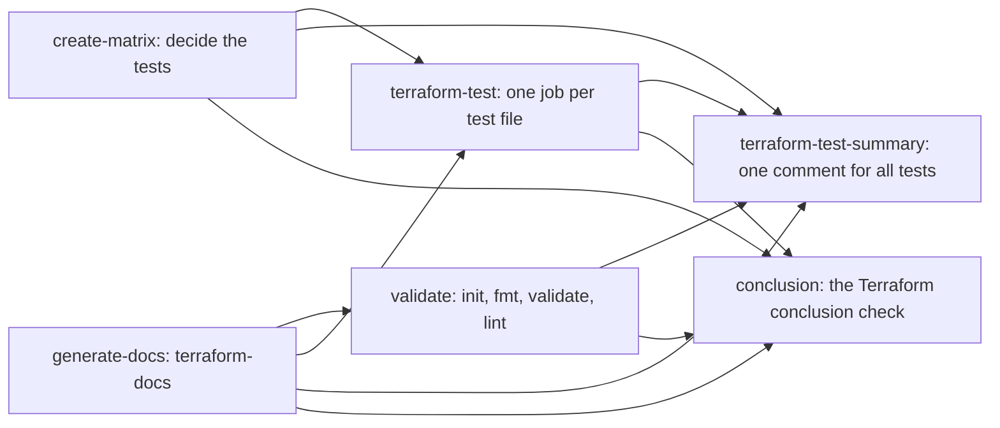

# Workflow [`terraform-module-ci`](../.github/workflows/terraform-module-ci.yaml)

The reusable CI workflow for a Terraform **module** repository: one module at the repository root, its examples under `examples/`, and its `terraform test` files. On every run it:

1. keeps the README's generated documentation current with terraform-docs: on a pull request from the repository, Dependabot's excepted, it commits the regenerated README, anywhere else a README that needs regenerating fails the check;
2. validates the module: `terraform init` without a backend, `terraform fmt -check`, `terraform validate` and TFLint;
3. runs every committed test file as its own job, in parallel with validation, with the credentials its lane gives it; a module needs at least one test file;
4. reports on the pull request (a validation comment and one tests comment) and on the run page (a step summary from every job);
5. ends in one check to require, `Terraform conclusion`.

Repositories of environments that are planned and applied use the sibling [`terraform-ci-cd-default`](Workflow-terraform-ci-default.md) instead; the two share the test stage, so lanes, credentials and the test reports work the same in both. The design is [Module-ci.md](Module-ci.md), the test stage [Terraform-tests.md](Terraform-tests.md), and releases are [`terraform-module-release`](Workflow-terraform-module-release.md). The module template is [dsb-norge/tf-module-template](https://github.com/dsb-norge/tf-module-template).

Moving a module repository from `@v0`: [Migration-v0-to-v1-modules.md](Migration-v0-to-v1-modules.md).

## Requirements

- **Permissions and secrets on the calling job:**

  ```yaml
      secrets: inherit       # the App's key, and any secret a test lane maps
      permissions:
        id-token: write      # OIDC, for the test jobs
        contents: read       # checkout; the docs commit is pushed with the App token, not this one
        pull-requests: write # the validation and tests comments
        actions: read        # job links in the tests comment
  ```

  No job asks for more than `contents: read`, so a calling workflow that still grants `contents: write` from v0 keeps working, with a permission it no longer needs.

- **The organisation's CI App.** The docs job mints a token from the App to push a regenerated README. It reads:
  - the organisation variable `ORG_TF_CICD_APP_ID`, the App's ID (or its client ID);
  - the organisation secret `ORG_TF_CICD_APP_PRIVATE_KEY`, a private key of the App.

  For a new repository, give it access to both (the organisation's Actions secrets and variables settings, "Repository access"), and add the repository to the App's installation (the organisation's GitHub Apps settings, "Configure"); the installation needs write access to contents. `ORG_TF_CICD_APP_INSTALLATION_ID` is not read: the token action finds the installation itself.

- **Terraform 1.13 or later** for the tests. `terraform-version` accepts a constraint such as `"1.14.x"`.

- **A committed `.tflint.hcl`** at the repository root. Lint fails without one, see [troubleshooting](#tflinthcl-is-not-committed).

- **A `README.md`** in `readme-file-path` (the root by default), and one in each `examples/<example>/` when the repository has examples.

- **At least one test file**, a unit suite such as `tests/unit-tests.tftest.hcl`, unless `terraform-test-required: false`, see [tests](#tests).

## A complete calling workflow

Saved as `.github/workflows/terraform-module-ci.yml` in the module repository:

```yaml
name: "Terraform module CI"

on:
  pull_request:
    branches: [main]
  push:
    branches: [main]
  workflow_dispatch: # a manual build
  schedule:
    - cron: "0 4 * * 1-5" # a nightly build catches provider and API drift

jobs:
  tf:
    uses: dsb-norge/github-actions-terraform/.github/workflows/terraform-module-ci.yaml@v1
    secrets: inherit
    permissions:
      id-token: write      # OIDC, for the test jobs
      contents: read       # checkout
      pull-requests: write # the validation and tests comments
      actions: read        # job links in the tests comment
    with:
      terraform-version: "1.14.x"
      tflint-version: "v0.55.1"
```

Every trigger is optional; keep the ones you want. Without lanes, as here, every test file runs without credentials on all four events.

Require the check **`tf / Terraform conclusion`** in the branch protection of `main`: `tf` is the calling job's id, so a different id changes the check's name. It is the only check to require; the other jobs' checks come and go with the event.

## Inputs

`terraform-version` and `tflint-version` are required; every other input has a default. The descriptions are also in the [workflow declaration](../.github/workflows/terraform-module-ci.yaml).

| Input | Type | Default | Meaning |
|---|---|---|---|
| `terraform-version` | string | required | Terraform for validation and, unless a lane sets its own, for the tests. 1.13 or later for the tests. |
| `tflint-version` | string | required | TFLint for the lint step, for example `"v0.55.1"`. |
| `readme-file-path` | string | `"."` | Directory of the `README.md` terraform-docs maintains, relative to the repository root. |
| `runs-on` | string | `"ubuntu-latest"` | Runner of every job but the test jobs. |
| `add-pr-comment` | boolean | `true` | Post the validation and tests comments on pull requests. `false` posts neither; the step summaries remain. |
| `cache-terraform-modules` | boolean | `true` | Cache the modules the test jobs download ([Terraform-module-cache.md](Terraform-module-cache.md)). A lane may set its own. |
| `terraform-test-enabled` | boolean | `true` | `false` removes the test stage: no test jobs, no tests comment, and no test file is required. |
| `terraform-test-required` | boolean | `true` | A module needs at least one test file; with none the conclusion is red. `false` lets a repository without test files conclude green. |
| `allow-failing-terraform-tests` | boolean | `false` | A failing or erroring test does not fail the check; the tests comment shows it as tolerated. A lane may set its own. |
| `terraform-test-runs-on` | string | `"ubuntu-latest"` | Runner of the test jobs. A lane may set its own `runs-on`. |
| `terraform-test-timeout-minutes` | number | `30` | Timeout of each test job. A lane may set its own `timeout-minutes`. |
| `terraform-test-lanes-yml` | string (YAML list) | `""` | Which test files run with which credentials, runner, Terraform version and GitHub Environment, see [credentials](#credentials-lanes). Empty: every file runs without credentials. |
| `terraform-test-exclude-paths-yml` | string (YAML list) | `""` | Glob patterns of test files that do not run ([Terraform-tests.md §4.4](Terraform-tests.md)). |
| `dependabot-admission-enabled` | boolean | `false` | Judge a Dependabot pull request before validation and the tests run it; an admitted one runs every lane, credentialed ones included. See [Dependabot pull requests](#dependabot-pull-requests). |
| `dependabot-admission-yml` | string (YAML) | `""` | The admission's policy, added to the built-in one ([Dependabot-admission.md §6](Dependabot-admission.md)). |

A setting the workflow cannot use, such as an unknown lane key or a boolean that is not `true` or `false`, is refused by the `Create test matrix` job with an error annotation per problem, before any test runs.

## The jobs of a run



An arrow is a `needs:` of the job it points to. Validation and the tests run side by side: a failing test is worth seeing next to a failing lint. Both wait for the docs job, because a docs commit starts a run of its own and leaves this run's tree out of date.

| Job (check name) | Runs | On a pull request | On the run page |
|---|---|---|---|
| `create-matrix` (Create test matrix) | on every run | — | Validates the test inputs and lanes, lists the committed test files and decides which run, in which lane. Warns about a misplaced test file and about a missing one. A refused configuration fails here. |
| `generate-docs` (Update documentation) | on every run | From the repository, not from Dependabot: regenerates the README and the examples' READMEs, and commits and pushes them to the pull request's branch. | Elsewhere it checks the READMEs and fails when one needs regenerating. One line in the step summary, see [documentation](#documentation). |
| `validate` (Validate module) | unless the docs job pushed a commit | The validation comment, titled "Terraform validation summary for module: `<repository>`", with rows for init, fmt, validate and lint and the count of init and validate warnings. It also deletes the per-file test comments of v0. | The same block in the step summary; a failed step `🧐 Validation outcome: …` for each of init, fmt, validate and lint that did not succeed. |
| `terraform-test` (Terraform test (`<file>`)) | once per test file, when there is a file to run and the docs job pushed nothing | — | Each job's own block in its step summary, and the artifact `terraform-test-log-<slug>` with the test's output. |
| `terraform-test-summary` (Terraform tests summary) | while the test stage is on, on a run with test files and on every pull request, unless the docs job pushed a commit; after validation, so the validation comment comes first | One comment for every test file, failed ones first, with a link to each job. Deleted when the last test file is. | One block for all test files, and a headline annotation. |
| `conclusion` (Terraform conclusion) | on every run | — | One line, in the log, the step summary and an annotation. |

The comments are not posted on a pull request from a fork, with `add-pr-comment: false`, or on a closed or draft-converted pull request; the step summaries are written on every run. The tests summary job is not among the conclusion's `needs`, so reporting can never turn the check red.

Each comment is updated in place on every run. The validation comment carries the marker `<!-- tf:head:module -->`, the tests comment `<!-- tf:head:tests:<calling workflow's name> -->`, the name kept to letters, digits, `-` and `_`.

### The conclusion

The conclusion judges the jobs in this order and prints one line, `conclusion: <green|red> — <why>; tests: <number of test jobs>`:

| Line | When |
|---|---|
| `conclusion: red — the test matrix could not be built (failure); tests: 0` | the `Create test matrix` job failed, usually on a refused configuration; its annotations say why |
| `conclusion: red — Dependabot pull request not admitted: 1 of 1 dependencies failed; see the admission comment; tests: 0` | with the admission switched on, it refused a Dependabot pull request: nothing ran |
| `conclusion: red — the documentation check's result is failure; tests: 1` | a README needs regenerating, terraform-docs failed, or the App token could not be created |
| `conclusion: green — documentation regenerated and pushed; the run it started decides; tests: 1` | the docs job pushed a commit; validation and tests were skipped on purpose, and the run on the new commit decides |
| `conclusion: red — validation's result is failure; tests: 1` | init, fmt, validate or lint failed |
| `conclusion: red — a module needs at least one test file, a unit suite (terraform-test-required: false opts out); tests: 0` | no test file to run, see [troubleshooting](#no-test-file) |
| `conclusion: red — the tests' result is failure; tests: 3` | a test job failed and is not tolerated |
| `conclusion: red — the tests should have run but were skipped; tests: 3` | the test jobs did not run although there were files to run |
| `conclusion: green — validation succeeded; tests: 3` | everything that should have run, ran and passed |

## Events

The workflow runs on `pull_request`, `push`, `workflow_dispatch` and `schedule`, and runs the tests on all four: a dispatch is a module's manual build and a schedule its nightly one. Any other event fails `Create test matrix`.

| Event | Docs | Validation | Tests | Comments |
|---|---|---|---|---|
| Pull request from the repository | regenerated, committed and pushed | yes, unless the docs job pushed | every file, unless the docs job pushed | yes |
| Pull request from a fork | checked; a stale README fails | yes | files in lanes without credentials; a credentialed lane's files are listed as "secrets unavailable" | no |
| Push, dispatch, schedule | checked; a stale README fails | yes | every file | no |

A fork's run has no secrets, so a credentialed lane cannot run there; a Dependabot pull request is treated the same way by the tests, unless the admission is on (below), and by the docs job, which checks its README instead of committing. A file held back like this still counts as a test file for `terraform-test-required`.

### Dependabot pull requests

Without the admission, a Dependabot pull request validates and runs the tests that need no credentials; its credentialed lanes are listed as "secrets unavailable". It reaches no cloud identity, which is why the admission is off by default here and on in the project workflow.

With `dependabot-admission-enabled: true`, a run Dependabot starts first meets the admission ([Dependabot-admission.md](Dependabot-admission.md)): every provider and module the pull request changes must come from an allowed namespace (built in `dsb-norge`, `hashicorp`, `microsoft`, `Azure`), be old enough and, for a provider, be signed as the version before it. An admitted pull request validates and runs **every** lane, credentialed ones included, so all its tests run; a lane's IDs must then be plain values in its `extra-envs-yml`, since a Dependabot run reads no environment secret. A refused pull request runs neither validation nor tests, and the conclusion is red with the reason.

There is one run per ref at a time: a newer push to the same pull request waits for the running one and replaces a waiting one. A test job also queues on its file, across the repository, so two pull requests never run the same integration test at the same time.

## Documentation

terraform-docs writes the module's inputs, outputs and resources into `README.md` in `readme-file-path` and, when the repository has an `examples/` directory, into each `examples/<example>/README.md`, between the `BEGIN_TF_DOCS` and `END_TF_DOCS` delimiters. A README without the delimiters gets them appended; delimiters in the wrong order, or twice, fail the job. The configuration is the repository's `.terraform-docs.yml` (in the root, and `examples/.terraform-docs.yml` for the examples), or the action's default where there is none.

**On a pull request from the repository**, the docs job regenerates the READMEs and, when anything changed, commits and pushes to the pull request's branch with the App token. That push starts a new run on the new commit; a push with the job's own `GITHUB_TOKEN` would start none, and the required check would stay on the old commit. The run that pushed skips validation and the tests and concludes green, pointing at the new run. Pull the branch before pushing to it again.

**On every other event**, a push, a dispatch, a schedule or a pull request from a fork or from Dependabot, nothing is committed: a dispatch or a push must never commit to the branch it runs on, `main` included. A README that differs from what terraform-docs generates fails the docs job, and with it the conclusion. Fix it in either of two ways:

- open a pull request from the repository and let the workflow regenerate and push the README; or
- regenerate locally with **terraform-docs 0.20**, the version the pinned action runs, with the same configuration, and commit. Another version can format the tables differently and fail the check again.

The docs job's step summary is one line:

| Line | Meaning |
|---|---|
| `📝 Docs: up to date` | nothing to change |
| `📝 Docs: regenerated and pushed (2 files)` | a docs commit was pushed; the run it starts decides |
| `📝 Docs: README needs regenerating (1 file) — run terraform-docs, or push to a pull request where CI regenerates it` | a stale README where nothing may be committed; the job fails |
| `📝 Docs: failed (<reason>)` | terraform-docs failed, or the delimiters are invalid; the job fails |

## Tests

Every committed `*.tftest.hcl` and `*.tftest.json` file runs as its own job, `Terraform test (<file>)`, on every event. The module is the repository root, so the usual place is `tests/` there, `tests/unit-tests.tftest.hcl` for example; a test file beside the module's `.tf` files works too. Terraform finds a test file only beside a root module's `.tf` files or in the `tests/` directory under it, so a file in `examples/<example>/tests/` runs with that example as its root; a file anywhere else is reported as misplaced, gets no job and does not count as a test file. Files are found with `git ls-files`, so an uncommitted file does not run, and a path with a segment starting with `.` is ignored. The full rules are [Terraform-tests.md §4](Terraform-tests.md).

**A unit suite is required by default.** With no test file to run, `Create test matrix` warns

```text
no test file: a module needs at least one test file, a unit suite such as tests/unit-tests.tftest.hcl; set terraform-test-required: false to run without (docs/Module-ci.md D9)
```

and the conclusion is red. A module's tests are its contract with its callers. `terraform-test-required: false` opts out, and `terraform-test-enabled: false` removes the test stage altogether.

**Provider versions float.** A module commits no lock file, so each test job installs the newest provider versions the module's constraints allow; the nightly schedule is what notices a new one that breaks the module.

**Tolerating a failure.** `allow-failing-terraform-tests: true`, globally or on a lane, keeps a failing test from failing the check; the tests comment shows it as tolerated.

### Credentials: lanes

A test job gets credentials from its lane and from nowhere else. Without lanes every file runs without credentials. The lane keys are the project workflow's, key for key: `name`, `match`, `extra-envs-yml`, `extra-envs-from-secrets-yml`, `runs-on`, `terraform-version`, `timeout-minutes`, `allow-failing-terraform-tests`, `cache-terraform-modules` and `github-environment` ([Terraform-tests.md §3.2](Terraform-tests.md)). `providers-from` names environments, which a module does not have, so any environment it names is refused. The first lane whose `match` covers a file owns it; a lane without `match` takes the files no other lane matches; a file no lane takes runs in the implicit lane `default`, without credentials.

When `ARM_TENANT_ID`, `ARM_SUBSCRIPTION_ID` and `ARM_CLIENT_ID` are all set in a lane, the job also logs in with `azure/login`; the `azurerm` and `azuread` providers log in on their own through OIDC either way.

#### None: unit tests with mocks

No lanes. Every file runs without credentials, so each mocks the providers the module uses:

```hcl
mock_provider "azurerm" {}

run "plans_with_defaults" {
  command = plan
}
```

#### One credential, from repository secrets

The usual case: the repository already has the secrets `REPO_AZURE_DSB_TENANT_ID`, `REPO_AZURE_SUBSCRIPTION_ID` and `REPO_AZURE_TERRAFORM_USER_SERVICE_PRINCIPAL`. One lane without `match` maps them for every file:

```yaml
    with:
      terraform-version: "1.14.x"
      tflint-version: "v0.55.1"
      terraform-test-lanes-yml: |
        - name: azure
          extra-envs-yml:
            ARM_USE_OIDC: true
            ARM_USE_AZUREAD: true
          extra-envs-from-secrets-yml:
            ARM_TENANT_ID: REPO_AZURE_DSB_TENANT_ID
            ARM_SUBSCRIPTION_ID: REPO_AZURE_SUBSCRIPTION_ID
            ARM_CLIENT_ID: REPO_AZURE_TERRAFORM_USER_SERVICE_PRINCIPAL
```

This lane replaces the `env:` block a v0 calling workflow carried, line for line; that block never reached the called workflow. Without a GitHub Environment, the job's OIDC subject is the repository's `pull_request` subject on a pull request and its branch's `ref:` subject otherwise, so the identity has to trust every pull request of the repository. Every file, unit tests included, runs as that identity.

#### One credential, isolated in a GitHub Environment (recommended)

The same lane with `github-environment: auto` instead of the mappings:

```yaml
      terraform-test-lanes-yml: |
        - name: azure
          github-environment: auto # the GitHub Environment tftest-azure
          extra-envs-yml:
            ARM_USE_AZUREAD: true
```

The lane's jobs run in the GitHub Environment `tftest-azure`, whose `ARM_*` and `TF_VAR_*` secrets are exported under their own names, and `ARM_USE_OIDC` is `true` unless the lane sets it. The identity trusts only the subject `repo:<owner>/<repo>:environment:tftest-azure`, the secrets are scoped to the lane, and anyone with write access can set them. The export relies on the organisation's naming rule: organisation secrets are `ORG_*` and repository secrets `REPO_*`, so no `ARM_*` or `TF_VAR_*` secret exists above the environment.

Bringing the lane up:

1. Add the lane and open a pull request. The first run creates `tftest-azure`, and its test jobs fail with `The environment 'tftest-azure' has no ARM_TENANT_ID or ARM_CLIENT_ID secret yet.`, printing the commands that set them. Set `allow-failing-terraform-tests: true` on the lane meanwhile if the pull request must stay green.
2. Someone with write access sets the secrets (the environment must exist first):
   ```bash
   gh secret set ARM_TENANT_ID       --repo <owner>/<repo> --env tftest-azure --body '<tenant-id>'
   gh secret set ARM_CLIENT_ID       --repo <owner>/<repo> --env tftest-azure --body '<client-id>'
   gh secret set ARM_SUBSCRIPTION_ID --repo <owner>/<repo> --env tftest-azure --body '<subscription-id>'
   ```
3. The identity's owner adds a federated credential for the subject `repo:<owner>/<repo>:environment:tftest-azure`, and removes the repository's `pull_request` and branch credentials once nothing else uses them. Environment names are lowercase; the credential compares case-sensitively.
4. Re-run the failed jobs: `gh run rerun <run-id> --repo <owner>/<repo> --failed`.

Never add protection rules to a `tftest-*` environment: a required reviewer holds every test job of every pull request. The details, including one flexible credential for every lane of a repository, are [Terraform-tests.md §3.6](Terraform-tests.md).

#### Unit tests without credentials, integration tests with

Two lanes. Name the files after their lane:

```yaml
      terraform-test-lanes-yml: |
        - name: unit
          match: ["**/unit-*.tftest.hcl"]
        - name: integration
          match: ["**/integration-*.tftest.hcl"]
          github-environment: auto # tftest-integration
          timeout-minutes: 60
```

| Test file | Lane | Credentials |
|---|---|---|
| `tests/unit-tests.tftest.hcl` | `unit` | none: the file mocks its providers |
| `tests/integration-tests.tftest.hcl` | `integration` | the environment `tftest-integration`'s |
| `tests/smoke.tftest.hcl` | `default` | none: no lane matches it |

On a pull request from a fork the two files without credentials run and the integration file is listed as "secrets unavailable". Leave `match` off the integration lane to make it take every file the unit lane does not.

#### Several credentials

One lane per identity, each matching its files and running in its own environment:

```yaml
      terraform-test-lanes-yml: |
        - name: unit
          match: ["**/unit-*.tftest.hcl"]
        - name: directory
          match: ["**/integration-directory-*.tftest.hcl"]
          github-environment: auto # tftest-directory
        - name: subscription
          match: ["**/integration-subscription-*.tftest.hcl"]
          github-environment: auto # tftest-subscription
          timeout-minutes: 60
```

Each environment holds its own identity's secrets, and each identity trusts its own environment's subject. A lane may instead map repository secrets, as in the [one-credential case](#one-credential-from-repository-secrets).

## Troubleshooting

### No test file

`Create test matrix` warns `no test file: a module needs at least one test file, …`, and the conclusion reads:

```text
conclusion: red — a module needs at least one test file, a unit suite (terraform-test-required: false opts out); tests: 0
```

Add a unit suite, `tests/unit-tests.tftest.hcl` with mocked providers, or set `terraform-test-required: false`. A misplaced test file does not count: when `Create test matrix` also warns `test file '<path>' is misplaced`, move the file into `tests/` at the root.

### A unit test fails to configure its provider

A unit test without `mock_provider`, in a lane without credentials, fails when the provider tries to configure itself and finds nothing to log in with. The job's error names the provider. Mock the provider in the test file (`mock_provider "azurerm" {}`), or give the file a lane with the credential.

### `.tflint.hcl` is not committed

The template's `.gitignore` matches `**/.tflint.hcl`, and the template's own `.tflint.hcl` is force-added. A copy that is recreated, or added to a repository made from the template, is ignored by `git add` and never committed. Lint then fails, and its log says:

```text
could not find a TFLint config file to use, unable to perform linting!
```

Commit it with `git add -f .tflint.hcl`; `git ls-files .tflint.hcl` shows whether it is committed. Keep the file force-added rather than removing the pattern from `.gitignore`.

### The README needs regenerating

On a push, a dispatch, a schedule or a pull request from a fork or from Dependabot, the docs job fails with `📝 Docs: README needs regenerating …`, and the conclusion is `red — the documentation check's result is failure`. Nothing is committed on those events. Regenerate with terraform-docs 0.20 and commit, or open a pull request from the repository and let the workflow push the README, see [documentation](#documentation).

### The docs job cannot create the App token

On a pull request from the repository, `Update documentation` fails before terraform-docs runs. The step that fails names the cause:

- `🔐 Check the App's variable and secret` fails with `This repository cannot read the organisation variable ORG_TF_CICD_APP_ID` or `… the organisation secret ORG_TF_CICD_APP_PRIVATE_KEY`, one error for each that is missing. Add the repository to that variable's or secret's repository access (the organisation's settings, Secrets and variables, Actions); for the secret, the calling job also needs `secrets: inherit`.
- `🔐 Explain the failed App token` fails with `The App whose ID is ORG_TF_CICD_APP_ID gave no token for this repository` when both reach the repository but the token step failed: the App is not installed on the repository, or the key is not a key of that App. The token step's log above it has GitHub's answer.

See [requirements](#requirements).

### Terraform below 1.13

Every test job fails with reason `terraform-version`, and its log says, for example:

```text
Terraform 1.12.2 is below the floor 1.13.0 for terraform test (docs/Terraform-tests.md §3.5 in dsb-norge/github-actions-terraform).
```

Set `terraform-version` to 1.13 or later, `"1.14.x"` for example, or give the lane its own `terraform-version`.

### Tests have no credentials although the calling workflow sets them

A calling workflow's `env:` block never reaches a called workflow. Move the variables into a lane, see [one credential, from repository secrets](#one-credential-from-repository-secrets).
