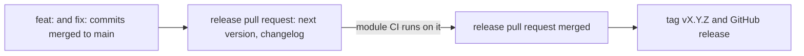

# Workflow [`terraform-module-release`](../.github/workflows/terraform-module-release.yaml)

The reusable release workflow for a Terraform **module** repository. It runs [release-please](https://github.com/googleapis/release-please) on every push to the default branch: from the conventional commits since the last release it opens, or updates, a **release pull request** with the next version and its changelog. Merging that pull request makes the next run tag the version and publish a GitHub release.



It is the release half of a module repository; the CI half is [`terraform-module-ci`](Workflow-terraform-module-ci.md). The design is [Module-ci.md](Module-ci.md), D7.

With the CI workflow's [auto-merge](Workflow-terraform-module-ci.md#auto-merge) on and the CI App's bot account on its list, the release pull request merges itself once its run is green, provided it changes only `CHANGELOG.md` and `.release-please-manifest.json`; a release that also updates other files waits for a person ([Module-auto-merge.md](Module-auto-merge.md) M5).

## What it runs

One job, `release-pr`, with two steps:

1. **`actions/create-github-app-token@v3`** mints a token from the organisation's CI App, with the permissions the App's installation grants.
2. **`googleapis/release-please-action`**, pinned to v5.0.0 by commit, with `release-type: terraform-module` and that token.

Which commits make a release is release-please's rule: a `fix:` bumps the patch version, a `feat:` the minor version, and a breaking change (`feat!:`, or a `BREAKING CHANGE:` footer) the major version. A `chore:` makes no release. See the [release-please documentation](https://github.com/googleapis/release-please?tab=readme-ov-file#release-please) for the rest.

### Why an App token, not `GITHUB_TOKEN`

Events caused by the job's `GITHUB_TOKEN` start no workflow runs. A release pull request opened or updated with it would never get its module CI run: its required `Terraform conclusion` check would never be reported, and the pull request could not be merged without bypassing branch protection. With the App's token, opening and updating the release pull request starts module CI like any other pull request. The same holds for the tag and the release after the merge: a workflow in the repository that runs on them starts.

The job therefore needs no `GITHUB_TOKEN` permissions at all and declares `permissions: {}`. The repository setting "Allow GitHub Actions to create and approve pull requests" governs `GITHUB_TOKEN` only, so the workflow does not need it either.

## Requirements

- **The organisation's CI App**, read from:
  - the organisation variable `ORG_TF_CICD_APP_ID`, the App's ID (or its client ID);
  - the organisation secret `ORG_TF_CICD_APP_PRIVATE_KEY`, a private key of the App.

  For a new repository, give it access to both (the organisation's Actions secrets and variables settings, "Repository access"), and add the repository to the App's installation (the organisation's GitHub Apps settings, "Configure"). The installation needs write access to contents and to pull requests: release-please pushes its branch, opens and labels the release pull request, and creates the tag and the release. `ORG_TF_CICD_APP_INSTALLATION_ID` is not read: the token action finds the installation itself. These are the same App and settings as module CI's.

- **`secrets: inherit`** on the calling job, so the called workflow can read the App's key.

- **Conventional commit subjects** on the default branch: release-please reads nothing else.

## A complete calling workflow

Saved as `.github/workflows/terraform-module-release.yml` in the module repository:

```yaml
name: "Terraform module release"

on:
  push:
    branches: [main]

jobs:
  release:
    uses: dsb-norge/github-actions-terraform/.github/workflows/terraform-module-release.yaml@v1
    secrets: inherit # the App's private key
    permissions: {}  # the workflow works with the App token only
```

The workflow takes no inputs.

## Troubleshooting

### The release job cannot create the App token

The step that fails names the cause:

- `🔐 Check the App's variable and secret` fails with `This repository cannot read the organisation variable ORG_TF_CICD_APP_ID` or `… the organisation secret ORG_TF_CICD_APP_PRIVATE_KEY`, one error for each that is missing. Add the repository to that variable's or secret's repository access (the organisation's settings, Secrets and variables, Actions); for the secret, the calling job also needs `secrets: inherit`.
- `🔐 Explain the failed App token` fails with `The App whose ID is ORG_TF_CICD_APP_ID gave no token for this repository` when both reach the repository but the token step failed: the App is not installed on the repository, or the key is not a key of that App. The token step's log above it has GitHub's answer.

See [requirements](#requirements).

### release-please fails with a permission error

The App's installation lacks write access to contents or pull requests on the repository. A permission added to the App must also be accepted for the organisation's installation before tokens carry it.

### The release pull request has no module CI run

The release pull request was opened or last updated by `GITHUB_TOKEN`, as the v0 workflow did before v0.9, so no run started. With this workflow, the next update of the pull request is made with the App token and starts one; closing and reopening the pull request by hand starts one at once.

### A merge opened no release pull request

The commits since the last release hold no `feat:`, `fix:` or breaking change, so there is nothing to release. The release itself, the tag and the GitHub release, is made only when the release pull request is merged.
